# mysql高级

# 逻辑架构

下面是MySQL5.7使用的`经典架构图`，MySQL 8中去掉了Caches&Buffers部分：

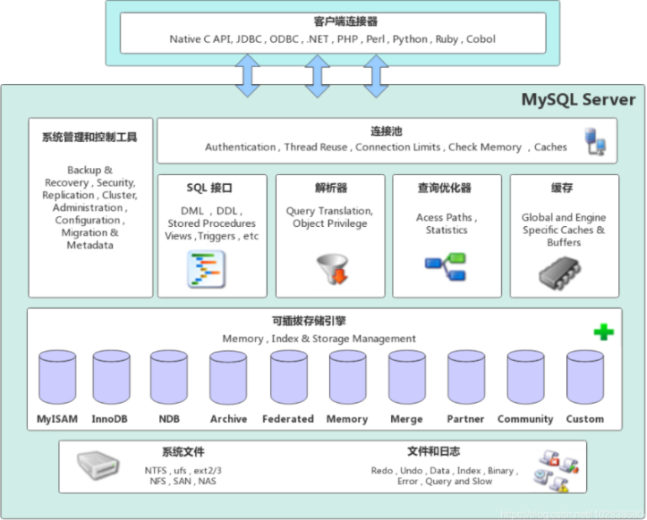

## 逻辑架构剖析

### **Connectors（客户端）**

* MySQL服务器之外的客户端程序，与具体的语言相关，例如Java中的JDBC，图形用户界面Navicat/SQLyog等。`本质上都是在TCP连接上通过MySQL协议和MySQL服务器进行通信。`

### **MySQL Server（服务器）**

#### **第1层：连接层**

- 客户端访问 MySQL 服务器前，做的`第一件事就是建立 TCP 连接`。
- 经过三次握手建立连接成功后， MySQL 服务器对 TCP 传输过来的账号密码做`身份认证、权限获取`。
  - 用户名或密码不对`，会收到一个`Access denied for user`错误，客户端程序结束执行`
  - `用户名密码认证通过`，会从权限表`查出账号拥有的权限`与连接关联，之后的权限判断逻辑，都将依赖于此时读到的权限
- TCP 连接收到请求后，必须要分配给一个线程专门与这个客户端的交互。所以还会有个线程池，去走后面的流程。每一个连接从线程池中获取线程，省去了创建和销毁线程的开销。

#### **第2层：服务层**

**SQL Interface：SQL接口：**

- `接收用户的SQL命令，并且返回用户需要查询的结果。`比如SELECT ... FROM就是调用SQL Interface 
- MySQL支持DML（数据操作语言）、DDL（数据定义语言）、存储过程、视图、触发器、自定义函数等多种SQL语言接口
- **注意：**在MySQL5.7以前（存在查询缓存部分）优先从查询缓存中获取数据（SQL作为Key）命中查询缓存直接返回，未命中则继续执行后续组件。

**Parser：解析器：**

在SQL命令传递到解析器的时候会被解析器验证和解析。解析器中SQL 语句进行`词法分析、语法分析、语义分析`，并为其创建`语法树`。

- 词法分析：将整个语句拆分成一个个字段

- 语法分析：将词法分析拆分出的字段，按照MySQl语法规则，生成解析树   

- 语义分析：`检查解析树是否合法/用户是否有操作权限`，比如查看表是否存在，列是否存在

典型的解析树如下：

```mysql
select username,ismale from userinfo where age>20 and level>5 and 1=1;
```


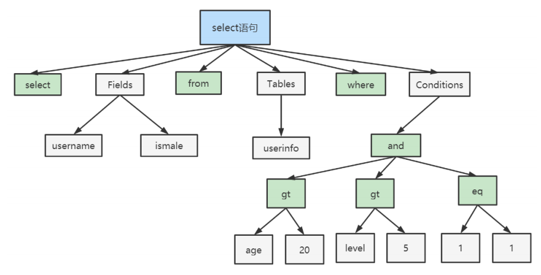

**Optimizer：查询优化器：**

- SQL语句在语法解析后、查询前会使用查询优化器对查询进行优化，`确定SQL语句的执行路径，生成一个执行计划`。
  - 例如：有复合索引  `a,b,c`  查询条件顺序：where  b = ? and   a=? and c=?  MySQL查询优化器 自动对SQL调整条件列顺序
  - 例如：执行：子查询，查询优化器会尝试将子查询转为关联查询（内连接） MySQL查询优化器自动进行转换SQL

**Caches & Buffers： 查询缓存组件：**

- MySQL内部维持着一些Cache和Buffer，比如Query Cache用来缓存一条SELECT语句的执行结果，如果能够在其中找到对应的查询结果，那么就不必再进行查询解析、查询优化和执行的整个过程了，直接将结果反馈给客户端。
- 这个缓存机制是由一系列小缓存组成的。比如表缓存，记录缓存，key缓存，权限缓存等 。
- 这个查询缓存可以在不同客户端之间共享 。 
- **问：大多数情况查询缓存就是个鸡肋，为什么呢？**
  - 只有相同的SQL语句才会命中查询缓存。两个查询请求在任何字符上的不同（例如：空格、注释、大小写），都会导致缓存不会命中。
  - 在两条查询之间 有 INSERT 、 UPDATE 、 DELETE 、 TRUNCATE TABLE 、 ALTER TABLE 、 DROP TABLE 或 DROP DATABASE 语句也会导致缓存失效
  - 因此 MySQL的查询缓存命中率不高。`所以在MySQL 8之后就抛弃了这个功能。`

#### **第3层：引擎层**

所有的数据、数据库、表的定义、表的每一行的内容、索引，都是存在`文件系统` 上，以文件的方式存在，并完成与存储引擎的交互。

存储引擎层（ Storage Engines），`负责MySQL中数据的存储和提取，对物理服务器级别维护的底层数据执行操作，服务器通过API与存储引擎进行通信`。不同的存储引擎具有的功能不同，管理的表有不同的存储结构，采用的存取算法也不同，这样我们可以根据自己的实际需要进行选取。例如MyISAM引擎和InnoDB引擎。

```mysql
# 查看MySQL提供什么存储引擎  最小单位是表
SHOW ENGINES;
SHOW VARIABLES LIKE '%default_storage_engine%';
```

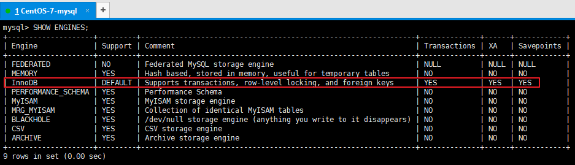

MyISAM和InnoDB的区别

| **对比项**     | **MyISAM**                                               | **InnoDB**                                                   |
| -------------- | -------------------------------------------------------- | ------------------------------------------------------------ |
| 外键           | 不支持                                                   | 支持                                                         |
| 事务           | 不支持                                                   | 支持                                                         |
| 行表锁         | 表锁，即使操作一条记录也会锁住整个表，不适合高并发的操作 | 行锁，操作时只锁某一行，不对其它行有影响，适合高并发的操作   |
| 缓存           | 只缓存索引，不缓存真实数据                               | 不仅缓存索引还要缓存真实数据，对内存要求较高，而且内存大小对性能有决定性的影响。支持聚簇索引 |
| 关注点         | 并发查询，节省资源、消耗少、简单业务                     | 并发写、事务、更大更复杂的资源操作                           |
| 默认使用       | N                                                        | Y                                                            |
| 自带系统表使用 | Y                                                        | N                                                            |

## 查询流程

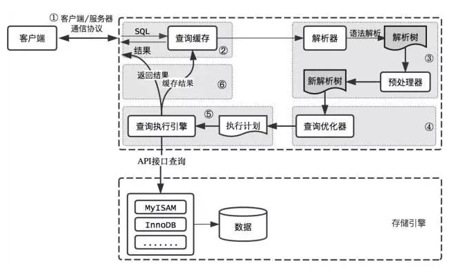

**首先，MySQL客户端通过协议与MySQL服务器建连接，通过SQL接口发送SQL语句，先检查查询缓存，如果命中，直接返回结果，否则进行语句解析。**也就是说，在解析查询之前，服务器会先访问查询缓存，如果某个查询结果已经位于缓存中，服务器就不会再对查询进行解析、优化、以及执行。它仅仅将缓存中的结果返回给用户即可，这将大大提高系统的性能。

**接下来是解析过程，MySQL解析器通过关键字将SQL语句进行解析，并生成一棵对应的解析树，**解析器使用MySQL语法规则验证和解析SQL语句。例如，它将验证是否使用了错误的关键字，或者使用关键字的顺序是否正确，引号能否前后匹配等；

**然后是优化过程，**`MySQL优化程序会对我们的语句做一些优化，将查询的IO成本和CPU成本降到最低。优化的结果就是生成一个执行计划。`这个执行计划表明了应该使用哪些索引执行查询，以及表之间的连接顺序是啥样，必要时将子查询转换为连接、表达式简化等等。我们可以使用EXPLAIN语句来查看某个语句的执行计划。

**最后，**`进入执行阶段。`完成查询优化后，`查询执行引擎`会按照生成的执行计划调用存储引擎提供的接口执行SQL查询并将结果返回给客户端。在MySQL8以下的版本，如果设置了查询缓存，这时会将查询结果进行缓存，再返回给客户端。

## SQL执行流程

```mysql
# 确认profiling是否开启
SHOW VARIABLES LIKE '%profiling%';
# profiling=0 代表关闭，即设置为 1：
SET profiling = 1;  -- profiling = ON
# 执行任意SQL语句：
SELECT * FROM impower.employee; 
SELECT * FROM impower.employee WHERE id = 5; 
# 查看最后一个SQL的执行流程：
SHOW PROFILE;
# 查看指定SQL的执行流程：查询指定的 Query IDs
SHOW PROFILE FOR QUERY 3
# 查询更丰富的内容
SHOW PROFILE cpu,block io FOR QUERY 3;
```

```mysql
SHOW PROFILE 的常用查询参数:
- ALL：显示所有的开销信息。
- BLOCK IO：显示块IO开销。
- CONTEXT SWITCHES：上下文切换开销。
- CPU：显示CPU开销信息。
- IPC：显示发送和接收开销信息
- MEMORY：显示内存开销信息。
- PAGE FAULTS：显示页面错误开销信息。
- SOURCE：显示和Source_function，Source_file，Source_line相关的开销信息。
- SWAPS：显示交换次数开销信息。
```


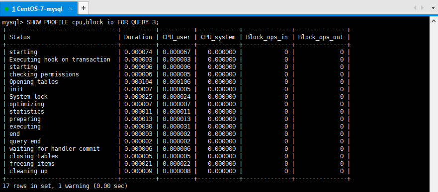

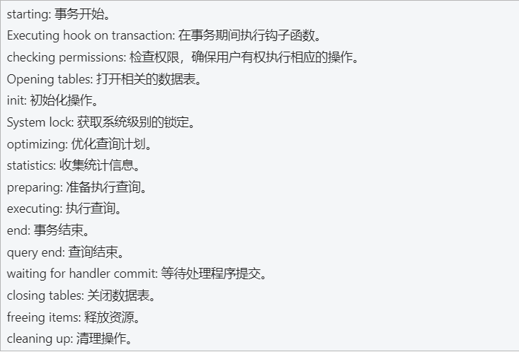


# MySQL索引

## mysql索引是什么

MySQL官方对索引的定义为：**索引（Index）是帮助MySQL高效获取数据的数据结构。**
**索引的本质：**索引是数据结构。

## 索引的优缺点

**优点：**

（1）`提高数据检索的效率，降低数据库的IO成本`   但是数据库的数据量不大，那么使用索引也不一定能够带来很大提升

（2）保证表中每条记录的`唯一性` 。

**缺点：**
（1）创建索引和维护索引要`耗费时间` 。 

（2）索引是存储在磁盘上的，因此需要`占用磁盘空间` 。


## 索引底层数据结构选型

### Hash 表

**为什么 MySQL 没有使用其作为索引的数据结构呢？** 主要是因为 Hash 索引不支持顺序和范围查询。假如我们要对表中的数据进行排序或者进行范围查询，那 Hash 索引可就不行了。并且，每次 IO 只能取一个。

### 二叉查找树(BST)

如果二叉树不平衡，例如左子树全部为空，从形式上看，更像一个单链表，不能发挥BST的优势。

### AVL 树

IO操作的效率很低，在大量数据存储中，查询时我们不能一下子将所有数据加载到内存中，只能逐节点加载（一个节点一次IO）。如果我们利用二叉树作为索引结构，`那么磁盘的IO次数和索引树的高度是相关的`。平衡二叉树由于树深度过大而造成磁盘IO读写过于频繁，进而导致效率低下。

### B树

`B-Tree即B树，Balance Tree，平衡树,B树就是典型的多叉树，它的高度远小于平衡二叉树的高度`。

`B树的阶：`节点的最多子节点个数。

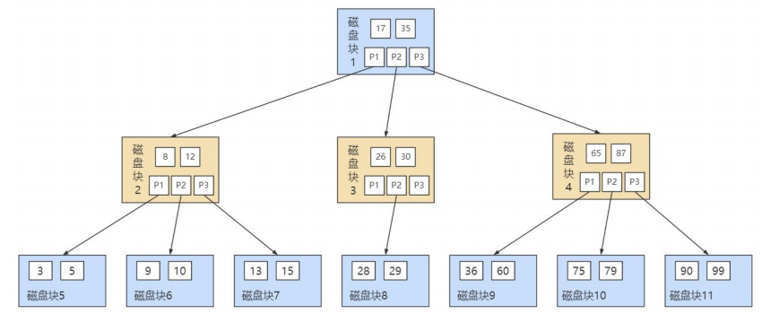

 在B 树的搜索过程中，比较的次数并不少，但如果把数据读取出来然后在内存中进行比较，这个时间就是可以忽略不计的。`而读取磁盘块本身需要进行 I/O 操作，消耗的时间比在内存中进行比较所需要的时间要多，是数据查找用时的重要因素。` B 树相比于平衡二叉树来说磁盘 I/O 操作要少 ，在数据查询中比平衡二叉树效率要高。`所以只要树的高度足够低，IO次数足够少，就可以提高查询性能` 。

### B+ Tree

B+ 树是 B 树的一种变体。B 树和 B+树中的 B 是 `Balanced` 的意思。


新分配一个编号为30的页来专门存储`目录项记录`，页10、28、9、20专门存储`用户记录`

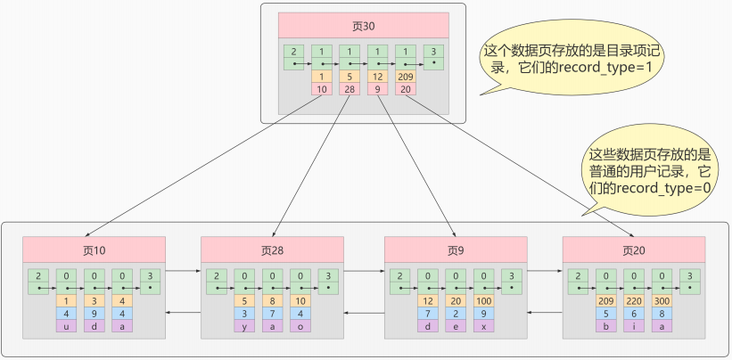

`目录项记录和普通的用户记录的不同点：` 

- 目录项记录 的 record_type 值是1，而 普通用户记录 的 record_type 值是0。
- 目录项记录只有主键值和页的编号两个列，而普通的用户记录的列是用户自己定义的，包含很多列，另外还有InnoDB自己添加的隐藏列。

`现在查找主键值为 20 的记录，具体查找过程分两步：`

1. 先到页30中通过二分法快速定位到对应目录项，因为 12 ≤ 20 < 209 ，就是页9。 
2. 再到页9中根据二分法快速定位到主键值为 20 的用户记录。

**更复杂的情况如下：**

我们生成了一个存储更高级目录项的 页33 ，这个页中的两条记录分别代表页30和页32，如果用户记录的主键值在 `[1, 320)` 之间，则到页30中查找更详细的目录项记录，如果主键值 不小于320 的话，就到页32中查找更详细的目录项记录。

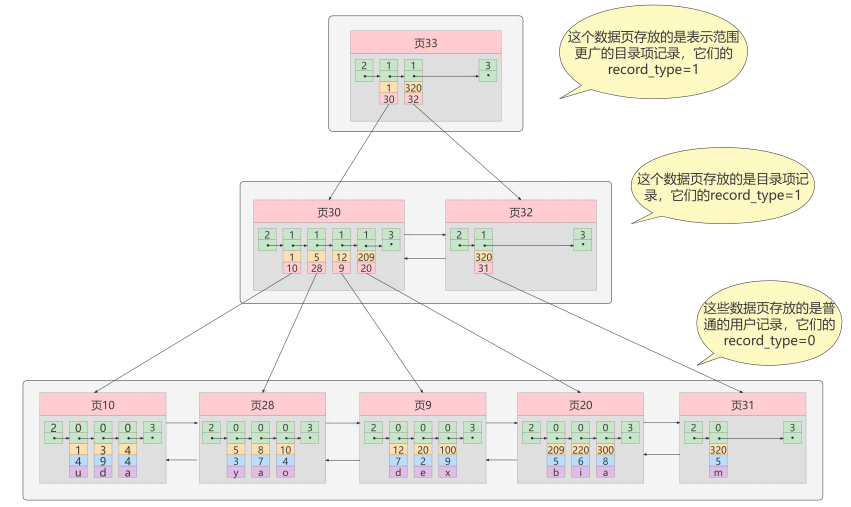


### B Tree和B+ Tree对比**☆** 

**B+** **树和** **B** **树的差异：**

- B+树中非叶子节点仅用于索引，不保存数据记录，跟记录有关的信息都放在叶子节点中。而B树中， 非叶子节点既保存索引，也保存数据记录 。 

- B+树中所有关键字都在叶子节点出现，叶子节点构成一个有序链表，而且叶子节点本身按照关键字的大小从小到大顺序链接。

- B+树中非叶子节点的关键字也会同时存在于子节点中，并且是在子节点中所有关键字的最小值。

**B+树为什么IO的次数会更少：**

- `真实环境`中一个页存放的记录数量是非常大的（默认16KB），假设指针与键值占大约10字节，数据占 1 kb 的空间：
- 如果B+树只有1层，也就是只有1个用于存放用户记录的节点，则最多能存放 16 条记录。
- 如果B+树有2层，最多能存放约 `1600×16=25600` 条记录。
- 如果B+树有3层，最多能存放约 `1600×1600×16=40960000` 条记录。
- 如果存储千万级别的数据，只需要三层就够了

`B+树的非叶子节点不存储用户记录，只存储目录记录，相对B树每个节点可以存储更多的记录，树的高度会更矮胖，IO次数也会更少。`


## 索引类型总结

- 从功能逻辑上划分，索引主要有 4 种，分别是`普通索引、唯一索引、主键索引、全文索引`。
- 按照作用字段个数划分，索引可以分为`单列索引和联合索引`。
- 按照物理实现方式划分 ，索引可以分为 2 种，分别是`聚簇索引和非聚簇索引`。
- 按照聚集方式划分，索引可以分为2种，分别是`主键索引和二级索引`。

### 主键索引(Primary Key)

**数据表的主键列使用的就是主键索引。**

在 MySQL 的 InnoDB 的表中，当没有显示的指定表的主键时，InnoDB 会自动先检查表中是否有唯一索引且不允许存在 null 值的字段，如果有，则选择该字段为默认的主键，否则 InnoDB 将会自动创建一个 6Byte 的自增主键。


### 二级索引（Secondary Index）

二级索引（Secondary Index）的叶子节点存储的数据是主键的值，也就是说，通过二级索引可以定位主键的位置，二级索引又称为辅助索引/非主键索引。

唯一索引，普通索引，前缀索引，全局索引等索引都属于二级索引。


**普通索引(Index)**:普通索引的唯一作用就是为了快速查询数据，一张表允许创建多个普通索引，并允许数据重复和 NULL。

**唯一索引(Unique Key)**:唯一索引也是一种约束。唯一索引的属性列不能出现重复的数据，但是允许数据为 NULL，一张表允许创建多个唯一索引。 建立唯一索引的目的大部分时候都是为了该属性列的数据的唯一性，而不是为了查询效率。

**前缀索引(Prefix)**:前缀索引只适用于字符串类型的数据。前缀索引是对文本的前几个字符创建索引，相比普通索引建立的数据更小，因为只取前几个字符。

**全文索引(Full Text)**:全文索引主要是为了检索大文本数据中的关键字的信息，是目前搜索引擎数据库使用的一种技术。Mysql5.6 之前只有 MYISAM 引擎支持全文索引，5.6 之后 InnoDB 也支持了全文索引。


### 聚簇索引☆

**特点：**

- `索引和数据保存在同一个B+树中`

- `页内的记录`是按照`主键`的大小顺序排成一个`单向链表` 。
- `页和页之间`也是根据页中记录的`主键`的大小顺序排成一个`双向链表` 。
- 非叶子节点存储的是记录的`主键+页号`。
- 叶子节点存储的是`完整的用户记录`。

**优点：**

- 数据访问更快 ，因为`索引和数据保存在同一个B+树中`，因此从聚簇索引中获取数据比非聚簇索引更快。
- 聚簇索引对于主键的`排序查找`和`范围查找`速度非常快。
- 按照聚簇索引排列顺序，查询显示一定范围数据的时候，由于`数据都是紧密相连`，数据库可以从更少的数据块中提取数据，`节省了大量的IO操作` 。

**缺点：**

- 插入速度严重依赖于插入顺序 ，按照主键的顺序插入是最快的方式，否则将会出现页分裂，严重影响性能。因此，对于InnoDB表，我们一般都会定义一个`自增的ID列为主键`。
- 更新主键的代价很高 ，因为将会导致被更新的行移动。因此，对于InnoDB表，我们一般定义`主键为不可更新`。

**限制：**

- 只有InnoDB引擎支持聚簇索引，`MyISAM不支持聚簇索引`。
- 由于数据的物理存储排序方式只能有一种，所以`每个MySQL的表只能有一个聚簇索引`。
- 如果没有为表定义主键，InnoDB会选择`非空的唯一索引列代替`。如果没有这样的列，InnoDB会`隐式的定义一个主键`作为聚簇索引。
- 为了充分利用聚簇索引的聚簇特性，InnoDB中表的`主键应选择有序的id`，不建议使用无序的id，比如UUID、MD5、HASH、字符串作为主键，无法保证数据的顺序增长。

### 非聚簇索引**☆**

**也叫（二级索引、辅助索引）**

非聚簇索引的叶子节点并不一定存放数据的指针，因为二级索引的叶子节点就存放的是主键，根据主键再回表查数据。

**回表**

我们根据这个以c2列大小排序的B+树只能确定我们要查找记录的主键值，所以如果我们想根据c2列的值查找到完整的用户记录的话，仍然需要到聚簇索引中再查一遍，这个过程称为回表 。也就是根据c2列的值查询一条完整的用户记录需要`使用到 2棵B+树`！


**非聚簇索引的优缺点**

**优点**：

更新代价比聚簇索引要小 。非聚簇索引的更新代价就没有聚簇索引那么大了，非聚簇索引的叶子节点是不存放数据的。

**缺点**：

- **依赖于有序的数据**:跟聚簇索引一样，非聚簇索引也依赖于有序的数据
- **可能会二次查询(回表)**:这应该是非聚簇索引最大的缺点了。 当查到索引对应的指针或主键后，可能还需要根据指针或主键再到数据文件或表中查询。

**例如，**`以c2列作为搜索条件`，那么需要使`用c2列创建一棵B+树`，如下所示：


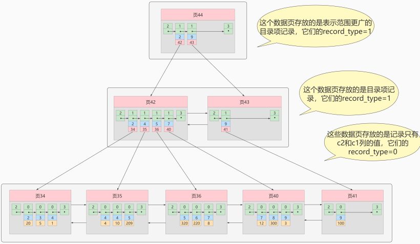

**与聚簇索引有几处不同：**

- `页内的记录`是按照从`c2列`的大小顺序排成一个`单向链表` 。
- `页和页之间`也是根据页中记录的`c2列`的大小顺序排成一个`双向链表` 。

- 非叶子节点存储的是记录的`c2列+页号`。
- 叶子节点存储的并不是完整的用户记录，而只是`c2列+主键`这两个列的值。

### 聚簇索引跟非聚簇索引的区别

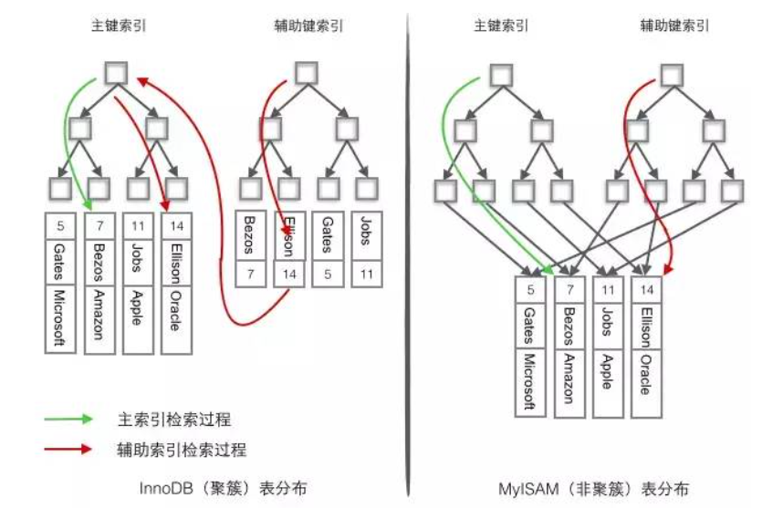

1. **数据存储方式**：
    - **聚簇索引**：数据行的物理顺序与键值的逻辑（排序）顺序相同。也就是说，聚簇索引决定了表中数据的物理存储顺序。一个表只能有一个聚簇索引，因为数据行本身只能按一种方式排序。
    - **非聚簇索引**：数据行的物理顺序与键值的逻辑顺序不相关。非聚簇索引包含一个链接到实际数据行的指针，这些数据行可以以任何顺序存储。一个表可以有多个非聚簇索引。
2. **索引结构**：
    - **聚簇索引**：索引结构直接指向表中的数据行。由于数据行按照索引键值排序，查找操作通常更快，尤其是范围查询。
    - **非聚簇索引**：索引结构是一个B树或B+树，其中叶子节点包含了指向实际数据行的指针，而非数据行本身。这可能导致额外的数据访问延迟，因为可能需要两次磁盘访问（一次访问索引，一次访问数据行）。
3. **更新性能**：
    - **聚簇索引**：更新聚簇索引可能涉及移动数据行，以保持键值的排序顺序，这可能会降低写入性能。
    - **非聚簇索引**：更新非聚簇索引仅涉及更新索引条目，通常比更新聚簇索引快。
4. **适用场景**：
    - **聚簇索引**：适用于经常进行范围查询或者排序的列，以及频繁进行全表扫描的场景。
    - **非聚簇索引**：适用于频繁作为查询条件的列，特别是当查询只需要从索引中获取信息而不必访问实际数据行时（即覆盖索引）。
5. **空间占用**：
    - **聚簇索引**：由于数据行本身就是按照索引键值排序的，所以它不会额外占用空间（除了索引元数据）。
    - **非聚簇索引**：每个非聚簇索引都会额外占用存储空间，因为它存储了指向数据行的指针。


#### **何时使用聚簇索引与非聚簇索引**

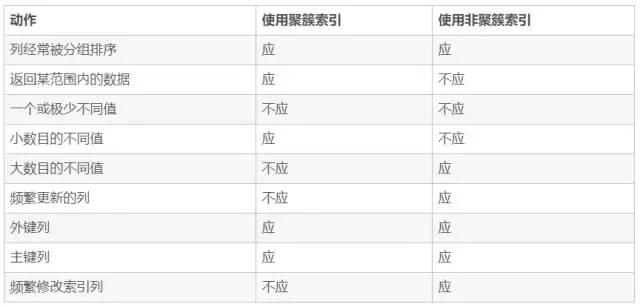


### 联合索引

`为c2和c3列建立联合索引：`

- 各个页中的记录按照`c2`列进行排序。
- 在记录的`c2`列相同的情况下，采用`c3`列进行排序
- B+树叶子节点处的记录由`c2列、c3列和主键c1列组成`
- 本质上也是二级索引

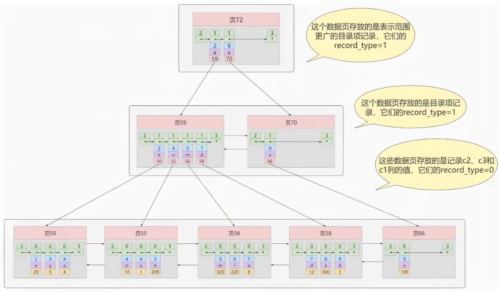

### 覆盖索引**☆** 

如果能通过读取索引就可以得到想要的数据，那就不需要读取用户记录，或者`不用再做回表`操作了。`一个索引包含了满足查询结果的数据就叫做覆盖索引。` 

### MyISAM中的索引**☆**

MyISAM引擎使用 B+Tree 作为索引结构，`叶子节点的data域存放的是数据记录的地址` 。 

下图是MyISAM索引的原理图`（索引和数据分开存储，是非聚簇索引）`： 

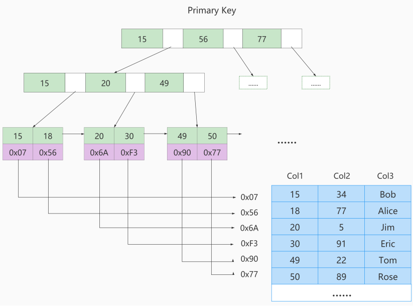

如果我们在Col2上建立一个二级索引，则此索引的结构如下图所示`（是非聚簇索引）`：

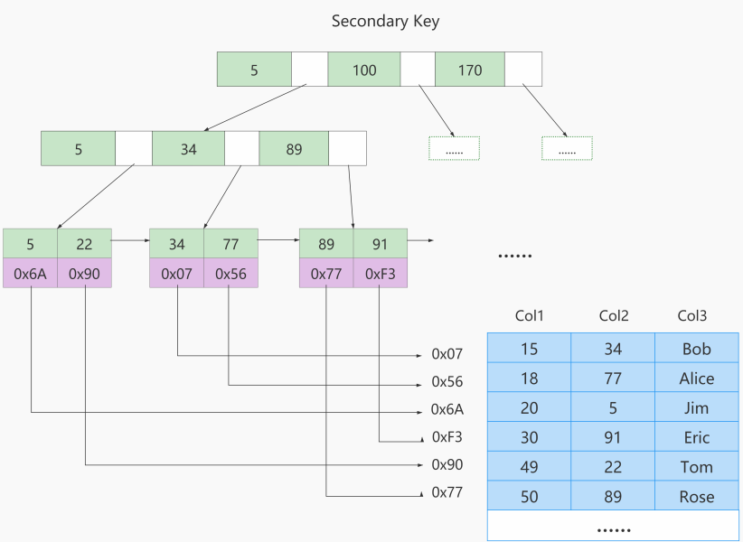

### MyISAM与InnoDB索引对比**☆** 

- InnoDB的数据文件本身就是索引文件，而MyISAM索引文件和数据文件是分离的：
    - InnoDB的表在磁盘上存储在以下文件中： `.ibd（表结构、索引和数据都存在一起,MySQL5.7表结构放在.frm中）`
    - MyISAM的表在磁盘上存储在以下文件中：  `*.sdi（描述表结构，MySQL5.7是.frm）`、`*.MYD（数据）`，`*.MYI（索引）`

- InnoDB中主键索引是聚簇索引，叶子节点中存储完整的数据记录；其他索引是非聚簇索引，存储相应记录主键的值 。
- InnoDB要求表必须有主键 （ MyISAM可以没有 ）。如果没有显式指定，则MySQL系统会自动选择一个可以`非空且唯一`标识数据记录的列作为主键。如果不存在这种列，则MySQL自动为InnoDB表生成一个隐含字段作为主键。
- MyISAM中无论是主键索引还是非主键索引都是非聚簇的，叶子节点记录的是数据的地址。

- `MyISAM的回表操作是十分快速的`，因为是拿着地址偏移量直接到文件中取数据的，反观InnoDB是通过获取主键之后再去聚簇索引里找记录，虽然说也不慢，但还是比不上直接用地址去访问。

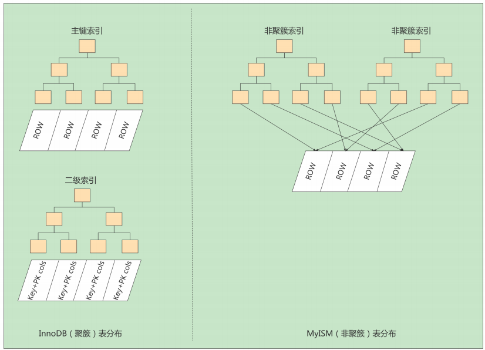

## 索引的使用场景**☆** 

**哪些情况适合创建索引：**

- 频繁作为WHERE查询条件的字段     id = 聚簇索引，不需要回表 iphone
- 经常GROUP BY 和 ORDER BY的列    
- 字段的值有唯一性的限制 
- DISTINCT字段需要创建索引
- 多表JOIN时，对连接字段创建索引
- 使用字符串前缀创建索引
    - `例如`一个字段 address varchar（120），我们可以创建索引的长度为（12）个字符，节省索引空间
- 区分度高的列（重复的数据少）适合作为索引
- 使用频繁的列，放到联合索引的左侧 


**哪些情况不要创建索引：**

- WHERE、GROUP BY 、ORDER BY里用不到的字段不创建索引
- 表的数据记录太少
- 有大量重复数据的列上 
- 避免对经常增删改的表创建索引 
- 不要定义冗余或重复的索引


# MySQL调优

- 索引失效，没有充分利用到索引：`索引建立`
- 关联查询太多JOIN（设计缺陷或不得已的需求）：`SQL优化`
- 数据过多500W，2GB：分库分表

- 服务器调优及各个参数设置（缓冲、线程数等）：调整my.cnf

## 执行计划

 定位问题SQL：

-   微服务项目中搭建链路追踪系统 定位耗时较久接口
-   数据库层面开启慢查询日志，超过设置最大忍耐时间就会将SQL记录在日志，解析日志获取耗时较久SQL
-   顾客通过客服投诉，业务功能很卡顿，找出业务SQL

## 查看SQL执行计划

数据准备

```mysql
USE impowerdb;
 
CREATE TABLE t1(id INT(10) AUTO_INCREMENT, content VARCHAR(100) NULL, PRIMARY KEY (id));
CREATE TABLE t2(id INT(10) AUTO_INCREMENT, content VARCHAR(100) NULL, PRIMARY KEY (id));
CREATE TABLE t3(id INT(10) AUTO_INCREMENT, content VARCHAR(100) NULL, PRIMARY KEY (id));
CREATE TABLE t4(id INT(10) AUTO_INCREMENT, content1 VARCHAR(100) NULL, content2 VARCHAR(100) NULL, PRIMARY KEY (id));

CREATE INDEX idx_content1 ON t4(content1);  -- 创建普通索引

# 以下新增sql多执行几次，以便演示
INSERT INTO t1(content) VALUES(CONCAT('t1_',FLOOR(1+RAND()*1000)));
INSERT INTO t2(content) VALUES(CONCAT('t2_',FLOOR(1+RAND()*1000)));
INSERT INTO t3(content) VALUES(CONCAT('t3_',FLOOR(1+RAND()*1000)));
INSERT INTO t4(content1, content2) VALUES(CONCAT('t4_',FLOOR(1+RAND()*1000)), CONCAT('t4_',FLOOR(1+RAND()*1000)));
```


`EXPLAIN`可以对mysql语句性能分析

### id

**id相同:**

在一个完整的查询语句中，每个SELECT关键字，都对应一个唯一的id，同时通过id也可以知道操作表的顺序。

```mysql
EXPLAIN SELECT * FROM t1, t2, t3;
```

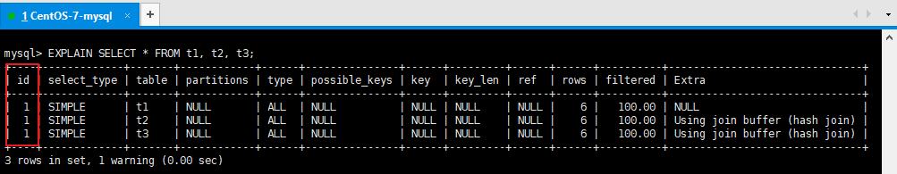

**id不同：**三个SELECT，id是1、2、3 

```mysql
EXPLAIN SELECT t1.id FROM t1 WHERE t1.id =(
  SELECT t2.id FROM t2 WHERE t2.id =(
    SELECT t3.id FROM t3 WHERE t3.content = '000'
  )
);
```

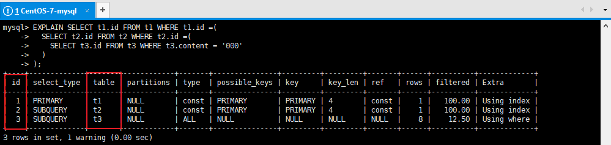

**注意：**如果t3表查询无结果，则table列`t1`和`t2`处为`NULL`

**注意：**查询优化器可能对涉及子查询的语句进行优化，`转为连接查询`

```mysql
EXPLAIN SELECT * FROM t1 WHERE content IN (SELECT content FROM t2 WHERE content = 'a');
```

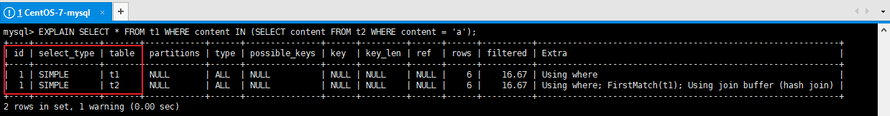

### table

结果值从最好到最坏依次是： 

`system > const > eq_ref > ref` > fulltext > ref_or_null > index_merge > unique_subquery > index_subquery > `range > index > ALL` 

`比较重要的包含：system > const > eq_ref > ref > range > index > ALL`

SQL 性能优化的目标：至少要达到 `range` 级别，要求是 `ref` 级别，最好是 `const`级别。（阿里巴巴
开发手册要求）

* **ALL：**全表扫描。Full Table Scan，将遍历全表以找到匹配的行

```mysql
EXPLAIN SELECT * FROM t1;
```

* **index：**全索引扫描。当使用`覆盖索引`，但需要扫描`全部的索引记录`时

```mysql
EXPLAIN SELECT content1 FROM t4;
```

* **range：**只检索给定范围的行，使用一个索引来选择行。key 列显示使用了哪个索引，一般就是在你的where语句中出现了between、<、>、in等的查询。

```mysql
EXPLAIN SELECT * FROM t1 WHERE id > 2;
```

* **ref：**通过普通二级索引列与常量进行等值匹配时

```mysql
EXPLAIN SELECT * FROM t4 WHERE content1 = 'a';
```

* **eq_ref：**连接查询时通过`主键`或不允许NULL值的`唯一二级索引`列进行等值匹配时数据量级，可能会影响索引的使用！ mysql 内部的优化器！

```mysql
EXPLAIN SELECT * FROM t1, t2 WHERE t1.id = t2.id;
```

* **const：**根据`主键`或者`唯一二级索引`列与`常数`进行匹配时

```mysql
EXPLAIN SELECT * FROM t1 WHERE id = 1;
```

* **system：**MyISAM引擎中，当表中只有一条记录时。`（这是所有type的值中性能最高的场景）`

```mysql
CREATE TABLE t(i int) Engine=MyISAM;
INSERT INTO t VALUES(1);
EXPLAIN SELECT * FROM t;
```

### possible_keys 和 key **☆**

- `possible_keys`表示执行查询时`可能用到的索引`，一个或多个。 查询涉及到的字段上若存在索引，则该索引将被列出，但不一定被查询实际使用。

- `keys`表示`实际使用的索引`。如果为NULL，则没有使用索引。

```mysql
EXPLAIN SELECT id FROM t1 WHERE id = 1;
```

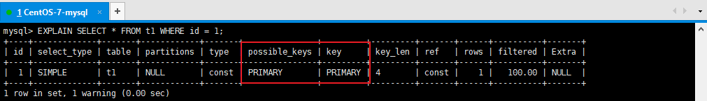

### key_len **☆** 

表示索引使用的字节数，根据这个值可以判断索引的使用情况，`检查是否充分利用了索引，针对联合索引值越大越好。`

**如何计算：**

1. 先看索引上字段的类型+长度。比如：int=4 ; varchar(20) =20 ; char(20) =20 
2. 如果是varchar或者char这种字符串字段，视字符集要乘不同的值，比如utf8要乘 3(MySQL5.7)，如果是utf8mb4要乘4，GBK要乘2
3. varchar这种动态字符串要加2个字节
4. 允许为空的字段要加1个字节 

```mysql
-- 创建索引
CREATE INDEX idx_age_name ON t_emp(age, `name`);
-- 测试1
EXPLAIN SELECT * FROM t_emp WHERE age = 30 AND `name` = 'ab%';
-- 测试2
EXPLAIN SELECT * FROM t_emp WHERE age = 30;
```

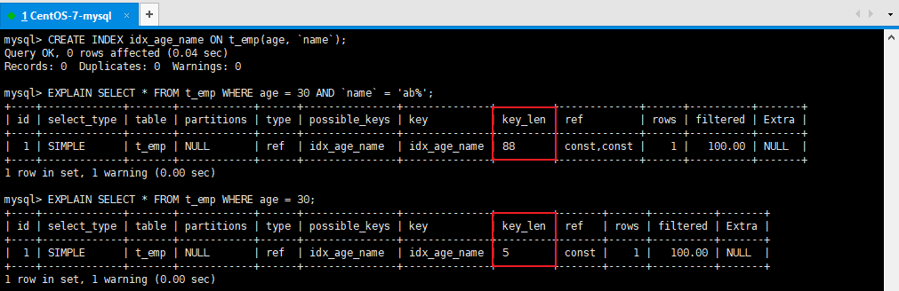

### ref

显示与key中的索引进行比较的列或常量。

- **const：**  与索引列进行等值比较的东西是啥，const表示一个常数

```sql
EXPLAIN SELECT * FROM t4 WHERE content1 = 'a';
```

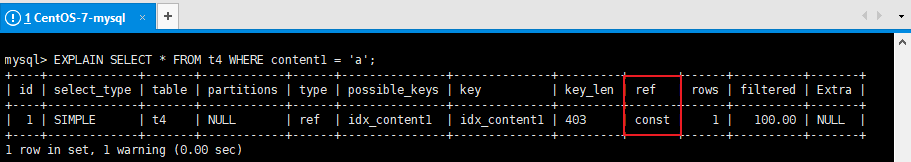


- **ref=atguigudb.t1.id**   关联查询时出现，t2表和t1表的哪一列进行关联

```sql
EXPLAIN SELECT * FROM t1, t2 WHERE t1.id = t2.id;
```

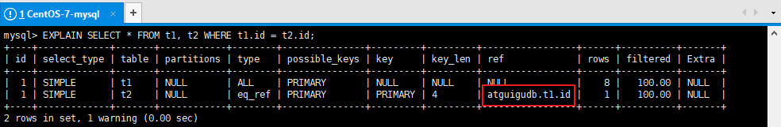


### rows **☆**

MySQL认为它执行查询时实际从索引树中查找到的行数。`值越小越好。`

```sql
-- 如果是全表扫描，rows的值就是表中数据的估计行数
EXPLAIN SELECT * FROM t_emp WHERE empno = '100001';

-- 如果是使用索引查询，rows的值就是预计扫描索引记录行数
EXPLAIN SELECT * FROM t_emp WHERE deptId = 1;
```


### filtered

最后查询出来的数据占所有服务器端（server）检查行数（rows）的`百分比`，`值越大越好`。

例如上一个例子。

### Extra **☆** 

包含不适合在其他列中显示但十分重要的额外信息。通过这些额外信息来`理解MySQL到底将如何执行当前的查询语句`  MySQL提供的额外信息有好几十个，这里只挑比较重要的介绍。

- 被返回到server层进行过滤，那么就是Using where。

```sql
EXPLAIN SELECT * FROM t_emp WHERE `name` = '风清扬';
```

- **Using filesort：**

如果出现了Using filesort 说明排序没有使用上索引，如下所示：

```sql
EXPLAIN SELECT * FROM t1 ORDER BY id;
```

- **Using index：**`使用了覆盖索引`，表示直接访问索引就足够获取到所需要的数据，不需要通过索引回表

```sql
 EXPLAIN SELECT id, content1 FROM t4;
```

- **Using index condition：**叫作  `Index Condition Pushdown Optimization （索引下推优化）`
    - `如果没有索引下推（ICP）`，那么MySQL在存储引擎层找到满足`content1 > 'z'`条件的第一条二级索引记录。`主键值进行回表`，返回完整的记录给server层，server层再判断其他的搜索条件是否成立。如果成立则保留该记录，否则跳过该记录，然后向存储引擎层要下一条记录。
    - `如果使用了索引下推（ICP）`，那么MySQL在存储引擎层找到满足`content1 > 'z'`条件的第一条二级索引记录。`不着急执行回表`，而是在这条记录上先判断一下所有关于`idx_content1`索引中包含的条件是否成立，也就是`content1 > 'z' AND content1 LIKE '%a'`是否成立。如果这些条件不成立，则直接跳过该二级索引记录，去找下一条二级索引记录；如果这些条件成立，则执行回表操作，返回完整的记录给server层。

```sql
-- content1列上有索引idx_content1
EXPLAIN SELECT * FROM t4 WHERE content1 > 'z' AND content1 LIKE '%a';
```

**注意：**如果这里的查询条件`只有content1 > 'z'`，那么找到满足条件的索引后也会进行一次索引下推的操作，判断content1 > 'z'是否成立（这是源码中为了编程方便做的冗余判断

- **Using join buffer：**在连接查询时，当`被驱动表（t2）不能有效的利用索引时`，MySQL会提前申请一块内存空间（join buffer）存储驱动表的数据，来加快查询速度

```sql
EXPLAIN  SELECT * FROM t1, t2 WHERE t1.content = t2.content;
# 创建了索引就不会出现Using join buffer！
create index idx_content on t2(content);
```

下面这个例子就是被驱动表使用了索引，此时Extra中就没有Using join buffer了：

```sql
EXPLAIN SELECT * FROM t_emp, t_dept WHERE t_dept.id = t_emp.deptId;
```


## 单表索引优化

全值匹配我最爱，最左前缀要遵守；
带头大哥不能死，中间兄弟不能断；
索引列上少计算，范围之后全失效；
like百分写最右，覆盖索引不写*；
不等空值还有or，索引失效要少用；
var引号不能丢，sql高级也不难；

**创建索引后，用不用索引，最终是优化器说了算。`优化器会基于开销选择索引，怎么开销小就怎么来。`不是基于规则，也不是基于语义。**

**另外SQL语句是否使用索引，和数据库的版本、数据量、数据选择度（查询中选择的列数）运行环境都有关系。**

```sql
-- 创建索引
CREATE INDEX idx_name ON emp(`name`);
```

### 计算、函数、LIKE以%开头导致索引失效

```sql
-- 显示查询分析
EXPLAIN SELECT * FROM emp WHERE emp.name  LIKE 'abc%';
EXPLAIN SELECT * FROM emp WHERE LEFT(emp.name,3) = 'abc'; -- 索引失效
EXPLAIN SELECT * FROM emp WHERE name LIKE '%ab%'; -- 索引失效
```

### 不等于(!= 或者<>) IS NOT NULL 索引失效

```sql
EXPLAIN SELECT * FROM emp WHERE emp.name = 'abc' ;
EXPLAIN SELECT * FROM emp WHERE emp.name <> 'abc' ; -- 索引失效
EXPLAIN SELECT * FROM emp WHERE emp.name IS NOT NULL; -- 索引失效
```

### 类型转换导致索引失效

```sql
EXPLAIN SELECT * FROM emp WHERE name='123'; 
EXPLAIN SELECT * FROM emp WHERE name= 123; -- 索引失效
```

### 全值匹配我最爱 最佳左前缀法则

联合索引 全值效率最高

- 如果索引了多列，要遵守最左前缀法则。即查询从`索引的最左前列`开始并且不跳过索引中的列。
- 过滤条件要使用索引，必须按照`索引建立时的顺序，依次满足`，一旦跳过某个字段，索引后面的字段都无法被使用。

## 多表查询优化

**左外连接**

针对两张表的连接条件涉及的列，索引要创建在被驱动表上，驱动表尽量是小表

- 如果驱动表上没有where过滤条件
  - 当驱动表的连接条件没有索引时，驱动表是全表扫描
  - 当针对驱动表的连接条件建立索引时，驱动表依然要进行全索引扫描
  - 因此，此时建立在驱动表上的连接条件上的索引是没有太大意义的

- 如果驱动表上有where过滤条件，那么针对过滤条件创建的索引是有必要的

**内连接**

发现即使交换表的位置，MySQL优化器也会自动选择驱动表，自动选择驱动表的原则是：索引创建在被驱动表上，驱动表是小表。

- 保证被驱动表的JOIN字段已经创建了索引。

- 需要JOIN 的字段，数据类型保持绝对一致。

- LEFT JOIN 时，选择小表作为驱动表，大表作为被驱动表 。减少外层循环的次数。

- INNER JOIN 时，MySQL会自动将小结果集的表选为驱动表 。选择相信MySQL优化策略。

- 能够直接多表关联的尽量直接关联，不用子查询。(减少查询的趟数)

- 衍生表建不了索引（MySQL5.5）

### 子查询优化

```sql
-- 推荐
-- 按照集合查询
SELECT emp.* FROM t_emp emp 
LEFT JOIN t_dept dept ON emp.id = dept.ceo WHERE dept.id IS NULL;
```

### 排序优化

* 无过滤，不索引
* 顺序错，不索引
* 方向反，不索引

### 分组优化

- `group by 使用索引的原则几乎跟order by一致`。但是group by 即使没有过滤条件用到索引，也可以直接使用索引（Order By 必须有过滤条件才能使用上索引）
- 包含了order by、group by、distinct这些查询的语句，where条件过滤出来的结果集请保持在1000行以内，否则SQL会很慢。

### 覆盖索引优化

* 禁止使用select *，禁止查询与业务无关字段
* 尽量利用覆盖索引

## 慢查询日志

**慢查询日志是什么?** 

查看哪些SQL超出了我们的最大忍耐时间值。

**怎么使用慢查询日志?**

1. 默认情况下，MySQL数据库没有开启慢查询日志，需要我们手动来设置这个参数。**如果不是调优需要的话**，一般不建议启动该参数，因为开启慢查询日志会或多或少带来一定的性能影响。

```sql
SHOW VARIABLES LIKE '%slow_query_log%';
SET GLOBAL slow_query_log=1; 
```

2. 修改long_query_time阈值

```sql
SHOW VARIABLES LIKE '%long_query_time%'; -- 查看值：默认10秒
SET GLOBAL long_query_time=0.1; -- 设置一个比较短的时间，便于测试
```

- **重新登录客户端**使上面的设置生效
- 假如运行时间正好等于long_query_time的情况，并不会被记录下来。
- 也就是说，在mysql源码里是判断大于long_query_time，而非大于等于。

3. 日志分析工具

执行耗时sql

查询慢查询记录数：

```sql
SHOW GLOBAL STATUS LIKE '%Slow_queries%'; 
```

查询日志：

```bash
注意这个地方是容器中的
vim /var/lib/mysql/atguigu-slow.log
```

**mysqldumpslow：**

在生产环境中，如果要手工分析日志，查找、分析SQL，显然是个体力活，MySQL提供了日志分析工具mysqldumpslow。退出mysql命令行，执行以下命令：

```sql
-- 查看mysqldumpslow的帮助信息
mysqldumpslow --help

-- 工作常用参考
-- 1.得到返回记录集最多的10个SQL
mysqldumpslow -s r -t 10 /var/lib/mysql/atguigu-slow.log
-- 2.得到访问次数最多的10个SQL
mysqldumpslow -s c -t 10 /var/lib/mysql/atguigu-slow.log
-- 3.得到按照时间排序的前10条里面含有左连接的查询语句
mysqldumpslow -s t -t 10 -g "left join" /var/lib/mysql/atguigu-slow.log
-- 4.另外建议在使用这些命令时结合 | 和more 使用 ，否则语句过多有可能出现爆屏情况
mysqldumpslow -s r -t 10 /var/lib/mysql/atguigu-slow.log | more
```

- -a: 不将数字抽象成N，字符串抽象成S

- -s: 是表示按照何种方式排序；
  - c: sql语句的访问次数
  - l: 锁定时间
  - r: 返回数据记录集的总数量
  - t: 查询时间

  - al:平均锁定时间
  - ar:平均返回记录数
  - at:平均查询时间

- -t: 即为返回前面多少条的数据；

- -g: 后边搭配一个正则匹配模式，大小写不敏感的；

## View视图

**view视图是什么**

- 将一段查询sql封装为一个虚拟的表。 
- 这个虚拟表只保存了sql逻辑，不会保存任何查询结果。

**view视图的作用**

- 封装复杂sql语句，提高复用性
- 逻辑放在数据库上面，更新不需要发布程序，面对频繁的需求变更更灵活

**view视图的适用场景**

- 共用查询结果
- 报表

**view视图的使用**

**创建**

```sql
-- 语法
CREATE VIEW view_name 
AS SELECT column_name(s) FROM table_name WHERE condition;

-- 例如：求所有人物对应的掌门名称
CREATE VIEW v_ceo AS
SELECT emp.name, ceo.name AS ceoname 
FROM t_emp emp
LEFT JOIN t_dept dept ON emp.deptid = dept.id 
LEFT JOIN t_emp ceo ON dept.ceo = ceo.id;
```

**使用**

```sql
-- 语法
SELECT * FROM view_name; 

-- 例如：
SELECT * FROM v_ceo; 
```

**更新**

```sql
-- 语法
CREATE OR REPLACE VIEW view_name 
AS SELECT column_name(s) FROM table_name WHERE condition

-- 建议直接删除重新创建
```

**删除**

```sql
DROP VIEW view_name;

-- 例如：
DROP VIEW v_ceo;
```

# MySQL事务

## 什么是mysql事务?

事务 : 一组操作作为一个整体被提交或回滚。

事务提供了四个重要的属性，通常被称为 ACID 属性：

1. **原子性（Atomicity）**：事务中的所有操作要么全部成功完成，要么全部失败回滚。如果事务的一部分成功，另一部分失败，那么整个事务都会回滚，以保持数据库的一致性。
2. **一致性（Consistency）**：事务将数据库从一个一致状态转换到另一个一致状态。这意味着事务开始前和结束后，数据库都处于有效的业务规则状态。
3. **隔离性（Isolation）**：并发执行的事务之间相互独立，它们的操作不会影响到彼此。不同的事务看起来像是在独立的时间段内执行的。
4. **持久性（Durability）**：一旦事务被提交，其对数据库所做的更改就是永久性的，即使系统出现故障，如断电或崩溃，这些更改也不会丢失。


## mysql事务的隔离级别

MySQL 支持四种标准的事务隔离级别，这些级别是按照 SQL 标准定义的，从低到高分别是：

1. **读未提交（Read Uncommitted）**：
- 在这个级别下，一个事务可以读取另一个事务尚未提交的数据。这可能会**导致脏读**（Dirty Reads），即一个事务读取到了另一个事务修改但未提交的数据。
2. **读已提交（Read Committed）**：
- 这个级别禁止了脏读，确保一个事务只能读取到已经提交的数据。但是，在这种情况下仍然可能出现**不可重复读**（Non-Repeatable Reads），即在一个事务中多次读取同一数据时，结果可能不同，因为其他事务在这期间可能已经修改并提交了数据。
3. **可重复读（Repeatable Read）**：
   - 这是 MySQL InnoDB 存储引擎的默认隔离级别。它通过多版本并发控制（MVCC）机制，保证了事务可以重复读取相同的数据行，即使在事务执行过程中有其他事务修改并提交了这些数据行。然而，它仍然不能**防止幻读（Phantom Reads）**，即在一个事务内，两次相同的查询返回不同的行数，因为另一个事务在第一次查询后插入了新的行。
4. **串行化（Serializable）**：
   - 这是最严格的隔离级别，它通过锁定机制来避免所有冲突，确保事务以串行方式执行，就像没有并发一样。这样可以完全避免脏读、不可重复读和幻读，**但可能会导致更多的锁争用，从而降低系统性能**。


## MVCC


### 什么是MVCC

MVCC(Mutil-Version Concurrency Control)，是一种乐观锁 **多版本并发控制。是一种并发控制的方法，**一般在数据库管理系统中，实现对数据库的并发访问。

用于支持读已提交(RC）和可重复读(RR）隔离级别的实现。 

> **MVCC**在**MySQL InnoDB**引擎中的实现主要是为了在处理读-写冲突时提高数据库并发性能，记录读已提交和可重复读这两种隔离级别下事务操作版本连的过程。

- **数据库并发场景一般有三种：**
  - **读-读**：不存在任何问题，不需要并发控制
  - **读-写**：有线程安全问题，可能会造成事务隔离性问题，可能会有脏读，幻读，不可重复读
  - **写-写**：有线程安全问题，可能会存在更新丢失问题
- MVCC主要是用来解决**读-写**冲突的**无锁并发控制**，
  - 在并发读写数据时，可以做到在读操作时不用阻塞写操作，写操作不用阻塞读操作，提高数据库并发读写的性能
  - 可以解决脏读，幻读，不可重复读等事务隔离问题，但不能解决【写-写】引起的更新丢失问题
- 降低了死锁的概率
- 解决一致性读的问题


> MVCC的作用可以概括为就是为了解决【读写冲突】，提高数据库性能的，而MVCC的实现又依赖于六个概念：【隐式字段】【undo日志】【版本链】【快照读和当前读】【读视图】。

### 隐式字段

**在InnoDB存储引擎，针对每行记录都有固定的两个隐藏列【DB_TRX_ID】【DB_ROLL_PTR】以及一个可能存在的隐藏列【DB_ROW_ID】**。

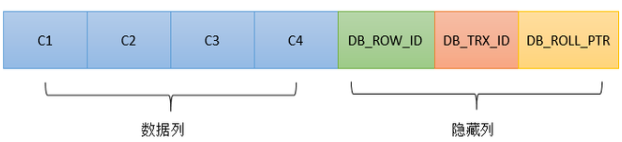

| 隐式字段    | 描述                                                         | 是否必须存在 |
| :---------- | :----------------------------------------------------------- | :----------- |
| DB_TRX_ID   | 事物Id，也叫事物版本号，占用6byte的标识，**事务开启之前，从数据库获得一个自增长的事务ID，用其判断事务的执行顺序** | 是           |
| DB_ROLL_PTR | 占用7byte，**回滚指针，指向这条记录的上一个版本的undo log记录** | 是           |
| DB_ROW_ID   | 隐含的自增ID（隐藏主键），如果表中没有主键和非NULL唯一键时，则会生成一个**单调递增的行ID作为聚簇索引** | 否           |

### undo日志

**一种用于撤销回退的日志，在事务开始之前，会先记录存放到 Undo 日志文件里，备份起来，当事务回滚时或者数据库崩溃时用于回滚事务**。

**undo日志的主要作用是事务回滚和实现MVCC快照读**。

> **InnoDB 并不会真正地去开辟空间存储多个版本的行记录，只是借助 undo log 记录每次写操作的反向操作。所以B+ 索引树上对应的记录只会有一个最新版本，InnoDB 可以根据 undo log 得到数据的历史版本，从而实现多版本控制。**

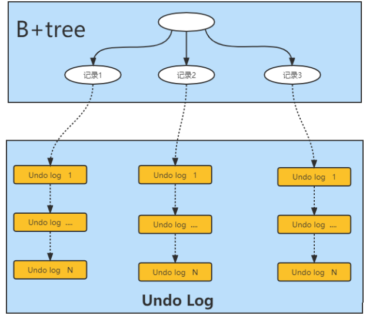

#### 版本链

> InnoDB 存储引擎中 MVCC 的实现是通过 **undo log** 来完成的

**当事务对某一行数据进行改动时，会产生一条Undo日志，多个事务同时操作一条记录时，就会产生多个版本的Undo日志，这些日志通过回滚指针（DB_ROLL_PTR）连成一个链表，称为版本链**。

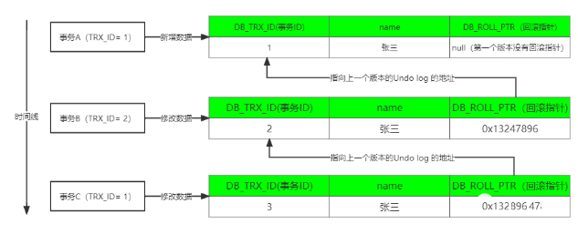

> 只要有事务写入数据时，就会产生一条对应的 undo log，一条 undo log 对应这行数据的一个版本，当这行数据有多个版本时，就会有多条 undo log 日志，undo log 之间通过回滚指针（DB_ROLL_PTR）连接，这样就形成了一个 undo log 版本链。

#### 快照读和当前读

- **快照读【Consistent Read】**

  也叫普通读，读取的是记录数据的可见版本，不加锁，不加锁的普通select语句都是快照读。快照读的执行方式是生成 ReadView，直接利用 MVCC 机制来进行读取，并不会对记录进行加锁。

  如下语句： 

  ```sql
  select * from table;
  ```

- **当前读【Locking Read】**

  也称锁定读，读取的是记录数据的最新版本，并且需要先获取对应记录的锁。如下语句：

  ```
  SELECT * FROM student lock in share mode; # 共享 锁
  SELECT * FROM student FOR UPDATE; # 排他锁
  INSERT INTO student values ...  # 排他锁
  DELETE FROM student WHERE ...  # 排他锁
  UPDATE student SET ...  # 排他锁
  ```

### 读视图【Read View】

**Read View提供了某一时刻事务系统的快照，主要是用来做`可见性`判断, 里面保存了【对本事务不可见的其他活跃事务】**。

当事务开始执行时，InnoDB 会为该事务创建一个 ReadView，这个 ReadView 会记录 4 个重要的信息：

- **creator_trx_id**

  当前read view创建者的事务ID

- **m_ids**

  当前系统中所有的活跃事务的 id，活跃事务指的是当前系统中开启了事务，但还**没有提交的事务**;

- **m_low_limit_id**

  表示在生成ReadView时，当前系统中活跃的读写事务中最小的事务id，即m_ids中的最小值。

- **m_up_limit_id**

  当前系统中事务的 id 值最大的那个事务 id +1，也就是系统中下一个要生成的事务 id。


## 不同隔离级别MVCC实现原理

### 读视图可见性判断规则

将Read View中的活跃事务Id按照大小放在坐标轴上表示的话，如下图：


一行数据记录对事务是否可见，取决于**数据记录的trx_id**与这几个信息的比对结果，有以下几种可能：

1、如果小于m_low_limit_id，表示这个版本是已提交的事务或者是当前事务自己生成的，这个数据是可见的；

2、如果大于m_up_limit_id，表示这个版本是由将来启动的事务生成的，是肯定不可见的；

3、如果在m_low_limit_id和 m_up_limit_id之间，那就包括两种情况

（1）若 row trx_id在数组中，表示这个版本是由还没提交的事务生成的，不可见；

（2）若 row trx_id不在数组中，表示这个版本是已经提交了的事务生成的，可见。

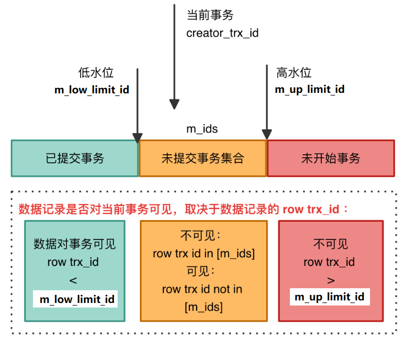

**而在实际的使用过程中，Read View在不同的隔离级别下是得工作方式是不一样**。

### 读已提交（RC）MVCC实现原理

**在读已提交(Read committed)的隔离级别下实现MVCC，同一个事务里面，【每一次查询都会产生一个新的Read View副本】，这样可能造成同一个事务里前后读取数据可能不一致的问题（不可重复读问题）**。

还是按照上述案例来说明一下：

- 【第一步】：准备一条原始数据

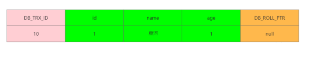

- 【第二步】：假设现在有事务 A【DB_TRX_ID = 20】 和事务 B 【DB_TRX_ID = 30】并发执行

  ```sql
  #事务A：
  select name from user where id = 1;
  #事务B：
  update user set name = 'edwin' where id = 1;
  ```

  执行过程为

  | 时间 | 事务A                                           | 事务B                                                  |
  | :--- | :---------------------------------------------- | :----------------------------------------------------- |
  | 1    | 开始事务                                        |                                                        |
  | 2    | 第一次查询：select name from user where id = 1; |                                                        |
  | 3    |                                                 | 开始事务                                               |
  | 4    |                                                 | 执行修改：update user set name = 'edwin' where id = 1; |
  | 5    |                                                 | 提交事务                                               |
  | 6    | 第二次查询：select name from user where id = 1; |                                                        |
  | 7    | 提交事务                                        |                                                        |

  版本链为：

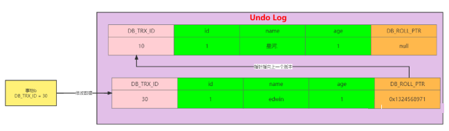

**案例结果分析**：

上述案例在**在读已提交(Read committed)的隔离级别下实现，同一个事务里面，【每一次查询都会产生一个新的Read View副本】**。所以实际上产生了三个Read View

|                            | m_ids   | m_low_limit_id | m_up_limit_id | creator_trx_id |
| :------------------------- | :------ | :------------- | :------------ | :------------- |
| 事务A：第一次查询Read View | [20,30] | 20             | 31            | 20             |
| 事务B：Read View           | [20,30] | 20             | 31            | 30             |
| 事务A：第二次查询Read View | [20]    | 20             | 31            | 20             |

通过可见性判断：

- **事务A第一次查询时**

  > 读视图可见性判断规则：`DB_TRX_ID < m_low_limit_id`**表示**DB_TRX_ID对应这条数据【Undo日志】是在当前事务开启之前，其他的事务就已经将该条数据修改了并提交了事务(事务的 id 值是递增的)，所以当前事务【开启Read View的事务】能读取到。

  版本链中的日志事务Id【DB_TRX_ID = 10】 < 最小活跃事务ID【m_low_limit_id=20】说明【DB_TRX_ID = 10】这条数据是事务A开启前就已经写入并提交，因此可以读取到DB_TRX_ID = 10这条版本链中的数据。即name = 星河。

- **事务A第二次查询时**

  >   读视图可见性判断规则：`m_low_limit_id =< DB_TRX_ID < m_up_limit_id`且`DB_TRX_ID  不在 m_ids 数组中` **表示**的是在当前事务【creator_trx_id】开启之前，其他事务【DB_TRX_ID】将数据修改后就已经提交了事务，所以当前事务能读取到。

  此时事务B已经提交，版本链中最新版本为DB_TRX_ID = 30，而可见性规则中虽然满足

  【m_low_limit_id=20】=<【DB_TRX_ID=30】<【m_up_limit_id=31】但是【DB_TRX_ID=30】不在m_ids集合[20]中，因此事务A的第二次查询可以读取【DB_TRX_ID=30】的数据，即name = edwin。

**案例总结**：

通过上述案例说明，**同一个事务A的两个相同查询，第一次结果为星河，第二次结果为edwin，因此在读已提交（RC）隔离级别下，存在不可重复读并发问题**。

### 可重复读（RR）MVCC实现原理

**在可重复读(Repeatable read)的隔离级别下实现MVCC，【同一个事务里面，多次查询，都只会产生一个共用Read View】，以此解决不可重复读并发问题**。

案例与3.2一样，这里就不重复赘述，可以再看一遍3.2的【第一步】【第二步】，直接进行案例分析

**案例结果分析**：

由于同一个事务只会产生一个共用Read View，所以可重复读的隔离级别下第二步只产生了两个Read View

上述案例在**可重复读(Repeatable read)，【每一次查询都会产生一个新的Read View副本】**。所以第二步实际上产生了三个Read View

|                  | m_ids   | m_low_limit_id | m_up_limit_id | creator_trx_id |
| :--------------- | :------ | :------------- | :------------ | :------------- |
| 事务A：Read View | [20,30] | 20             | 31            | 20             |
| 事务B：Read View | [20,30] | 20             | 31            | 30             |

通过可见性判断：

- **事务A第一次查询时**

  > 读视图可见性判断规则：`DB_TRX_ID < m_low_limit_id`**表示**DB_TRX_ID对应这条数据【Undo日志】是在当前事务开启之前，其他的事务就已经将该条数据修改了并提交了事务(事务的 id 值是递增的)，所以当前事务【开启Read View的事务】能读取到。

  日志事务Id【DB_TRX_ID = 10】 < 最小活跃事务ID【m_low_limit_id=20】，因此可以读取到DB_TRX_ID = 10这条版本链中的数据。即name = 星河。

- **事务A第二次查询时**

  > 读视图可见性判断规则：`m_low_limit_id =< DB_TRX_ID < m_up_limit_id`且`DB_TRX_ID  在 m_ids 数组中` 但`DB_TRX_ID不等于creator_trx_id`表示：**DB_TRX_ID事务修改了数据的值，并提交了事务，所以当前事务【creator_trx_id】不能读取到。**

  此时事务B已经提交，版本链中最新版本为DB_TRX_ID = 30，而可见性规则中虽然满足

  【m_low_limit_id=20】=<【DB_TRX_ID=30】<【m_up_limit_id=20】并且【DB_TRX_ID=30】也在m_ids集合[20，30]中，但是【DB_TRX_ID=30】不等于事务A的【creator_trx_id=20】，说明**DB_TRX_ID=30是同一时刻其他事务提交的，事务A不能读取到**，因此事务A只能按照版本链继续往上找，最终读取到【DB_TRX_ID=10】的数据，即name = 星河。

**案例总结**：

通过上述案例说明，**同一个事务A的两个相同查询，结果都为星河，因此在可重复读（RR）隔离级别下，解决了不可重复读并发问题**。


# Mysql分布式事务Seata

Apache Seata(incubating) 是一款开源的分布式事务解决方案，致力于在微服务架构下提供高性能和简单易用的分布式事务服务。

## 三个重要角色

- TC (Transaction Coordinator) - 事务协调者： 维护全局和分支事务的状态，协调全局事务提交或回滚。
- TM (Transaction Manager) - 事务管理器： 定义全局事务的范围、开始全局事务、提交或回滚全局事务。
- RM (Resource Manager) - 资源管理器： 管理分支事务处理的资源，与TC交互以注册分支事务和报告分支事务的状态，并驱动分支事务提交或回滚。

## 架构图


## 模式

- XA模式：强一致性分阶段事务模式，牺牲了一定的可用性，无业务侵入
- TCC模式：最终一致的分阶段事务模式，有业务侵入
- AT模式：最终一致的分阶段事务模式，无业务侵入，也是Seata的默认模式
- SAGA模式：长事务模式，有业务侵入

## 使用

- 使用docker 安装seata
- 数据库初始化
- 配置数据库相关信息
- 在相关微服务的数据库中添加undo_log表
- 事务的发起者：@GlobalTransactional(rollbackFor = Exception.class)

## seata 失效情况

- 不能有异步
- 不能将异常信息打印处理{ e.printStackTrace()}，必须要抛出去
- 远程调用下游服务存在全局异常处理，要对响应结果业务状态码进行判断处理

## seataAT模式原理

基本流程图：

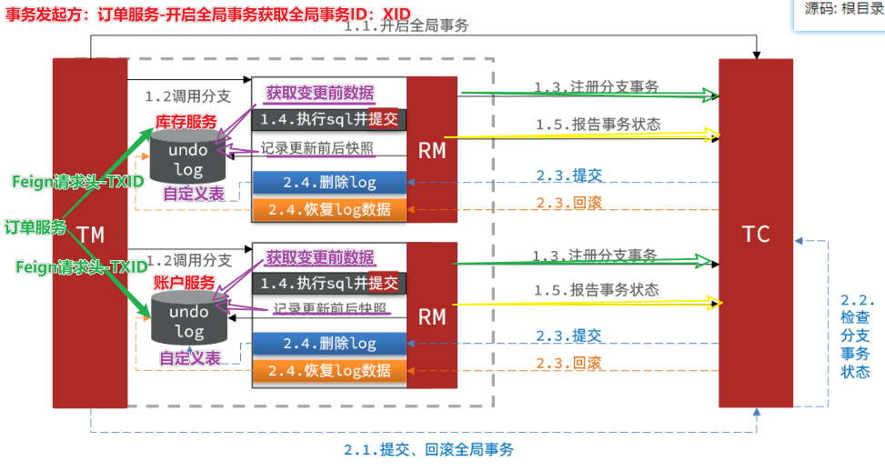

- 一阶段
  - 业务数据和回滚日志记录在同一个本地事务中提交（获取记录ID对应全局锁），释放本地锁和连接资源
    - 解析sql，获取到查询前镜像
    - 根据主键，获取到查询后镜像
    - 将前后镜像的数据插入到undo_log 表中
    - 根据主键值向TC申请全局锁
    - 本地事务提交【当前操作 + undo_log 表】
    - 将提交结果上报给TC
- 二阶段
  - 提交：提交异步化，非常快速地完成
    - 异步提交 并立刻返回结果
    - 删除undo_log 表
  - 回滚：回滚通过一阶段的回滚日志进行反向补偿
    - 开启本地事务，根据全局事务Id [xid] 和 分支Id branchId 获取undo_log 记录
    - 获取undo_log 后镜像数据与当前数据比较 true: 没有被修改  false: 被修改了，需要人工处理
    - 根据前镜像与undo_log 日志生成回滚语句


### 全局锁

写隔离

- 全局锁 -- 写隔离---{拿不到全局锁，不能提交本地事务} ，防止脏写！

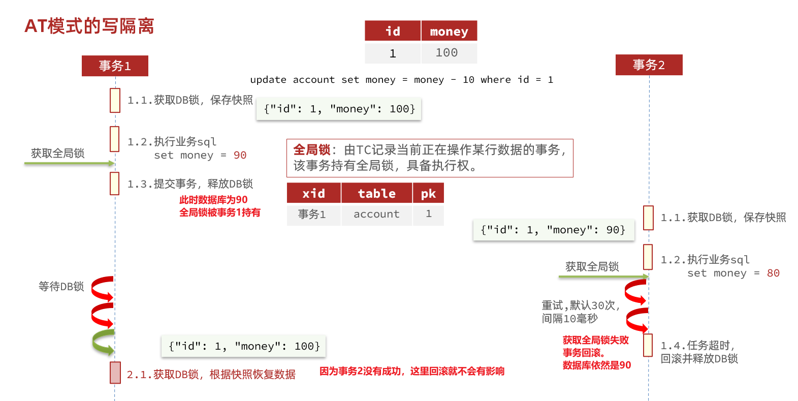


- 读隔离
  - select m table for update 获取全局锁

## Seata的XA模型

Seata对原始的XA模式做了简单的封装和改造，以适应自己的事务模型，基本架构如图：

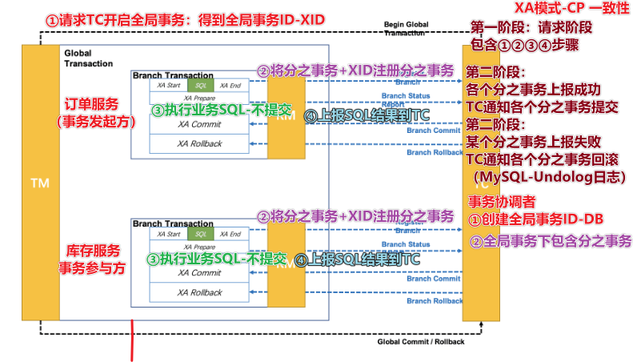

RM一阶段的工作：

​	① 注册分支事务到TC

​	② 执行分支业务sql但不提交

​	③ 报告执行状态到TC

TC二阶段的工作：

- TC检测各分支事务执行状态

  a.如果都成功，通知所有RM提交事务 

  b.如果有失败，通知所有RM回滚事务

RM二阶段的工作：

- 接收TC指令，提交或回滚事务

### 优缺点

XA模式的优点是什么？

- 事务的强一致性，满足ACID原则。
- 常用数据库都支持，实现简单，并且没有代码侵入

XA模式的缺点是什么？

- 因为一阶段需要锁定数据库资源，等待二阶段结束才释放，**性能较差**
- 依赖关系型数据库实现事务

### AT与XA的区别

简述AT模式与XA模式最大的区别是什么？

- XA模式一阶段不提交事务，锁定资源；AT模式一阶段直接提交，不会长时间锁定资源。
- XA模式依赖数据库机制(undolog日志文件)实现回滚；AT模式利用**数据快照表**实现数据回滚。
- XA模式强一致（刚性事务）；AT模式最终一致（柔性事务）

## 三种模式对比

我们从以下几个方面来对比四种实现：

- 一致性：能否保证事务的一致性？强一致还是最终一致？
- 隔离性：事务之间的隔离性如何？
- 代码侵入：是否需要对业务代码改造？
- 性能：有无性能损耗？
- 场景：常见的业务场景

如图：

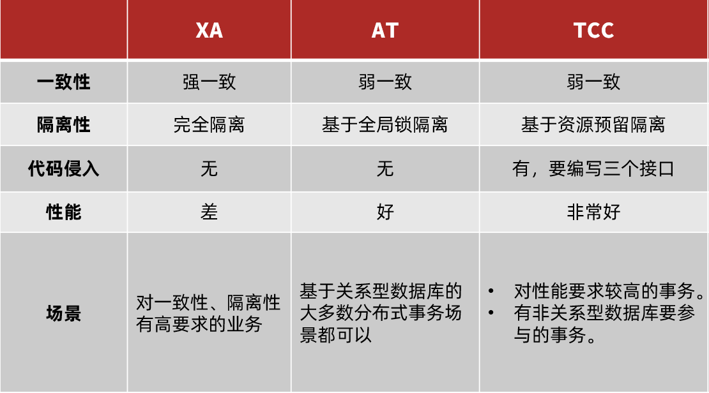

