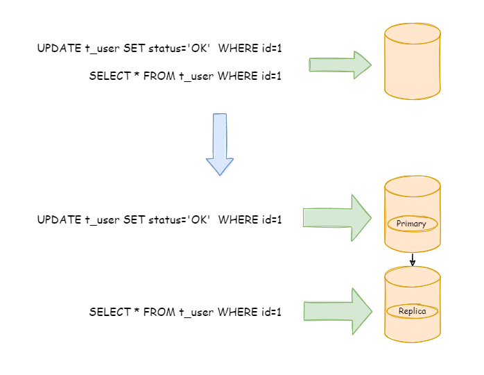
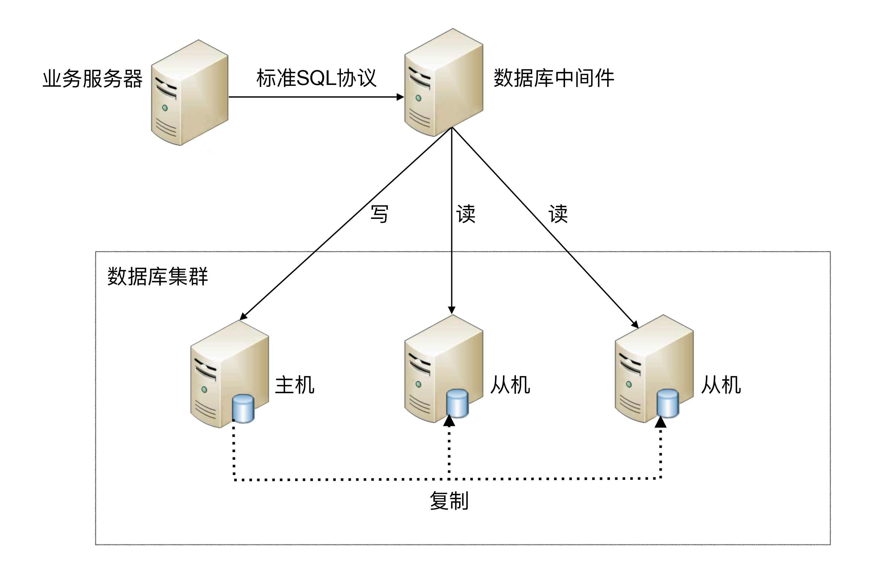
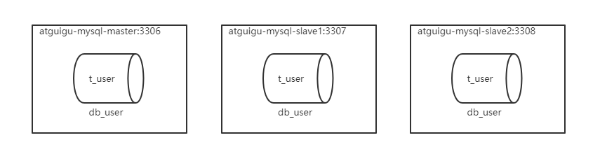
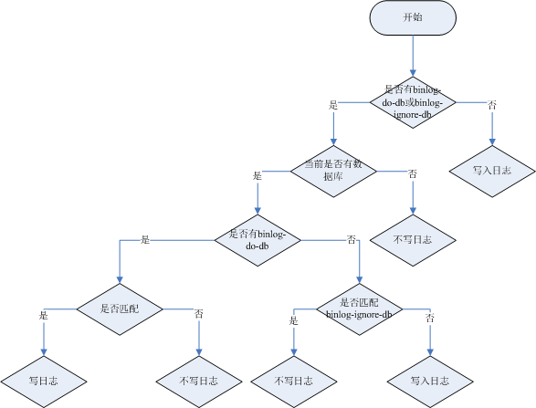
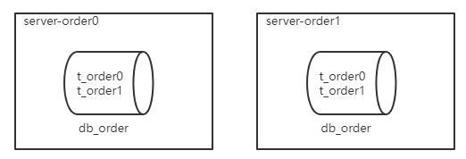

# ShardingSphere5

# 高性能架构模式

互联网业务兴起之后，海量用户加上海量数据的特点，单个数据库服务器已经难以满足业务需要，必须考虑数据库集群的方式来提升性能。高性能数据库集群的`第一种方式是“读写分离”`，`第二种方式是“数据库分片”`。


## 读写分离架构

**读写分离原理：**读写分离的基本原理是将数据库读写操作分散到不同的节点上，下面是其基本架构图：


**读写分离的基本实现：**

-  `主库负责处理事务性的增删改操作，从库负责处理查询操作`，能够有效的避免由数据更新导致的行锁，使得整个系统的查询性能得到极大的改善。
-  读写分离是`根据 SQL 语义的分析`，`将读操作和写操作分别路由至主库与从库`。
-  通过`一主多从`的配置方式，可以将查询请求均匀的分散到多个数据副本，能够进一步的提升系统的处理能力。 
-  使用`多主多从`的方式，不但能够提升系统的吞吐量，还能够提升系统的可用性，可以达到在任何一个数据库宕机，甚至磁盘物理损坏的情况下仍然不影响系统的正常运行。


**下图展示了根据业务需要，将用户表的写操作和读操路由到不同的数据库的方案：**




**CAP 理论：**

CAP 定理（CAP theorem）又被称作布鲁尔定理（Brewer's theorem），是加州大学伯克利分校的计算机科学家埃里克·布鲁尔（Eric Brewer）在 2000 年的 ACM PODC 上提出的一个猜想。`对于设计分布式系统的架构师来说，CAP 是必须掌握的理论。`


在一个`分布式系统中`，当涉及读写操作时，只能保证一致性（Consistence）、可用性（Availability）、分区容错性（Partition Tolerance）三者中的两个，另外一个必须被牺牲。

- C 一致性（Consistency）：对某个指定的客户端来说，读操作保证能够返回最新的写操作结果
- A 可用性（Availability）：非故障的节点在合理的时间内返回合理的响应`（不是错误和超时的响应）`
- P 分区容忍性（Partition Tolerance）：当出现网络分区后`（可能是丢包，也可能是连接中断，还可能是拥塞）`，系统能够继续“履行职责”


**CAP特点：**

- 在实际设计过程中，每个系统不可能只处理一种数据，而是包含多种类型的数据，`有的数据必须选择 CP，有的数据必须选择 AP，分布式系统理论上不可能选择 CA 架构。`

    

    - CP：如下图所示，`为了保证一致性`，当发生分区现象后，N1 节点上的数据已经更新到 y，但由于 N1 和 N2 之间的复制通道中断，数据 y 无法同步到 N2，N2 节点上的数据还是 x。`这时客户端 C 访问 N2 时，N2 需要返回 Error，提示客户端 C“系统现在发生了错误”，`这种处理方式`违背了可用性`（Availability）的要求，因此 CAP 三者只能满足 CP。

    

    

    - AP：如下图所示，`为了保证可用性`，当发生分区现象后，N1 节点上的数据已经更新到 y，但由于 N1 和 N2 之间的复制通道中断，数据 y 无法同步到 N2，N2 节点上的数据还是 x。`这时客户端 C 访问 N2 时，N2 将当前自己拥有的数据 x 返回给客户端 C 了`，而实际上当前最新的数据已经是 y 了，这就`不满足一致性`（Consistency）的要求了，因此 CAP 三者只能满足 AP。注意：这里 N2 节点返回 x，虽然不是一个“正确”的结果，但是一个“合理”的结果，因为 x 是旧的数据，并不是一个错乱的值，只是不是最新的数据而已。


- CAP 理论中的 `C 在实践中是不可能完美实现的`，在数据复制的过程中，节点N1 和节点 N2 的数据并不一致（强一致性）。即使无法做到`强一致性`，但应用可以采用适合的方式达到`最终一致性`。具有如下特点：

    - 基本可用（Basically Available）：分布式系统在出现故障时，允许损失部分可用性，即保证核心可用。
    - 软状态（Soft State）：允许系统存在中间状态，而该中间状态不会影响系统整体可用性。这里的中间状态就是 CAP 理论中的数据不一致。
    - `最终一致性（Eventual Consistency）：系统中的所有数据副本经过一定时间后，最终能够达到一致的状态。`


## 数据库分片架构

**读写分离的问题：**

读写分离分散了数据库读写操作的压力，但没有分散存储压力，为了满足业务数据存储的需求，就需要`将存储分散到多台数据库服务器上`。

**数据分片：**

将存放在单一数据库中的数据分散地存放至多个数据库或表中，以达到提升性能瓶颈以及可用性的效果。 数据分片的有效手段是对关系型数据库进行`分库和分表`。数据分片的拆分方式又分为`垂直分片和水平分片`。


### 垂直分片

**垂直分库：**

`按照业务拆分的方式称为垂直分片，又称为纵向拆分`，它的核心理念是专库专用。 在拆分之前，一个数据库由多个数据表构成，每个表对应着不同的业务。而拆分之后，则是按照业务将表进行归类，分布到不同的数据库中，从而将压力分散至不同的数据库。 


下图展示了根据业务需要，将用户表和订单表垂直分片到不同的数据库的方案：


垂直拆分可以缓解数据量和访问量带来的问题，但无法根治。`如果垂直拆分之后，表中的数据量依然超过单节点所能承载的阈值，则需要水平分片来进一步处理。`


**垂直分表：**

`垂直分表适合将表中某些不常用的列，或者是占了大量空间的列拆分出去。`

假设有一个婚恋网站，用户在筛选其他用户的时候，主要是用 age 和 sex 两个字段进行查询，而 nickname 和 description 两个字段主要用于展示，一般不会在业务查询中用到。description 本身又比较长，因此我们可以将这两个字段独立到另外一张表中，这样在查询 age 和 sex 时，就能带来一定的性能提升。

垂直分表引入的复杂性主要体现在表操作的数量要增加。例如，原来只要一次查询就可以获取 name、age、sex、nickname、description，现在需要两次查询，一次查询获取 name、age、sex，另外一次查询获取 nickname、description。


### 水平分片

`水平分片又称为横向拆分。` 相对于垂直分片，它不再将数据根据业务逻辑分类，而是通过某个字段（或某几个字段），根据某种规则将数据分散至多个库或表中，每个分片仅包含数据的一部分。 例如：根据主键分片，偶数主键的记录放入 0 库（或表），奇数主键的记录放入 1 库（或表），如下图所示。


`单表进行切分后，是否将多个表分散在不同的数据库服务器中，可以根据实际的切分效果来确定。`

- **水平分表：**单表切分为多表后，新的表即使在同一个数据库服务器中，也可能带来可观的性能提升，如果性能能够满足业务要求，可以不拆分到多台数据库服务器，毕竟业务分库也会引入很多复杂性；

- **水平分库：**如果单表拆分为多表后，单台服务器依然无法满足性能要求，那就需要将多个表分散在不同的数据库服务器中。


> **阿里巴巴Java开发手册：**
>
> 【推荐】单表行数超过 500 万行或者单表容量超过 2GB，才推荐进行分库分表。
>
> 说明：如果预计三年后的数据量根本达不到这个级别，`请不要在创建表时就分库分表`。


# 解决方案

读写分离和数据分片具体的实现方式一般有两种：  `程序代码封装`和`中间件封装`。


## 程序代码封装

程序代码封装指在代码中抽象一个`数据访问层（或中间层封装）`，实现读写操作分离和数据库服务器连接的管理。

**其基本架构是：**以读写分离为例


## 中间件封装

中间件封装指的是`独立一套系统出来`，实现读写操作分离和数据库服务器连接的管理。对于业务服务器来说，访问中间件和访问数据库没有区别，在业务服务器看来，中间件就是一个数据库服务器。

**基本架构是：**以读写分离为例




## 常用解决方案

- Apache ShardingSphere

    - 程序代码封装：ShardingSphere-JDBC
    - 中间件封装：ShardingSphere-Proxy

    官网：https://shardingsphere.apache.org/index_zh.html

    文档：https://shardingsphere.apache.org/document/5.4.0/cn/overview/

- MyCat：数据库中间件 


# MySQL主从同步

## MySQL主从同步原理


**基本原理：**

slave会从master读取binlog来进行数据同步

**具体步骤：**

- `step1：`master将数据改变记录到`二进制日志（binary log）`中。
- `step2：` 当slave上执行 `start slave` 命令之后，slave会创建一个 `IO 线程`用来连接master，请求master中的binlog。
- `step3：`当slave连接master时，master会创建一个 `log dump 线程`，用于发送 binlog 的内容。在读取 binlog 的内容的操作中，会对主节点上的 binlog 加锁，当读取完成并发送给从服务器后解锁。
- `step4：`IO 线程接收主节点 binlog dump 进程发来的更新之后，保存到 `中继日志（relay log）` 中。
- `step5：`slave的`SQL线程`，读取relay log日志，并解析成具体操作，从而实现主从操作一致，最终数据一致。


## 一主多从配置

服务器规划：使用`docker`方式创建，`主从服务器IP一致，端口号不一致`



- 主服务器：容器名`impower-mysql-master`，端口`3306`
- 从服务器：容器名`impower-mysql-slave1`，端口`3307`
- 从服务器：容器名`impower-mysql-slave2`，端口`3308`

**注意：**如果此时防火墙是开启的，`则先关闭防火墙，并重启docker`，否则后续安装的MySQL无法启动

```shell
#关闭docker
systemctl stop docker
#关闭防火墙
systemctl stop firewalld
#启动docker
systemctl start docker
```


### 准备主服务器

- **step1：在docker中创建并启动MySQL主服务器：**`端口3306`

```shell
docker run -d \
-p 3306:3306 \
-v /impower/mysql/master/conf:/etc/mysql/conf.d \
-v /impower/mysql/master/data:/var/lib/mysql \
-e MYSQL_ROOT_PASSWORD=123456 \
--name impower-mysql-master \
mysql:8.0.29
```


- **step2：创建MySQL主服务器配置文件：** 

默认情况下MySQL的binlog日志是自动开启的，可以通过如下配置定义一些可选配置

```shell
vim /impower/mysql/master/conf/my.cnf
```

配置如下内容

```properties
[mysqld]
# 服务器唯一id，默认值1
server-id=1
# 设置日志格式，默认值ROW
binlog_format=STATEMENT
# 二进制日志名，默认binlog
# log-bin=binlog
# 设置需要复制的数据库，默认复制全部数据库
#binlog-do-db=mytestdb1
#binlog-do-db=mytestdb2
# 设置不需要复制的数据库
#binlog-ignore-db=mytestdb3
#binlog-ignore-db=mytestdb4
```

重启MySQL容器

```shell
docker restart impower-mysql-master
```


`binlog格式说明：`

- binlog_format=STATEMENT：日志记录的是主机数据库的`写指令`，性能高，但是now()之类的函数以及获取系统参数的操作会出现主从数据不同步的问题。
- binlog_format=ROW（默认）：日志记录的是主机数据库的`写后的数据`，批量操作时性能较差，解决now()或者  user()或者  @@hostname 等操作在主从机器上不一致的问题。
- binlog_format=MIXED：是以上两种level的混合使用，`有函数用ROW，没函数用STATEMENT`


`binlog-ignore-db和binlog-do-db的优先级问题：`




- **step3：使用命令行登录MySQL主服务器：**

```shell
#进入容器：env LANG=C.UTF-8 避免容器中显示中文乱码
docker exec -it impower-mysql-master env LANG=C.UTF-8 /bin/bash
#进入容器内的mysql命令行
mysql -uroot -p
```

- **step4：主机中创建slave用户：**

```sql
-- 创建slave用户
CREATE USER 'impower_slave'@'%';
-- 设置密码
ALTER USER 'impower_slave'@'%' IDENTIFIED WITH mysql_native_password BY '123456';
-- 授予复制权限
GRANT REPLICATION SLAVE ON *.* TO 'impower_slave'@'%';
-- 刷新权限
FLUSH PRIVILEGES;
```


- **step5：主机中查询master状态：**

执行完此步骤后`不要再操作主服务器MYSQL`，防止主服务器状态值变化

```sql
SHOW MASTER STATUS;
```

记下`File`和`Position`的值。执行完此步骤后不要再操作主服务器MYSQL，防止主服务器状态值变化。


### 准备从服务器1

可以配置多台从机slave1、slave2...，这里以配置slave1为例，**请参考slave1独立完成slave2的配置**

- **step1：在docker中创建并启动MySQL从服务器：**`端口3307`

```shell
docker run -d \
-p 3307:3306 \
-v /impower/mysql/slave1/conf:/etc/mysql/conf.d \
-v /impower/mysql/slave1/data:/var/lib/mysql \
-e MYSQL_ROOT_PASSWORD=123456 \
--name impower-mysql-slave1 \
mysql:8.0.29
```


- **step2：创建MySQL从服务器配置文件：** 

```shell
vim /impower/mysql/slave1/conf/my.cnf
```

配置如下内容：

```properties
[mysqld]
# 服务器唯一id，每台服务器的id必须不同，如果配置其他从机，注意修改id
server-id=2
# 中继日志名，默认xxxxxxxxxxxx-relay-bin
#relay-log=relay-bin
```

重启MySQL容器

```shell
docker restart impower-mysql-slave1
```


- **step3：使用命令行登录MySQL从服务器：**

```shell
#进入容器：
docker exec -it impower-mysql-slave1 env LANG=C.UTF-8 /bin/bash
#进入容器内的mysql命令行
mysql -uroot -p
```


- **step4：在从机上配置主从关系：**

在**从机**上执行以下SQL操作

```sql
CHANGE MASTER TO MASTER_HOST='192.168.200.66', 
MASTER_USER='impower_slave',MASTER_PASSWORD='123456', MASTER_PORT=3306,
MASTER_LOG_FILE='binlog.000003',MASTER_LOG_POS=1357; 
```


### 准备从服务器2

参考2.2

```shell
docker run -d \
-p 3308:3306 \
-v /impower/mysql/slave2/conf:/etc/mysql/conf.d \
-v /impower/mysql/slave2/data:/var/lib/mysql \
-e MYSQL_ROOT_PASSWORD=123456 \
--name impower-mysql-slave2 \
mysql:8.0.29
```

```shell
vim /impower/mysql/slave2/conf/my.cnf
```

配置如下内容：

```properties
[mysqld]
# 服务器唯一id，每台服务器的id必须不同，如果配置其他从机，注意修改id
server-id=3
# 中继日志名，默认xxxxxxxxxxxx-relay-bin
#relay-log=relay-bin
```

重启MySQL容器

```shell
docker restart impower-mysql-slave2
```

```sql
#进入容器：
docker exec -it impower-mysql-slave2 env LANG=C.UTF-8 /bin/bash
#进入容器内的mysql命令行
mysql -uroot -p

```

```sql
CHANGE MASTER TO MASTER_HOST='192.168.200.66', 
MASTER_USER='impower_slave',MASTER_PASSWORD='123456', MASTER_PORT=3306,
MASTER_LOG_FILE='binlog.000003',MASTER_LOG_POS=1357; 
```


### 启动主从同步

分别在两台从机上启动从机的复制功能，执行SQL：

```sql
START SLAVE;
-- 查看状态（不需要分号）
SHOW SLAVE STATUS\G
```


**两个关键进程：**下面两个参数都是Yes，则说明主从配置成功！


### 测试主从同步

在主机中执行以下SQL，在从机中查看数据库、表和数据是否已经被同步

```sql
CREATE DATABASE db_user;
USE db_user;
CREATE TABLE t_user (
 id BIGINT AUTO_INCREMENT,
 uname VARCHAR(30),
 PRIMARY KEY (id)
);
INSERT INTO t_user(uname) VALUES('zhang3');
INSERT INTO t_user(uname) VALUES(@@hostname);
```


### **常见问题**

#### 问题1

启动主从同步后，常见错误是`Slave_IO_Running： No 或者 Connecting` 的情况，此时查看下方的 `Last_IO_ERROR`错误日志，根据日志中显示的错误信息在网上搜索解决方案即可


**典型的错误例如：**`Last_IO_Error: Got fatal error 1236 from master when reading data from binary log: 'Client requested master to start replication from position > file size'`

**解决方案：**

```sql
-- 在从机停止slave
-- 在从机上执行。功能说明：停止I/O 线程和SQL线程的操作。
stop slave; 

-- 在从机上执行。功能说明：用于删除SLAVE数据库的relaylog日志文件，并重新启用新的relaylog文件。
reset slave;

-- 在主机上执行。功能说明：删除所有的binlog日志文件，并将日志索引文件清空，重新开始所有新的日志文件。
-- 用于第一次进行搭建主从库时，进行主库binlog初始化工作；
reset master;

-- 还原主服务器之前的操作

-- 在主机查看mater状态
SHOW MASTER STATUS;
-- 在主机刷新日志
FLUSH LOGS;
-- 再次在主机查看mater状态（会发现File和Position发生了变化）
SHOW MASTER STATUS;
-- 修改从机连接主机的SQL，并重新连接即可
```


#### 问题2

启动docker容器后提示 `WARNING: IPv4 forwarding is disabled. Networking will not work.`


此错误，虽然不影响主从同步的搭建，但是如果想从`远程客户端通过以下方式连接`docker中的MySQL则没法连接

```shell
C:\Users\administrator>mysql -h 192.168.100.201 -P 3306 -u root -p
```

**解决方案：**

```shell
#修改配置文件：
vim /usr/lib/sysctl.d/00-system.conf
#追加
net.ipv4.ip_forward=1
#接着重启网络
systemctl restart network
```


# ShardingSphere-JDBC读写分离

## 创建SpringBoot程序

### 创建项目

项目类型：Spring Initializr

SpringBoot脚手架：http://start.aliyun.com

项目名：sharding-jdbc-demo

SpringBoot版本：**3.0.5**


### 添加依赖

```xml
<parent>
    <!-- 版本对应： https://start.spring.io/actuator/info -->
    <groupId>org.springframework.boot</groupId>
    <artifactId>spring-boot-starter-parent</artifactId>
    <version>3.0.5</version>
</parent>


<dependencies>
    <dependency>
        <groupId>org.springframework.boot</groupId>
        <artifactId>spring-boot-starter</artifactId>
    </dependency>

    <dependency>
        <groupId>org.springframework.boot</groupId>
        <artifactId>spring-boot-starter-test</artifactId>
        <scope>test</scope>
    </dependency>

    <dependency>
        <groupId>org.apache.shardingsphere</groupId>
        <artifactId>shardingsphere-jdbc-core</artifactId>
        <version>5.4.0</version>
    </dependency>

    <!--兼容jdk17和spring boot3-->
    <dependency>
        <groupId>org.yaml</groupId>
        <artifactId>snakeyaml</artifactId>
        <version>1.33</version>
    </dependency>
    <dependency>
        <groupId>org.glassfish.jaxb</groupId>
        <artifactId>jaxb-runtime</artifactId>
        <version>2.3.8</version>
    </dependency>

    <dependency>
        <groupId>mysql</groupId>
        <artifactId>mysql-connector-java</artifactId>
        <version>8.0.29</version>
    </dependency>

    <dependency>
        <groupId>com.baomidou</groupId>
        <artifactId>mybatis-plus-boot-starter</artifactId>
        <version>3.5.3.1</version>
    </dependency>

    <dependency>
        <groupId>org.projectlombok</groupId>
        <artifactId>lombok</artifactId>
        <optional>true</optional>
    </dependency>
</dependencies>
```


### 创建实体

```java
package com.impower.shardingjdbcdemo.entity;

@TableName("t_user")
@Data
public class User {
    @TableId(type = IdType.AUTO)
    private Long id;
    private String uname;
}
```


### 创建Mapper

```java
package com.impower.shardingjdbcdemo.mapper;

@Mapper
public interface UserMapper extends BaseMapper<User> {
}
```


### 配置 Spring Boot

application.properties：

```properties
# 配置 DataSource Driver
spring.datasource.driver-class-name=org.apache.shardingsphere.driver.ShardingSphereDriver
# 指定 YAML 配置文件
spring.datasource.url=jdbc:shardingsphere:classpath:shardingsphere.yaml
```


### 配置shardingsphere

shardingsphere.yaml

模式配置：

```yaml
mode:
  type: Standalone
  repository:
    type: JDBC
```


数据源配置：

```yaml
dataSources:
  write_ds:
    dataSourceClassName: com.zaxxer.hikari.HikariDataSource
    driverClassName: com.mysql.cj.jdbc.Driver
    jdbcUrl: jdbc:mysql://192.168.200.66:3306/db_user
    username: root
    password: 123456
  read_ds_0:
    dataSourceClassName: com.zaxxer.hikari.HikariDataSource
    driverClassName: com.mysql.cj.jdbc.Driver
    jdbcUrl: jdbc:mysql://192.168.200.66:3307/db_user
    username: root
    password: 123456
  read_ds_1:
    dataSourceClassName: com.zaxxer.hikari.HikariDataSource
    driverClassName: com.mysql.cj.jdbc.Driver
    jdbcUrl: jdbc:mysql://192.168.200.66:3308/db_user
    username: root
    password: 123456
```


读写分离配置：

```yaml
rules:
  - !READWRITE_SPLITTING
    dataSources:
      readwrite_ds:
        writeDataSourceName: write_ds
        readDataSourceNames:
          - read_ds_0
          - read_ds_1
        transactionalReadQueryStrategy: PRIMARY # 事务内读请求的路由策略，可选值：PRIMARY（路由至主库）、FIXED（同一事务内路由至固定数据源）、DYNAMIC（同一事务内路由至非固定数据源）。默认值：DYNAMIC
        loadBalancerName: random
    loadBalancers:
      random:
        type: RANDOM
```


输出sql：

```yaml
props:
  sql-show: true
```


## 测试

### 读写分离测试

```java
package com.impower.shardingjdbcdemo;

@SpringBootTest
class ShardingJdbcDemoApplicationTests {

    @Autowired
    private UserMapper userMapper;

    /**
     * 写入数据的测试
     */
    @Test
    public void testInsert(){

        User user = new User();
        user.setUname("张三丰");
        userMapper.insert(user);
    }

}
```


### 负载均衡测试

```java
/**
     * 负载均衡测试
     */
@Test
public void testSelect(){

    for (int i = 0; i < 100; i++) {
        User user1 = userMapper.selectById(1);
    }
}
```


负载均衡算法配置：

```yaml
rules:
  - !READWRITE_SPLITTING
    loadBalancers:
      random:
        type: RANDOM
      round_robin:
        type: ROUND_ROBIN
      weight:
        type: WEIGHT
        props:
          read_ds_0: 1
          read_ds_1: 2
```


### 事务测试

**transactionalReadQueryStrategy: PRIMARY** 

事务内读请求的路由策略，可选值：

PRIMARY（路由至主库）

FIXED（同一事务内路由至固定数据源）

DYNAMIC（同一事务内路由至非固定数据源）。默认值：DYNAMIC


**测试1：**

不添加@Transactional：insert对主库操作，select对从库操作


**测试2：**

添加@Transactional：则insert和select按照transactionalReadQueryStrategy的配置执行

```java
/**
     * 事务测试
     */
@Transactional//开启事务
@Test
public void testTrans(){

    User user = new User();
    user.setUname("铁锤");
    userMapper.insert(user);

    List<User> users = userMapper.selectList(null);
}
```


**注意：**在JUnit环境下的@Transactional注解，默认情况下就会对事务进行回滚（即使在没加注解@Rollback，也会对事务回滚）


### 常见错误


ShardingSphere-JDBC远程连接的方式默认的密码加密规则是：mysql_native_password

因此需要在服务器端修改服务器的密码加密规则，如下：

```sql
ALTER USER 'root'@'%' IDENTIFIED WITH mysql_native_password BY '123456';
```


# ShardingSphere-JDBC垂直分片

## 准备服务器

服务器规划：使用`docker`方式创建如下容器


- 服务器：容器名`server-user`，端口 `3301`

- 服务器：容器名`server-order`，端口`3302`

    

### 创建server-user容器

- **step1：创建容器：**

```shell
docker run -d \
-p 3301:3306 \
-v /impower/server/user/conf:/etc/mysql/conf.d \
-v /impower/server/user/data:/var/lib/mysql \
-e MYSQL_ROOT_PASSWORD=123456 \
--name server-user \
mysql:8.0.29
```


- **step2：登录MySQL服务器：**

```shell
#进入容器：
docker exec -it server-user env LANG=C.UTF-8 /bin/bash
#进入容器内的mysql命令行
mysql -uroot -p
#修改默认密码插件
ALTER USER 'root'@'%' IDENTIFIED WITH mysql_native_password BY '123456';
```


- **step3：创建数据库：**

```sql
CREATE DATABASE db_user;
USE db_user;
CREATE TABLE t_user (
 id BIGINT AUTO_INCREMENT,
 uname VARCHAR(30),
 PRIMARY KEY (id)
);
```


### 创建server-order容器

- **step1：创建容器：**

```shell
docker run -d \
-p 3302:3306 \
-v /impower/server/order/conf:/etc/mysql/conf.d \
-v /impower/server/order/data:/var/lib/mysql \
-e MYSQL_ROOT_PASSWORD=123456 \
--name server-order \
mysql:8.0.29
```


- **step2：登录MySQL服务器：**

```shell
#进入容器：
docker exec -it server-order env LANG=C.UTF-8 /bin/bash
#进入容器内的mysql命令行
mysql -uroot -p
#修改默认密码插件
ALTER USER 'root'@'%' IDENTIFIED WITH mysql_native_password BY '123456';
```


- **step3：创建数据库：**

```sql
CREATE DATABASE db_order;
USE db_order;
CREATE TABLE t_order (
  id BIGINT AUTO_INCREMENT,
  order_no VARCHAR(30),
  user_id BIGINT,
  PRIMARY KEY(id) 
);
```


## 程序实现

### 创建实体类

```java
package com.impower.shardingjdbcdemo.entity;

@TableName("t_order")
@Data
public class Order {
    @TableId(type = IdType.AUTO)
    private Long id;
    private String orderNo;
    private Long userId;
}
```


### 创建Mapper

```java
package com.impower.shardingjdbcdemo.mapper;

@Mapper
public interface OrderMapper extends BaseMapper<Order> {
}
```


### 配置垂直分片

模式配置

```yaml
mode:
  type: Standalone
  repository:
    type: JDBC
```

数据源配置：

```yaml
dataSources:
  user_ds:
    dataSourceClassName: com.zaxxer.hikari.HikariDataSource
    driverClassName: com.mysql.cj.jdbc.Driver
    jdbcUrl: jdbc:mysql://192.168.200.66:3301/db_user
    username: root
    password: 123456
  order_ds:
    dataSourceClassName: com.zaxxer.hikari.HikariDataSource
    driverClassName: com.mysql.cj.jdbc.Driver
    jdbcUrl: jdbc:mysql://192.168.200.66:3302/db_order
    username: root
    password: 123456
```

垂直分片配置：

```yaml
rules:
  - !SHARDING
    tables:
      t_user:
        actualDataNodes: user_ds.t_user
      t_order:
        actualDataNodes: order_ds.t_order
```

输出sql：

```yaml
props:
  sql-show: true
```


## 测试垂直分片

```java
@Autowired
private UserMapper userMapper;

@Autowired
private OrderMapper orderMapper;

/**
     * 垂直分片：插入数据测试
     */
@Test
public void testInsertOrderAndUser(){

    User user = new User();
    user.setUname("强哥");
    userMapper.insert(user);

    Order order = new Order();
    order.setOrderNo("impower001");
    order.setUserId(user.getId());
    orderMapper.insert(order);

}

/**
     * 垂直分片：查询数据测试
     */
@Test
public void testSelectFromOrderAndUser(){
    User user = userMapper.selectById(1L);
    Order order = orderMapper.selectById(1L);
}
```


# ShardingSphere-JDBC水平分片

## 准备服务器

服务器规划：使用`docker`方式创建如下容器



- 服务器：容器名`server-order0`，端口`3310`

- 服务器：容器名`server-order1`，端口`3311`

    

### 创建server-order0容器

- **step1：创建容器：**

```shell
docker run -d \
-p 3310:3306 \
-v /impower/server/order0/conf:/etc/mysql/conf.d \
-v /impower/server/order0/data:/var/lib/mysql \
-e MYSQL_ROOT_PASSWORD=123456 \
--name server-order0 \
mysql:8.0.29
```


- **step2：登录MySQL服务器：**

```shell
#进入容器：
docker exec -it server-order0 env LANG=C.UTF-8 /bin/bash
#进入容器内的mysql命令行
mysql -uroot -p
#修改默认密码插件
ALTER USER 'root'@'%' IDENTIFIED WITH mysql_native_password BY '123456';
```


- **step3：创建数据库：**

`注意：`水平分片的id需要在业务层实现，`不能依赖数据库的主键自增`

```sql
CREATE DATABASE db_order;
USE db_order;
CREATE TABLE t_order0 (
  id BIGINT,
  order_no VARCHAR(30),
  user_id BIGINT,
  PRIMARY KEY(id) 
);
CREATE TABLE t_order1 (
  id BIGINT,
  order_no VARCHAR(30),
  user_id BIGINT,
  PRIMARY KEY(id) 
);
```


### 创建server-order1容器

- **step1：创建容器：**

```shell
docker run -d \
-p 3311:3306 \
-v /impower/server/order1/conf:/etc/mysql/conf.d \
-v /impower/server/order1/data:/var/lib/mysql \
-e MYSQL_ROOT_PASSWORD=123456 \
--name server-order1 \
mysql:8.0.29
```


- **step2：登录MySQL服务器：**

```shell
#进入容器：
docker exec -it server-order1 env LANG=C.UTF-8 /bin/bash
#进入容器内的mysql命令行
mysql -uroot -p
#修改默认密码插件
ALTER USER 'root'@'%' IDENTIFIED WITH mysql_native_password BY '123456';
```


- **step3：创建数据库：**和server-order0相同

`注意：`水平分片的id需要在业务层实现，不能依赖数据库的主键自增

```sql
CREATE DATABASE db_order;
USE db_order;
CREATE TABLE t_order0 (
  id BIGINT,
  order_no VARCHAR(30),
  user_id BIGINT,
  PRIMARY KEY(id) 
);
CREATE TABLE t_order1 (
  id BIGINT,
  order_no VARCHAR(30),
  user_id BIGINT,
  PRIMARY KEY(id) 
);
```


## 水平分片

### 配置一个分片节点

模式配置

```yaml
mode:
  type: Standalone
  repository:
    type: JDBC
```

数据源配置：

```yaml
dataSources:
  user_ds:
    dataSourceClassName: com.zaxxer.hikari.HikariDataSource
    driverClassName: com.mysql.cj.jdbc.Driver
    jdbcUrl: jdbc:mysql://192.168.200.66:3301/db_user
    username: root
    password: 123456
  order_ds_0:
    dataSourceClassName: com.zaxxer.hikari.HikariDataSource
    driverClassName: com.mysql.cj.jdbc.Driver
    jdbcUrl: jdbc:mysql://192.168.200.66:3310/db_order
    username: root
    password: 123456
  order_ds_1:
    dataSourceClassName: com.zaxxer.hikari.HikariDataSource
    driverClassName: com.mysql.cj.jdbc.Driver
    jdbcUrl: jdbc:mysql://192.168.200.66:3311/db_order
    username: root
    password: 123456
```

配置一个order分片节点：

```yaml
rules:
  - !SHARDING
    tables:
      t_user:
        actualDataNodes: user_ds.t_user
      t_order:
        actualDataNodes: order_ds_0.t_order0
```

输出sql：

```yaml
props:
  sql-show: true
```


修改Order实体类的主键策略：

```java
//@TableId(type = IdType.AUTO)//依赖数据库的主键自增策略
@TableId(type = IdType.ASSIGN_ID)//分布式id
```


测试代码：

```java
/**
     * 水平分片：插入数据测试
     */
@Test
public void testInsertOrder(){

    Order order = new Order();
    order.setOrderNo("impower001");
    order.setUserId(1L);
    orderMapper.insert(order);
}
```


### 水平分库配置

使用**行表达式：**[核心概念 :: ShardingSphere (apache.org)](https://shardingsphere.apache.org/document/current/cn/features/sharding/concept/#行表达式)

将数据 分片到order_ds_0和order_ds_1中

```yaml
actualDataNodes: order_ds_${0..1}.t_order0
```


**分片算法配置**

分片规则：order表中`user_id`为偶数时，数据插入`server-order0服务器`，`user_id`为奇数时，数据插入`server-order1服务器`。这样分片的好处是，同一个用户的订单数据，一定会被插入到同一台服务器上，查询一个用户的订单时效率较高。

```yaml
rules:
  - !SHARDING
    tables:
      t_user:
        actualDataNodes: user_ds.t_user
      t_order:
        actualDataNodes: order_ds_${0..1}.t_order0
        databaseStrategy:
          standard:
            shardingColumn: user_id
            shardingAlgorithmName: userid_inline

    shardingAlgorithms:
      userid_inline:
        type: INLINE
        props:
          algorithm-expression: order_ds_${user_id % 2}
```


测试：

```java
/**
     * 水平分片：分库插入数据测试
     */
@Test
public void testInsertOrderDatabaseStrategy(){

    for (long i = 0; i < 4; i++) {
        Order order = new Order();
        order.setOrderNo("impower" + System.currentTimeMillis());
        order.setUserId(i + 1);
        orderMapper.insert(order);
    }
}
```


### 水平分表配置

将数据 分片到order_ds_0和order_ds_1的t_order0和t_order1中

```yaml
actualDataNodes: order_ds_${0..1}.t_order${0..1}
```


**分片算法配置**

分片规则：order表中`id`为偶数时，数据插入`t_order0数据库`，`id`为奇数时，数据插入`t_order1数据库`。

```yaml
rules:
  - !SHARDING
    tables:
      t_user:
        actualDataNodes: user_ds.t_user
      t_order:
        actualDataNodes: order_ds_${0..1}.t_order${0..1}
        databaseStrategy:
          standard:
            shardingColumn: user_id
            shardingAlgorithmName: userid_inline
        tableStrategy:
          standard:
            shardingColumn: id
            shardingAlgorithmName: orderid_inline

    shardingAlgorithms:
      userid_inline:
        type: INLINE
        props:
          algorithm-expression: order_ds_${user_id % 2}
      orderid_inline:
        type: INLINE
        props:
          algorithm-expression: t_order${id % 2}
```


测试：

```java
/**
 * 水平分片：分表插入数据测试
 */
@Test
public void testInsertOrderTableStrategy(){

    for (long i = 0; i < 4; i++) {

        Order order = new Order();
        order.setOrderNo("impower" + System.currentTimeMillis());
        order.setUserId(1L);
        orderMapper.insert(order);
    }

    for (long i = 0; i < 4; i++) {

        Order order = new Order();
        order.setOrderNo("impower" + System.currentTimeMillis());
        order.setUserId(2L);
        orderMapper.insert(order);
    }
}
```


## 多表关联

### 创建关联表

在`server-order0、server-order1`服务器中分别创建两张订单详情表`t_order_item0、t_order_item1`

我们希望`同一个用户的订单表和订单详情表中的数据都在同一个数据源中，避免跨库关联`，因此这两张表我们使用相同的分片策略。

那么在`t_order_item`中我们也需要创建`order_id`和`user_id`这两个分片键

```sql
CREATE TABLE t_order_item0(
    id BIGINT,
    user_id BIGINT,
    order_id BIGINT,
    price DECIMAL(10,2),
    `count` INT,
    PRIMARY KEY(id)
);

CREATE TABLE t_order_item1(
    id BIGINT,
    user_id BIGINT,
    order_id BIGINT,
    price DECIMAL(10,2),
    `count` INT,
    PRIMARY KEY(id)
);
```


### 创建实体类

```java
package com.impower.shardingjdbcdemo.entity;

@TableName("t_order_item")
@Data
public class OrderItem {

    @TableId(type = IdType.ASSIGN_ID) //分布式id
    private Long id;
    private Long userId;
    private Long orderId;
    private BigDecimal price;
    private Integer count;
}
```


### 创建Mapper

```java
package com.impower.shargingjdbcdemo.mapper;

@Mapper
public interface OrderItemMapper extends BaseMapper<OrderItem> {
}

```


### 配置关联表

t_order_item的分片表、分片策略、分布式序列策略和t_order一致

```properties
rules:
  - !SHARDING
    tables:
      t_user:
        actualDataNodes: user_ds.t_user
      t_order:
        actualDataNodes: order_ds_${0..1}.t_order${0..1}
        databaseStrategy:
          standard:
            shardingColumn: user_id
            shardingAlgorithmName: userid_inline
        tableStrategy:
          standard:
            shardingColumn: id
            shardingAlgorithmName: orderid_inline
      t_order_item:
        actualDataNodes: order_ds_${0..1}.t_order_item${0..1}
        databaseStrategy:
          standard:
            shardingColumn: user_id
            shardingAlgorithmName: userid_inline
        tableStrategy:
          standard:
            shardingColumn: order_id
            shardingAlgorithmName: orderid_item_inline

    shardingAlgorithms:
      userid_inline:
        type: INLINE
        props:
          algorithm-expression: order_ds_${user_id % 2}
      orderid_inline:
        type: INLINE
        props:
          algorithm-expression: t_order${id % 2}
      orderid_item_inline:
        type: INLINE
        props:
          algorithm-expression: t_order_item${order_id % 2}
```


### 测试插入数据

同一个用户的订单表和订单详情表中的数据都在同一个数据源中，避免跨库关联

```java
   /**
     * 测试关联表插入
     */
    @Test
    public void testInsertOrderAndOrderItem(){


        for (long i = 0; i < 2; i++) {

            Order order = new Order();
            order.setOrderNo("impower" + System.currentTimeMillis());
            order.setUserId(1L);
            orderMapper.insert(order);

            for (long j = 0; j < 2; j++) {
                OrderItem orderItem = new OrderItem();
                orderItem.setUserId(1L);
                orderItem.setOrderId(order.getId());
                orderItem.setPrice(new BigDecimal(10));
                orderItem.setCount(2);
                orderItemMapper.insert(orderItem);
            }
        }

        for (long i = 0; i < 2; i++) {

            Order order = new Order();
            order.setOrderNo("impower" + System.currentTimeMillis());
            order.setUserId(2L);
            orderMapper.insert(order);

            for (long j = 0; j < 2; j++) {
                OrderItem orderItem = new OrderItem();
                orderItem.setUserId(2L);
                orderItem.setOrderId(order.getId());
                orderItem.setPrice(new BigDecimal(5));
                orderItem.setCount(2);
                orderItemMapper.insert(orderItem);
            }
        }

    }
```


