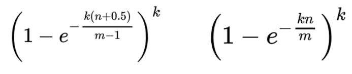

# redis应用

# Redis是AP的还是CP的

Redis是一个支持多种数据结构的内存数据库，它可以根据配置和使用方式在AP和CP之间做出选择。具体来说，Redis可以在不同的场景下提供不同的一致性级别：

1\. 在默认情况下，Redis追求最高的性能和可用性，更倾向于AP模型（即可用性优先）。它使用主从复制和哨兵机制来实现高可用性，但在出现网络分区或节点故障时，可能会导致数据的不一致性。

2\. 但是，Redis也提供了一些支持一致性的特性，例如Redis Cluster和Redis Sentinel。通过使用这些特性，Redis可以在需要更高一致性的场景下选择CP模型（即一致性优先）。在Redis Cluster中，数据被分片存储在不同的节点上，并使用Gossip协议来保持数据的一致性。Redis Sentinel则提供了监控和自动故障转移的功能，以保证高可用性和数据的一致性。

因此，根据具体的配置和使用方式，Redis可以在AP和CP之间进行选择。

# Redis事务

### Redis事务是什么

可以一次执行多个命令，本质上是一组命令的集合。一个事务种的所有命令都会序列化，按顺序地串行化执行而不被其他命令插入。

### 为什么要用redis事务

可以把命令写入队列中，一次性，有序的，排他的执行一系列命令。

### Redis事务控制命令

| 命令    | 功能             |
| ------- | ---------------- |
| multi   | 开始组队         |
| exec    | 执行队列中的命令 |
| discard | 取消组队         |
| watch   | 监视key          |
| unwatch | 取消监视         |

### Redis事务的三个特性

- 单独的隔离操作 
    - 事务中的所有命令都会序列化、按顺序地执行。事务在执行的过程中，不会被其他客户端发送来的命令请求所打断。
- 没有隔离级别的概念 
    - 队列中的命令没有提交之前都不会实际被执行，因为事务提交前任何指令都不会被实际执行
- 不保证原子性 
    - 事务中如果有一条命令执行失败，其后的命令仍然会被执行，没有回滚

ex:

```java
@Test
public void performTransaction() {
    redisTemplate.setEnableTransactionSupport(true);

    Object execute = redisTemplate.execute(new SessionCallback<Object>() {
        @Override
        public Object execute(RedisOperations operations) throws DataAccessException {
            //可以开启锁
            operations.watch("key1");
            operations.multi(); // 开启事务
            try {
                Thread.sleep(10000);
            } catch (InterruptedException e) {
                throw new RuntimeException(e);
            }
            try {
                // 在事务中执行多个命令
                operations.opsForValue().set("key1", "value111");
                operations.opsForValue().set("key2", "value222");
                operations.exec(); // 提交事务
            } catch (Exception e) {
                e.printStackTrace();
                operations.discard(); // 取消事务，释放锁
            }
            return "xxx";
        }
    });

    System.out.println("execute = " + execute);
}
```

# Redis集群方案

**什么是集群**

Redis 集群实现了对Redis的水平扩容，即启动N个redis节点，将整个数据库分布存储在这N个节点中，每个节点存储总数据的1/N。

Redis 集群通过分区（partition）来提供一定程度的可用性（availability ）：即使集群中有一部分节点失效或者无法进行通讯，集群也可以继续处理命令请求。

**为什么需求集群**

- 容量不够，redis如何进行扩容？
- 并发写操作， redis如何分摊？
- 另外，主从模式，薪火相传模式，主机宕机，导致ip地址发生变化，应用程序中配置需要修改对应的主机地址、端口等信息。
- 之前通过代理主机来解决，但是redis3.0中提供了解决方案。就是无中心化集群配置。

**集群提供的好处**

-   实现扩容
-   分摊压力
-   无中心配置相对简单

**集群的不足**

-   多键操作是不被支持的 {key}
-   多键的Redis事务是不被支持的。lua脚本不被支持 {key}


## 主从模式

**什么是主从复制**

主机数据更新后根据配置和策略， 自动同步到备机的master/slaver机制，Master以写为主，Slave以读为主

**主从复制的作用**

- 读写分离，性能扩展
- 容灾快速恢复

### 主从复制原理

- Slave启动成功连接到master后会发送一个sync命令
- Master接到命令启动后台的存盘进程，同时收集所有接收到的用于修改数据集命令， 在后台进程执行完毕之后，master将传送整个数据文件到slave,以完成一次完全同步
- 全量复制：而slave服务在接收到数据库文件数据后，将其存盘并加载到内存中。
- 增量复制：Master继续将新的所有收集到的修改命令依次传给slave,完成同步
- 但是只要是重新连接master,一次完全同步（全量复制)将被自动执行


### 主从复制三种模式

一主二仆


- 问题1: 切入点问题,slave1、slave2是从头开始复制还是从切入点开始复制?比如从k4进来，那之前的k1,k2,k3是否也可以复制？[全量复制 第一次]
- 问题2 :从机是否可以写？set可否？  [不可以]
- 问题3:主机shutdown后情况如何？从机是上位还是原地待命？ [从机还是小弟]
- 问题4:主机又回来了后，主机新增记录，从机还能否顺利复制？ [可以]
- 问题5:其中一台从机down后情况如何？依照原有它能跟上大部队吗(还会自动变为从机吗?)？ [15 断了在连一下slaveof ]

薪火相传


```
上一个Slave可以是下一个slave的Master，Slave同样可以接收其他 slaves的连接和同步请求，那么该slave作为了链条中下一个的master, 可以有效减轻master的写压力,去中心化降低风险。用 slaveof  <ip><port>
中途变更转向:会清除之前的数据，重新建立拷贝最新的,风险是一旦某个slave宕机，后面的slave都没法备份,主机挂了，从机还是从机，无法写数据了
```

反客为主


- 当一个master宕机后，后面的slave可以立刻升为master，其后面的slave不用做任何修改。用 slaveof no one  将从机变为主机。

哨兵模式

反客为主的自动版，能够后台监控主机是否故障，如果故障了根据投票数自动将从库转换为主库


## 哨兵模式

反客为主的自动版，能够后台监控主机是否故障，如果故障了根据投票数自动将从库转换为主库


# Redis的持久化

**是什么:**

定期将内存中的数据保存到硬盘上

**为什么要用**

防止服务器宕机，停电，重启导致数据丢失

## 持久化方式

Redis 提供了2个不同形式的持久化方式。


-  RDB（Redis DataBase）定时数据快照 默认方式 
    - RDB持久化是一种周期性将Redis数据集快照保存到磁盘的机制。它会创建一个二进制文件（以`.rdb`为扩展名），其中包含了当前数据库中的所有键值对的快照。RDB持久化有以下特点： 
        - 快速恢复：RDB文件是一个快照，恢复时可以快速加载整个数据集，适合用于备份和灾难恢复。
        - 紧凑的文件格式：RDB文件采用二进制格式，文件相对较小，节省存储空间。
        - 高性能：由于RDB是周期性执行的快照操作，可以提供很好的性能，不会对数据库的读写操作产生额外的负担。
        - 可配置的触发机制：可以通过配置触发RDB持久化的方式，如根据时间间隔、写操作次数或者同时满足两者等。
-  AOF（Append Of File） 指令日志文件 手动开启 
    - AOF持久化通过将Redis的写操作追加到一个日志文件（Append-Only File）中来记录数据库状态的持久化方式。AOF文件以文本方式保存 Redis 数据库的操作命令，它可以通过重新执行这些命令来还原数据集。AOF持久化有以下特点： 
        - 高数据完整性：通过记录每个写操作命令，可以将数据库的状态完全还原。
        - 恢复方式灵活：可以选择完全根据AOF文件来还原数据库状态，也可以选择在启动时将AOF文件的内容重放到内存数据库中。
        - 默认是追加模式：在默认情况下，Redis以追加模式将写操作追加到AOF文件中，即使文件很大，也不会对系统性能产生明显影响。
        - 文件体积相对较大：由于AOF文件保存了系统的写操作历史，相比RDB文件，AOF文件的体积通常要大。
        - 可能会有较高的写入延迟：由于每个写操作都需要追加到AOF文件，如果AOF文件较大，可能会导致写入延迟增加。

### RDB和AOP用哪个?

官方推荐两个都启用。如果对数据不敏感，可以选单独用RDB，不建议单独用 AOF，因为可能会出现Bug。


只做缓存：如果你只希望你的数据在服务器运行的时候存在,你也可以不使用任何持久化方式。同时开启两种持久化方式 在这种情况下,当redis重启的时候会优先载入AOF文件来恢复原始的数据, 因为在通常情况下AOF文件保存的数据集要比RDB文件保存的数据集要完整. 


RDB的数据不实时，同时使用两者时服务器重启也只会找AOF文件，那要不要只使用AOF呢？ 

建议不要，因为RDB更适合用于备份数据库(AOF在不断变化不好备份)， 快速重启，而且不会有AOF可能潜在的bug，留着作为一个万一的手段。 


性能建议

因为RDB文件只用作后备用途，建议只在Slave上持久化RDB文件，而且只要15分钟备份一次就够了，只保留save 900 1这条规则。如果使用AOF，好处是在最恶劣情况下也只会丢失不超过两秒数据，启动脚本较简单只load自己的AOF文件就可以了。代价,一是带来了持续的IO，二是AOF rewrite的最后将rewrite过程中产生的新数据写到新文件造成的阻塞几乎是不可避免的。只要硬盘许可，应该尽量减少AOF rewrite的频率，AOF重写的基础大小默认值64M太小了，可以设到5G以上。默认超过原大小100%大小时重写可以改到适当的数值。 


## RDB持久化（Redis DataBase）

### RDB持久化流程

**执行流程**


    Redis会单独创建（fork）一个子进程来进行持久化，会先将数据写入到 一个临时文件中，待持久化过程都结束了，再用这个临时文件替换上次持久化好的文件。 整个过程中，主进程是不进行任何IO操作的，这就确保了极高的性能 如果需要进行大规模数据的恢复，且对于数据恢复的完整性不是非常敏感，那RDB方式要比AOF方式更加的高效。RDB的缺点是最后一次持久化后的数据可能丢失（服务器宕机，最后一次不会缓存，正常关闭会进行缓存）。

**Fork子进程**


- Fork的作用是复制一个与当前进程一样的进程。新进程的所有数据（变量、环境变量、程序计数器等） 数值都和原进程一致，但是是一个全新的进程，并作为原进程的子进程
- 在Linux程序中，fork()会产生一个和父进程完全相同的子进程，但子进程在此后多会exec系统调用，出于效率考虑，Linux中引入了“写时复制技术”
- 一般情况父进程和子进程会共用同一段物理内存，只有进程空间的各段的内容要发生变化时，才会将父进程的内容复制一份给子进程。

**RDB持计划流程图**


### RDB的优势和劣势

#### 优势

- 适合大规模的数据恢复
- 对数据完整性和一致性要求不高更适合使用
- **节省磁盘空间**
- **恢复速度快**

#### 劣势

- Fork的时候，内存中的数据被克隆了一份，大致2倍的膨胀性需要考虑
- 虽然Redis在fork时使用了**写时拷贝技术**,但是如果数据庞大时还是比较消耗性能。
- 在备份周期在一定间隔时间做一次备份，所以如果Redis意外down掉的话，就会丢失最后一次快照后的所有修改。

### RDB总结


## AOF持久化（ Append Only File）

### AOF持计划流程

（1）客户端的请求写命令会被append追加到AOF缓冲区内；

（2）AOF缓冲区根据AOF持久化策略[always,everysec,no]将操作sync同步到磁盘的AOF文件中；

（3）AOF文件大小超过重写策略或手动重写时，会对AOF文件rewrite重写，压缩AOF文件容量；

（4）Redis服务重启时，会重新load加载AOF文件中的写操作达到数据恢复的目的；


### AOF的优势

- 备份机制更稳健，丢失数据概率更低。
- 可读的日志文本，通过操作AOF稳健，可以处理误操作。

### AOF的劣势

- 比起RDB占用更多的磁盘空间。
- 恢复备份速度要慢。
- 每次读写都同步的话，有一定的性能压力。
- 存在个别Bug，造成无法恢复。

### AOF总结


# Redis的数据分片

Redis的数据分片是一种数据分布在多个节点上的技术，用于实现水平扩展和负载均衡。在Redis中，数据分片是通过哈希槽（Hash Slot）来实现的。

具体而言，数据分片的过程如下：

1\. 哈希槽的定义：Redis将整个数据空间划分为固定数量的哈希槽，通常是16384个。每个哈希槽都有一个唯一的标识符，从0到16383。

2\. 数据的映射：当客户端发送一个命令请求时，Redis Cluster通过对的哈希值进行计算，将键值对映射到一个特定的哈希槽中。这样，每个键值对就被分配到了一个特定的哈希槽中。

3\. 哈希槽的分配：Redis Cluster将所有的哈希槽均匀地分配给各个节点，每个节点负责存储一部分哈希槽对应的数据。这样，数据就被分片存储在了多个节点上。

4\. 数据的查找：当客户端需要访问某个键值对时，它首先计算键的哈希值，然后根据哈希值找到对应的哈希槽。客户端根据哈希槽的信息找到负责该哈希槽的节点，并将请求发送给该节点。

5\. 数据的迁移：当需要添加或删除节点时，Redis Cluster会进行数据的迁移，以保持各个节点负载均衡。数据迁移的过程中，哈希槽会从一个节点移动到另一个节点，保证数据的分片均匀和一致。通过数据分片，Redis可以在多个节点上并行处理请求，提高了系统的吞吐量和容量。

同时，数据分片还实现了负载均衡和故障隔离，当某个节点故障时，其他节点仍然可以继续提供服务。总的来说，Redis的数据分片通过哈希槽的方式，将数据分布在多个节点上，实现了水平扩展、负载均衡和故障隔离。

# Redis 为什么这么快？

Redis 内部做了非常多的性能优化，比较重要的有下面 5 点：

1. Redis 基于内存RAM，内存的访问速度比磁盘快很多, 可以实现很低的延迟和高吞吐量。
2. (最主要)Redis的网络通信采用非阻塞I/O多路复用机制和事件驱动的方式，可以处理大量的并发连接，提高了系统的并发性能。
3. Redis 内置了多种优化过后的数据类型/结构实现，性能非常高。
4. Redis采单线程模型，避免了多线程间的竞争和上下文切换的开销。线程模型简化了并发控制，减少了锁的使用，提高了处理请求的效率。
5. Redis支持异步操作，可以在后台执行一些耗时的操作，如持久化、复制和集群的同步等。这样可以减少客户端的等待时间，提高系统的响应速度。

总的来说，Redis之所以快速，是因为它使用内存存储、采用单线程模型、提供高效的数据结构、支持异步操作、优化网络通信和使用优化的算法和数据结构等。这些特性使得能够在处理大量请求时保持低延迟和高吞吐量。

## 非阻塞I/O多路复用机制是什么

i/o :网络io          多路: 多个客户端连接(socket/channel),指多条tcp连接

复用: 用一个进程来处理多条连接,使用单线程就能同时处理多个客户端的连接

**总得来说 实现了一个进程来处理大量的用户连接**


**底层原理**

I/O多路复用在英文中其实叫 I/O multiplexing  这里面的 multiplexing 指的其实是在单个线程通过记录跟踪每一个Sock(I/O流)的状态来同时管理多个I/O流. 目的是尽量多的提高服务器的吞吐能力。


**多个Socket复用一根网线这个功能是在内核＋驱动层实现的 需要使用 select 、 poll 、 epoll 来配合 ** 


举例: 大家都用过nginx，nginx使用epoll接收请求，ngnix会有很多链接进来， epoll会把他们都监视起来，然后像拨开关一样，谁有数据就拨向谁，然后调用相应的代码处理。redis类似同理

举例:  假设你是一个监考老师，让30个学生解答一道竞赛考题, 你站在讲台上等，谁解答完谁举手。这时C、D举手，表示他们解答问题完毕，你下去依次检查C、D的答案，然后继续回到讲台上等。此时E、A又举手，然后去处理E和A。。。这种就是IO复用模型。Linux下的select、poll和epoll就是干这个的。


## 为什么单线程处理多个并发客户端还那么快?

Redis将网络数据读写、请求协议解析通过多个IO线程的来处理 ，

对于真正的命令执行来说，仍然使用主线程操作，一举两得, 鱼和熊掌兼得


# Redis 的过期策略

Redis是key-value数据库，我们可以设置Redis中缓存的key的过期时间。Redis的过期策略就是指当Redis中缓存的key过期了，Redis如何处理。

**惰性过期**：只有当访问一个key时，才会判断该key是否已过期，过期则清除。该策略可以最大化地节省CPU资源，却对内存非常不友好。极端情况可能出现大量的过期key没有再次被访问，从而不会被清除，占用大量内存。

**定期过期**：每隔一定的时间，会扫描一定数量的数据库的expires字典中一定数量的key，并清除其中已过期的key。该策略是一个折中方案。通过调整定时扫描的时间间隔和每次扫描的限定耗时，可以在不同情况下使得CPU和内存资源达到最优的平衡效果。

(expires字典会保存所有设置了过期时间的key的过期时间数据，其中，key是指向键空间中的某个键的指针，value是该键的毫秒精度的UNIX时间戳表示的过期时间。键空间是指该Redis集群中保存的所有键。)

Redis中同时使用了惰性过期和定期过期两种过期策略。

# 缓存问题

## 缓存穿透问题

是指查询一个**不存在的数据**，由于缓存无法命中，将去查询数据库，但是数据库也无此记录，并且出于容错考虑，我们没有将这次查询的null写入缓存，这将导致这个不存在的数据每次请求都要到存储层去查询，失去了缓存的意义。在流量大时，可能DB就挂掉了，要是有人利用不存在的key频繁攻击我们的应用，这就是漏洞。


* 缓存空对象
    * 优点：实现简单，维护方便
    * 缺点：额外的内存消耗        可能造成短期的不一致
* 布隆过滤
    * 优点：内存占用较少，没有多余key
    * 缺点：实现复杂      存在误判可能

## 缓存雪崩问题

是指在我们设置缓存时采用了相同的过期时间，导致缓存在某一时刻同时失效，请求全部转发到DB，DB瞬时压力过重雪崩。

* 给不同的Key的TTL添加随机值
* 利用Redis集群提高服务的可用性
* 给缓存业务添加降级限流策略
* 给业务添加多级缓存

## 缓存击穿问题

是指对于一些设置了过期时间的key，如果这些key可能会在某些时间点被超高并发地访问，是一种非常“热点”的数据。这个时候，需要考虑一个问题：如果这个key在大量请求同时进来之前正好失效，那么所有对这个key的数据查询都落到db，我们称为缓存击穿。

* 互斥锁
* 逻辑过期

## 缓存一致性问题

**读取数据时**：缓存中的数据可能已经过期或不一致。

**更新数据时**：数据库更新后，缓存中的数据可能没有及时更新或清除。

# 布隆过滤器的解决方案

它实际上是一个很长的二进制向量和**一系列随机映射函数**。布隆过滤器可以用于检索一个元素是否在一个集合中。它的优点是空间效率和查询时间都比一般的算法要好的多，缺点是有一定的误识别率和删除困难。

主要用于判断一个元素是否在一个集合中，0代表不存在某个数据，1代表存在某个数据。

总结： **判断一个元素一定不存在 或者 可能存在！** 存在一定的误判率{通过代码调节}

解决缓存穿透问题

###  原理

**存入过程 ** 

布隆过滤器上面说了，就是一个二进制数据的集合。当一个数据加入这个集合时，经历如下：

通过**K个哈希函数**计算该数据，返回**K个**计算出的**hash值**

这些K个hash值映射到对应的K个二进制的数组下标

将K个下标对应的二进制数据改成1。

查询过程

布隆过滤器主要作用就是查询一个数据，在不在这个二进制的集合中，查询过程如下：

1、通过K个哈希函数计算该数据，对应计算出的K个hash值

2、通过hash值找到对应的二进制的数组下标

3、判断：如果存在一处位置的二进制数据是0，那么该数据不存在。如果都是1，该数据**可能**存在集合中。

### 布隆过滤器的优缺点

优点

1. 由于存储的是二进制数据，所以占用的空间很小
2. 它的插入和查询速度是非常快的，时间复杂度是O（K），空间复杂度：O (M)。
    - K: 是哈希函数的个数
    - M: 是二进制位的个数
3. 保密性很好，因为本身不存储任何原始数据，只有二进制数据

缺点

添加数据是通过计算数据的hash值，那么很有可能存在这种情况：两个不同的数据计算得到相同的hash值。


例如图中的“张三”和“张三丰”，假如最终算出hash值相同，那么他们会将同一个下标的二进制数据改为1。

这个时候，你就不知道下标为1的二进制，到底是代表“张三”还是“张三丰”。

一、存在误判

假如上面的图没有存 "张三"，只存了 "张三丰"，那么用"张三"来查询的时候，会判断"张三"存在集合中。

因为“张三”和“张三丰”的hash值是相同的，通过相同的hash值，找到的二进制数据也是一样的，都是1。

误判率：

​	受三个**因素影响**： **二进制位的个数m**, 哈希**函数**的个数k, **数据规模n** (添加到布隆过滤器中的函数)



已知误判率p, 数据规模n, 求二进制的个数m，哈希函数的个数k {m,k 程序会自动计算 ，你只需要告诉我数据规模，误判率就可以了}


ln: 自然对数是以常数e为[底数](https://baike.baidu.com/item/底数/5416651 "底数")的[对数](https://baike.baidu.com/item/对数/91326 "对数")，记作lnN（N>0）。在物理学，生物学等自然科学中有重要的意义，一般表示方法为lnx。数学中也常见以logx表示自然对数。

二、删除困难

还是用上面的举例，因为“张三”和“张三丰”的hash值相同，对应的数组下标也是一样的。

如果你想去删除“张三”，将下标为1里的二进制数据，由1改成了0。

那么你是不是连“张三丰”都一起删了呀。

### 初始化布隆过滤器

```java
@SpringBootApplication(exclude = DataSourceAutoConfiguration.class)//取消数据源自动配置
@EnableDiscoveryClient
@EnableFeignClients//(basePackages = {"a","b"})  //确保能够扫描到依赖中OpenFeign接口
@EnableAsync
public class RBloomFilterApplication implements CommandLineRunner {

    public static void main(String[] args) {
        SpringApplication.run(RBloomFilterApplication.class, args);
    }

    @Autowired
    private RedissonClient redissonClient;

    /**
     * 当springboot应用启动成功后执行
     *
     * @param args incoming main method arguments
     * @throws Exception
     */
    @Override
    public void run(String... args) throws Exception {
        //初始化布隆过滤器
        RBloomFilter<Long> bloomFilter = redissonClient.getBloomFilter(RedisConstant.ALBUM_BLOOM_FILTER);
        //判断布隆过滤器是否存在
        if (!bloomFilter.isExists()) {
            //通过数据规模+误判率进行初始化布隆过滤器
            bloomFilter.tryInit(100000, 0.03);
        }
    }
}
```


# 分布式锁的解决方案


分布式锁主流的实现方案：

1. 基于数据库实现分布式锁
2. 基于缓存（ Redis等）
3. 基于Zookeeper

每一种分布式锁解决方案都有各自的优缺点：

1. 性能：Redis最高 
2. 可靠性：zookeeper最高


## Redisson 解决分布式锁


1. 多个客户端同时获取锁（setnx）
2. 获取成功，执行业务逻辑：从db获取数据，放入缓存，执行完成释放锁（del）
3. 其他客户端等待重试

分布式锁使用的逻辑如下：

```java
尝试获取锁
    成功：执行业务代码    
        执行业务  
            try{
                获取锁
                业务代码
            } catch(){
            
            }finally{ 
                释放锁
            }
    失败：等待；
```

## AOP与分布式锁整合

```java
/**
 * 自定义缓存注解
 */
@Target({ElementType.METHOD})
@Retention(RetentionPolicy.RUNTIME)
@Inherited
@Documented
public @interface RedisCache {
    /**
     * 缓存业务及分布式锁key的前缀
     * @return
     */
    String prefix() default "data:";
}
```

```java
/**
* 自定义切面类
*/
@Slf4j
@Aspect
@Component
public class RedisCacheAspect {

    @Autowired
    private RedisTemplate redisTemplate;

    @Autowired
    private RedissonClient redissonClient;

    /**
     * 自定义缓存注解的切面逻辑
     *
     * @param pjp        切入点对象
     * @param redisCache 方法使用使用注解对象
     * @return
     * @throws Throwable
     */
    @Around("@annotation(RedisCache)")
    public Object doBasicProfiling(ProceedingJoinPoint pjp, RedisCache redisCache) throws Throwable {
        try {
            // 1.优先从缓存Redis中获取业务数据
            // 获取注解前缀
            String prefix = redisCache.prefix();
            // 获取方法参数如果存在多个参数采用_拼接
            String params = "none";
            Object[] args = pjp.getArgs();
            if (args != null && args.length > 0) {
                List<Object> objects = Arrays.asList(args);
                params = objects.stream()
                        .map(Object::toString)
                        .collect(Collectors.joining("_"));
            }
            String dataKey = prefix + params;
            // 查询Redis获取业务数据
            Object objectResult = redisTemplate.opsForValue().get(dataKey);

            //2.如果命中缓存，直接返回业务数据即可
            if (objectResult != null) {
                return objectResult;
            }

            // 3.如果未命中缓存，先获取分布式锁
            // 构建分布式锁key
            String lockKey = dataKey + RedisConstant.CACHE_LOCK_SUFFIX;
            // 获取锁对象
            RLock lock = redissonClient.getLock(lockKey);
            // 获取分布式锁
            boolean flag = lock.tryLock();

            // 4.获取分布锁锁成功，执行查询数据库（目标方法执行），并设置缓存
            if (flag) {
                try {
                    // 执行目标方法（执行自定义注解修饰方法-查询数据库方法）
                    objectResult = pjp.proceed();
                    // 将查询数据库业务数据放入Redis缓存中
                    int ttl = RandomUtil.randomInt(100, 600);
                    redisTemplate.opsForValue().set(dataKey, objectResult, RedisConstant.ALBUM_TIMEOUT + ttl, TimeUnit.SECONDS);
                    return objectResult;
                } finally {
                    // 5.释放分布式锁
                    lock.unlock();
                }
            } else {
                //6.获取分布式锁失败，进行自旋（自旋可能获取锁成功线程会将业务数据已经放入缓存）
                return this.doBasicProfiling(pjp, redisCache);
            }
        } catch (Throwable e) {
            //7.兜底处理-直接查询数据库
            log.error("[自定义缓存切面]Redis服务不可用，执行兜底方案，查库。异常：{}", e);
            return pjp.proceed();
        }
    }
}
```

# 数据一致性的解决方案

## 延时双删方案

修改数据业务逻辑

1.删除缓存

2.更新数据库

3.睡眠一段时间

4.再次删除缓存


加了个睡眠时间，**主要是为了确保请求 A （读）在睡眠的时候，请求 B （写）能够在这这一段时间完成「从数据库读取数据，再把缺失的缓存写入缓存」的操作**，然后请求 B 睡眠完，再删除缓存。

所以，请求 B 的睡眠时间就需要大于请求A「从数据库读取数据 + 写入缓存」的时间。

但是具体睡眠多久其实是个**玄学**，很难评估出来，所以这个方案也只是尽可能保证一致性而已。


## 分布式读写锁

- 读读允许并发
- 读写不允许并发
- 写读不允许并发
- 写写不允许并发

依赖“锁”的机制，避免出现并发读写。弊端：性能低

## Binlog方案

「**先更新数据库，再删缓存**」的策略的第一步是更新数据库，那么更新数据库成功，就会产生一条变更日志，记录在 binlog 里。

于是我们就可以通过订阅 binlog 日志，拿到具体要操作的数据，然后再执行缓存删除，阿里巴巴开源的 **Canal** 中间件就是基于这个实现的。

Canal 模拟 MySQL 主从复制的交互协议，把自己伪装成一个 MySQL 的从节点，向 MySQL 主节点发送 dump 请求，MySQL 收到请求后，就会开始推送 Binlog 给 Canal，Canal 解析 Binlog 字节流之后，转换为便于读取的结构化数据，供下游程序订阅使用。

下图是 Canal 的工作原理：


# 什么是热Key问题，如何解决热key问题

热Key问题是指在Redis中，某个或某些特定的键被频繁访问，导致对这些键的操作成为系统的性能瓶颈。热Key问题可能会导致Redis负载过高，响应时间延长，甚至造成系统崩溃。

为了解决热Key问题，可以采取以下一些策略：

1.  增加缓存容量：扩大Redis内存容量可以提高缓存命中率，减少对热Key的访问次数，从而缓解热Key问题。可以考虑升级Redis服务器或增加Redis集群节点来增加内存容量。
2.  分片：将热Key均匀地分散到多个Redis实例中，每个实例处理一部分热Key的请求。这样可以降低单个Redis实例的负载压力，提系统整体的吞吐量。
3.  缓存预热：在系统启动或流量低峰期，提前加载热Key的数据到缓存中，使得这些热Key的数据在实际访问时已经存在于缓存中，减少对后端存储的访问。
4.  数据分片：对于热Key所对的数据量较大的情况，可以考虑将数据进行分片存储，将不同片段的数据存放在不同的键上，从而减轻单个键的访问压力。
5.  缓存降级：对于某些热Key，可以考虑将其缓存时间设置较短，或者不缓存，直接访问后端存储。这样可以避免热Key对缓存系统的过度压力，同时确保其他非热Key正常缓存。
6.  使用Redis集群：通过搭建Redis集群，将热Key分散到多个节点上，实现负载均衡和高可用性，提高系统的整体性能和稳定性。

综合考虑具体业务场景和系统需求，可以采取不同的策略或组合使用来解决热Key问题。


# 什么是大Key问题，如何解决？

大Key问题是指在Redis数据库中存储了过大的数据结构，如大型列表、哈希、集合等，导致内存占用过高，影响Redis性能的情况。这可能会导致以下问题：

内存占用过高： 大Key占用了大量的内存空间，导致其他数据无法被缓存，从而影响Redis的性能和响应速度。

数据加载时间延长： 由于大Key的加载和传输需要较长时间，会导致读取和写入操作的延迟。

持久化问题： 在进行数据持久化（如RDB快照、AOF日志）时，大Key会增加持久化的时间和磁盘空间占用。

解决大Key问题的方法包括：

数据分片： 将大数据拆分成多个小数据，分别存储在不同的Key中。例如，将一个大型哈希表分成多个小型哈希表。

使用分布式存储： 将大数据存储在分布式数据库中，如Redis Cluster或其他分布式存储系统。

合理选择数据结构： 根据实际需求，选择合适的数据结构，避免在单个Key中存储过大的数据。

数据压缩： 对于可以压缩的数据，使用Redis提供的数据压缩功能，减小存储占用。

使用大Key分析工具： Redis提供了一些工具可以用于识别和处理大Key问题，例如Redis内存分析工具和命令。

定期清理： 周期性地检查数据库，发现并处理大Key，例如将大Key转移至其他存储系统。

合理设置过期时间： 对于不再需要的数据，设置适当的过期时间，让Redis可以自动淘汰这些数据。

综合使用这些方法可以有效地解决大Key问题，提高Redis的性能和稳定性。


# 除了做缓存，Redis还能用来干什么？

除了做缓存，Redis还可以用来实现以下几个功能：

1.  数据存储：Redis支持多种数据结构，如字符串、哈希、列表、集合、有序集合等。可以将Redis作为主要的数据存储，用于存储和查询数据。例如，可以将用户会话信息、配置信息、计数器等数据存储在Redis中。
2.  消息队列：Redis的发布/订阅功能可以用作简单的消息队列系统。发布者将消息发布到指定的频道，订阅者可以监听频道并接收消息。这种方式可以用于实现异步任务、事件驱动等场景。
3.  分布式锁：利用Redis的原子性操作和过期时间特性，可以实现分布式锁。通过在Redis中存储一个特定键值对作为锁标识可以实现对共享资源的互斥访问，避免并发问题。
4.  计数器：Redis的自增和自减操作可以用于实现计数器功能。可以用于统计网站的访问量、点赞数量、订单数量等场景。
5.  地理位置应用：Redis理位置数据结构（Geo）可以存储和查询地理位置信息，如地理坐标、半径查询等。可以用于实现附近的人、地理位置搜索等功能。
6.  实时排行榜：利用Redis的有序集合数据结构，可以实现实时的排行榜功能。可以根据特定的规则将成员和分数存储在有序集合中，并根据分数进行排名。
7.  分布式缓存：Redis可以作为分布式缓存系统，通过集群和主从复制等机制，提供高可用性和高性能的缓存服务。

总之，Redis不仅仅是一个缓存系统还可以用于实现多种功能和应用场景，包括数据存储、消息队列、分布式锁、计数器、地理位置应用、实时排行榜等。

# Redis如何实现延迟消息？

Redis本身并不提供延迟消息的特性，但可以通过一些技术手段实现延迟消息的功能。以下是一种基于Redis的延迟消息实现方法：

1.  使用有序集合（Sorted Set）：将延迟消息的到期时间作为有序集合的分数(score)，消息内容作为有序集合的成员(member)。
2.  将延迟消息添加到有序集合中：将延迟消息按照到期时间添加到有序集合中。
3.  定时检查有序集合：通过定时任务或者后台线程，定期检查有序集合中的消息，找到到期的消息。
4.  处理到期的消息：当有序集合中的消息到期时，将其从有序集合中移除，并进行相应的处理，可以将消息发送到消息队列或者进行其他业务操作。

通过以上方法，可以实现延迟消息的功能。需要注意的是，在实现过程中需要考虑以下几点：

-   需要保证定时检查的频率，以确保消息能够及时被处理。
-   可以使用多个有序集合来支持不同延迟时间的消息，将消息按照不同的延迟时间分组存储。
-   可以使用Redis的发布/订阅功能将到期的消息发送到其他服务进行处理。
-   需要考虑消息的可靠性，如处理失败时的重试机制等。

需要根据具体的业务需求和系统架构选择合适的延迟消息方案，以上方法只是其中一种常见的实现方式之一。

