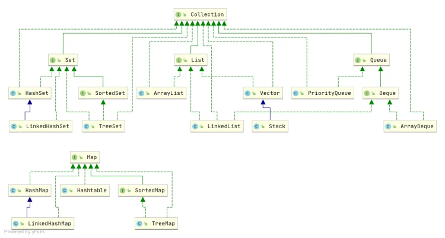

# Collection
java集合的架构。主体内容包括Collection集合和Map类；Collection集合又可以划分为List(队列)和Set(集合)。
而 Map 存储着键值对（两个对象）的映射表。



**说说 List, Set, Queue, Map 四者的区别？**

`List`(对付顺序的好帮手): 存储的元素是有序的、可重复的。

`Set`(注重独一无二的性质): 存储的元素不可重复的。

`Queue`(实现排队功能的叫号机): 按特定的排队规则来确定先后顺序，存储的元素是有序的、可重复的。

`Map`(用 key 来搜索的专家): 使用键值对（key-value）存储，类似于数学上的函数 y=f(x)，"x" 代表 key，"y" 代表 value，key 是无序的、不可重复的，value 是无序的、可重复的，每个键最多映射到一个值。
## List

List的实现类主要有: LinkedList, ArrayList, Vector, Stack。

- LinkedList :是双向链表实现的双端队列；它不是线程安全的，只适用于单线程。   **双向链表(JDK1.6 之前为循环链表，JDK1.7 取消了循环)**
- ArrayList：是**Object[] 数组**实现的队列，它是一个动态数组；它也不是线程安全的，只适用于单线程。 
- Vector：是 **Object[]数组**实现的矢量队列，它也一个动态数组；不过和ArrayList不同的是，Vector是线程安全的，它支持并发。
- Stack： 是**Vector实现**的栈；和Vector一样，它也是线程安全的。


### ArrayLIst
ArrayList提供了三个构造函数：

-  ArrayList()：默认构造函数，提供**初始容量为10**的空列表。 
-  ArrayList(int initialCapacity)：构造一个具有指定初始容量的空列表。 
-  ArrayList(Collection<’?’ extends E> c)：构造一个包含指定 collection 的元素的列表，这些元素是按照该 collection 的迭代器返回它们的顺序排列的。 


### ArrayList 和 Array的区别?

`ArrayList` 内部基于动态数组实现，比 `Array`（静态数组） 使用起来更加灵活：

- `ArrayList`会根据实际存储的元素动态地扩容或缩容，而 `Array` 被创建之后就不能改变它的长度了。
- `ArrayList` 允许你使用泛型来确保类型安全，`Array` 则不可以。
- `ArrayList` 中只能存储对象。对于基本类型数据，需要使用其对应的包装类（如 Integer、Double 等）。`Array` 可以直接存储基本类型数据，也可以存储对象。
- `ArrayList` 支持插入、删除、遍历等常见操作，并且提供了丰富的 API 操作方法，比如 `add()`、`remove()`等。`Array` 只是一个固定长度的数组，只能按照下标访问其中的元素，不具备动态添加、删除元素的能力。
- `ArrayList`创建时不需要指定大小，而`Array`创建时必须指定大小。

```java
add(E e);      //将指定的元素添加到此列表的尾部
remove(int index);
remove(Object o);
removeRange(int fromIndex, int toIndex);
removeAll();
get(int index);
ensureCapacity(); //扩容1.5 >>1
```

### LinkedList

在LinkedList中提供了两个基本属性size、header

LinkedList提高了两个构造方法：LinkedLis()和LinkedList(Collection


```java
在addAll()方法中，涉及到了两个方法，一个是entry(int index)，该方法为LinkedList的私有方法，主要是用来查找index位置的节点元素。
```
### ArrayList 与 LinkedList 区别?

- **是否保证线程安全：**ArrayList 和 LinkedList 都是不同步的，也就是不保证线程安全；
- **底层数据结构：**ArrayList 底层使用的是 **Object 数组**；LinkedList 底层使用的是 **双向链表** 数据结构（JDK1.6 之前为循环链表，JDK1.7 取消了循环。注意双向链表和双向循环链表的区别，下面有介绍到！）
- **插入和删除是否受元素位置的影响：**
   - **ArrayList 采用数组存储，**所以插入和删除元素的时间复杂度受元素位置的影响。 比如：执行add(E e)方法的时候， ArrayList 会默认在将指定的元素追加到此列表的末尾，这种情况时间复杂度就是 O(1)。但是如果要在指定位置 i 插入和删除元素的话（add(int index, E element)），时间复杂度就为 O(n)。因为在进行上述操作的时候集合中第 i 和第 i 个元素之后的(n-i)个元素都要执行向后位/向前移一位的操作。
   - **LinkedList 采用链表存储，**所以在头尾插入或者删除元素不受元素位置的影响（add(E e)、addFirst(E e)、addLast(E e)、removeFirst()、 removeLast()），时间复杂度为 O(1)，如果是要在指定位置 i 插入和删除元素的话（add(int index, E element)，remove(Object o),remove(int index)）， 时间复杂度为 O(n) ，因为需要先移动到指定位置再插入和删除。
- **是否支持快速随机访问：**LinkedList 不支持高效的随机元素访问，而 ArrayList（实现了 RandomAccess 接口） 支持。快速随机访问就是通过元素的序号快速获取元素对象(对应于get(int index)方法)。
- **内存空间占用：**ArrayList 的空间浪费主要体现在在 list 列表的结尾会预留一定的容量空间，而 LinkedList 的空间花费则体现在它的每一个元素都需要消耗比 ArrayList 更多的空间（因为要存放直接后继和直接前驱以及数据）


## Set

Set的实现类主要有: HastSet和TreeSet。

- HashSet：是一个没有重复元素的集合，基于HashMap实现；HashSet不是线程安全的，只适用于单线程。
- TreeSet：也是一个没有重复元素的集合，不过和HashSet不同的是，TreeSet中的元素是有序的；它是通过TreeMap实现的；TreeSet也不是线程安全的，只适用于单线程。


### Comparable 和 Comparator 的区别

`Comparable` 接口和 `Comparator` 接口都是 Java 中用于排序的接口，它们在实现类对象之间比较大小、排序等方面发挥了重要作用：

- `Comparable` 接口实际上是出自`java.lang`包 它有一个 `compareTo(Object obj)`方法用来排序
- `Comparator`接口实际上是出自 `java.util` 包它有一个`compare(Object obj1, Object obj2)`方法用来排序
#### Comparator 定制排序
```java
ArrayList<Integer> arrayList = new ArrayList<Integer>();
arrayList.add(-1);arrayList.add(3);arrayList.add(3);arrayList.add(-5);arrayList.add(7);
arrayList.add(4);arrayList.add(-9);arrayList.add(-7);
System.out.println("原始数组:");
System.out.println(arrayList);

// void sort(List list),按自然排序的升序排序
System.out.println("Collections.sort(arrayList):");
System.out.println(arrayList);
// 定制排序的用法
Collections.sort(arrayList, new Comparator<Integer>() {
    @Override
    public int compare(Integer o1, Integer o2) {
        return o2.compareTo(o1);
    }
});
System.out.println("定制排序后：");
System.out.println(arrayList);

```
#### compareTo 实现排序
```java
// person对象没有实现Comparable接口，所以必须实现，这样才不会出错，才可以使treemap中的数据按顺序排列
// 前面一个例子的String类已经默认实现了Comparable接口，详细可以查看String类的API文档，另外其他
// 像Integer类等都已经实现了Comparable接口，所以不需要另外实现了
@Data
public  class Person implements Comparable<Person> {
    private String name;
    private int age;

    /**
     * T重写compareTo方法实现按年龄来排序
     */
    @Override
    public int compareTo(Person o) {
        if (this.age > o.getAge()) {
            return 1;
        }
        if (this.age < o.getAge()) {
            return -1;
        }
        return 0;
    }
}
```

### 无序性和不可重复性的含义是什么

- 无序性不等于随机性 ，无序性是指存储的数据在底层数组中并非按照数组索引的顺序添加 ，而是根据数据的哈希值决定的。
- 不可重复性是指添加的元素按照 `equals()` 判断时 ，返回 false，需要同时重写 `equals()` 方法和 `hashCode()` 方法。
### 合适重写equals和hashcode

当你需要自定义一个类的对象如何进行比较或者在集合中查找时，通常需要重写`hashCode`和`equals`方法。以下是一些情况，你可能需要重写这些方法：

1. **自定义对象的比较**：当你创建了一个自定义类，并且希望使用自定义的标准来比较两个对象是否相等时，你应该重写`equals`方法。例如，你可能希望比较两个对象的特定属性，而不是它们的内存地址。
2. **使用集合类**：当你的类的实例将要作为元素存储在集合（如`HashSet`，`HashMap`等）中时，你需要重写`hashCode`和`equals`方法。这是因为集合类（特别是`HashSet`和`HashMap`）使用散列码（`hashCode`）来快速查找和存储元素，以及使用`equals`方法来确定两个元素是否相等。
3. 

### 比较 HashSet、LinkedHashSet 和 TreeSet 三者的异同

- `HashSet`、`LinkedHashSet` 和 `TreeSet` 都是 `Set` 接口的实现类，都能保证元素唯一，并且都不是线程安全的。
- `HashSet`、`LinkedHashSet` 和 `TreeSet` 的主要区别在于底层数据结构不同。`HashSet` 的底层数据结构是哈希表（基于 `HashMap` 实现）。`LinkedHashSet` 的底层数据结构是链表和哈希表，元素的插入和取出顺序满足 FIFO。`TreeSet` 底层数据结构是红黑树，元素是有序的，排序的方式有自然排序和定制排序。
- 底层数据结构不同又导致这三者的应用场景不同。`HashSet` 用于不需要保证元素插入和取出顺序的场景，`LinkedHashSet` 用于保证元素的插入和取出顺序满足 FIFO 的场景，`TreeSet` 用于支持对元素自定义排序规则的场景。

## Queue

### Queue 与 Deque 的区别

`Queue` 是单端队列，只能从一端插入元素，另一端删除元素，实现上一般遵循 **先进先出（FIFO）** 规则。

`Queue` 扩展了 `Collection` 的接口，根据 **因为容量问题而导致操作失败后处理方式的不同** 可以分为两类方法: 一种在操作失败后会抛出异常，另一种则会返回特殊值。

| `Queue`
 接口 | 抛出异常 | 返回特殊值 |
| --- | --- | --- |
| 插入队尾 | add(E e) | offer(E e) |
| 删除队首 | remove() | poll() |
| 查询队首元素 | element() | peek() |


`Deque` 是双端队列，在队列的两端均可以插入或删除元素。

`Deque` 扩展了 `Queue` 的接口, 增加了在队首和队尾进行插入和删除的方法，同样根据失败后处理方式的不同分为两类：

| `Deque`
 接口 | 抛出异常 | 返回特殊值 |
| --- | --- | --- |
| 插入队首 | addFirst(E e) | offerFirst(E e) |
| 插入队尾 | addLast(E e) | offerLast(E e) |
| 删除队首 | removeFirst() | pollFirst() |
| 删除队尾 | removeLast() | pollLast() |
| 查询队首元素 | getFirst() | peekFirst() |
| 查询队尾元素 | getLast() | peekLast() |


事实上，`Deque` 还提供有 `push()` 和 `pop()` 等其他方法，可用于模拟栈。

### ArrayDeque 与 LinkedList 的区别

`ArrayDeque` 和 `LinkedList` 都实现了 `Deque` 接口，两者都具有队列的功能，但两者有什么区别呢？

- `ArrayDeque` 是基于可变长的数组和双指针来实现，而 `LinkedList` 则通过链表来实现。
- `ArrayDeque` 不支持存储 `NULL` 数据，但 `LinkedList` 支持。
- `ArrayDeque` 是在 JDK1.6 才被引入的，而`LinkedList` 早在 JDK1.2 时就已经存在。
- `ArrayDeque` 插入时可能存在扩容过程, 不过均摊后的插入操作依然为 O(1)。虽然 `LinkedList` 不需要扩容，但是每次插入数据时均需要申请新的堆空间，均摊性能相比更慢。

从性能的角度上，选用 `ArrayDeque` 来实现队列要比 `LinkedList` 更好。此外，`ArrayDeque` 也可以用于实现栈。

### PriorityQueue

`PriorityQueue` 是在 JDK1.5 中被引入的, 其与 `Queue` 的区别在于元素出队顺序是与优先级相关的，即总是优先级最高的元素先出队。

这里列举其相关的一些要点：

- `PriorityQueue` 利用了二叉堆的数据结构来实现的，底层使用可变长的数组来存储数据
- `PriorityQueue` 通过堆元素的上浮和下沉，实现了在 O(logn) 的时间复杂度内插入元素和删除堆顶元素。
- `PriorityQueue` 是非线程安全的，且不支持存储 `NULL` 和 `non-comparable` 的对象。
- `PriorityQueue` 默认是小顶堆，但可以接收一个 `Comparator` 作为构造参数，从而来自定义元素优先级的先后。

`PriorityQueue` 在面试中可能更多的会出现在手撕算法的时候，典型例题包括堆排序、求第 K 大的数、带权图的遍历等，所以需要会熟练使用才行。

### BlockingQueue

`BlockingQueue` （阻塞队列）是一个接口，继承自 `Queue`。`BlockingQueue`阻塞的原因是其支持当队列没有元素时一直阻塞，直到有元素；还支持如果队列已满，一直等到队列可以放入新元素时再放入。

```java
public interface BlockingQueue<E> extends Queue<E> {
  // ...
}
```

`BlockingQueue` 常用于生产者-消费者模型中，生产者线程会向队列中添加数据，而消费者线程会从队列中取出数据进行处理。

### ArrayBlockingQueue 和 LinkedBlockingQueue 有什么区别

`ArrayBlockingQueue` 和 `LinkedBlockingQueue` 是 Java 并发包中常用的两种阻塞队列实现，它们都是线程安全的。不过，不过它们之间也存在下面这些区别：

- 底层实现：`ArrayBlockingQueue` 基于数组实现，而 `LinkedBlockingQueue` 基于链表实现。
- 是否有界：`ArrayBlockingQueue` 是有界队列，必须在创建时指定容量大小。`LinkedBlockingQueue` 创建时可以不指定容量大小，默认是`Integer.MAX_VALUE`，也就是无界的。但也可以指定队列大小，从而成为有界的。
- 锁是否分离： `ArrayBlockingQueue`中的锁是没有分离的，即生产和消费用的是同一个锁；`LinkedBlockingQueue`中的锁是分离的，即生产用的是`putLock`，消费是`takeLock`，这样可以防止生产者和消费者线程之间的锁争夺。
- 内存占用：`ArrayBlockingQueue` 需要提前分配数组内存，而 `LinkedBlockingQueue` 则是动态分配链表节点内存。这意味着，`ArrayBlockingQueue` 在创建时就会占用一定的内存空间，且往往申请的内存比实际所用的内存更大，而`LinkedBlockingQueue` 则是根据元素的增加而逐渐占用内存空间。