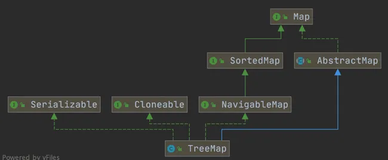

# Map
## 分类
Map的实现类主要有: HashMap，WeakHashMap, Hashtable和TreeMap。

- `LinkedHashMap`：`LinkedHashMap` 继承自 `HashMap`，它的底层增加了一条双向链表，
- WeakHashMap：和HashMap不同的是，HashMap的“键”是强引用类型，而WeakHashMap的“键”是弱引用类型，也就是说当WeakHashMap
中的某个键不再正常使用时，会被从WeakHashMap中被自动移除。WeakHashMap也不是线程安全的，只适用于单线程。
- Hashtable：**数组+链表组成 ** 和HashMap不同的是，Hashtable是线程安全的，支持并发。
- TreeMap   ** R-BTree(红黑树)实现** TreeMap中的“键-值对”是有序的, TreeMap不是线程安全的，只适用于单线程。
## HashMap 
HashMap 主要用来存放键值对，基于哈希表的 Map 接口实现，是常用的 Java 集合之一，是非线程安全的。
HashMap 可以存储 null 的 key 和 value，但 null 作为键只能有一个，null 作为值可以有多个
JDK1.8 之前 HashMap 由 数组+链表 组成的，数组是 HashMap 的主体，链表则是主要为了解决哈希冲突而存在的（“拉链法”解决冲突）。 JDK1.8 以后的 HashMap 在解决哈希冲突时有了较大的变化，当链表长度大于等于阈值（默认为 8）（将链表转换成红黑树前会判断，如果当前数组的长度小于 64，那么会选择先进行数组扩容，而不是转换为红黑树）时，将链表转化为红黑树，以减少搜索时间。
HashMap 默认的初始化大小为 16。之后每次扩充，容量变为原来的 2 倍。并且， HashMap 总是使用 2 的幂作为哈希表的大小。

## map的6种常见遍历方式

1. 使用 Java 8 Stream API

性能最高的
Java 8 引入了流（Stream）API，它提供了一种新的遍历和处理集合数据的方式。

```java
map.entrySet().stream()
.forEach(entry -> System.out.println("Key: " + entry.getKey() + ", Value: " + entry.getValue()));
```
**使用java8 lamda表达式，对Map对象进行遍历，性能最高**

2. 使用 `entrySet()` 方法

最常用的
`entrySet()` 方法返回了 `HashMap` 中所有键值对的集合视图。你可以遍历这个集合来访问每个键值对。

```java
import java.util.HashMap;
import java.util.Map;

public class Main {
    public static void main(String[] args) {
        HashMap<String, String> map = new HashMap<>();
        map.put("key1", "value1");
        map.put("key2", "value2");
        map.put("key3", "value3");

        for (Map.Entry<String, String> entry : map.entrySet()) {
            String key = entry.getKey();
            String value = entry.getValue();
            System.out.println("Key: " + key + ", Value: " + value);
        }
    }
}
```

3. 使用 `keySet()` 方法

`keySet()` 方法返回了 `HashMap` 中所有键的集合视图。如果你只需要访问键，可以使用这个方法。

```java
for (String key : map.keySet()) {
    String value = map.get(key);
    System.out.println("Key: " + key + ", Value: " + value);
}
```

4. 使用 `values()` 方法

如果你只需要访问值，可以使用 `values()` 方法，它返回了 `HashMap` 中所有值的集合视图。

```java
for (String value : map.values()) {
    System.out.println("Value: " + value);
}
```

5. 使用 `forEach()` 方法 (Java 8+)

数据量小时 性能最佳
从Java 8开始，你可以使用 `forEach()` 方法和Lambda表达式来遍历 `HashMap`。

```java
map.forEach((key, value) -> {
    System.out.println("Key: " + key + ", Value: " + value);
});
```

6. 使用迭代器 (Iterator)

你还可以使用迭代器来遍历 `HashMap`。首先，通过 `entrySet()` 获取集合的迭代器，然后使用 `hasNext()` 和 `next()` 方法来遍历。

```java
import java.util.Iterator;
import java.util.Map;

Iterator<Map.Entry<String, String>> iterator = map.entrySet().iterator();
while (iterator.hasNext()) {
    Map.Entry<String, String> entry = iterator.next();
    String key = entry.getKey();
    String value = entry.getValue();
    System.out.println("Key: " + key + ", Value: " + value);
}
```

## HashMap 和 Hashtable 的区别

**线程是否安全：** `HashMap` 是非线程安全的，`Hashtable` 是线程安全的,因为 `Hashtable` 内部的方法基本都经过`synchronized` 修饰；

**效率：** 因为线程安全的问题，`HashMap` 要比 `Hashtable` 效率高一点。另外，`Hashtable` 基本被淘汰，不要在代码中使用它；

**对 Null key 和 Null value 的支持：**`HashMap` 可以存储 null 的 key 和 value，但 null 作为键只能有一个，null 作为值可以有多个；Hashtable 不允许有 null 键和 null 值，否则会抛出 `NullPointerException`。

**初始容量大小和每次扩充容量大小的不同：** ① 创建时如果不指定容量初始值，`Hashtable` 默认的初始大小为 11，之后每次扩充，容量变为原来的 2n+1。`HashMap` 默认的初始化大小为 16。之后每次扩充，容量变为原来的 2 倍。② 创建时如果给定了容量初始值，那么 `Hashtable` 会直接使用你给定的大小，而 `HashMap` 会将其扩充为 2 的幂次方大小（`HashMap` 中的`tableSizeFor()`方法保证，下面给出了源代码）。也就是说 `HashMap` 总是使用 2 的幂作为哈希表的大小,后面会介绍到为什么是 2 的幂次方。

**底层数据结构：** JDK1.8 以后的 `HashMap` 在解决哈希冲突时有了较大的变化，当链表长度大于阈值（默认为 8）时，将链表转化为红黑树（将链表转换成红黑树前会判断，如果当前数组的长度小于 64，那么会选择先进行数组扩容，而不是转换为红黑树），以减少搜索时间（后文中我会结合源码对这一过程进行分析）。`Hashtable` 没有这样的机制。

## HashMap 和 HashSet 区别

如果你看过 `HashSet` 源码的话就应该知道：`HashSet` 底层就是基于 `HashMap` 实现的。（`HashSet` 的源码非常非常少，因为除了 `clone()`、`writeObject()`、`readObject()`是 `HashSet` 自己不得不实现之外，其他方法都是直接调用 `HashMap` 中的方法。

| `HashMap` | `HashSet` |
| --- | --- |
| 实现了 `Map`
 接口 | 实现 `Set`
 接口 |
| 存储键值对 | 仅存储对象 |
| 调用 `put()`
向 map 中添加元素 | 调用 `add()`
方法向 `Set`
 中添加元素 |
| `HashMap`
 使用键（Key）计算 `hashcode` | `HashSet`
 使用成员对象来计算 `hashcode`
 值，对于两个对象来说 `hashcode`
 可能相同，所以`equals()`
方法用来判断对象的相等性 |


## HashMap 和 TreeMap 区别

`TreeMap` 和`HashMap` 都继承自`AbstractMap` ，但是需要注意的是`TreeMap`它还实现了`NavigableMap`接口和`SortedMap` 接口。实现 `NavigableMap` 接口让 `TreeMap` 有了对集合内元素的搜索的能力。

`NavigableMap` 接口提供了丰富的方法来探索和操作键值对:

1. **定向搜索**: `ceilingEntry()`, `floorEntry()`, `higherEntry()`和 `lowerEntry()` 等方法可以用于定位大于、小于、大于等于、小于等于给定键的最接近的键值对。
2. **子集操作**: `subMap()`, `headMap()`和 `tailMap()` 方法可以高效地创建原集合的子集视图，而无需复制整个集合。
3. **逆序视图**:`descendingMap()` 方法返回一个逆序的 `NavigableMap` 视图，使得可以反向迭代整个 `TreeMap`。
4. **边界操作**: `firstEntry()`, `lastEntry()`, `pollFirstEntry()`和 `pollLastEntry()` 等方法可以方便地访问和移除元素。

这些方法都是基于红黑树数据结构的属性实现的，红黑树保持平衡状态，从而保证了搜索操作的时间复杂度为 O(log n)，这让 `TreeMap` 成为了处理有序集合搜索问题的强大工具。

## HashMap的底层实现
JDK1.8 之前 `HashMap` 由数组+链表组成的，数组是 `HashMap` 的主体，链表则是主要为了解决哈希冲突而存在的（“拉链法”解决冲突）。JDK1.8 以后在解决哈希冲突时有了较大的变化，当链表长度大于阈值（默认为 8）（将链表转换成红黑树前会判断，如果当前数组的长度小于 64，那么会选择先进行数组扩容，而不是转换为红黑树）时，将链表转化为红黑树.

### **JDK 1.8 HashMap 的 hash 方法**


HashMap 通过 key 的 hashcode 经过扰动函数处理过后得到 hash 值，然后通过 (n - 1) & hash 判断当前元素存放的位置（这里的 n 指的是数组的长度），如果当前位置存在元素的话，就判断该元素与要存入的元素的 hash 值以及 key 是否相同，如果相同的话，直接覆盖，不相同就通过拉链法解决冲突。
所谓扰动函数指的就是 HashMap 的 hash 方法。使用 hash 方法也就是扰动函数是为了防止一些实现比较差的 hashCode() 方法 换句话说使用扰动函数之后可以减少碰撞。

```java
// 1.8
static final int hash(Object key) {
      int h;
      // key.hashCode()：返回散列值也就是hashcode
      // ^：按位异或
      // >>>:无符号右移，忽略符号位，空位都以0补齐
      return (key == null) ? 0 : (h = key.hashCode()) ^ (h >>> 16);
}
// 1.7
static int hash(int h) {
    // This function ensures that hashCodes that differ only by
    // constant multiples at each bit position have a bounded
    // number of collisions (approximately 8 at default load factor).

    h ^= (h >>> 20) ^ (h >>> 12);
    return h ^ (h >>> 7) ^ (h >>> 4);
}
// 相比于 JDK1.8 的 hash 方法 ，JDK 1.7 的 hash 方法的性能会稍差一点点，因为毕竟扰动了 4 次。
```
### **JDK 1.8 HashMap 的转红黑树的逻辑**
**putVal 方法中执行链表转红黑树的判断逻辑**
链表的长度大于 8 的时候，就执行 treeifyBin （转换红黑树）的逻辑。
```java
// 遍历链表
for (int binCount = 0; ; ++binCount) {
    // 遍历到链表最后一个节点
    if ((e = p.next) == null) {
        p.next = newNode(hash, key, value, null);
        // 如果链表元素个数大于TREEIFY_THRESHOLD（8）
        if (binCount >= TREEIFY_THRESHOLD - 1) // -1 for 1st
            // 红黑树转换（并不会直接转换成红黑树）
            treeifyBin(tab, hash);
        break;
    }
    if (e.hash == hash &&
        ((k = e.key) == key || (key != null && key.equals(k))))
        break;
    p = e;
}
```
**treeifyBin 方法中判断是否真的转换为红黑树。**
```java
final void treeifyBin(Node<K,V>[] tab, int hash) {
    int n, index; Node<K,V> e;
    // 判断当前数组的长度是否小于 64
    if (tab == null || (n = tab.length) < MIN_TREEIFY_CAPACITY)
        // 如果当前数组的长度小于 64，那么会选择先进行数组扩容
        resize();
    else if ((e = tab[index = (n - 1) & hash]) != null) {
        // 否则才将列表转换为红黑树

        TreeNode<K,V> hd = null, tl = null;
        do {
            TreeNode<K,V> p = replacementTreeNode(e, null);
            if (tl == null)
                hd = p;
            else {
                p.prev = tl;
                tl.next = p;
            }
            tl = p;
        } while ((e = e.next) != null);
        if ((tab[index] = hd) != null)
            hd.treeify(tab);
    }
}
```
将链表转换成红黑树前会判断，如果当前数组的长度小于 64，那么会选择先进行数组扩容，而不是转换为红黑树。
### HashMap 的长度为什么是 2 的幂次方

为了能让 HashMap 存取高效，尽量较少碰撞，也就是要尽量把数据分配均匀。我们上面也讲到了过了，Hash 值的范围值-2147483648 到 2147483647，前后加起来大概 40 亿的映射空间，只要哈希函数映射得比较均匀松散，一般应用是很难出现碰撞的。但问题是一个 40 亿长度的数组，内存是放不下的。所以这个散列值是不能直接拿来用的。用之前还要先做对数组的长度取模运算，得到的余数才能用来要存放的位置也就是对应的数组下标。这个数组下标的计算方法是“ `(n - 1) & hash`”。（n 代表数组长度）。这也就解释了 HashMap 的长度为什么是 2 的幂次方。

**这个算法应该如何设计呢？**

**“取余(%)操作中如果除数是 2 的幂次则等价于与其除数减一的与(&)操作（也就是说 hash%length==hash&(length-1)的前提是 length 是 2 的 n 次方；）。”** 并且 **采用二进制位操作 &，相对于%能够提高运算效率，这就解释了 HashMap 的长度为什么是 2 的幂次方。
### HashMap 为什么线程不安全？
jdk1.7 的hashMap在多线程操作环境下 **扩容**，多个线程同时对链表进行操作，头插法可能会导致链表中的节点指向错误的位置，从而形成一个环形链表，进而使得查询元素的操作陷入死循环无法结束。

 JDK 1.8 后，在 HashMap 中，多个键值对可能会被分配到同一个桶（bucket），并以链表或红黑树的形式存储。多个线程对 HashMap 的 put 操作会导致线程不安全，具体来说会有数据覆盖的风险。

多线程的情况下推荐使用concurrentHashMap

## concurrentHashMap?
# 集合方法注意事项
《阿里巴巴 Java 开发手册》的描述如下：
**判断所有集合内部的元素是否为空，使用 isEmpty() 方法，而不是 size()==0 的方式。**
这是因为 isEmpty() 方法的可读性更好，并且时间复杂度为 O(1)。
绝大部分我们使用的集合的 size() 方法的时间复杂度也是 O(1)，不过，也有很多复杂度不是 O(1) 的，
```java
public int size() {
    long n = sumCount();
    return ((n < 0L) ? 0 :
            (n > (long)Integer.MAX_VALUE) ? Integer.MAX_VALUE :
            (int)n);
}
final long sumCount() {
    CounterCell[] as = counterCells; CounterCell a;
    long sum = baseCount;
    if (as != null) {
        for (int i = 0; i < as.length; ++i) {
            if ((a = as[i]) != null)
                sum += a.value;
        }
    }
    return sum;
}
public boolean isEmpty() {
    return sumCount() <= 0L; // ignore transient negative values
}

```
