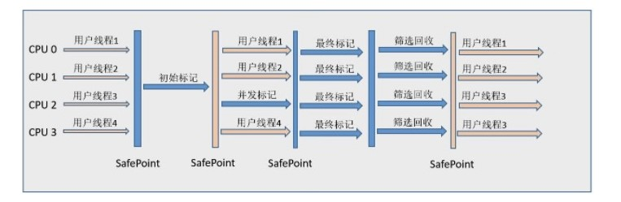

# JVM概述

## JVM简介

Java虚拟机（Java Virtual Machine，简称JVM）是Java平台的核心组成部分，它是一个抽象的计算机，用于执行编

译后的Java字节码（.class文件），而不需要依赖于底层操作系统的具体实现。JVM提供了一套标准的指令集，使

得Java程序可以在任何安装了JVM的平台上运行，这正是Java“一次编写，到处运行”（Write Once, Run 

Anywhere，WORA）理念的基础。

如下图所示：


### JVM规范和JVM

**Java虚拟机规范**（Java Virtual Machine Specification）是一份由Sun Microsystems（现在是Oracle Corporation）制定的文档，它定义了Java虚

拟机的**结构、指令集、类文件格式、类加载器、字节码执行引擎**等方面的内容。Java虚拟机规范是Java平台的核心标准之一，它确保了Java程序

在不同的硬件和操作系统上都能够正确地运行。


Java虚拟机（Java Virtual Machine）是实现Java虚拟机规范的软件，它是Java程序运行的基础。Java虚拟机负责将Java程序转换成机器码执行，并

提供了一系列的功能和特性，例如内存管理、线程管理、异常处理等。Java虚拟机可以在不同的硬件和操作系统上运行，从而实现Java程序的跨平台

性。


它们的关系如下所示：

 

1、Oracle HotSpot JVM：Oracle HotSpot是目前最常用的Java虚拟机，也是官方提供的JVM实现。它具有成熟的垃圾回收器和即时编译器，广泛

应用于生产环境。

2、OpenJDK JVM：OpenJDK是一个开源的Java开发工具包，其中包含了Java语言的参考实现。OpenJDK中也包含了HotSpot JVM，因此它可以

作为一种常见的Java虚拟机使用。

3、IBM J9 JVM：IBM J9是IBM公司开发的Java虚拟机，具有高度优化的垃圾回收器和即时编译器。它在性能和资源利用方面有一定的优势，并且

支持多种操作系统和硬件平台。

除了以上列举的常见Java虚拟机外，还有一些其他的实现，如BEA JRockit、Excelsior JET等。不同的Java虚拟机在性能、垃圾回收、即时编译等方

面可能有所差异，开发者可以根据具体需求选择适合的Java虚拟机。


可以通过如下的命令查看当前所使用的jvm：

```shell
java -version
```


### JVM架构

JVM的整体架构如下所示：


详细架构：


**在JVM中包含三部分，分别是：**

**功能区：类加载子系统、垃圾回收器、字节码执行引擎**

**线程私有区：栈(线程)、本地方法栈、程序计数器**

**线程共享区：方法区、堆、直接内存**


## 类加载器子系统


### **类的加载过程**

**加载阶段：**通过一个类的全限定名获取这个类所对应的二进制字节流，然后通过该二进制字节流将其加载到JVM中，并且为之创建一个Class对象

**连接阶段：**

​	**验证：**为了确保Class文件字节流中包含的信息符合当前虚拟机的要求，并且不会危害虚拟机自身安全

​	**准备：** 为类变量分配内存并设置初始值，使用方法区的内存

​	**解析**： 将常量池的符号引用替换为直接引用的过程

**初始化阶段：** 初始化阶段才真正开始执行类中定义的 Java 程序代码。

JVM为了一个类的 <clinit>() 方法在多线程环境下能够被正常加载会对该类加锁和同步，如果多个线程同时初始化一个类，只会有一个线程执行这个类的 <clinit>() 方法，其它线程都会阻塞等待，直到活动线程执行 <clinit>() 方法完毕。如果在一个类的 <clinit>() 方法中有耗时的操作，就可能造成多个线程阻塞，在实际过程中此种阻塞很隐蔽。

### **类的生命周期**

类的加载过程+使用阶段+卸载阶段

### **初始化开始的时机**

**主动引用：**

- 在遇到 new、putstatic、getstatic、invokestatic 字节码指令时，如果类尚未初始化，则需要先触发其初始化。
- 对类进行反射调用时，如果类还没有初始化，则需要先触发其初始化。
- 初始化一个类时，如果其父类还没有初始化，则需要先初始化父类。
- 虚拟机启动时，用于需要指定一个包含 `main()` 方法的主类，虚拟机会先初始化这个主类。
- 当使用 JDK 1.7 的动态语言支持时，如果一个 java.lang.invoke.MethodHandle 实例最后的解析结果为 REF_getStatic、REF_putStatic、REF_invokeStatic 的方法句柄，并且这个方法句柄所对应的类还没初始化，则需要先触发其初始化。

**被动引用：** 

以上 5 种场景中的行为称为对一个类进行主动引用。除此之外，所有引用类的方式都不会触发初始化，称为被动引用。被动引用的常见例子包括：

- 通过子类引用父类的静态字段，不会导致子类初始化。

```java
System.out.println(SubClass.value);  // value 字段在 SuperClass 中定义
```

- 通过数组定义来引用类，不会触发此类的初始化。该过程会对数组类进行初始化，数组类是一个由虚拟机自动生成的、直接继承自 Object 的子类，其中包含了数组的属性和方法。

```java
SuperClass[] sca = new SuperClass[10];
```

- 常量在编译阶段会存入调用类的常量池中，本质上并没有直接引用到定义常量的类，因此不会触发定义常量的类的初始化。

```java
System.out.println(ConstClass.HELLOWORLD);
```


### **类加载器分类**

1、启动类加载器（Bootstrap class loader）

它是虚拟机的内置类加载器，通过表示为null。负责加载Java核心类库，如rt.jar中的类、只加载包名为java、javax、sun等开头的类。启动类加载器是由C++实现的，不是一个Java类。


2、扩展类加载器（Extension|Platform Class Loader）(平台类加载器)

扩展类加载器负责加载Java的扩展类库，**位于JRE的lib/ext目录下的jar包。**在 Java 9 之后，由于模块化的引入，这个类加载器已经被废弃。平台类加载器负责加载 JDK 自带的模块。**这些模块通常位于 JDK 安装目录下的 jmods 文件夹中。**


3、应用程序类加载器（Application Class Loader）

也称为**系统类加载器**，它负责加载应用程序的类，即开发者自己编写的类。


4、自定义类加载器

以下代码中的 FileSystemClassLoader 是自定义类加载器，继承自 java.lang.ClassLoader，用于加载文件系统上的类。它首先根据类的全名在文件系统上查找类的字节代码文件（.class 文件），然后读取该文件内容，最后通过 defineClass() 方法来把这些字节代码转换成 java.lang.Class 类的实例。

java.lang.ClassLoader 的 loadClass() **实现了双亲委派模型的逻辑**，自定义类加载器一般不去重写它，但是需要重写 findClass() 方法。


上述箭头是指类加载器之间的上下级关系，而不是继承关系，它们的继承体系如下所示：


### 双亲委托(派)机制


#### **什么是双亲委托机制**

双亲委派模型是描述类加载器之间的层次关系。它要求除了顶层的启动类加载器外，其余的类加载器都应当有自己的父类加载器。（父子关系一般不会以继承的关系实现，而是以组合关系来复用父加载器的代码）


#### **双亲委派模型的工作过程**

如果一个类加载器收到了类加载的请求，它首先不会自己尝试加载,而是返回给上级, 每一个层次的类加载器都是如此，因此所有的加载请求最终都应该传送到顶层的启动类加载器中，只有当父加载器反馈自己无法完成这个加载请求（找不到所需的类）时，子加载器才会尝试自己去加载。

在 java.lang.ClassLoader 中的 `loadClass` 方法中实现该过程。


#### 为什么使用双亲委派模型

1、**避免重复加载**：当一个类需要被加载时，首先会委派给父类加载器进行加载。如果父类加载器能够找到并加载该类，就不会再由子类加载器重复加载，避免了重复加载同一个类的问题。
2、**确保类的唯一性**：通过双亲委派机制，类加载器在加载类时会按照一定的顺序进行查找和加载。这样可以确保同一个类在不同的类加载器中只会被加载一次，保证了类的唯一性。
3、**提高安全性**：双亲委派机制可以防止恶意代码通过自定义类加载器来替换核心类库中的类。因为在加载核心类库时，会优先委派给启动类加载器进行加载，而启动类加载器是由JVM提供的，具有较高的安全性，这种机制防止某些核心类库被恶意篡改等。

#### 自定义类加载器打破双亲委派模型

```java
public class FileSystemClassLoader extends ClassLoader {

    private String rootDir;

    public FileSystemClassLoader(String rootDir) {
        this.rootDir = rootDir;
    }

    protected Class<?> findClass(String name) throws ClassNotFoundException {
        byte[] classData = getClassData(name);
        if (classData == null) {
            throw new ClassNotFoundException();
        } else {
            return defineClass(name, classData, 0, classData.length);
        }
    }

    private byte[] getClassData(String className) {
        String path = classNameToPath(className);
        try {
            InputStream ins = new FileInputStream(path);
            ByteArrayOutputStream baos = new ByteArrayOutputStream();
            int bufferSize = 4096;
            byte[] buffer = new byte[bufferSize];
            int bytesNumRead;
            while ((bytesNumRead = ins.read(buffer)) != -1) {
                baos.write(buffer, 0, bytesNumRead);
            }
            return baos.toByteArray();
        } catch (IOException e) {
            e.printStackTrace();
        }
        return null;
    }

    private String classNameToPath(String className) {
        return rootDir + File.separatorChar
                + className.replace('.', File.separatorChar) + ".class";
    }
}
```


## 运行时数据区（内存管理）


线程私有区： 

- 程序计数器
- 虚拟机栈
- 本地方法栈

线程共享区：

- 堆
- 方法区
- 直接内存

### 程序计数器

**属于线程私有区**
**作用：**是一块较小的内存空间，存储的是当前线程所执行的**行号**
特点：线程私有空间 ，唯一一个不会出现内存溢出的内存空间

### 本地方法接口/本地库

**属于线程私有区**

**作用：** 与虚拟机栈作用相似。但它不是为Java方法服务的，而是本地方法，本地方法的实现一般都是通过c语言。由于规范对这块没有强制要求，不同虚拟机实现方法不同。

**特点：** **只处理被native所修饰的方法**

```java
public class Object {
    
    public final native Class<?> getClass();		// 获取字节码文件对象的本地方法
    public native int hashCode();					// 获取对象hashCode值的本地方法
    ...
        
}
```
在Java虚拟机（JVM）中，本地方法接口（Native Method Interface，JNI）和本地库（Native Library）是用于与

底层系统交互的机制。

本地库是一个包含本地方法实现的动态链接库（DLL）或共享对象文件（SO）。它是使用其他编程语言编写的，

通常是为了与底层操作系统或硬件进行交互。本地库可以通过JNI加载到JVM中，并提供给Java代码调用。

使用本地方法接口和本地库，Java程序可以利用底层系统的功能和性能优势，例如访问硬件设备、调用操作系统特

定的API、执行高性能计算等。同时，本地方法也可以用于与现有的C/C++代码进行集成，以便重用现有的代码库。


### 虚拟机栈  


**属于线程私有区**

**概述：**    以栈帧（Stack Frame)为单位进行管理每个栈帧对应一个方法的执行。当一个方法被调用时，JVM会为该方法创建一个新的栈帧，并将其推入当前线程的JVM栈顶。当方法执行完毕或者遇到异常时，栈帧会被弹出，恢复到上一个栈帧的状态

**作用：** 实现java的方法调用

**特点：** 

* 运行速度特别快，仅仅次于 PC 寄存器。

* 它的生命周期和线程相同，随着线程的创建而创建，随着线程的死亡而死亡。


#### 栈帧详解

每个栈帧由五部分组成：

* 局部变量表（Local Variable Table）
* 操作数栈（Operand Stack）
* 动态链接（Dynamic Linking）
* 方法出口
* 附加信息


#### 局部变量表（Local Variable Table）

局部变量表容量大小是在编译期确定下来的。最基本的存储单元是 slot，32 位占用一个 slot，64 位类型（long 和 double）占用两个 slot。

**作用：** 存储方法参数和方法体内的局部变量：8种基本类型变量、对象引用（reference) 以及 return address 类型。


#### 操作数栈（Operand Stack）

主要作为方法调用的中转站使用，用于存放方法执行过程中产生的中间计算结果。另外，计算过程中产生的临时变量也会放在操作数栈中

**作用：**用于存储方法执行过程中的**操作数**。


#### 动态链接（Dynamic Linking）
动态链接是指在方法调用过程中，将**符号引用（Symbolic Reference）解析为实际的方法或字段**。

符号引用是一种用于表示方法或字段的符号名称，它与具体的内存地址没有直接关联。

**作用：**就是将符号引用转换为实际的内存地址，以便正确地执行方法调用。当一个方法要调用其他方法，需要将常量池中指向方法的符号引用转化为其在内存地址中的直接引用。


#### 方法返回地址
方法返回地址存储的是调用该方法的**程序计数器的值**。

**作用：**可以知道调用完当前方法后，上一层方法接着做什么。


### 虚拟机堆

Java虚拟机堆是Java内存区域中一块用来存放**对象**实例、数组、stringtable的区域，新创建的对象，数组都使用堆

内存；【从Java7开始，常量池也会使用堆内存】

堆内存还可以继续进行细分，如下所示：


在默认情况下，Java虚拟机堆内存的初始大小为物理内存的1/64，并且最大可达物理内存的1/4。

新生代占整个堆内存的1/3、老年代占整个堆内存的2/3  1：2

新生代又可以细分为：伊甸园(Eden)、幸存区(from、to)，它们之间的比例默认情况下是8：1：1

**特点**：

* 被**线程共享**，因此需要考虑线程安全问题
* 会产生内存溢出问题
* 在虚拟机启动时创建
* 是垃圾回收的主要场所
* Java 虚拟机规范规定，堆可以处于物理上不连续的内存空间中，但在逻辑上它应该被视为连续的。
* 关于 Survivor s0，s1 区： 复制之后有交换，谁空谁是 to

**新生代与老年代**

- 老年代比新生代生命周期长。
- 在默认情况下，Java虚拟机堆内存的初始大小为物理内存的1/64，并且最大可达物理内存的1/4。
- 几乎所有的 Java 对象都是在 Eden 区被 new 出来的，Eden 放不了的大对象，就直接进入老年代了。


#### 堆内存大小设定

-XX：NewRatio

设置老年代和新生代的初始比例。例如，-XX：NewRatio=2表示新生代占堆内存的1/3，老年代占堆内存的2/3。

-XX：SurvivorRatio

设置Eden区和Survivor区的初始比例。例如，-XX：SurvivorRatio=8表示Eden区占新生代的8/10，每个Survivor区占新生代的1/10。

-Xms

设置堆的初始大小。例如，-Xms512m表示将堆的初始大小设置为512MB。

-Xmx

设置堆的最大大小。例如，-Xmx1024m表示将堆的最大大小设置为1GB。

-Xmn

设置新生代的大小。例如，-Xmn256m表示将新生代的大小设置为256MB。

- 


### 方法区(元空间)
方法区是被所有**线程共享**。

方法区主要包含以下几个重要的组成部分：

**1、类信息：**方法区存储了加载的类的结构信息，包括类的名称、父类、接口、字段、方法等。这些信息在类加载

过程中被加载到方法区，并且在运行时被使用。

**2、运行时常量池：**每个类都有一个运行时常量池，它是方法区的一部分。运行时常量池用于存储编译期生成的各

种字面量和符号引用。例如，字符串常量、类和方法的符号引用等都存储在运行时常量池中。

**3、即时编译器编译后的代码：**当JVM将某段热点代码（HotSpot）识别出来后，会将其编译为机器码以提高执行

效率。这些编译后的代码被存储在方法区中。


变化的原因：


1、提高内存的回收效率(方法区内存的回收效率远远低于堆内存，因为方法去中存储的都是类信息、运行时常量池

这些信息不能被轻易回收)

2、字符串常量池在方法区，那么很容易产生内存溢出(因为方法区的垃圾回收效率比较低)

#### 运行时常量池

运行时常量池是方法区的一部分。

Class 文件中的常量池（编译器生成的字面量和符号引用）会在类加载后被放入这个区域。

除了在编译期生成的常量，还允许动态生成，例如 String 类的 intern()。

#### 字符串常量池

**字符串常量池** 是 JVM 为了提升性能和减少内存消耗针对字符串（String 类）专门开辟的一块区域，主要目的是为了避免字符串的重复创建。

**JDK 1.7 为什么要将字符串常量池移动到堆中？**

主要是因为永久代（方法区实现）的 GC 回收效率太低，只有在整堆收集 (Full GC)的时候才会被执行 GC。Java 程序中通常会有大量的被创建的字符串等待回收，将字符串常量池放到堆中，能够更高效及时地回收字符串内存。

### 直接内存

在 JDK 1.4 中新引入了 NIO 类，它可以使用 Native 函数库直接分配堆外内存，然后通过 Java 堆里的 DirectByteBuffer 对象作为这块内存的引用进行操作。这样能在一些场景中显著提高性能，因为避免了在堆内存和堆外内存来回拷贝数据。

### StackOverflowError

当JVM无法为新的方法调用分配更多的栈帧时，就会抛出这个错误。

JVM栈的大小是固定的【通常为1MB】，可以通过命令行参数【**-Xss**】进行调整。每个线程都有自己独立的JVM栈，用于支持线程的并发执行。

**出现原因：**

* 栈太小或者方法调用过深，
* 递归层数太深，
* 大量循环及死循环                   

出现 StackOverFlowError 时，内存空间可能还有很多


### OutOfMemoryError

如果栈的内存大小可以动态扩展， 如果虚拟机在动态扩展栈时无法申请到足够的内存空间，则抛出OutOfMemoryError异常。

**出现原因：**

- 堆溢出
- gc开销超限制
- 无法新建本地线程
- 永生代空间不足 1.7
- 元数据区空间不足 1.8
- 直接内存溢出


## 执行引擎

执行引擎主要包含以下几个重要的组成部分：

1、**解释器（Interpreter）**：解释器逐条解释字节码指令，并将其转换为对应的机器码进行执行。解释器的优点

是实现简单、快速启动和适应性强，但由于每次执行都需要解释字节码，因此执行效率相对较低。

2、**即时编译器（Just-In-Time Compiler，JIT）**：即时编译器将热点代码（HotSpot）从字节码直接编译成机器

码，以提高执行效率。热点代码通常是经过多次执行的代码块，即被频繁调用的方法或循环等。即时编译器可以根

据运行时的情况进行优化，例如内联展开、方法内联、去除无用代码等。JVM中常用的即时编译器有C1（Client 

Compiler）和C2（Server Compiler）。

3、**垃圾回收器（Garbage Collector）：**垃圾回收器负责自动回收不再使用的对象，并释放其占用的内存空间。执

行引擎与垃圾回收器紧密合作，当执行引擎发现某个对象不再被引用时，会通知垃圾回收器进行回收。垃圾回收器

的工作涉及到堆内存的分配和释放，以及对象的标记、清除等操作。


## 垃圾回收

### GC的作用区域


### **★如何判断对象是否死亡**

要进行垃圾回收，那么首先需要找出垃圾，如果判断一个对象是否为垃圾呢? 

两种算法：

1、引用计数法

2、可达性分析算法

#### 引用计数法(Reference-Counting)
引用计数算法是通过判断对象的**引用数量**来决定对象是否可以被回收。

给对象中添加一个引用计数器，每当有一个地方引用它时，计数器值就加1；当引用失效时，计数器值就减1；任

何时刻计数器为0的对象就是不可能再被使用的。

优点：

- 简单，高效，现在的objective-c、python等用的就是这种算法。

缺点：

- 引用和去引用伴随着加减算法，影响性能
- 很难处理循环引用，相互引用的两个对象则无法释放。
  因此，目前主流的Java虚拟机都摒弃掉了这种算法

#### 可达性分析算法(JVM中默认使用)
这个算法的基本思想，就是通过一系列的称为 **“GC Roots”** 的对象作为起点，从这些节点开始向下搜索，节点所走

过的路径称为**引用链**，当一个对象到 GC Roots 没有任何引用链相连的话，则证明，此对象是不可用的。(类似于

葡萄串)；

在Java语言中，可以作为GC Roots的对象包括下面几种：

1、虚拟机栈（栈帧中的本地变量表）中的引用对象 ==> 正在运行的方法中的参数、局部变量等

2、方法区中的常量引用的对象 ==> 运行时常量池中的对象，例如程序中需要使用的类的类类型对象

3、本地方法栈中JNI（Native方法）的引用对象 ==> 正在运行的本地方法

4、Java虚拟机的内部引用 ==> 基本数据类型对应的Class对象，常驻异常对象（空指针、OOM等)，系统类加载器

5、被同步锁synchronize持有的对象。


### 如何判断一个常量是废弃常量?

假如在字符串常量池中存在字符串 "abc"，如果当前没有任何 String 对象引用该字符串常量的话，就说明常量 "abc" 就是废弃常量，如果这时发生内存回收的话而且有必要的话，"abc" 就会被系统清理出常量池了。

### 如何判断一个类是无用的类?

判定一个常量是否是“废弃常量”比较简单，而要判定一个类是否是“无用的类”的条件则相对苛刻许多。类需要同时满足下面 3 个条件才能算是 **“无用的类”**：

- 该类所有的实例都已经被回收，也就是 Java 堆中不存在该类的任何实例。
- 加载该类的 `ClassLoader` 已经被回收。
- 该类对应的 `java.lang.Class` 对象没有在任何地方被引用，无法在任何地方通过反射访问该类的方法。

虚拟机可以对满足上述 3 个条件的无用类进行回收，这里说的仅仅是“可以”，而并不是和对象一样不使用了就会必然被回收

### 对象分配过程

- new 的对象先放在 Eden 区，大小有限制
- 如果创建新对象时，Eden 空间填满了，就会触发 Minor GC，将 Eden 不再被其他对象引用的对象进行销毁，再加载新的对象放到 Eden 区，特别注意的是 Survivor 区满了是不会触发 Minor GC 的，而是 Eden 空间填满了，Minor GC 才顺便清理 Survivor 区
- 将 Eden 中剩余的对象移到 Survivor0 区
- 再次触发垃圾回收，此时上次 Survivor 下来的，放在 Survivor0 区的，如果没有回收，就会放到 Survivor1 区
- 再次经历垃圾回收，又会将幸存者重新放回 Survivor0 区，依次类推
- 默认是 15 次的循环，超过 15 次，则会将幸存者区幸存下来的转去老年区 JVM 参数设置次数 ： -XX：MaxTenuringThreshold=N 进行设置
- 频繁在新生区收集，很少在养老区收集，几乎不在永久区/元空间搜集

**为什么是15岁?**

因为记录年龄的区域在对象头中，这个区域的大小通常是 4 位。这 4 位可以表示的最大二进制数字是 1111，即十

进制的 15。因此，对象的年龄被限制为 0 到 15

#### 对象分配策略

1. **对象优先在 Eden 分配**

大多数情况下，对象在新生代 Eden 上分配，当 Eden 空间不够时，发起 Minor GC。

2. **大对象直接进入老年代**

大对象是指需要连续内存空间的对象，最典型的大对象是那种很长的字符串以及数组。

经常出现大对象会提前触发垃圾收集以获取足够的连续空间分配给大对象。

-XX：PretenureSizeThreshold，大于此值的对象直接在老年代分配，避免在 Eden 和 Survivor 之间的大量内存复制。

3. **长期存活的对象进入老年代**

为对象定义年龄计数器，对象在 Eden 出生并经过 Minor GC 依然存活，将移动到 Survivor 中，年龄就增加 1 

岁，增加到一定年龄则移动到老年代中。

-XX：MaxTenuringThreshold 用来定义年龄的阈值。

4. **动态对象年龄判定**

虚拟机并不是永远要求对象的年龄必须达到 MaxTenuringThreshold 才能晋升老年代，如果在 Survivor 中相同年

龄所有对象大小的总和大于 Survivor 空间的一半，则年龄大于或等于该年龄的对象可以直接进入老年代，无需等

到 MaxTenuringThreshold 中要求的年龄。

5. **空间分配担保**

在发生 Minor GC 之前，虚拟机先检查老年代最大可用的连续空间是否大于新生代所有对象总空间，如果条件成立

的话，那么 Minor GC 可以确认是安全的。

如果不成立的话虚拟机会查看 HandlePromotionFailure 的值是否允许担保失败，如果允许那么就会继续检查老年

代最大可用的连续空间是否大于历次晋升到老年代对象的平均大小，如果大于，将尝试着进行一次 Minor GC；如

果小于，或者 HandlePromotionFailure 的值不允许冒险，那么就要进行一次 Full GC。

### Minor GC 和 Full GC

- Minor GC：回收新生代，因为新生代对象存活时间很短，因此 Minor GC 会频繁执行，执行的速度一般也会比较快。
- Full GC：回收老年代和新生代，老年代对象其存活时间长，因此 Full GC 很少执行，执行速度会比 Minor GC 慢很多。

#### Full GC 的触发条件

1. **调用 System.gc()**

只是建议虚拟机执行 Full GC，但是虚拟机不一定真正去执行。不建议使用这种方式，而是让虚拟机管理内存。

2. **老年代空间不足**

老年代空间不足的常见场景为前文所讲的大对象直接进入老年代、长期存活的对象进入老年代等。

为了避免以上原因引起的 Full GC，应当尽量不要创建过大的对象以及数组。除此之外，可以通过 -Xmn 虚拟机参

数调大新生代的大小，让对象尽量在新生代被回收掉，不进入老年代。还可以通过 -XX：MaxTenuringThreshold 

调大对象进入老年代的年龄，让对象在新生代多存活一段时间。

3. **空间分配担保失败**

使用复制算法的 Minor GC 需要老年代的内存空间作担保，如果担保失败会执行一次 Full GC。

4. **JDK 1.7 及以前的永久代空间不足**

在 JDK 1.7 及以前，HotSpot 虚拟机中的方法区是用永久代实现的，永久代中存放的为一些 Class 的信息、常量、

静态变量等数据。

当系统中要加载的类、反射的类和调用的方法较多时，永久代可能会被占满，在未配置为采用 CMS GC 的情况下

也会执行 Full GC。如果经过 Full GC 仍然回收不了，那么虚拟机会抛出 java.lang.OutOfMemoryError。

为避免以上原因引起的 Full GC，可采用的方法为增大永久代空间或转为使用 CMS GC。

5. **Concurrent Mode Failure**

执行 CMS GC 的过程中同时有对象要放入老年代，而此时老年代空间不足（可能是 GC 过程中浮动垃圾过多导致

暂时性的空间不足），便会报 Concurrent Mode Failure 错误，并触发 Full GC。

#### Minor GC的书法条件

Eden空间不足时触发


### 垃圾回收算法
#### 标记清除(Mark-Sweep)
执行过程：首先标记出所有需要回收的对象，在标记完成后统一回收所有被标记的对象。

优点：速度比较快
缺点：会产生内存碎片，碎片过多，仍会使得连续空间少

#### 标记整理(Mark-Compact)
执行过程：首先标记出所有需要回收的对象，在标记完成后统一进行整理，整理是指存活对象向一端移动来减少内存碎片，相对效率较低

优点：无内存碎片
缺点：效率较低

#### 复制算法(Copying)
执行过程：开辟两份大小相等空间，一份空间始终空着，垃圾回收时，将存活对象拷贝进入空闲空间；

优点：无内存碎片
缺点：占用空间多
注意：如果有很多对象的存活率较高，这时我们采用复制算法，那么效率就比较低；

#### 分代回收(Generational-Collection)
概述：根据对象存活周期的不同，将对象划分为几块，比如Java的堆内存，分为新生代和老年代，然后根据各个年

代的特点采用最合适的算法；

新生代对象的存活的时间都比较短，因此使用的是【复制算法】；

而老年代对象存活的时间比较长那么采用的就是【标记清除】或者【标记整理】；


### 四种引用类型
#### 强引用
Java中默认声明的就是强引用
**只要强引用存在，垃圾回收器将永远不会回收被引用的对象，哪怕内存不足时，JVM也会直接抛出OutOfMemoryError，不会去回收。**

#### 软引用
**在内存足够的时候，软引用对象不会被回收，只有在内存不足时，系统则会回收软引用对象**
在 JDK1.2 之后，用java.lang.ref.**SoftReference**类来表示软引用。

#### 弱引用
**无论内存是否足够，只要 JVM 开始进行垃圾回收，那些被弱引用关联的对象都会被回收**。
在 JDK1.2之后,用java.lang.ref.**WeakReference**来表示弱引用。

#### 虚引用
虚引用是最弱的一种引用关系，如果一个对象仅持有虚引用，那么它就和没有任何引用一样，它随时可能会被回收，在 JDK1.2 之后，用 PhantomReference 类来表示，
### 垃圾收集器


JDK 默认垃圾收集器（使用 `java -XX：+PrintCommandLineFlags -version` 命令查看）：

- JDK 8：Parallel Scavenge（新生代）+ Parallel Old（老年代）
- JDK 9 ~ JDK20： G1

#### CMS 收集器

CMS（Concurrent Mark Sweep），Mark Sweep 指的是标记 - 清除算法。


分为以下四个流程：

- 初始标记：仅仅只是标记一下 GC Roots 能直接关联到的对象，速度很快，需要停顿。
- 并发标记：进行 GC Roots Tracing 的过程，它在整个回收过程中耗时最长，不需要停顿。
- 重新标记：为了修正并发标记期间因用户程序继续运作而导致标记产生变动的那一部分对象的标记记录，需要停顿。
- 并发清除：不需要停顿。

在整个过程中耗时最长的并发标记和并发清除过程中，收集器线程都可以与用户线程一起工作，不需要进行停顿。

具有以下缺点：

- 吞吐量低：低停顿时间是以牺牲吞吐量为代价的，导致 CPU 利用率不够高。
- 无法处理浮动垃圾，可能出现 Concurrent Mode Failure。浮动垃圾是指并发清除阶段由于用户线程继续运行而产生的垃圾，这部分垃圾只能到下一次 GC 时才能进行回收。由于浮动垃圾的存在，因此需要预留出一部分内存，意味着 CMS 收集不能像其它收集器那样等待老年代快满的时候再回收。如果预留的内存不够存放浮动垃圾，就会出现 Concurrent Mode Failure，这时虚拟机将临时启用 Serial Old 来替代 CMS。
- 标记 - 清除算法导致的空间碎片，往往出现老年代空间剩余，但无法找到足够大连续空间来分配当前对象，不得不提前触发一次 Full GC。

#### G1 收集器

G1（Garbage-First），它是一款面向服务端应用的垃圾收集器，在多 CPU 和大内存的场景下有很好的性能。HotSpot 开发团队赋予它的使命是未来可以替换掉 CMS 收集器。

堆被分为新生代和老年代，其它收集器进行收集的范围都是整个新生代或者老年代，而 G1 可以直接对新生代和老年代一起回收。


G1 把堆划分成多个大小相等的独立区域（Region），新生代和老年代不再物理隔离。


通过引入 Region 的概念，从而将原来的一整块内存空间划分成多个的小空间，使得每个小空间可以单独进行垃圾回收。这种划分方法带来了很大的灵活性，使得可预测的停顿时间模型成为可能。通过记录每个 Region 垃圾回收时间以及回收所获得的空间（这两个值是通过过去回收的经验获得），并维护一个优先列表，每次根据允许的收集时间，优先回收价值最大的 Region。

每个 Region 都有一个 Remembered Set，用来记录该 Region 对象的引用对象所在的 Region。通过使用 Remembered Set，在做可达性分析的时候就可以避免全堆扫描。




如果不计算维护 Remembered Set 的操作，G1 收集器的运作大致可划分为以下几个步骤：

- 初始标记
- 并发标记
- 最终标记：为了修正在并发标记期间因用户程序继续运作而导致标记产生变动的那一部分标记记录，虚拟机将这段时间对象变化记录在线程的 Remembered Set Logs 里面，最终标记阶段需要把 Remembered Set Logs 的数据合并到 Remembered Set 中。这阶段需要停顿线程，但是可并行执行。
- 筛选回收：首先对各个 Region 中的回收价值和成本进行排序，根据用户所期望的 GC 停顿时间来制定回收计划。此阶段其实也可以做到与用户程序一起并发执行，但是因为只回收一部分 Region，时间是用户可控制的，而且停顿用户线程将大幅度提高收集效率。

具备如下特点：

- 空间整合：整体来看是基于“标记 - 整理”算法实现的收集器，从局部（两个 Region 之间）上来看是基于“复制”算法实现的，这意味着运行期间不会产生内存空间碎片。
- 可预测的停顿：能让使用者明确指定在一个长度为 M 毫秒的时间片段内，消耗在 GC 上的时间不得超过 N 毫秒。

## JVM调优

调优的最终**目的都是为了令应用程序使用最小的硬件消耗来承载更大的吞吐。JVM调优主要是针对垃圾收集器的收集性能优化**


### 何时进行JVM调优

- **Heap内存（老年代）持续上涨达到设置的最大内存值；**
- **Full GC 次数频繁；**
- **GC 停顿时间过长（超过1秒）；**
- **应用出现OutOfMemory等内存异常；**
- **应用中有使用本地缓存且占用大量内存空间；**
- **系统吞吐量与响应性能不高或不降。**


### JVM调优的基本原则

 JVM调优是一个手段，但并不一定所有问题都可以通过JVM进行调优解决；因此，在进行JVM调优时，我们**要遵循一些原则**：

- 大多数的Java应用不需要进行JVM优化；
- 大多数导致GC问题的原因是代码层面的问题导致的（代码层面）；
- 上线之前，应先考虑将机器的JVM参数设置到最优；
- 减少创建对象的数量（代码层面）；
- 减少使用全局变量和大对象（代码层面）；
- 优先架构调优和代码调优，JVM优化是不得已的手段（代码、架构层面）；
- 分析GC情况优化代码比优化JVM参数更好（代码层面）。

**JVM优化则是最后不得已的手段**


### JVM调优的步骤

一般情况下，JVM调优可通过以下步骤进行：

- 分析GC日志及dump文件，判断是否需要优化，确定瓶颈问题点；
- 确定JVM调优量化目标；
- 确定JVM调优参数（根据历史JVM参数来调整）；
- 依次调优内存、延迟、吞吐量等指标；
- 对比观察调优前后的差异；
- 不断的分析和调整，直到找到合适的JVM参数配置；
- 找到最合适的参数，将这些参数应用到所有服务器，并进行后续跟踪。

 以上操作步骤中，某些步骤是需要**多次不断迭代完成**的。一般是从**满足程序的内存使用需求开始的，之后是时间延迟的要求，最后才是吞吐量的要求，要基于这个步骤来不断优化**，每一个步骤都是进行下一步的基础，不可逆行之。

### JVM参数

```bash
java -X # 查看java-x开头的参数

-XX:-DisableExplicitGC 禁止调用System.gc()；但jvm的gc仍然有效
-XX:+MaxFDLimit 最大化文件描述符的数量限制
-XX:+ScavengeBeforeFullGC  新生代GC优先于Full GC执行
-XX:+UseGCOverheadLimit 在抛出OOM之前限制jvm耗费在GC上的时间比例
-XX:-UseConcMarkSweepGC 对老年代采用并发标记交换算法进行GC
-XX:-UseParallelGC 启用并行GC
-XX:-UseParallelOldGC  对Full GC启用并行，当-XX:-UseParallelGC启用时该项自动启用
-XX:-UseSerialGC  启用串行GC
-XX:+UseThreadPriorities  启用本地线程优先级

-XX:LargePageSizeInBytes=4m 设置用于Java堆的大页面尺寸
-XX:MaxHeapFreeRatio=70 GC后java堆中空闲量占的最大比例
-XX:MaxNewSize=size 新生成对象能占用内存的最大值
-XX:MaxPermSize=64m 老年代对象能占用内存的最大值
-XX:MinHeapFreeRatio=40 GC后java堆中空闲量占的最小比例
-XX:NewRatio=2 新生代内存容量与老生代内存容量的比例
-XX:NewSize=size 新生代对象生成时占用内存的默认值
-XX:ReservedCodeCacheSize=32m  保留代码占用的内存容量
-XX:ThreadStackSize=512 设置线程栈大小，若为0则使用系统默认值
-XX:+UseLargePages 使用大页面内存

-XX:-CITime 打印消耗在JIT编译的时间
-XX:ErrorFile=./hs_err_pid<pid>.log 保存错误日志或者数据到文件中
-XX:-ExtendedDTraceProbes  开启solaris特有的dtrace探针
-XX:HeapDumpPath=./java_pid<pid>.hprof 指定导出堆信息时的路径或文件名
-XX:-HeapDumpOnOutOfMemoryError 当首次遭遇OOM时导出此时堆中相关信息
-XX:OnError="<cmd args>;<cmd args>" 出现致命ERROR之后运行自定义命令
-XX:OnOutOfMemoryError="<cmd args>;<cmd args>" 当首次遭遇OOM时执行自定义命令
-XX:-PrintClassHistogram  遇到Ctrl-Break后打印类实例的柱状信息，与jmap -histo功能相同
-XX:-PrintConcurrentLocks  遇到Ctrl-Break后打印并发锁的相关信息，与jstack -l功能相同
-XX:-PrintCommandLineFlags 打印在命令行中出现过的标记
-XX:-PrintCompilation  当一个方法被编译时打印相关信息
-XX:-PrintGC  每次GC时打印相关信息
-XX:-PrintGCDetails  每次GC时打印详细信息
-XX:-PrintGCTimeStamps 打印每次GC的时间戳
-XX:-TraceClassLoading 跟踪类的加载信息
-XX:-TraceClassLoadingPreorder 跟踪被引用到的所有类的加载信息
-XX:-TraceClassResolution  跟踪常量池
-XX:-TraceClassUnloading  跟踪类的卸载信息
-XX:-TraceLoaderConstraints 跟踪类加载器约束的相关信息
```

### 使用工具分析

- jps
- jstat
- jmap
- jstack
- jhat
- jinfo


### 线上问题定位
不同的问题【接口报错，RT超时、CPU飙高、OOM...】排查方案是一不一样的。

排查问题方式：直接排查**项目的运行日志**，tomcat的logs，找到运行日志或者项目目录logs文件夹，去分析运行

日志，找到问题点，进行问题定位和分析，最后解决，更新源码，运维部署迭代。

如果是分布式系统关于日志的采集可能需要有一套完整的日志采集系统：Spring Boot Admin、ELK

没有报错、程序卡死这种问题参数的主要原因可能是CPU飙升、内存飙升、死锁等。

#### 接口报错以及RT超时

排查问题方式：直接排查**项目的运行日志**，tomcat的logs，找到运行日志或者项目目录logs文件夹，去分析运行日志，找到问题点，进行问题定位和

分析，最后解决，更新源码，运维部署迭代。

如果是分布式系统关于日志的采集可能需要有一套完整的日志采集系统：Spring Boot Admin、ELK

Spring Boot Admin的监控架构：

 

微服务集成Spring Boot Admin Client，Spring Boot Admin Client会定时的将微服务相关信息(CPU的使用率、线程信息、内存信息)汇报给Spring 

Boot Admin Server。Spring Boot Admin Server也会采集到每一给微服务所产生的日志数据。

**SBA本质是一个监控系统，只是集成了日志功能，如果想搭建专门的日志搜集平台ELK,如下所示**：


ELK的监控架构：

ELK是三个技术栈的简称：ElasticSearch(存储日志数据)、Logstash(采集日志数据)、Kibana(可视化的数据展示)，常见的日志采集架构如下所示：


key:

 

这是最简单的一种ELK架构方式。优点是搭建简单，易于上手。缺点是Logstash耗资源较大，运行占用CPU和内存高。另外没有消息队列缓存，存在数

据丢失隐患。此架构由Logstash分布于各个节点上搜集相关日志、数据，并经过分析、过滤后发送给远端服务器上的Elasticsearch进行存储。

Elasticsearch将数据以分片的形式压缩存储并提供多种API供用户查询，操作。用户亦可以更直观的通过配置Kibana Web方便的对日志查询，并根据

数据生成报表。

**当有大量数据直接由logstash 发送给Elasticsearch时，对Elasticsearch的压力比较大，所以可以对Elasticsearch做加固**，就引入了Kafka,如下所示：


**架构图二**   

 

此种架构引入了消息队列机制，位于各个节点上的Logstash Agent先将数据/日志传递给Kafka（或者Redis），并将队列中消息或数据间接传递给

Logstash，Logstash过滤、分析后将数据传递给Elasticsearch存储。最后由Kibana将日志和数据呈现给用户。因为引入了Kafka（或者Redis）,所以

即使远端Logstash server因故障停止运行，数据将会先被存储下来，从而避免数据丢失。


#### CPU飙升问题排查
具体步骤如下所示：
1、通过top查看系统各种资源的占用情况，看看CPU占用是否过高

2、通过ps -ef | grep java查询指定的进程id

3、通过top -H -p pid查看指定进程中的线程信息(一个进程中有多个线程哦)


4、将线程的id的十进制数据转换成十六进制：printf "%x" tid

5、通过jstack -l pid查询进行中的线程nid(native thread id)：


#### 死锁问题排查
使用jdk自带的工具： **jstack、jconsole、jvisualvm**[低版本有、jdk17中没有了]

jdk17采用一些工具进行排查

对上面的程序使用jstack进行死锁诊断

```java
C:\Users\Administrator>jps
7408
8144 DeadThreadDemo1
3620
9108 Launcher
9180 Jps

C:\Users\Administrator>jstack -l 8144
2019-10-19 14:52:01
Full thread dump Java HotSpot(TM) 64-Bit Server VM (11+28 mixed mode):
...
"Thread-0":
        at com.itheima.javase.security.demo10.DeadThread.run(DeadThread.java:19)
        - waiting to lock <0x000000008c591218> (a java.lang.Object)   // 等待锁0x000000008c591218
        - locked <0x000000008c591208> (a java.lang.Object)			  // 已经拥有的锁0x000000008c591208
"Thread-1":
        at com.itheima.javase.security.demo10.DeadThread.run(DeadThread.java:29)
        - waiting to lock <0x000000008c591208> (a java.lang.Object)   // 等待锁0x000000008c591208
        - locked <0x000000008c591218> (a java.lang.Object)			  // 已经拥有的锁0x000000008c591218

Found 1 deadlock.		// 发现了一个1个死锁


C:\Users\Administrator>
```


#### OOM异常

问题定位(方法区、堆)

可以采取以下步骤：

1、收集错误信息：首先查看应用程序的日志文件，寻找与内存相关的错误信息。通常OOM异常会在日志中有相应的记录，包括堆栈跟踪和错误消息。

2、分析堆转储文件：当应用程序发生OOM异常时，JVM通常会**生成一个堆转储文件**(Heap Dump)，其中包含了应用程序在发生异常时的内存快照。

3、使用内存分析工具：将生成的堆转储文件导入到内存分析工具中，如Eclipse Memory Analyzer（MAT）、YourKit Java Profiler、VisualVM 

Heap Dump Analyzer等。这些工具可以帮助分析堆转储文件，查找内存泄漏、大对象、对象引用关系等问题。

4、检查内存使用情况：通过内存分析工具，查看应用程序的内存使用情况，包括堆内存、非堆内存、对象数量、对象大小等指标。特别关注内存占用

较高的对象或数据结构，以及是否存在异常的内存增长趋势。

5、查找内存泄漏：使用内存分析工具，检查堆转储文件中的对象引用关系，查找可能导致内存泄漏的对象。特别关注长时间存活的对象、被遗忘的引

用、缓存对象等。

6、优化内存使用：根据分析结果，进行相应的优化措施。例如，减少对象的创建和销毁、优化数据结构、调整缓存策略、增加堆内存大小等。

7、监控和测试：在优化后，持续监控应用程序的内存使用情况，并进行性能测试，以确保问题已经解决或得到改善。

需要注意的是，OOM异常可能有多种原因，如内存泄漏、内存溢出、过度使用第三方库等。因此，在定位OOM异常时，需要综合考虑多个因素，并进

行适当的分析和测试。

ex:

**1、生成堆转储文件**

方案一：系统已经OOM挂了，针对该情况，需要在启动程序的时候就添加jvm生成转存文件的参数，如下所示：

```shell
java -XX:+HeapDumpOnOutOfMemoryError -XX:HeapDumpPath=./jvm_logs/ -Xms10M -Xmx10M -jar oom.jar     :Linux系统

-XX:+HeapDumpOnOutOfMemoryError -XX:HeapDumpPath=.\ -Xms10M -Xmx10M                           ：windows系统idea中直接运行
```

方案二：系统正在运行中还未产生OOM，我们想查看一下内存的使用情况，就可以通过如下命令进行实现：

```shell
jmap -dump:format=b,file=oom-dump.hprof pid   # b表示二进制的意思
```

2.对内存快照文件分析：

```
1.jdk自带Visualvm
2.Eclipse Memory Analyzer tool(MAT)
3.在线分析网址：https://fastthread.io
```

举例如下所示：使用VisualVM 工具或者MAT工具进行内存分析

VisualVM工具：打开jvisualvm工具  ----> 载入文件 ----> 查看类实例数最多的并且和业务相关的对象  ----> GcROOT对象  ----> 查看线程栈


