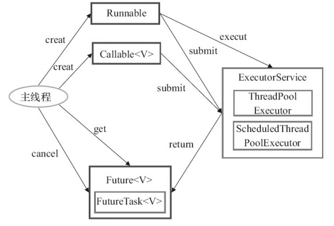

# ThreadPool线程池

## 什么是线程池

管理一系列线程的池子，当有任务要处理时，直接从线程池种获取线程来处理，处理完后也不会立即销毁，而是等待另一个任务。

## 为什么要用线程池？

线程池的优势：降低资源消耗；提高响应速度；提高线程的可管理性。

1. 降低资源消耗。通过重复利用已创建的线程降低线程创建和销毁造成的销耗。
2. 提高响应速度。当任务到达时，任务可以不需要等待线程创建就能立即执行。
3. 提高线程的可管理性。线程是稀缺资源，如果无限制的创建，不仅会销耗系统资源，还会降低系统的稳定性，使用线程池可以进行统一的分配，调优和监控。


## ThreadPoolExecutor分析

```java
public ThreadPoolExecutor(int corePoolSize，//线程池的核心线程数量
                          int maximumPoolSize，//线程池的最大线程数  一般等于核心线程数 提高资源利用率
                          long keepAliveTime，//当线程数大于核心线程数时，多余的空闲线程存活的最长时间
                          TimeUnit unit，//时间单位
                          BlockingQueue<Runnable> workQueue，//任务队列，用来储存等待执行任务的队列
                          ThreadFactory threadFactory，//线程工厂，用来创建线程，一般默认即可
                          RejectedExecutionHandler handler//拒绝策略，当提交的任务过多而不能及时处理时，我们可以定制策略来处理任务) {
        if (corePoolSize < 0 ||
            maximumPoolSize <= 0 ||
            maximumPoolSize < corePoolSize ||
            keepAliveTime < 0)
            throw new IllegalArgumentException();
        if (workQueue == null || threadFactory == null || handler == null)
            throw new NullPointerException();
        this.corePoolSize = corePoolSize;
        this.maximumPoolSize = maximumPoolSize;
        this.workQueue = workQueue;
        this.keepAliveTime = unit.toNanos(keepAliveTime);
        this.threadFactory = threadFactory;
        this.handler = handler;
}

```

ex:

```java
public class ThreadPoolDemo {

    public static void main(String[] args) {
        // 创建单一线程的连接池
        // ExecutorService threadPool = Executors.newSingleThreadExecutor();
        // ExecutorService threadPool = Executors.newFixedThreadPool(3);
        ExecutorService threadPool = Executors.newCachedThreadPool();

        try {
            for (int i = 0; i < 5; i++) {
                threadPool.execute(()->{
                    System.out.println(Thread.currentThread().getName() + "执行了业务逻辑");
                });
            }
        } catch (Exception e) {
            e.printStackTrace();
        } finally {
            threadPool.shutdown();
        }
    }
}


@Bean
public ThreadPoolExecutor threadPoolExecutor(){
    // 当前系统可用处理器数量
    int processorsCount = Runtime.getRuntime().availableProcessors();
    ThreadPoolExecutor threadPoolExecutor = new ThreadPoolExecutor(
            processorsCount * 2，  //线程池的核心线程数量
            processorsCount * 2，  //线程池的最大线程数  
            0，                    //当线程数大于核心线程数时，多余的空闲线程存活的最长时间
            TimeUnit.SECONDS，     //时间单位
            new ArrayBlockingQueue<>(200)，  //阻塞队列，用来储存等待执行任务的队列
            Executors.defaultThreadFactory()，  //默认的线程工厂，用来创建线程.
            // 自定义拒绝策略
            (runnable， executor) -> {  //拒绝策略，当提交的任务过多而不能及时处理时，我们可以定制策略来处理任务
                try {
                    Thread.sleep(200);
                } catch (InterruptedException e) {
                    throw new RuntimeException(e);
                }
                executor.submit(runnable);
            }
    );
    // 线程池创建，核心线程同时创建
    threadPoolExecutor.prestartAllCoreThreads();
    return threadPoolExecutor;
}
```

**`ThreadPoolExecutor`创建方式:**

推荐通过new的方式构造  

**《阿里巴巴 Java 开发手册》强制线程池不允许使用 `Executors` 去创建**


上述案例中的三个方法的本质都是ThreadPoolExecutor的实例化对象，只是具体参数值不同。


### 线程池的7个重要参数

1. corePoolSize：线程池中的常驻核心线程数
2. maximumPoolSize：线程池中能够容纳同时 执行的最大线程数，此值必须大于等于1
3. keepAliveTime：多余的空闲线程的存活时间 当前池中线程数量超过corePoolSize时，当空闲时间达到keepAliveTime时，多余线程会被销毁直到 只剩下corePoolSize个线程为止
4. Timeunit：keepAliveTime的单位
5. workQueue：阻塞队列，被提交但尚未被执行的任务
6. threadFactory：表示生成线程池中工作线程的线程工厂， 用于创建线程，**一般默认的即可**
7. handler：拒绝策略，表示当队列满了，并且工作线程大于 等于线程池的最大线程数（maximumPoolSize）时，如何来拒绝 请求执行的runnable的策略

### 线程池底层工作原理

重要的事情说三遍：以下重要：以下重要：以下重要：

1.  在创建了线程池后，线程池中的**线程数为零**。 
2.  当调用execute()方法添加一个请求任务时，线程池会做出如下判断： 
    1. 如果正在运行的线程数量**小于corePoolSize**，那么马上**创建线程**运行这个任务；
    2. 如果正在运行的线程数量**大于或等于corePoolSize**，那么**将这个任务放入队列**；
    3. 如果这个时候队列满了且正在运行的线程数量还**小于maximumPoolSize**，那么还是要**创建非核心线程**立刻运行这个任务；
    4. 如果队列满了且正在运行的线程数量**大于或等于maximumPoolSize**，那么线程池会**启动饱和拒绝策略**来执行。
3.  当一个线程完成任务时，它会从队列中取下一个任务来执行。 
4.  当一个线程无事可做超过一定的时间（keepAliveTime）时，线程会判断：
    如果当前运行的线程数大于corePoolSize，那么这个线程就被停掉。
    所以线程池的所有任务完成后，**它最终会收缩到corePoolSize的大小**。 


### 拒绝策略

一般我们创建线程池时，为防止资源被耗尽，任务队列都会选择创建有界任务队列，但种模式下如果出现**任务队列已满且线程池创建的线程数达到你设置的最大线程数时**，这时就需要你指定ThreadPoolExecutor的RejectedExecutionHandler参数即合理的拒绝策略，来处理线程池"超载"的情况。

ThreadPoolExecutor自带的拒绝策略如下：

1. AbortPolicy(默认)：直接**抛出RejectedExecutionException异常**阻止系统正常运行
2. CallerRunsPolicy：“调用者运行”一种调节机制，该策略既不会抛弃任务，也不会抛出异常，而是**将某些任务回退到调用者**，从而降低新任务的流量。(确保任务必然执行)
3. DiscardOldestPolicy：**抛弃队列中等待最久的任务**，然后把当前任务加人队列中 尝试再次提交当前任务。
4. DiscardPolicy：**该策略默默地丢弃无法处理的任务**，不予任何处理也不抛出异常。 如果允许任务丢失，这是最好的一种策略。

**以上内置的策略均实现了RejectedExecutionHandler接口，也可以自己扩展RejectedExecutionHandler接口，定义自己的拒绝策略**


**自定义线程池**

不推荐


## CompletableFuture (异步)

作用: 串行->并行

### Future

在 Java 中，`Future` 类是一个泛型接口，位于 `java.util.concurrent` 包下，其中定义了 5 个方法，主要包括下面这 5个功能：

```java
// V 代表了Future执行的任务返回值的类型
public interface Future<V> {
    // 取消任务执行
    // 成功取消返回 true，否则返回 false
    boolean cancel(boolean mayInterruptIfRunning);
    // 判断任务是否被取消
    boolean isCancelled();
    // 判断任务是否已经执行完成
    boolean isDone();
    // 获取任务执行结果
    V get() throws InterruptedException， ExecutionException;
    // 指定时间内没有返回计算结果就抛出 TimeOutException 异常
    V get(long timeout， TimeUnit unit)

        throws InterruptedException， ExecutionException， TimeoutExceptio

}
```

简单理解就是：我有一个任务，提交给了 `Future` 来处理。任务执行期间我自己可以去做任何想做的事情。并且，在这期间我还可以取消任务以及获取任务的执行状态。一段时间之后，我就可以 `Future` 那里直接取出任务执行结果。

缺点:

.get()是阻塞式等待，拿不到结果就一直等。get()方法一定要放在start()方法【开启多线程】之后。

### FutureTask

FutureTask，先认识该类，上源码：


发现：FutureTask其实可以充当了一个中间人的角色

```java
/**
 * 1. 创建Callable的实现类，并重写call()方法，该方法为线程执行体，并且该方法有返回值
 */
class MyCallableThread implements Callable<Integer>{

    @Override
    public Integer call() throws Exception {
        System.out.println(Thread.currentThread().getName() + "执行了！");
        return 200;
    }
}

public class CallableDemo {

    public static void main(String[] args) throws ExecutionException， InterruptedException {
        // 2. 创建Callable的实例，并用FutureTask类来包装Callable对象
        // 3. 创建FutureTask对象，需要一个Callable类型的参数
        FutureTask task = new FutureTask<Integer>(new MyCallableThread());
        // 4. 创建多线程，由于FutureTask的本质是Runnable的实现类，所以第一个参数可以直接使用task
        new Thread(task， "threadName").start();
        //new Thread(task， "threadName2").start();
		
        /*while (!task.isDone()) {
            System.out.println("wait...");
        }*/
        System.out.println(task.get());
        System.out.println(Thread.currentThread().getName() + " over!");
    }
}
```

FutureTask：未来的任务，用它就干一件事，**异步调用。通常用它解决耗时任务，挂起堵塞问题。**

在主线程中需要执行比较耗时的操作时，但又不想阻塞主线程时，可以把这些作业交给Future对象在后台完成，当主线程将来需要时，就可以通过Future对象获得后台作业的计算结果或者执行状态。

一般FutureTask多用于耗时的计算，主线程可以在完成自己的任务后，再去获取结果。

FutureTask仅在call方法完成时才能get结果；如果计算尚未完成，则阻塞 get 方法。

一旦计算完成，就不能再重新开始或取消计算。get方法获取结果只有在计算完成时获取，否则会一直阻塞直到任务转入完成状态，然后会返回结果或者抛出异常。 


注意点：

1.get()是阻塞式等待，拿不到结果就一直等。get()方法一定要放在start()方法【开启多线程】之后。

2.每个FutureTask对象对应一个线程，有几个FutureTask对象对象就能创建几个线程。

3.通过FutureTask对象isDone()方法可以知道该线程是否已经执行结束。


### CompletableFuture 

Java 8 才被引入`CompletableFuture` 类可以解决`Future` 的缺点。`CompletableFuture` 除了提供了更为好用和强大的 `Future` 特性之外，还提供了函数式编程、异步任务编排组合的能力。

```java
public class CompletableFuture<T> implements Future<T>， CompletionStage<T> {
}
```


`CompletionStage` 接口描述了一个异步计算的阶段。很多计算可以分成多个阶段或步骤，此时可以通过它将所有步骤组合起来，形成异步计算的流水线。

### CompletableFuture 操作

创建CompletableFuture

1. new 
2. 基于 `CompletableFuture` 自带的静态工厂方法：`runAsync()`、`supplyAsync()` 。

### 常用的使用方式

CompletableFutre的方法很多 下面介绍几个常用的方法

#### runAsync

当你需要异步操作且不关心返回结果的时候可以使用 `runAsync()` 方法。

```java
public static CompletableFuture<Void> runAsync(Runnable runnable) {
        return asyncRunStage(ASYNC_POOL， runnable);
}

public static CompletableFuture<Void> runAsync(Runnable runnable， Executor executor) {
        return asyncRunStage(screenExecutor(executor)， runnable);
}
```

`runAsync()` 方法接受的参数是 `Runnable` ，这是一个函数式接口，不允许返回值。

```java
@FunctionalInterface
public interface Runnable {
    public abstract void run();
}
```


#### supplyAsync

当你需要异步操作且关心返回结果的时候，可以使用 `supplyAsync()` 方法。

```java
public static <U> CompletableFuture<U> supplyAsync(Supplier<U> supplier) {
        return asyncSupplyStage(ASYNC_POOL， supplier);
}

public static <U> CompletableFuture<U> supplyAsync(Supplier<U> supplier，Executor executor) {
        return asyncSupplyStage(screenExecutor(executor)， supplier);
}
```

`supplyAsync()` 方法接受的参数是 `Supplier<U>` ，这也是一个函数式接口，`U` 是返回结果值的类型。

```java
@FunctionalInterface
public interface Supplier<T> {
    T get();
}

```

#### thenAcceptAsync

`thenAcceptAsync`等待上一个任务执行完成之后，使用这个方法获取上一个任务的返回结果，之后调用下一个任务的操作

```java
public CompletableFuture<Void> thenAcceptAsync(Consumer<? super T> action) {
        return uniAcceptStage(defaultExecutor()， action);
}

public CompletableFuture<Void> thenAcceptAsync(Consumer<? super T> action，
                                                   Executor executor) {
        return uniAcceptStage(screenExecutor(executor)， action);
}
```

#### handle()

通过 `handle()` 方法来处理任务执行过程中可能出现的抛出异常的情况。

```java
public <U> CompletableFuture<U> handle(
    BiFunction<? super T， Throwable， ? extends U> fn) {
    return uniHandleStage(null， fn);
}

public <U> CompletableFuture<U> handleAsync(
    BiFunction<? super T， Throwable， ? extends U> fn) {
    return uniHandleStage(defaultExecutor()， fn);
}

public <U> CompletableFuture<U> handleAsync(
    BiFunction<? super T， Throwable， ? extends U> fn， Executor executor) {
    return uniHandleStage(screenExecutor(executor)， fn);
```

#### allOf()

运行多个 `CompletableFuture`

**`allOf()` 方法会等到所有的 `CompletableFuture` 都运行完成之后再返回**

调用 `join()` 可以让程序等`future1` 和 `future2` 都运行完了之后再继续执行。

```java
//x.组合以上七个异步任务
CompletableFuture.allOf(
        skuCompletableFuture，
        productComCompletableFuture，
        skuPriceCompletableFuture，
        productDetailsComCompletableFuture，
        skuSpecValueComCompletableFuture，
        skuStockVoComCompletableFuture
).join();
```

## 使用注意事项

### 使用自定义线性池

`CompletableFuture` 默认使用`ForkJoinPool.commonPool()` 作为执行器，这个线程池是全局共享的，可能会被其他任务占用，导致性能下降或者饥饿。因此，建议使用自定义的线程池来执行 `CompletableFuture` 的异步任务，可以提高并发度和灵活性。

### 尽量避免使用 get()

`CompletableFuture`的`get()`方法是阻塞的，尽量避免使用。如果必须要使用的话，需要添加超时时间，否则可能会导致主线程一直等待，无法执行其他任务。

## 合理组合多个异步任务


# Executors框架

`Executor`框架是Java并发编程中的一个重要组成部分，它被引入到Java 5中作为Java Util Concurrency（J.U.C）包的一部分，以简化多线程编程并提高代码的可维护性和效率。在Java中处理并发之前，程序员通常需要直接管理和控制`Thread`对象的生命周期，这不仅繁琐，而且容易出错。

`Executor` 框架不仅包括了线程池的管理，还提供了线程工厂、队列以及拒绝策略等，`Executor` 框架让并发编程变得更加简单。


### Executor框架的主要部分

**Executor**:  任务执行  它是线程池框架的基础  

* `execute(Runnable command)`   用于提交一个 `Runnable` 任务到执行框架中。

★**ExcutorService**: `ExecutorService` 是 `Executor` 的扩展 提供很多方法

- `void execute(Runnable command)`：提交一个 `Runnable` 任务。
- `Future<?> submit(Runnable task)`：提交一个 `Runnable` 任务并返回一个 `Future` 对象。
- `<T> Future<T> submit(Callable<T> task)`：提交一个 `Callable` 任务并返回一个 `Future` 对象。
- `List<Future<?>> invokeAll(Collection<? extends Callable<?>> tasks)`：提交一系列 `Callable` 任务，并等待所有任务完成。
- `List<Future<?>> invokeAll(Collection<? extends Callable<?>> tasks， long timeout， TimeUnit unit)`：提交一系列 `Callable` 任务，并等待所有任务完成，或在指定时间内超时。
- `<T> T invokeAny(Collection<? extends Callable<T>> tasks)`：提交一系列 `Callable` 任务，并返回任意一个完成的任务的结果。
- `void shutdown()`：停止接收新任务，并等待已提交的任务完成。
- `List<Runnable> shutdownNow()`：尝试停止所有正在执行的任务，并返回尚未开始的任务列表。

**AbstractExecutorService**:  

AbstractExecutorService除了实现ExecutorService接口外，

* `<T> RunnableFuture<T> newTaskFor(Runnable runnable， T value)`

* `<T> RunnableFuture<T> newTaskFor(Callable<T> callable)`

  方法返回一个RunnableFuture，在运行的时候，它将调用底层可调用任务，作为 Future 任务，它将生成可调用的结果作为其结果，并为底层任务提供取消操作。

**ScheduledExecutorService**:  

为一个“延迟”和“定期执行”的ExecutorService  

**ThreadPoolExecutor**:

 线程池

**ScheduledThreadPoolExecutor**: 

提供了“延迟”和“周期执行”功能的ThreadPoolExecutor。

**★Executors**:  静态工厂类

- `newFixedThreadPool(int nThreads)`：创建一个固定大小的线程池。
- `newCachedThreadPool()`：创建一个缓存线程池，线程数量根据需要动态调整。
- `newSingleThreadExecutor()`：创建一个单线程的 `ExecutorService`。
- `newScheduledThreadPool(int corePoolSize)`：创建一个支持定时任务的线程池。
- `newWorkStealingPool(int parallelism)`：创建一个使用工作窃取算法的线程池。

**★异步计算的结果(`Future`)**

（调用 `submit()` 方法时会返回一个 **`FutureTask`** 对象）


### **Executor框架主要流程**



1. 主线程首先要创建实现 `Runnable` 或者 `Callable` 接口的任务对象。

2. 把创建完成的实现 `Runnable`/`Callable`接口的 对象直接交给 `ExecutorService` 执行: `ExecutorService.execute（Runnable command）`）或者也可以把 `Runnable` 对象或`Callable` 对象提交给 `ExecutorService` 执行（`ExecutorService.submit（Runnable task）`或 `ExecutorService.submit（Callable <T> task）`）。

3. 如果执行 `ExecutorService.submit（…）`，`ExecutorService` 将返回一个实现`Future`接口的对象（我们刚刚也提到过了执行 `execute()`方法和 `submit()`方法的区别，`submit()`会返回一个 `FutureTask 对象）。由于 FutureTask` 实现了 `Runnable`，我们也可以创建 `FutureTask`，然后直接交给 `ExecutorService` 执行。

4. 最后，主线程可以执行 `FutureTask.get()`方法来等待任务执行完成。主线程也可以执行 `FutureTask.cancel（boolean mayInterruptIfRunning）`来取消此任务的执行。

