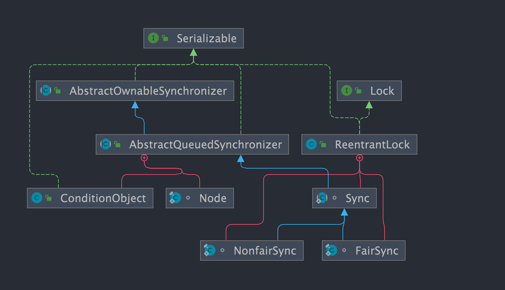
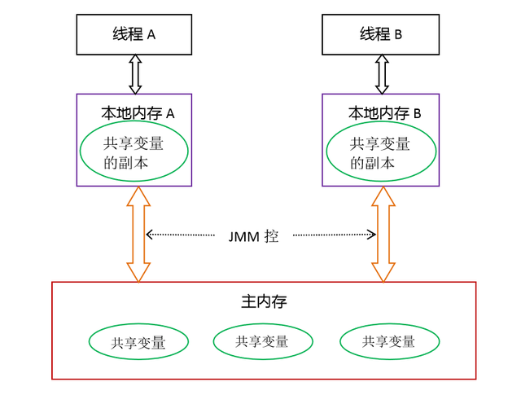

# Juc线程锁及机制

## volatile

在`java.util.concurrent`包下，用于确保变量的可见性和有序性(禁止指令重排序)，但不保证原子性，从而提供一定程度的同步效果。**轻量级锁**

### **如何保证可见性?**

如果我们将变量声明为 `volatile` ，这就指示 JVM，这个变量是共享且不稳定的，每次使用它都到主存中进行读取。(当读取一个`volatile`变量时，`JMM`会把该线程对应的工作内存置为无效，那么该线程只能从主内存中重新读取共享变量。)

### **如何防止jvm指令重排?**

在对这个变量进行读写操作的时候，会通过插入特定的 **内存屏障** 的方式来禁止指令重排序。

**内存屏障，**又称内存栅栏，是一个`CPU`指令，它的作用有两个，一是保证特定操作的执行顺序，二是保证强制刷出各种`CPU`缓存数据，（利用该特性实现`volatile`的内存可见性）让每个线程都能读取到这些数据的最新版本。


### volatile 的使用场景

**状态标记**：

* 使用 `volatile` 变量来表示线程间共享的状态标记，如线程中断标志、线程池关闭标志等。

**单例模式的双重检查锁定**

在实现线程安全的单例模式时，`volatile`可以防止指令重排序带来的问题。在双重检查锁定（Double-Checked Locking）模式中，`volatile`关键字确保了初始化的单例对象一旦构造完成，其引用就对所有线程可见，避免了可能的“半构造”对象问题。

**线程间通信**

- `volatile`变量可以作为线程间通信的一种简单方式。例如，一个线程修改`volatile`变量的值，另一个线程读取这个值，从而达到线程间的同步。

**序列化ID**

- 在某些情况下，`volatile`可以用于序列化ID的生成，确保多个线程生成的序列化ID是唯一且有序的。

**发布对象**：

- 使用 `volatile` 变量来发布一个对象引用，确保其他线程能够看到完整的对象状态。

## synchronized

`synchronized` 是 Java 中的一个关键字，用于保证可见性,原子性,有序性  但是无法禁止指令重排序，主要解决的是多个线程之间访问资源的同步性，可以保证被它修饰的方法或者代码块在任意时刻只能有一个线程执行。****

### **synchronized 的使用场景**

* 饰实例方法  (锁当前对象实例)

```java
synchronized void method() {
    //业务代码
}
```

* 修饰静态方法  (锁当前类)

```java
synchronized static void method() {
    //业务代码
}
```

* 修饰代码块  (锁指定对象/类)

```java
synchronized(this) {
    //业务代码
}
```

**不要使用 `synchronized(String a)`** 因为 JVM 中，字符串常量池具有缓存功能

构造方法不能被`synchronized`修饰  可以在构造方法内部使用 synchronized 代码块


### **synchronized 和 volatile 有什么区别**

`synchronized` 关键字和 `volatile` 关键字是两个互补的存在，而不是对立的存在！

- `volatile` 关键字是线程同步的轻量级实现，所以 `volatile`性能肯定比`synchronized`关键字要好 。但是 `volatile` 关键字只能用于变量而 `synchronized` 关键字可以修饰方法以及代码块 。
- `volatile` 关键字能保证数据的可见性，但不能保证数据的原子性。`synchronized` 关键字两者都能保证。
- `volatile`关键字主要用于解决变量在多个线程之间的可见性，而 `synchronized` 关键字解决的是多个线程之间访问资源的同步性.

### 为什么synchronized不能禁止指令重排序？

**`synchronized`能保证有序性，却不能禁止指令重排序**。

`synchronized`所保证的原子性、可见性、有序性，实际上都是基于一个思路：**将之前的多线程并行执行，变为了单线程的串行执行。**

那实际对于单线程而言，所有操作都是有序的，变为了单线程的串行执行之后，必然可以保证“有序性”。而对于单线程而言，指令重排是对单线程的执行有利的，此时就没有必要去禁止指令重排序，禁止了反而影响单线程的性能。

所以对于这个问题，为什么`synchronized`能够保证有序性，却不能禁止指令重排序？那是因为`synchronized`没有必要禁止指令重排序，否则还会影响程序性能。

### synchronized与ReentrantLock相比性能不好的原因

`synchronized`是基于进入和退出管程`Monitor`实现的，而`Monitor`底层是依赖于`OS`的`Mutex Lock`，获取锁和释放锁都需要经过系统调用，而系统调用涉及到用户态和内核态的切换，会经过`0x80`中断，经过内核调用后再返回用户态，因此而效率低下。

而`ReentrantLock`底层实现依赖于特殊的`CPU`指令，比如发送`lock`指令和`unlock`指令，不需要用户态和内核态的切换，所以效率高（这里和volatile底层原理类似）。

不过相对来说，在并发竞争不大的情况下，`synchronized`的性能反而会超越`ReentrantLock`，毕竟`synchronized`有同步消除、偏向锁这些机制，可以确保在竞争不激烈的情况下，程序性能得到很好释放。


### **sychronized 的底层原理**

synchronized 关键字底层原理属于 JVM 层面的东西。


方法级的同步是隐式，即无需通过字节码指令来控制的，它实现在方法调用和返回操作之中。JVM可以从方法常量池中的方法表结构(method_info Structure) 中的 ACC_SYNCHRONIZED 访问标志区分一个方法是否同步方法。当方法调用时，调用指令将会 检查方法的 ACC_SYNCHRONIZED 访问标志是否被设置，如果设置了，执行线程将先持有monitor（虚拟机规范中用的是管程一词）， 然后再执行方法，最后再方法完成(无论是正常完成还是非正常完成)时释放monitor。

代码块的同步是利用monitorenter和monitorexit这两个字节码指令。它们分别位于同步代码块的开始和结束位置。当jvm执行到monitorenter指令时，当前线程试图获取monitor对象的所有权，如果未加锁或者已经被当前线程所持有，就把锁的计数器+1；当执行monitorexit指令时，锁计数器-1；当锁计数器为0时，该锁就被释放了。如果获取monitor对象失败，该线程则会进入阻塞状态，直到其他线程释放锁。

不过两者的本质都是对对象监视器 monitor 的获取。

**从反编译字节码理解synchronized修饰方法原理**

编译前源代码

```java
public class SyncDemo{
    int i;
    public void incr(){
        synchronized(this){
            i++;
        }
    }
}
```

使用`javac`编译如上代码，并使用`javap -p -v -c`进行反汇编

```c
/*-------synchronized修饰incr()中代码块，反汇编之后得到的字节码文件--------*/
public void incr();
descriptor: ()V
flags: ACC_PUBLIC
Code:
  stack=3, locals=3, args_size=1
     0: aload_0
     1: dup
     2: astore_1
     3: monitorenter        // monitorenter进入同步
     4: aload_0
     5: dup
     6: getfield      #2                  // Field i:I
     9: iconst_1
    10: iadd
    11: putfield      #2                  // Field i:I
    14: aload_1
    15: monitorexit         // monitorexit退出同步
    16: goto          24
    19: astore_2
    20: aload_1
    21: monitorexit         // 第二次出现monitorexit退出同步
    22: aload_2
    23: athrow
    24: return
  Exception table:
     // 省略其他字节码信息........
```

从字节码中可知，`synchronized`修饰代码块，是基于进入管程`monitorenter`和退出管程`monitorexit`指令实现的，其中`monitorenter`指令指向同步代码块的开始位置，`monitorexit`指令则指明同步代码块的结束位置。

当执行`monitorenter`指令时，当前线程将试图获取`objectref`（即对象锁）所对应的`monitor`的持有权，当`objectref`的`monitor`计数器为`0`，那线程可以尝试占有`monitor`，如果将计数器值成功设置为`1`，表示获取锁成功。


## AQS

**是什么**

AQS 的全称为 `AbstractQueuedSynchronizer` ，在 `java.util.concurrent.locks` 包下面，它是实现同步器的核心基础组件（框架）, 抽象队列同步器。


juc下面Lock（ReentrantLock、ReentrantReadWriteLock等）的实现以及一些并发工具类（Semaphore、CountDownLatch、CyclicBarrier等）就是通过AQS来实现的。具体用法是通过继承AQS实现其模板方法，然后将子类作为同步组件的内部类。But StampLock不是基于AQS实现的。



**框架结构**
AQS内部维护着一个FIFO双向队列，该队列就是`CLH同步队列`。

- **CLH队列**：全称是(Craig.Landin. and Haqersten)lock queue，`用来存储被阻塞的线程信息`。


AQS维护了一个volatile语义(支持多线程下的可见性)的共享资源变量**state**和一个FIFO（first-in-first-out）**线程等待队列**(多线程竞争state资源被阻塞时，会进入此队列)。

`state 属性表示资源的状态`
例如：

- 对于ReentrantLock来说，state=1，表示资源被占用；state=0，表示资源没有被占用。
- 对于CountDownLatch来说，state=0，表示计数器归零，所有线程都可以访问资源；status为N表示计数器未归零，所有线程都需要阻塞。

### **基于AQS实现锁的思路**

AQS将大部分的同步逻辑均已经实现好，继承的自定义同步器只需要实现state的获取(acquire)和释放(release)的逻辑代码就可以，主要包括下面方法：

- acquire(int)：独占方式。尝试获取资源，成功则返回true，失败则返回false。
- release(int)：独占方式。尝试释放资源，成功则返回true，失败则返回false。
- acquireShared(int)：共享方式。尝试获取资源。负数表示失败；0表示成功，但没有剩余可用资源；正数表示成功，且有剩余资源。
- releaseShared(int)：共享方式。尝试释放资源，如果释放后允许唤醒后续等待结点返回true，否则返回false。
- isHeldExclusively()：该线程是否正在独占资源。只有用到condition才需要去实现它。

也就是说通过AQS可以实现独占锁（只有一个线程可以获取到锁，如：ReentrantLock），也可以实现共享锁（多个线程都可以获取到锁Semaphore/CountDownLatch等）

### AQS的底层原理

AQS使用一个volatile成员变量state来表示锁是否已被持有，通过内置的FIFO队列存储被阻塞的线程。

AQS使用CAS机制对state进行原子操作从而对state的值进行修改。

如果state的值为0，表示锁未被持有，则将当前线程设置为工作线程（即获取到了锁），并将state的值设置为1，

返回成功获取到锁。

如果未能成功获取到锁，AQS先自旋获取锁，如果一直获取不到，则将当前获取不到锁的线程加入到FIFO队列中

## **Lock**

· Lock的存储结构：一个int类型状态值（用于锁的状态变更），一个双向链表（用于存储等待中的线程）

· Lock获取锁的过程：本质上是通过CAS来获取状态值修改，如果当场没获取到，会将该线程放在线程等待链表中。

· Lock释放锁的过程：修改状态值，调整等待链表。

· Lock大量使用CAS+自旋。因此根据CAS特性，lock建议使用在低锁冲突的情况下。


### ReentrantLock

ReentrantLock实现了Lock接口 比synchronized更加强大 , 灵活, 增加了轮询、超时、中断、公平锁和非公平锁等高级功能。


#### **RenntrantLock的创建**

`private ReentrantLock lock = new ReentrantLock(); // 锁声明`

**可重入性**

可重入锁又名递归锁，是指在同一个线程在外层方法获取锁的时候，再进入该线程的内层方法会自动获取锁。Java中ReentrantLock和synchronized都是可重入锁，可重入锁的一个优点是**可一定程度避免死锁**。

```java
class A{
	public synchronized void aa{
		......
        bb();
        ......
	}
	public synchronized void bb{
		......
	}
}
A a = new A();
a.aa();
```

A类中有两个普通同步方法，都需要对象a的锁。如果是不可重入锁的话，aa方法首先获取到锁，aa方法在执行的过程中需要调用bb方法，此时锁被aa方法占有，bb方法无法获取到锁，这样就会导致bb方法无法执行，aa方法也无法执行，出现了死锁情况。可重入锁可避免这种死锁的发生。


#### 公平锁设置

默认是非公平锁

```java
private ReentrantLock lock = new ReentrantLock(true); // 公平锁设置

// 传入一个 boolean 值，true 时为公平锁，false 时为非公平锁
public ReentrantLock(boolean fair) {
    sync = fair ? new FairSync() : new NonfairSync();
}
```


#### **限时等待**设置

传入时间参数，表示等待指定的时间，无参则表示立即返回锁申请的结果：true表示获取锁成功，false表示获取锁失败。我们可以将这种方法用来解决死锁问题。

```java
boolean tryLock(long time, TimeUnit unit) throws InterruptedException; // 限时等待  
```


#### **ReentrantLock和synchronized区别**

* **显式锁/隐式锁:**
  - `ReentrantLock`是显式锁，需要手动获取和释放锁。使用`lock()`方法获取锁，使用`unlock()`方法释放锁。加锁和解锁都是由java代码配合native方法（调用操作系统的相关方法）实现的
  - `synchronized`是隐式锁，不需要显式地调用方法获取和释放锁。在进入`synchronized`代码块或方法时自动获取锁，在退出时自动释放锁。synchronize的加锁和解锁的过程是由JVM管理的
* **异常安全性**
  - 使用`ReentrantLock`时，如果在锁持有的代码中抛出了未捕获的异常，锁不会自动释放，这可能导致死锁。需要在finally块中显式调用`unlock()`来确保锁被释放。
  - `synchronized`会在异常发生时自动释放锁。
* **可中断锁尝试**
  * `ReentrantLock`允许线程在等待锁时响应中断请求，可以通过`lockInterruptibly()`方法实现。
  * `synchronized`无法响应中断请求，线程会一直阻塞直到获取到锁。
* **公平锁 vs 非公平锁**
  * `ReentrantLock`支持公平锁和非公平锁，可以通过构造函数选择。公平锁保证请求锁的线程按照请求的顺序获取锁，非公平锁不保证这一点，可能会导致饥饿现象。
  * `synchronized`默认是非公平的，不保证请求锁的顺序。
* **锁的时效性**
  - `ReentrantLock`可以与`tryLock()`方法结合使用，尝试获取锁但不阻塞，或者在一定时间内尝试获取锁。
  - `synchronized`总是阻塞的，直到获取到锁为止。

总结:

- `synchronized`更简单易用，适用于大多数情况下的同步需求，特别是在短小的代码块中。由于自身的带有膨胀性 轻量锁会上升到重量锁 并不适合高并发的场景
- `ReentrantLock`提供了更多的功能和更高的灵活性，适用于需要更复杂锁行为的场景，如长时间的锁持有、中断响应、公平性控制等。


### ReentrantReadWriteLock

针对**读多写少**的情况    读写锁允许同一时刻被多个读线程访问，**但是在写线程访问时，所有的读线程和其他的写线程都会被阻塞。**
读写锁的特点：

1. 写写不可并发
2. 读写不可并发
3. 读读可以并发

读写锁：读写锁中的读锁和写锁实际是一把锁的两个不同角色。

读锁：读共享

写锁: 独占锁


#### 锁降级

什么是锁降级，锁降级就是从写锁降级成为读锁。在当前线程拥有写锁的情况下，再次获取到读锁，随后释放写锁的过程就是锁降级。这里可以举个例子：

```java
public void test(){
    rwlock.writeLock().lock();
    System.out.println("获取到写锁。。。。");
    rwlock.readLock().lock();
    System.out.println("获取到读锁----------");
    rwlock.writeLock().unlock();
    System.out.println("释放写锁==============");
    rwlock.readLock().unlock();
    System.out.println("释放写锁==============");
}
// 获取到写锁。。。。
// 获取到读锁----------
// 释放写锁==============
// 释放写锁==============
```


#### 读写锁总结

1. 支持公平/非公平策略


2. 支持可重入

    - 同一读线程在获取了读锁后还可以获取读锁
    - 同一写线程在获取了写锁之后既可以再次获取写锁又可以获取读锁

3. 支持锁降级，不支持锁升级

4. 读写锁如果使用不当，很容易产生“饥饿”问题：

    在读线程非常多，写线程很少的情况下，很容易导致写线程“饥饿”，虽然使用“公平”策略可以一定程度上缓解这个问题，但是“公平”策略是以牺牲系统吞吐量为代价的。

5. Condition条件支持

    写锁可以通过newCondition()方法获取Condition对象。但是读锁是没法获取Condition对象，读锁调用newCondition() 方法会直接抛出UnsupportedOperationException。


## CountDownLatch（倒计数器）

**是什么?**

CountDownLatch是一个非常实用的多线程控制工具类. 

CountDownLatch中count down是倒数的意思，latch则是门闩的含义。整体含义可以理解为倒数的门栓，似乎有

一点“三二一，芝麻开门”的感觉。

**为什么要用/使用场景**

- 多等一：初始化count=1，多条线程await()阻塞，一条线程调用countDown()唤醒所有阻塞线程
- 一等多：初始化count=x，多线程countDown()对count进行减一，一条线程await()阻塞，当count=0时阻塞的线程开始执行

**常用方法**

```java
//实例化一个倒计数器，count指定初始计数
new CountDownLatch(int count)
// 每调用一次，计数减一
countDown() 
//等待，当计数减到0时，阻塞线程（可以是一个，也可以是多个）并行执行
await() 
```

**快速使用**

```java
// 案例  6个同学陆续离开教室后值班同学才可以关门。

public class CountDownLatchDemo {

    /**
     * main方法也是一个进程，在这里是主进程，即上锁的同学
     *
     * @param args
     */
    public static void main(String[] args) throws InterruptedException {

        // 初始化计数器，初始计数为6
        CountDownLatch countDownLatch = new CountDownLatch(6);

        for (int i = 0; i < 6; i++) {
            new Thread(()->{
                try {
                    // 每个同学墨迹几秒钟
                    TimeUnit.SECONDS.sleep(new Random().nextInt(5));
                    System.out.println(Thread.currentThread().getName() + " 同学出门了");
                    // 调用countDown()计算减1
                    countDownLatch.countDown();
                } catch (InterruptedException e) {
                    e.printStackTrace();
                }
            }, String.valueOf(i)).start();
        }

        // 调用计算器的await方法，等待6位同学都出来
        countDownLatch.await();

        System.out.println("值班同学锁门了");
    }
}
```

### ★CountDownLatch 与 join 方法的区别

调用一个子线程的 **join()方法**后，该线程会一直**被阻塞直到该线程运行完毕**。而 CountDownLatch 则使用计数器

允许子线程**运行完毕或者运行中**时候递减计数，也就是 CountDownLatch 可以在子线程运行任何时候让 await 方

法返回而不一定必须等到线程结束；另外使用线程池来管理线程时候一般都是直接添加 Runnable 到线程池这时候

就没有办法在调用线程的 join 方法了，countDownLatch 相比 Join 方法让我们对线程同步有更灵活的控制。

动手案例:秦灭六国，一统华夏。

## CyclicBarrier（循环栅栏）

**是什么?**

`CyclicBarrier`是一个可以多次使用的栅栏，它允许一组线程相互等待，直到到达某个公共点（barrier）。当所有参与的线程到达barrier时，它们将被释放继续执行。`CyclicBarrier`可以在构造时指定一个“障碍动作”（barrier action），这个动作会在所有线程到达barrier之后由一个线程执行。

**为什么使用CyclicBarrier**

`CyclicBarrier`相对于`CountDownLatch`的主要优势在于它可以在多个循环中重复使用，而`CountDownLatch`只能使用一次。这意味着在需要多次同步点的场景下，`CyclicBarrier`更为适用，因为它不需要每次同步后重新创建对象，从而减少了创建和销毁对象的开销。

此外，`CyclicBarrier`允许在所有线程到达barrier后执行一个特定的动作，这在某些场景下非常有用，例如收集所有线程的结果或进行阶段性的清理工作。

总的来说，`CyclicBarrier`提供了一种更灵活的方式来协调多个线程的执行，特别是在需要多次同步的复杂并行算法中。

**使用场景**

- 并行流处理：在并行处理数据流时，`CyclicBarrier`可以确保所有的处理单元完成前一阶段的工作，然后一起进入下一阶段。
- 多线程协作：当多个线程需要分阶段协作完成任务时，每个阶段结束时所有线程在barrier处等待，确保所有线程都已经准备好进入下一阶段。
- 分布式算法：在实现一些需要节点间同步的分布式算法时，`CyclicBarrier`可以确保所有节点在执行下一步之前都已经到达某个检查点。

**常用方法**

```java
// 初始化 parties指定参与相互等待的线程数
public CyclicBarrier(int parties)
// 初始化 parties指定参与相互等待的线程数 该命令只在每个屏障点运行一次，可以在执行后续业务之前共享状态 该操作由最后一个进入屏障点的线程执行。
public CyclicBarrier(int parties, Runnable barrierAction)
// 当前线程阻塞进入休眠状态，直到所有线程都到达屏障点，当前线程才会被唤醒。
public int await()
public int await(long timeout, TimeUnit unit)
```

**快速使用**

```java
//组队打boss过关卡游戏。
public class CyclicBarrierDemo {

    public static void main(String[] args) {

        CyclicBarrier cyclicBarrier = new CyclicBarrier(3, () -> {

            System.out.println(Thread.currentThread().getName() + " 过关了");
        });

        for (int i = 0; i < 3; i++) {
            new Thread(()->{
                try {
                    System.out.println(Thread.currentThread().getName() + " 开始第一关");
                    TimeUnit.SECONDS.sleep(new Random().nextInt(4));
                    System.out.println(Thread.currentThread().getName() + " 开始打boss");
                    cyclicBarrier.await();

                    System.out.println(Thread.currentThread().getName() + " 开始第二关");
                    TimeUnit.SECONDS.sleep(new Random().nextInt(4));
                    System.out.println(Thread.currentThread().getName() + " 开始打boss");
                    cyclicBarrier.await();

                    System.out.println(Thread.currentThread().getName() + " 开始第三关");
                    TimeUnit.SECONDS.sleep(new Random().nextInt(4));
                    System.out.println(Thread.currentThread().getName() + " 开始打boss");
                    cyclicBarrier.await();

                } catch (Exception e) {
                    e.printStackTrace();
                }
            }, String.valueOf(i)).start();
        }
    }
}
```

### ★CyclicBarrier和CountDownLatch的区别

* 重用性
  - `CountDownLatch`是一次性使用的，而`CyclicBarrier`可以被重用。

* 计数器和参与者
  - `CountDownLatch`的计数器可以被任意线程递减，而`CyclicBarrier`的barrier点是由固定数量的参与者触发的。

* 动作执行
  - `CyclicBarrier`可以指定一个动作在所有参与者到达barrier时执行，而`CountDownLatch`没有此功能。

## Semaphore（信号量）

**是什么**

非常适合需求量大，而资源又很紧张的情况。比如给定一个资源数目有限的资源池，假设资源数目为N，每一个线程均可获取一个资源，但是当资源分配完毕时，后来线程需要阻塞等待，直到前面已持有资源的线程释放资源之后才能继续。

**为什么要用**

信号量主要用于两个目的：

1. 多个共享资源的互斥使用。
2. 用于并发线程数的控制。保护一个关键部分不要一次输入超过N个线程。

```java
// 构造方法，permits指资源数目（信号量）
public Semaphore(int permits) 
// 构造方法：permits指资源数目，fair→公平与非公平
Semaphore(int permits, boolean fair) 
// 占用资源，当一个线程调用acquire操作时，它要么通过成功获取信号量（信号量减1），要么一直等下去，直到有线程释放信号量，或超时。
public void acquire() throws InterruptedException 
// （释放）实际上会将信号量的值加1，然后唤醒等待的线程。
public void release() 
// 从信号量中获取许可，该方法不响应中断
void acquireUninterruptibly() 
// 返回当前信号量中未被获取的许可数
int availablePermits() 
// 获取并返回当前信号量中立即未被获取的所有许可
int drainPermits()
    
```

**快速使用**

```java
// 案例：6辆车抢占3个车位
public class SemaphoreDemo {

    public static void main(String[] args) {
        // 初始化信号量，3个车位
        Semaphore semaphore = new Semaphore(3);

        // 6个线程，模拟6辆车
        for (int i = 0; i < 6; i++) {
            new Thread(()->{
                try {
                    // 抢占一个停车位
                    semaphore.acquire();
                    System.out.println(Thread.currentThread().getName() + " 抢到了一个停车位！！");
                    // 停一会儿车
                    TimeUnit.SECONDS.sleep(new Random().nextInt(10));
                    System.out.println(Thread.currentThread().getName() + " 离开停车位！！");
                    // 开走，释放一个停车位
                    semaphore.release();
                } catch (InterruptedException e) {
                    e.printStackTrace();
                }
            }, String.valueOf(i)).start();
        }
    }
}
```

### ★ReetrantLock与Semaphore的区别

- `ReentrantLock`主要用于实现互斥，适合需要精细控制锁行为的场景。
- `Semaphore`用于控制多个线程对有限资源的访问，适合资源池管理和并发数量控制。

如果你只需要实现互斥，那么`ReentrantLock`可能更适合；如果你需要控制多个线程访问有限资源，那么`Semaphore`可能是更好的选择。


## 底层原理

### 物理内存模型(了解)


cpu缓存用来解决cpu处理速度和内存速度不匹配问题  

Java 源代码会经历 **编译器优化重排 —> 指令并行重排 —> 内存系统重排** 的过程，最终才变成操作系统可执行的指令序列。

### java内存模型(JMM)

#### 什么是JMM

本身是一种抽象的概念，实际并不存在。

**它描述的是一组规则或规范，**通过这组规范定义了线程中各个变量的访问方式。具体来说是一个线程对共享变量的写入何时对另一个线程可见

JMM规定了内存主要划分为**主内存**和**工作存**两种。

> **主内存**：属于线程共享区，保存了所有的变量。
>
> **工作内存**：每个线程都有自己的工作内存，线程独享，保存了线程用到的变量副本（主内存共享变量的一份拷贝）。工作内存负责与线程交互，也负责与主内存交互。


此处的主内存和工作内存跟JVM内存划分（堆、栈、方法区）是在不同的维度上进行的，如果非要对应起来，主内存对应的是Java堆中的对象实例部分，工作内存对应的是栈中的部分区域，从更底层的来说，**主内存对应的是硬件的物理内存，工作内存对应的是寄存器和高速缓存**。

JMM对共享内存的操作做出了如下两条规定：

> - 线程对共享内存的所有操作都必须在自己的工作内存中进行，不能直接从主内存中读写；
> - 不同线程无法直接访问其他线程工作内存中的变量，因此共享变量的值传递需要通过主内存完成。



#### 工作内存与主内存的关系

根据虚拟机规范，对于一个实例对象的成员方法而言，如果方法中包含的本地变量（局部变量），是`boolean、byte、short、char、int、long、float、double`八大基本数据类型，这将直接存储在工作内存的栈帧结构的局部变量表中。

倘若本地变量是引用类型，那么该对象的在内存中的具体引用地址，将会被存储在工作内存的栈帧结构的局部变量表中；而具体的实例对象，将存储在主内存（共享数据区域：堆）中。但对于实例对象的成员字段，不管是基本数据类型，还是`Integer、Double`等包装类型，又或者是引用类型，都会被存储到堆区（栈上分配除外）。

至于`static`变量以及类本身相关信息将会存储在主内存中。

需要注意的是：在主内存中的实例对象可以被多条线程共享，倘若两条线程同时调用同一个类的、同一个方法，那这两条线程需要将操作的数据，拷贝一份到自己的工作内存中，在工作内存运算完成后，才刷新到主内存

#### 为什么需要JMM

解决线程安全问题

`JVM`定义了一组规则，通过这组规则来决定：**一个线程对共享变量的写入何时对另一个线程可见**，这组规则也称为`Java`内存模型（`JMM`），`JMM`整体是围绕着程序执行的原子性、有序性、可见性展开的，下面我们看看这三个特性。

#### **内存模型的三大特性**

-  **原子性：即不可分割性，要么全部完成，要么全部不发生。**对于32位系统来说`byte、short、int、float、boolean、char`等基本数据类型的读写是原子操作，而`long、double`类型的数据，它们的读写并非原子性的！
-  **可见性：可见性是指当一个线程修改了共享变量的值，其他线程能够立即看到这个修改。**
-  **有序性：**有序性指的是程序执行的顺序按照代码的先后顺序执行，先写的代码会在后写的代码之前执行。由于现代处理器和编译器的优化，实际的执行顺序可能与代码的顺序不同，这被称为指令重排序。**Java内存模型通过使用内存屏障和`volatile`关键字等机制来控制指令重排序，**以确保代码的执行顺序符合程序员的预期。

volatile的详解在下一章

#### 指令重排

指令重排的意义在于提高性能 

* **编译器优化的重排**：编译器在不改变单线程程序语义的前提下，可以重新安排语句的执行顺序。

* **指令并行的重排**：现代处理器采用了指令级并行技术来将多条指令重叠执行。如果不存在数据依赖性（即后一个执行的语句，无需依赖前面语句的执行结果），处理器可以改变语句对应机器指令的执行顺序。

* **内存系统的重排**：由于处理器使用缓存和读写缓存冲区，这使得加载（`load`）和存储`store`操作看上去可能是在乱序执行，因为三级缓存的存在，导致内存与缓存的数据同步存在时间差。

#### 内存屏障

内存屏障（Memory Barrier），也称为内存栅栏或内存围栏，是一种在处理器中使用的同步机制，用于控制对内存的访问顺序，防止指令重排序，确保数据的正确性和一致性。在多核或多处理器系统中，内存屏障用来强制执行特定的内存访问顺序，这对于多线程编程和并行计算至关重要。

内存屏障可以分为几种类型，每种类型都有其特定的目的：

1. **Load-Load Barrier**：这种屏障确保所有在其之前的加载操作完成前，不会执行任何在其之后的加载操作。这通常用于确保某些加载操作的结果在其他加载操作之前可用。
2. **Store-Store Barrier**：这种屏障确保所有在其之前的存储操作完成前，不会执行任何在其之后的存储操作。它用于确保某些存储操作的效果在其他存储操作之前可见。
3. **Load-Store Barrier**：这种屏障确保所有在其之前的加载操作完成前，不会执行任何在其之后的存储操作。这有助于确保加载操作的数据在存储操作之前已经完全可用。
4. **Full Barrier**（或称Seq Cst Barrier）：这是一种全面的内存屏障，它结合了以上三种屏障的效果，确保了所有在其之前的内存操作（包括加载和存储）都完成前，不会执行任何在其之后的内存操作。

#### 先行发生原则

它用于描述两个操作之间的偏序关系，确保了操作的顺序和可见性。如果一个操作A先行发生于操作B，那么操作A对共享变量的修改对操作B是可见的，并且操作A的执行结果对操作B有效。

以下是一些常见的“先行发生”原则：

1. **程序次序规则**： 如果操作A在操作B之前按程序语句顺序出现，那么A先行发生于B。
2. **锁释放-获取规则**： 一个unlock操作先行发生于后续对同一个锁的lock操作。
3. **volatile变量规则**： 对volatile字段的写操作先行发生于后续对这个volatile字段的读操作。
4. **线程启动-结束规则**： Thread对象的start()方法调用先行发生于该线程的每一个动作；线程中所有的操作先行发生于线程的终止检测（通过Thread.join()或检查Thread.isAlive()）。
5. **异常传递规则**： 如果异常在某个方法中抛出，那么抛出异常的操作先行发生于任何由于这个异常而导致的方法返回。
6. **传递性**： 如果A先行发生于B，B先行发生于C，那么A先行发生于C。


#### Java 内存区域和 Java内存模型 有何区别？

 **Java 内存区域和Java内存模型是完全不一样的两个东西**：

Java内存区域 定义了 **JVM** 在运行时如何分区存储程序数据，就比如说堆主要用于存放对象实例。

**Java内存模型(JMM)**主要解决的是多线程环境下的内存可见性、原子性和有序性问题，它规定了所有的变量都存储在主内存(Main Memory)中，而每个线程都有自己的工作内存(Working Memory)，线程对变量的所有操作（读取、赋值等）都必须在工作内存中进行，不能直接操作主内存中的变量。不同的线程之间无法直接访问对方的工作内存，线程间的通信必须通过主内存来完成。


### 虚拟线程

这种线程是由`Java`虚拟机调度，而不是os调度。虚拟线程占用空间小，因此可以极大量地创建和使用。

#### 虚拟线程和平台线程有什么关系?

在没有虚拟线程之前  JVM 调度程序通过平台线程来管理虚拟线程，一个平台线程可以在不同的时间执行不同的虚拟线程，当虚拟线程被阻塞或等待时，平台线程可以切换到执行另一个虚拟线程


#### 虚拟线程实现原理

[虚拟线程 - VirtualThread 源码透视](https://www.cnblogs.com/throwable/p/16758997.html)


### ThreadLocal

**是什么**

threadLocal是JDK自带的类  位于java.lang包下 主要作用就是**实现每个线程都有专属的的本地变量**

**使用场景**

- 上下文(context)传递。一个对象需要在多个方法中层次传递使用，比如用户身份、任务信息、调用链ID、关联ID(如日志的uniqueID，方便串起多个日志)等，如果此时使用责任链模式给每个方法添加一个context参数会比较麻烦，而此时就可以使用ThreadLocal设置参数，需要使用时get一下即可。
- 线程间的数据隔离。如spring事务管理机制实现则使用到ThreadLocal来保证单个线程中的数据库操作使用的是同一个数据库连接。同时，采用这种方式可以使业务层使用事务时不需要感知并管理Connection连接对象，通过传播级别，能够巧妙地管理多个事务配置之间的切换，挂起和恢复。
- 项目中很少使用它，它更多应用则是在框架源码中应用。

#### **ThreadLocal原理**

```java
// Thread源码
public class Thread implements Runnable {
    //......
    //与此线程有关的ThreadLocal值。由ThreadLocal类维护
    ThreadLocal.ThreadLocalMap threadLocals = null;

    //与此线程有关的InheritableThreadLocal值。由InheritableThreadLocal类维护
    ThreadLocal.ThreadLocalMap inheritableThreadLocals = null;
    //......
}
```

从上面Thread类 源代码可以看出Thread 类中有一个 threadLocals 和 一个 inheritableThreadLocals 变量，它们都是 ThreadLocalMap 类型的变量,默认情况下这两个变量都是 null，只有当前线程调用 ThreadLocal 类的 set或get方法时才创建它们，**实际上调用这两个方法的时候，我们调用的是ThreadLocalMap类对应的 get()、set()方法。**

`ThreadLocal`类的`set()和get()`方法

```java
public void set(T value) {
    // 获取当前请求的线程
    Thread t = Thread.currentThread();
    // 获取当前线程的threadlocals成员变量取出  Thread类内部的 threadLocals 变量(哈希表结构)
    ThreadLocalMap map = getMap(t);
    // 如果map不为空，则将value添加进map
    if (map != null)
        map.set(this, value);
    // 如果map为空则先为当前线程创建一个map再将value加入map
    else
        createMap(t, value);
}
// ThreadLocal类 → getMap()方法
ThreadLocalMap getMap(Thread t) {
    return t.threadLocals;
}
```

最终的变量是放在了当前线程的 `ThreadLocalMap` 中，并不是存在 `ThreadLocal` 上，`ThreadLocal` 可以理解为

只是`ThreadLocalMap`的封装，传递了变量值。

 `ThrealLocal` 类中可以通过`Thread.currentThread()`获取到当前线程对象后，直接通过`getMap(Thread t)`可以访问到该线程的`ThreadLocalMap`对象。


**每个`Thread`中都具备一个`ThreadLocalMap`，而`ThreadLocalMap`可以存储以`ThreadLocal`为 **

**key ，Object 对象为 value 的键值对。**在`ThreadLocalMap`类中还存在一个内部类`Entry`，继承自`WeakReference`弱引用类型


#### **ThreadLocal 内存泄露问题是怎么导致的？**

`ThreadLocalMap` 中使用的 key 为 `ThreadLocal` 的弱引用，而 value 是强引用。所以，如果 `ThreadLocal` 没

有被外部强引用的情况下，在垃圾回收的时候，key 会被清理掉，而 value 不会被清理掉。

这样一来，`ThreadLocalMap` 中就会出现 key 为 null 的 Entry。假如我们不做任何措施的话，value 永远无法被 

GC 回收，这个时候就可能会产生内存泄露。`ThreadLocalMap` 实现中已经考虑了这种情况，在调用 `set()`、

`get()`、方法的时候，会清理掉 key 为 null 的记录。使用完 `ThreadLocal`方法后最好手动调用`remove()`方法

### 版本号-无锁的思想

在多线程环境下，当多个线程试图同时访问和修改共享数据时，可能会出现数据竞争和不一致性问题。版本号机制可以作为一种解决方案，通过为数据项附加一个版本号，每个线程在读取或修改数据时都需要检查和更新这个版本号，以确保数据的一致性和操作的原子性。

#### 工作原理

1. **读取数据**：当一个线程读取数据时，它同时读取数据的当前版本号。
2. **修改数据**：当一个线程想要修改数据时，它首先检查当前的数据版本号是否与读取时的版本号相同。如果相同，说明在这段时间内没有其他线程修改数据，线程可以安全地进行修改并更新版本号；如果不同，说明数据已被其他线程修改，当前线程的修改操作可能基于过期的数据，这时线程通常会放弃修改并重试。
3. **乐观锁**：版本号机制常常与乐观锁（Optimistic Locking）策略相结合。乐观锁假设数据不太可能在多个线程间产生冲突，因此在读取数据时不加锁，而在更新数据时检查版本号。如果版本号检查失败，表明发生了冲突，操作需要重试。

#### 版本号的作用

版本号在乐观锁中用于实现冲突检测。每个数据项都附带一个版本号，每次数据被修改时，版本号都会递增。当一个线程想要更新数据时，它会检查当前的版本号是否与它读取数据时记录的版本号相匹配。如果版本号匹配，说明数据在此期间未被其他线程修改，更新操作可以安全地进行，并且更新后的版本号会递增。如果版本号不匹配，说明数据已被其他线程修改，当前线程的更新操作将失败，通常会抛出一个异常，提示需要重试更新操作。

### CAS-无锁的落地执行者 

**是什么**

CAS，全称 Compare-and-Swap（或Compare-and-Set），是一种无锁算法的基础操作，用于实现原子的读-改-写操作。CAS操作在多线程环境下非常有用，因为它可以避免使用锁，从而减少锁的开销，提高并发性能。**“CAS天生免疫死锁”**，因为CAS本身没有加锁。

**为什么要用**

CAS是解决多线程并发安全问题的一种乐观锁算法。操作系统对于CAS机制的支持(本身cas的操作就是原子指令)

#### CAS的基本原理

**先比较再交换**
CAS操作有3个基本参数：内存地址A，旧值V，新值N。它的作用是将指定内存地址A的内容与所给的旧值V相比，如果相等，则将其内容替换为指令中提供的新值V；如果不等，则更新失败（称为自旋锁）。

类似于修改登陆密码的过程。当用户输入的原密码和数据库中存储的原密码相同，才可以将原密码更新为新密码，否则就不能更新。


```java
// 对象、对象的属性地址偏移量、预期值、修改值
public final native boolean compareAndSwapInt(Object var1, long var2, int var4, int var5);
```

#### CAS在Java中的实现

在Java中，`java.util.concurrent.atomic`包下的原子类（如`AtomicInteger`、`AtomicReference`等）利用了CAS操作来实现线程安全的更新。这些类的底层通常依赖于JVM和硬件平台提供的原子操作，例如`Unsafe`类中的`compareAndSwapInt`和`compareAndSwapObject`方法。

#### CAS的优点

1. **减少锁的使用**：CAS操作避免了使用锁，减少了锁的获取和释放的开销，提高了并发性能。
2. **非阻塞性**：失败的CAS操作不会阻塞线程，而是返回一个失败的标志，线程可以选择重试或其他备选方案。

#### CAS的局限性

1. **ABA问题**：CAS操作可能遇到ABA问题，即在两次检查之间，值由A变为B，然后再变回A，此时CAS检查会通过，但实际上中间发生过变化。这个问题在大多数情况下可以通过使用版本号或序列号来解决。

2. **开销大**：在并发量比较高的情况下，如果反复尝试更新某个变量，却又一直更新不成功，会给CPU带来较大的压力

3. **不能保证代码块的原子性**：CAS机制所保证的只是一个变量的原子性操作，而不能保证整个代码块的原子性。

   


基本代码演示

这里以AtomicInteger这个类来演示：

```java
public class CasDemo {

    public static void main(String[] args) {
        AtomicInteger i = new AtomicInteger(1);
        System.out.println("第一次更新：" + i.compareAndSet(1, 200));
        System.out.println("第一次更新后i的值：" + i.get());
        System.out.println("第二次更新：" + i.compareAndSet(1, 300));
        System.out.println("第二次更新后i的值：" + i.get());
        System.out.println("第三次更新：" + i.compareAndSet(200, 300));
        System.out.println("第三次更新后i的值：" + i.get());
    }
}
```

输出结果如下：

```
第一次更新：true
第一次更新后i的值：200
第二次更新：false
第二次更新后i的值：200
第三次更新：true
第三次更新后i的值：300
```

结果分析：

```
第一次更新：i的值（1）和预期值（1）相同，所以执行了更新操作，把i的值更新为200
第二次更新：i的值（200）和预期值（1）不同，所以不再执行更新操作
第三次更新：i的值（200）和预期值（1）相同，所以执行了更新操作，把i的值更新为300
```


### Unsafe 魔法类

**什么是魔法**

Unsafe类位于sun.misc包中，中文翻译过来就是不安全的意思，其内部方法操作可以像C的指针一样直接操作内存，当我们能够通过这个类做到和C的指针一样直接操作内存时也就凸显出此类的不安全性，意味着：

- 不受JVM管理，也就代表着无法被GC，需要我们手动释放内存，当你使用这个类做了一些操作稍有不慎就会出现内存泄漏
- Unsafe类中的不少方法中必须提供原始地址(内存地址)和被替换对象的地址，偏移量要自己计算，一旦出现问题就是JVM崩溃级别的错误，会导致整个Java程序崩溃，表现为应用进程直接crash掉

不过还有值得注意的一点是**Unsafe类中的所有方法都是native修饰的**，也就是说Unsafe类中的方法都直接调用操作系统底层资源执行相应任务，关于Unsafe类的主要功能点如下：

- 类(Class)相关：提供Class和它的静态域操纵方法
- 信息(Info)相关：返回某些低级别的内存信息
- 数组(Arrays)相关：提供数组操纵方法
- 对象(Objects)相关：提供Object和它的域操纵方法
- 内存(Memory)相关：提供直接内存访问方法（绕过JVM堆直接操纵本地内存）
- 同步(Synchronization)相关：提供低级别同步原语、线程挂起/放下等操纵方法

`Unsafe`类被称为“魔法类”主要是因为它能够做很多标准Java API不允许做的事情

**快速使用**

Unsafe简单demo：

```java
public class UnsafeDemo {

    private int number = 0;

    public static void main(String[] args) throws NoSuchFieldException, IllegalAccessException {
        UnsafeDemo unsafeDemo = new UnsafeDemo();
        System.out.println(unsafeDemo.number);// 修改前
        unsafeDemo.compareAndSwap(0, 30);
        System.out.println(unsafeDemo.number);// 修改后
    }

    public void compareAndSwap(int oldValue, int newValue){
        try {
            // 通过反射获取Unsafe类中的theUnsafe对象
            Field theUnsafe = Unsafe.class.getDeclaredField("theUnsafe");
            theUnsafe.setAccessible(true); // 设置为可见
            Unsafe unsafe = (Unsafe) theUnsafe.get(null); // 获取Unsafe对象
            // 获取number的偏移量
            long offset = unsafe.objectFieldOffset(UnsafeDemo.class.getDeclaredField("number"));
            // cas操作
            unsafe.compareAndSwapInt(this, offset, oldValue, newValue);
        } catch (NoSuchFieldException e) {
            e.printStackTrace();
        } catch (IllegalAccessException e) {
            e.printStackTrace();
        }
    }
}
```

**常用方法**

```java
// 分配内存指定大小的内存
public native long allocateMemory(long bytes);
// 根据给定的内存地址address设置重新分配指定大小的内存
public native long reallocateMemory(long address, long bytes);
// 用于释放allocateMemory和reallocateMemory申请的内存
public native void freeMemory(long address);
// 将指定对象的给定offset偏移量内存块中的所有字节设置为固定值
public native void setMemory(Object o, long offset, long bytes, byte value);
// 设置给定内存地址的值
public native void putAddress(long address, long x);
// 获取指定内存地址的值
public native long getAddress(long address);
// 设置给定内存地址的long值
public native void putLong(long address, long x);
// 获取指定内存地址的long值
public native long getLong(long address);
// 设置或获取指定内存的byte值
public native byte  getByte(long address);
public native void  putByte(long address, byte x);
// 操作系统的内存页大小
public native int pageSize();


/**
* 数组操作
*/
//获取数组第一个元素的偏移地址
public native int arrayBaseOffset(Class arrayClass);
//数组中一个元素占据的内存空间,arrayBaseOffset与arrayIndexScale配合使用，可定位数组中每个元素在内存中的位置
public native int arrayIndexScale(Class arrayClass);

/**
* CAS相关操作：Unsafe类提供Java中的CAS操作支持
*/
// 第一个参数o为给定对象，offset为对象内存的偏移量，通过这个偏移量迅速定位字段并设置或获取该字段的值，
// expected表示期望值，x表示要设置的值，下面3个方法都通过CAS原子指令执行操作。
public final native boolean compareAndSwapObject(Object o, long offset,Object expected, Object x);
public final native boolean compareAndSwapInt(Object o, long offset,int expected,int x);
public final native boolean compareAndSwapLong(Object o, long offset,long expected,long x);

/**
* 线程操作
*/
// 线程调用该方法，线程将一直阻塞到超时，或者是中断条件出现。  
public native void park(boolean isAbsolute, long time);  

// 终止挂起的线程，恢复正常.java.util.concurrent包中挂起操作都是在LockSupport类实现的，其底层正是使用这两个方法，  
public native void unpark(Object thread); 

/**
* 内存屏障
*/
//在该方法之前的所有读操作，一定在load屏障之前执行完成
public native void loadFence();
//在该方法之前的所有写操作，一定在store屏障之前执行完成
public native void storeFence();
//在该方法之前的所有读写操作，一定在full屏障之前执行完成，这个内存屏障相当于上面两个的合体功能
public native void fullFence();
```

### Atomic 原子类

**什么是原子类Atomic**

`Atomic`通常指的是`java.util.concurrent.atomic`包下的一系列原子类，它们提供了基本数据类型的线程安全版本，能够在多线程环境下提供原子操作，而无需显式地使用锁（synchronization）。原子类的设计目的是为了提高多线程应用的性能和可伸缩性，避免了锁带来的上下文切换和线程阻塞等开销。

**原子类的特点**

1. **原子性**：原子类所提供的操作（如读取、写入和更新）是不可分割的，这意味着这些操作要么全部完成，要么全部不完成，不会被其他线程干扰。这保证了数据的一致性和完整性。
2. **线程安全**：原子类通过底层的硬件支持（如比较并交换（CAS）操作）或`Unsafe`类实现线程安全，允许多个线程并发访问而不必担心数据竞争条件。
3. **无锁设计**：原子类通常使用无锁算法，如CAS算法，来实现线程安全，这可以减少锁的使用，提高并发性能。

**使用场景**

- **计数器**：在多线程环境中实现一个安全的计数器，例如统计网站访问量、线程池中的活动线程数等。
- **状态标志**：维护一个线程安全的标志，用于控制线程的执行流程，例如线程的运行状态。
- **更新共享变量**：在多线程环境中安全地更新共享变量，避免数据竞争和不一致。

**原子类分类**

基本类型原子类

数组类型原子类

引用类型原子类

对象的属性修改类型原子类

#### 基本类型原子类

- `AtomicInteger`：整型原子类
- `AtomicLong`：长整型原子类
- `AtomicBoolean`：布尔型原子类

**常用方法**

```java
public final int get() //获取当前的值
public final int getAndSet(int newValue)//获取当前的值，并设置新的值
public final int getAndIncrement()//获取当前的值，并自增
public final int getAndDecrement() //获取当前的值，并自减
public final int getAndAdd(int delta) //获取当前的值，并加上预期的值
boolean compareAndSet(int expect, int update) //如果输入的数值等于预期值，则以原子方式将该值设置为输入值（update）
public final void lazySet(int newValue)//最终设置为newValue, lazySet 提供了一种比 set 方法更弱的语义，可能导致其他线程在之后的一小段时间内还是可以读到旧的值，但可能更高效。
```

demo:

```java
// 初始化 AtomicInteger 对象，初始值为 0
AtomicInteger atomicInt = new AtomicInteger(0);

// 使用 getAndSet 方法获取当前值，并设置新值为 3
int tempValue = atomicInt.getAndSet(3);
System.out.println("tempValue: " + tempValue + "; atomicInt: " + atomicInt);

// 使用 getAndIncrement 方法获取当前值，并自增 1
tempValue = atomicInt.getAndIncrement();
System.out.println("tempValue: " + tempValue + "; atomicInt: " + atomicInt);

// 使用 getAndAdd 方法获取当前值，并增加指定值 5
tempValue = atomicInt.getAndAdd(5);
System.out.println("tempValue: " + tempValue + "; atomicInt: " + atomicInt);

// 使用 compareAndSet 方法进行原子性条件更新，期望值为 9，更新值为 10
boolean updateSuccess = atomicInt.compareAndSet(9, 10);
System.out.println("Update Success: " + updateSuccess + "; atomicInt: " + atomicInt);

// 获取当前值
int currentValue = atomicInt.get();
System.out.println("Current value: " + currentValue);

// 使用 lazySet 方法设置新值为 15
atomicInt.lazySet(15);
System.out.println("After lazySet, atomicInt: " + atomicInt);
```

#### 数组类型原子类

- `AtomicIntegerArray`：整形数组原子类
- `AtomicLongArray`：长整形数组原子类
- `AtomicReferenceArray`：引用类型数组原子类

**常用方法**：

```java
public final int get(int i) //获取 index=i 位置元素的值
public final int getAndSet(int i, int newValue)//返回 index=i 位置的当前的值，并将其设置为新值：newValue
public final int getAndIncrement(int i)//获取 index=i 位置元素的值，并让该位置的元素自增
public final int getAndDecrement(int i) //获取 index=i 位置元素的值，并让该位置的元素自减
public final int getAndAdd(int i, int delta) //获取 index=i 位置元素的值，并加上预期的值
boolean compareAndSet(int i, int expect, int update) //如果输入的数值等于预期值，则以原子方式将 index=i 位置的元素值设置为输入值（update）
public final void lazySet(int i, int newValue)//最终 将index=i 位置的元素设置为newValue,使用 lazySet 设置之后可能导致其他线程在之后的一小段时间内还是可以读到旧的值。
```

demo:

```java
int[] nums = {1, 2, 3, 4, 5, 6};
// 创建 AtomicIntegerArray
AtomicIntegerArray atomicArray = new AtomicIntegerArray(nums);

// 打印 AtomicIntegerArray 中的初始值
System.out.println("Initial values in AtomicIntegerArray:");
for (int j = 0; j < nums.length; j++) {
    System.out.print("Index " + j + ": " + atomicArray.get(j) + " ");
}

// 使用 getAndSet 方法将索引 0 处的值设置为 2，并返回旧值
int tempValue = atomicArray.getAndSet(0, 2);
System.out.println("\nAfter getAndSet(0, 2):");
System.out.println("Returned value: " + tempValue);
for (int j = 0; j < atomicArray.length(); j++) {
    System.out.print("Index " + j + ": " + atomicArray.get(j) + " ");
}

// 使用 getAndIncrement 方法将索引 0 处的值加 1，并返回旧值
tempValue = atomicArray.getAndIncrement(0);
System.out.println("\nAfter getAndIncrement(0):");
System.out.println("Returned value: " + tempValue);
for (int j = 0; j < atomicArray.length(); j++) {
    System.out.print("Index " + j + ": " + atomicArray.get(j) + " ");
}

// 使用 getAndAdd 方法将索引 0 处的值增加 5，并返回旧值
tempValue = atomicArray.getAndAdd(0, 5);
System.out.println("\nAfter getAndAdd(0, 5):");
System.out.println("Returned value: " + tempValue);
for (int j = 0; j < atomicArray.length(); j++) {
    System.out.print("Index " + j + ": " + atomicArray.get(j) + " ");
}
```

#### 引用类型原子类

* **AtomicStampedReference：**原子更新带有版本号的引用类型。该类将整数值与引用关联起来，可用于解决原子的更新数据和数据的版本号，可以解决使用 CAS 进行原子更新时可能出现的 ABA 问题。

* **AtomicMarkableReference：**原子更新带有标记的引用类型。该类将 boolean 标记与引用关联起来

```java
// Person 类
class Person {
    private String name;
    private int age;
    //省略getter/setter和toString
}


// 创建 AtomicReference 对象并设置初始值
AtomicReference<Person> ar = new AtomicReference<>(new Person("SnailClimb", 22));

// 打印初始值
System.out.println("Initial Person: " + ar.get().toString());

// 更新值
Person updatePerson = new Person("Daisy", 20);
ar.compareAndSet(ar.get(), updatePerson);

// 打印更新后的值
System.out.println("Updated Person: " + ar.get().toString());

// 尝试再次更新
Person anotherUpdatePerson = new Person("John", 30);
boolean isUpdated = ar.compareAndSet(updatePerson, anotherUpdatePerson);

// 打印是否更新成功及最终值
System.out.println("Second Update Success: " + isUpdated);
System.out.println("Final Person: " + ar.get().toString());
```

**`AtomicStampedReference`demo**

```java
// 创建一个 AtomicStampedReference 对象，初始值为 "SnailClimb"，初始版本号为 1
AtomicStampedReference<String> asr = new AtomicStampedReference<>("SnailClimb", 1);

// 打印初始值和版本号
int[] initialStamp = new int[1];
String initialRef = asr.get(initialStamp);
System.out.println("Initial Reference: " + initialRef + ", Initial Stamp: " + initialStamp[0]);

// 更新值和版本号
int oldStamp = initialStamp[0];
String oldRef = initialRef;
String newRef = "Daisy";
int newStamp = oldStamp + 1;

boolean isUpdated = asr.compareAndSet(oldRef, newRef, oldStamp, newStamp);
System.out.println("Update Success: " + isUpdated);

// 打印更新后的值和版本号
int[] updatedStamp = new int[1];
String updatedRef = asr.get(updatedStamp);
System.out.println("Updated Reference: " + updatedRef + ", Updated Stamp: " + updatedStamp[0]);

// 尝试用错误的版本号更新
boolean isUpdatedWithWrongStamp = asr.compareAndSet(newRef, "John", oldStamp, newStamp + 1);
System.out.println("Update with Wrong Stamp Success: " + isUpdatedWithWrongStamp);

// 打印最终的值和版本号
int[] finalStamp = new int[1];
String finalRef = asr.get(finalStamp);
System.out.println("Final Reference: " + finalRef + ", Final Stamp: " + finalStamp[0]);

```


#### 对象的属性修改类型原子类

* **AtomicIntegerFieldUpdater:**原子更新整形字段的更新器
* **AtomicLongFieldUpdater：**原子更新长整形字段的更新器
* **AtomicReferenceFieldUpdater：**原子更新引用类型里的字段的更新器

```java
// Person 类
class Person {
    private String name;
    // 要使用 AtomicIntegerFieldUpdater，字段必须是 public volatile
    private volatile int age;
    //省略getter/setter和toString
}

// 创建 AtomicIntegerFieldUpdater 对象
AtomicIntegerFieldUpdater<Person> ageUpdater = AtomicIntegerFieldUpdater.newUpdater(Person.class, "age");

// 创建 Person 对象
Person person = new Person("SnailClimb", 22);

// 打印初始值
System.out.println("Initial Person: " + person);

// 更新 age 字段
ageUpdater.incrementAndGet(person); // 自增
System.out.println("After Increment: " + person);

ageUpdater.addAndGet(person, 5); // 增加 5
System.out.println("After Adding 5: " + person);

ageUpdater.compareAndSet(person, 28, 30); // 如果当前值是 28，则设置为 30
System.out.println("After Compare and Set (28 to 30): " + person);

// 尝试使用错误的比较值进行更新
boolean isUpdated = ageUpdater.compareAndSet(person, 28, 35); // 这次应该失败
System.out.println("Compare and Set (28 to 35) Success: " + isUpdated);
System.out.println("Final Person: " + person);

```


