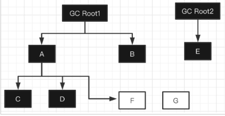

#### 三色标记算法

JVM中的垃圾回收是基于 标记-复制、标记-清除 和 标记-整理 三种模式的，那么其中最重要的其实是如何标记？

1、像Serial、Parallel这类的回收器，无论是单线程标记和多线程标记，其本质采用的是暂停用户线程进行全面标记的算法，这种算法的好处就是标记的很干净，而且实现简单，缺点就是标记时间相对很长，导致STW的时间很长。

2、那么后来就有了并发标记，适用于CMS和G1，并发标记的意思就是 可以在不暂停用户线程的情况下对其进行标记，提高了垃圾回收效率，那么实现这种并发标记的算法就是 三色标记法，三色标记法最大的特点就是可以异步执行，从而可以以中断时间极少的代价或者完全没有中断来进行整个GC。

三色标算法原理

三色标记算法使用的是三种颜色来区分对象的：

1、白色：本对象还没有被标记线程访问过

2、灰色：本对象已经被访问过，但是本对象引用的其他对象还没有被全部访问

3、黑色：本对象已经被访问过，并且本对象引用的其他对象也都被访问过了

 

jvm中三色标记算法大致流程如下所示：

1、刚开始所有对象都是白色

 

2、三色标记初始阶段（标记的初始不是CMS的初始标记），所有GC Roots直接引用（A、B、E）变成灰色，然后将灰色节点放入到一个队列中，GC Roots变成了黑色：

 

3、然后从灰色队列中取出一个灰色对象进行标记，比如A、将他直接引用C、D变成灰色，放入队列，A因为已扫描完它的直接引用对象，所以变成黑色：

 

继续取出灰色对对象，比如取出B对象，将它的直接引用F标记为灰色，放入队列，B对象此时标记为黑色：

 

继续从队列中取出灰色对象E，但是E没有直接引用其他对象，将E标记为黑色：

 

根据上述步骤，取出C 、D 、F 对象进行分析，他们都没有直接引用其他对象，那么就变为黑色：

 

最终分析标记结束后，还有一个G对象是白色，说明此G对象是一个垃圾对象，不可访问，可以被清理掉。

三色标算法弊端

如果整个标记过程是STW的，那么没有任何问题，但是并发标记过程中，用户线程也在运行，那么对象引用关系很可能发生变化，进而就会产生常见的两个问题：

1、浮动垃圾：标记为不是垃圾对象，变成了垃圾

比如垃圾回收线程标记回到上面的这个状态：

 

此时E对象已经被标记为黑色，表示不是垃圾，不会被清除，因为处在并发标记阶段，同一时刻某个用户线将GC Root2和E对象之间的关系断开了（objRoot2.e = null;)，如图：

 

很显然，E对象变为了垃圾对象，但是由于之前被标记为黑色，就不会被当作垃圾回收，这种问题称之为浮动垃圾。

2、漏标、错杀问题：标记为垃圾对象，变成了非垃圾

再回到上面地状态：

 

这里标记线程执行到分析B对象，但是刚好发生线程切换，操作系统调度用户线程来运行，而用户线程先执行A.f = F；那么引用关系变成了：

 

紧接着执行：B.f = null ；那么关系就变成了:

 

用户线程做完上述动作，GC线程重新开始运行，按照之前的流程继续走，从对类中取出B对象，发现对象没有直接引用，那么B对象变成了黑色：

 

接着继续取出 E、C、D 三个灰色对象，他们没有直接引用，那么变为黑色对象：

 

到现在所有对象分析完毕，从图中也可以明显看出问题，就是还在被黑色对象引用的F被标记为白色，那么此时会判断它是垃圾，会被回收清理掉，那程序运行如果需要用到

F对象，将会有问题(空指针异常)。 那怎么处理这些问题？

上述弊端的解决方案

对于第一个问题，即使不去处理也无所谓，大不了等下一次GC的时候再清理。第二个问题就比较严重，分分钟发生空指针异常，出现第二个问题必须满足两个条件：

1、并发标记过程中黑色对象(A)引用了白色对象(F)

2、灰色对象(B)断开了同一个白色对象(F)引用

这样导致了这个白色F对象被错误的回收，只要打破上述中的其中一个条件，就可以有效的避免这种现象，对应的就有两种方案，分别是增量更新（IncrementalUpdate）和原始快照（SATB, Snapshot At The Beginning）。

增量更新（CMS处理方式）

增量更新是站在新增引用对象(A)的角度来解决问题(即破坏条件1)，所谓增量更新就是在赋值操作前添加一个写屏障【屏障可以简单理解为在读写操作前后插入一段代码，用于记录一些信息，保存某些数据等，其概念类似于AOP】，在写屏障中记录新增的引用。上面的例如，并发标记阶段，用户线程执行：A.f = F，那么在写屏障中将新增的这个引用关系记录下来。其实就是，当黑色对象新增一个白色对象的引用时，通过写屏障把这个关系记录下来。然后在重新标记阶段，再以此引用关系的黑色对象为根，再扫描一次，以保证不会漏标。

要实现也很简单，在重新标记阶段直接把A对象变为灰色，放入灰色队列中，再来一次标记分析过程，但是如果此过程用户线程还在继续运行，那么也会有漏标的情况，所以重新标记需要STW，但是这个时间耗时不会太长，因为在并发标记的时候，已经把大部分对象都正确标记了。如果时间还是太长，可以设置在重新标记前，执行一次Minor GC，这个在CMS垃圾回收器中是可以设置参数-XX:+CMSScavengeBeforeRemark。

原始快照（G1 解决方式 SATB）

原始快照是站在减少对象引用(B)的角度来解决问题(即破坏条件2)，所谓原始快照，简单来说，就是赋值操作（B.f = null）,那么在写屏障中，首先会把B.f 记录下来，在进行置空操作，记录下来这个对象就可以称之为原始快照。

记录下来之后呢？很简单，之后直接将他变为黑色，意思就是默认认为它不是垃圾，不需要清理，当然这里的F有可能是垃圾，也有可能不是，如果是垃圾，就当作浮动垃圾，在下次回收的时候处理掉。

 