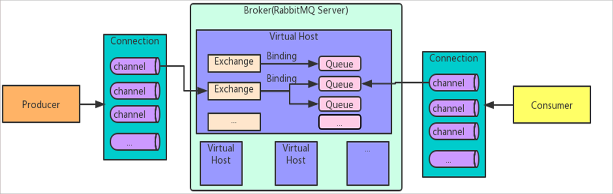
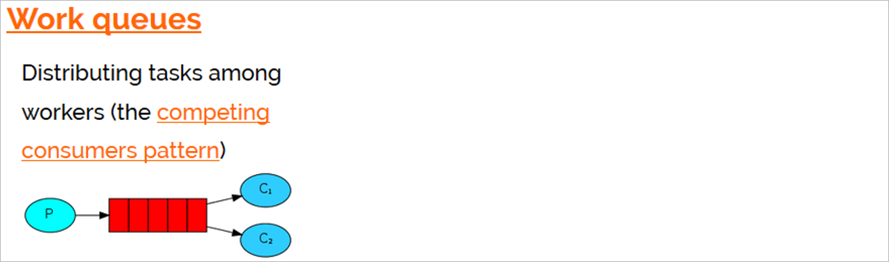
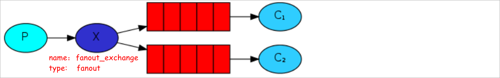
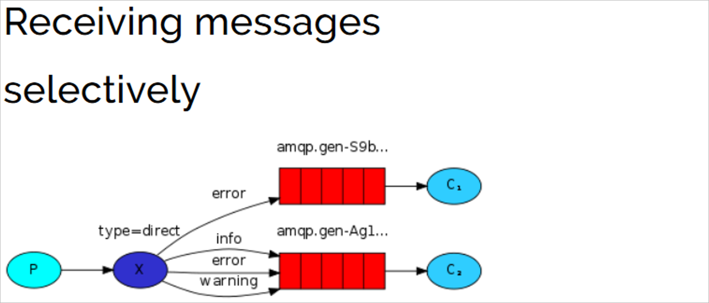
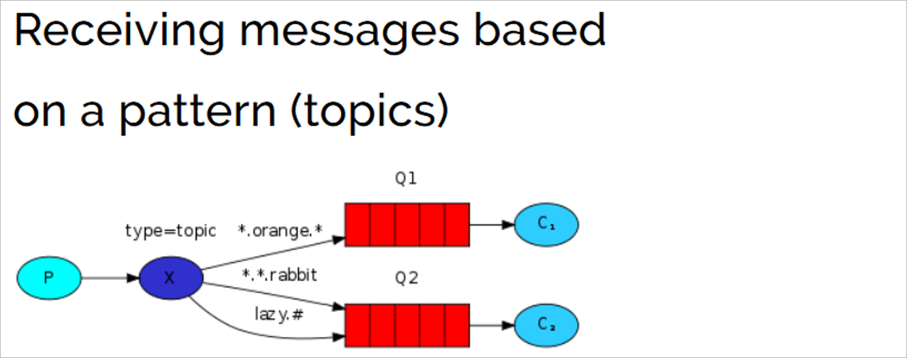
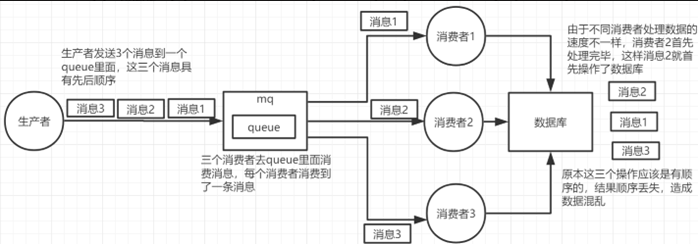
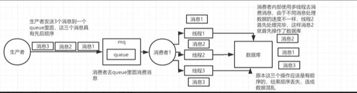
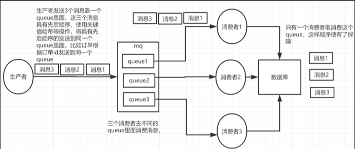
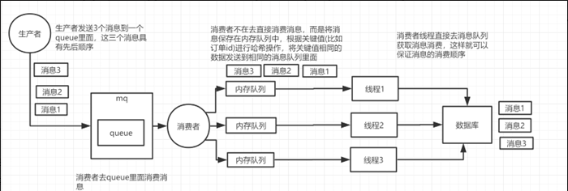

# 消息中间件
消息队列(message queue)简称MQ，是一种以“**先进先出**”的数据结构为基础的消息服务器。
消息：在两个系统要传输的数据
作用：实现消息的传递

原始的数据传递方式

为同步传输存在的弊端：**传输效率较低**。

基于MQ实现消息的传输

属于异步传输    数据传输的消息较高。

## 消息中间件的主要的作用
* **系统解耦**
* **流量消锋**
* **数据分发**

## MQ的优缺点
优点：
1、应用解耦提高了系统的容错性
2、异步通讯提高了系统的响应速度
3、流量消锋提高了系统的并发能力
缺点：
1、系统可用性降低：系统引入的外部依赖越多，系统稳定性越差。一旦MQ宕机，就会对业务造成影响。
2、系统复杂度提高：MQ的加入大大增加了系统的复杂度。

**MQ的选择依据是什么?** 

调用方是否需要获取到被调用方的执行结果，如果需要获取到结果，那么就需要使用同步通讯，如果不需要就可以使用异步通讯。

# Rabbitmq架构

**Broker**：接收和分发消息的应用，RabbitMQ Server就是 Message Broker

**Virtual host**:出于多租户和安全因素设计的，把 AMQP 的基本组件划分到一个虚拟的分组中，类似于网络中的 

namespace 概念。当多个不同的用户使用同一个 RabbitMQ server 提供的服务时，可以划分出多个vhost，每个

用户在自己的 vhost 创建 exchange／queue 等

**Connection**：publisher／consumer 和 broker 之间的 TCP 连接

**Channel**：如果每一次访问 RabbitMQ 都建立一个 Connection，在消息量大的时候建立 TCP Connection的

开销将是巨大的，效率也较低。Channel 是在 connection 内部建立的逻辑连接，如果应用程序支持多线程，通常

每个thread创建单独的 channel 进行通讯，AMQP method 包含了channel id 帮助客户端和message broker 

识别 channel，所以 channel 之间是完全隔离的。Channel 作为轻量级的 Connection 极大减少了操作系统建立 

TCP connection 的开销

**Exchange**：message 到达 broker 的第一站，根据分发规则，匹配查询表中的 routing key，分发消息到

queue 中去。常用的类型有：direct (point-to-point)， 

topic (publish-subscribe) and fanout (multicast)

**Queue**：存储消息的容器，消息最终被送到这里，等待 consumer 取走

**Binding**：exchange 和 queue 之间的虚拟连接，binding 中可以包含 routing key。Binding 信息被保存到 

exchange 中的查询表中，用于 message 的分发依据


### 消息可靠性配置

MQ消息的可靠性，一般需要三个方面一起保证：

1. 生产者不丢数据
2. MQ服务器不丢数据
3. 消费者不丢数据

保证消息不丢失有两种实现方式：

- 开启事务模式
- 消息确认模式（生产者，消费者）

**说明：**开启事务会大幅降低消息发送及接收效率，使用的相对较少，因此我们生产环境一般都采取消息确认模式，以下我们只是讲解消息确认模式

# Rabbitmq消息模型

## 简单队列模型

一个生产者对应一个消费者，这一个消费者从这个队列中消费所有的消息。

**应用场景：** 将发送的电子邮件放到消息队列，然后邮件服务在队列中获取邮件并发送给收件人

生产者

```java
@SpringBootApplication
public class ProducerApplication {

    public static void main(String[] args) {
        SpringApplication.run(ProducerApplication.class , args) ;
    }

}
```
测试类
```java
@SpringBootTest(classes = ProducerApplication.class)
public class Producer01 {

    @Autowired
    private RabbitTemplate rabbitTemplate ;

    @Test
    public void test01() {
        rabbitTemplate.convertAndSend("simple_queue" , "hello rabbitmq...");		// 第一个参数表示的就是队列名称
    }

}
```
消费者
```java
@SpringBootApplication
public class ConsumerApplication {

    public static void main(String[] args) {
        SpringApplication.run(ConsumerApplication.class , args) ;
    }

}
```
监听方法
```java
@Component
public class Consumer01Listener {

    @RabbitListener(queues = "simple_queue")
    public void consumer01(Message message) {
        byte[] body = message.getBody();
        String msg = new String(body);
        System.out.println("msg ----> " + msg);
    }

}
```
## 工作队列模型

Work Queues与入门程序的简单模式相比，多了一个或一些消费端，**多个消费者共同消费同一个队列**中的消息。

**应用场景**：对于任务过重或任务较多情况使用工作队列可以**提高任务处理的速度**。

## 发布订阅模型
消息的传输过程如下所示：

* 生产者发送消息给交换机
* 交换机获取到消息将消息转发给指定的队列
* 消费者监听指定的队列，一旦队列中存在消息，消费者监听方法执行

交换机接收到消息以后到底需要将消息转发给哪一个队列，取决于交换机的类型，常见的交换机的类型

**Fanout**：广播，将将消息交给所有与之绑定队列

**Direct**：路由，把消息交给符合指定routing key 的队列

**Topic**：主题，把消息交给符合routing pattern（路由规则） 的队列

**Exchange（交换机)只负责转发消息，不具备存储消息的能力**，因此如果没有任何队列与Exchange绑定，或

者没有符合路由规则的队列，那么消息会丢失！

### Fanout
简介：fanout类型的交换机会将将消息交给所有与之绑定队列


### Direct



路由模式特点：
1、队列与交换机的绑定的时候需要指定一个或者多个bindingKey(routingKey)

2、生产者发送消息的时候需要指定一个消息的routingKey

3、交换机获取到消息以后需要使用消息的routingKey和bindingKey比对，如果相等就会把消息转发给对应的队列

**Direct Exchange（直连交换机）**：

它根据完全匹配的路由键（Routing Key）将消息路由到绑定的队列。

### Topic

 

主题模式特点：
1、队列与交换机的绑定的时候需要指定一个或者多个bindingKey(routingKey) ， **在bindingKey可以使用通配符**

2、生产者发送消息的时候需要指定一个消息的routingKey

3、交换机获取到消息以后需要使用消息的routingKey和bindingKey规则进行比对，如果routingKey满足

bindingKey的规则就会把消息转发给对应的队列

通配符介绍：
**#**：匹配零个或多个词
*****：匹配不多不少**恰好1**个词

**Headers Exchange（头交换机）**：

- 头交换机不依赖于路由键，而是根据消息的头部属性进行匹配。
- 消息可以包含一组头部属性，队列可以被绑定到交换机上，同时指定一系列的头部匹配条件。
- 如果消息的头部属性满足所有条件，消息将被发送到相应的队列。

# @RabbitListener注解
RabbitListener注解用来声明消费者监听器，可以监听指定的队列，同时也可以声明队列、交换机、队列和交换机绑定信息。

```java
@Component
public class Consumer02Listener {

    @RabbitListener(bindings = @QueueBinding(
            value = @Queue(value = "direct_queue_02" , durable = "true") ,
            exchange = @Exchange(value = "direct_exchange" , durable = "true" , type = ExchangeTypes.DIRECT) ,
            key = { "error" , "info"}
    ))
    public void consumer01(Message message) {
        byte[] body = message.getBody();
        String msg = new String(body);
        System.out.println("consumer02Listener....msg ----> " + msg);
    }

}
```

# 什么情况下队列中的消息会变成死信?

1. **消息TTL（Time To Live）过期**：

   - 如果消息设置了 TTL 属性，当消息在队列中停留的时间超过这个期限时，它就会成为死信。

2. **消息被拒绝（Basic.Reject 或 Basic.Nack）**：

   - 当消费者使用 `basic.reject` 或 `basic.nack` 方法拒绝接收消息，并且将 `requeue` 参数设为 `false` 时，消息不会被重新入队，而是直接变为死信。

3. **队列达到最大长度限制**：

   - 如果队列设置了最大长度（通过 `x-max-length` 或 `x-max-length-bytes` 参数），当队列达到这个限制时，后续的消息会变成死信。

4. **队列被删除或消费者断开连接**：

   - 如果在消息被发布后但还未被消费前，队列被意外删除或消费者断开连接，这也会导致消息变成死信。

   

   为了处理这些死信，RabbitMQ 允许你将一个队列配置为死信交换机（Dead Letter Exchange, DLX）。当消息变成死信时，它会被重新发布到这个 DLX，然后根据 DLX 的配置被进一步处理，例如，可以被发送到另一个队列，或者被丢弃。

# RabbitMQ如何确保消息发送 ？ 消息接收？

**发送方确认机制**：

信道需要设置为 confirm 模式，则所有在信道上发布的消息都会分配一个唯一 ID。

一旦消息被投递到queue（可持久化的消息需要写入磁盘），信道会发送一个确认给生产者（包含消息唯一ID）。如果消息和队列是可持久化的，那么确认消息会在将消息写入磁盘之后发出。

如果 RabbitMQ 发生内部错误从而导致消息丢失，会发送一条 nack（未确认）消息给生产者。

所有被发送的消息都将被 confirm（即 ack） 或者被nack一次。但是没有对消息被 confirm 的快慢做任何保证，并且同一条消息不会既被 confirm又被nack。

发送方确认模式是异步的，生产者应用程序在等待确认的同时，可以继续发送消息。当确认消息到达生产者，生产者的回调方法会被触发来处理该确认消息，如果RabbitMQ因为自身内部错误导致消息丢失，就会发送一条nack消息，生产者应用程序同样可以在回调方法中处理该nack消息。

ConfirmCallback接口：只确认是否正确到达 Exchange 中，成功到达则回调。

ReturnCallback接口：消息失败返回时回调

**接收方确认机制：**

消费者在声明队列时，可以指定noAck参数，当noAck=false时，RabbitMQ会等待消费者显式发回ack信号后才从内存(或者磁盘，持久化消息)中移去消息。否则，消息被消费后会被立即删除。 消费者接收每一条消息后都必须进行确认（消息接收和消息确认是两个不同操作）。只有消费者确认了消息，RabbitMQ 才能安全地把消息从队列中删除。

RabbitMQ不会为未ack的消息设置超时时间，它判断此消息是否需要重新投递给消费者的唯一依据是消费该消息的消费者连接是否已经断开。这么设计的原因是RabbitMQ允许消费者消费一条消息的时间可以很长。保证数据的最终一致性；

如果消费者返回ack之前断开了链接，RabbitMQ 会重新分发给下一个订阅的消费者。（可能存在消息重复消费的隐患，需要去重）；

**消息队列本身**

可以进行消息持久化, 即使rabbitMQ挂了，重启后也能恢复数据

如果要进行消息持久化，那么需要对以下3种实体均配置持久化

a) Exchange

声明exchange时设置持久化（durable = true）并且不自动删除(autoDelete = false)

b) Queue

声明queue时设置持久化（durable = true）并且不自动删除(autoDelete = false)

c) message

发送消息时通过设置deliveryMode=2持久化消息

# RabbitMQ事务消息

**通过对信道的设置实现**

1. channel.txSelect()；通知服务器开启事务模式；服务端会返回Tx.Select-Ok
2. channel.basicPublish；发送消息，可以是多条，可以是消费消息提交ack
3. channel.txCommit()提交事务；
4. channel.txRollback()回滚事务；

**消费者使用事务：**

1. autoAck=false，手动提交ack，以事务提交或回滚为准；
2. autoAck=true，不支持事务的，也就是说你即使在收到消息之后在回滚事务也是于事无补的，队列已经把消息移除了

如果其中任意一个环节出现问题，就会抛出IoException异常，用户可以拦截异常进行事务回滚，或决定要不要重复消息。事务消息会降低rabbitmq的性能。


# RabbitMQ如何实现延迟消息？

RabbitMQ本身并不直接支持延迟消息的功能，但可以通过结合使用RabbitMQ的一些特性来实现延迟消息的效果。下面介绍两种常见的实现方式：

1. 利用消息的过期时间和死信队列（DLX）：这种方式可以通过设置消息的过期时间来实现延迟消息的效果。具体步骤如下：

   - 创建一个普通的交换机和队列用于接收延迟消息。
   - 设置队列的消息过期时间，可以通过设置队列的`x-message-ttl`参数或通过单独设置消息的`expiration`属性。
   - 设置队列的死信交换机和死信路键，将过期的消息发送到指定的死信交换机和路由键。
   - 创建一个死信交换机和队列，用于处理过期的消息。
   - 将队列绑定到死信交换机上，指定合适的路由键。
   - 发送延迟消息时，将消息发送到普通的交换机和队列。

   消息会在指定的过期时间后发送到死信交换机和队列，从而实现延迟消息的效果。

2. 使用RabbitMQ的延迟插件（rabbitmq_delayed_message_exchange）：RabbitMQ社区提供了一个延迟插件，可以直接实现延迟消息的功能。具体步骤如下：

   - 下载并安装rabbitmq_delayed_message_exchange插件。
   - 启用延迟插件，通过RabbitMQ的管理界面或命令行工具进行配置。
   - 创建一个延迟交换机和队列，将延迟插件应用到交换机上。
   - 发送延迟消息时，将消息发送到延迟交换机和队列，同时设置消息的延迟时间。

   延迟交换机会根据消息的延迟时间将消息发送到指定的目标队列，从而实现延迟消息的效果。

需要注意的是，以上两种方式都是通过消息的过期时间来实现延迟消息的，因此在使用时需要根据实际需求和性能考虑合适的延迟时间设置。另外，延迟消息的实现可能会增加系统的复杂性和消息的处理延迟，需要根据具体业务场景进行评估和选择。


# RabbitMQ如何保证消息的顺序性？

消息队列中的若干消息如果是对同一个数据进行操作，这些操作具有前后的关系，必须要按前后的顺序执行，否则就会造成数据异常。举例：
 比如通过mysql binlog进行两个数据库的数据同步，由于对数据库的数据操作是具有顺序性的，如果操作顺序搞反，就会造成不可估量的错误。比如数据库对一条数据依次进行了 插入->更新->删除操作，这个顺序必须是这样，如果在同步过程中，消息的顺序变成了 删除->插入->更新，那么原本应该被删除的数据，就没有被删除，造成数据的不一致问题。

举例场景：

RabbitMQ：

①一个queue，有多个consumer去消费，这样就会造成顺序的错误，consumer从MQ里面读取数据是有序的，但是每个consumer的执行时间是不固定的，无法保证先读到消息的consumer一定先完成操作，这样就会出现消息并没有按照顺序执行，造成数据顺序错误。



②一个queue对应一个consumer，但是consumer里面进行了多线程消费，这样也会造成消息消费顺序错误。



解决方案：

①拆分多个queue，每个queue一个consumer，就是多一些queue而已，确实是麻烦点；这样也会造成吞吐量下降，可以在消费者内部采用多线程的方式取消费。



一个queue对应一个consumer

②或者就一个queue但是对应一个consumer，然后这个consumer内部用内存队列做排队，然后分发给底层不同的worker来处理



一个queue对应一个consumer，采用多线程

# 如何防止RabbitMQ消息重复消费？

# 如何使用RabbitMQ解决分布式事务？

**分布式事务：**不同的服务操作不同的数据源（库或表），保证数据一致性的问题。

**解决：**采用RabbitMQ消息最终一致性的解决方案，解决分布式事务问题。

分布式事务场景：

1、电商项目中的商品库和ES库数据同步问题。

2、电商项目中：支付----订单---库存，一系列操作，进行状态更改等。

在互联网应用中，基本都会有用户注册的功能。在注册的同时，我们会做出如下操作：

收集用户录入信息，保存到数据库向用户的手机或邮箱发送验证码等等…

如果是传统的集中式架构，实现这个功能非常简单：开启一个本地事务，往本地数据库中插入一条用户数据，发送验证码，提交事物。

但是在分布式架构中，用户和发送验证码是两个独立的服务，它们都有各自的数据库，那么就不能通过本地事物保证操作的原子性。这时我们就需要用到 RabbitMQ（消息队列）来为我们实现这个需求。

在用户进行注册操作的时候，我们为该操作创建一条消息，当用户信息保存成功时，把这条消息发送到消息队列。验证码系统会监听消息，一旦接受到消息，就会给该用户发送验证码。

# 如何解决消息队列的延时以及过期失效问题?消息队列满了之后该如何处理?有几百万的消息持续积压几小时,如何解决?

方案分析

该问题,其本质针对的场景，都是说，可能你的消费端出了问题，不消费了，或者消费的极其极其慢。另外还有可能你的消息队列集群的磁盘都快写满了，都没人消费，这个时候怎么办？或者是整个这就积压了几个小时，你这个时候怎么办？或者是你积压的时间太长了，导致比如rabbitmq设置了消息过期时间后就没了怎么办？

所以这种问题线上常见的，一般不出，一出就是大问题，一般常见于，举个例子，消费端每次消费之后要写mysql，结果mysql挂了，消费端挂掉了。导致消费速度极其慢。

分析1+话术

这个是我们真实遇到过的一个场景，确实是线上故障了，这个时候要不然就是修复consumer的问题，让他恢复消费速度，然后傻傻的等待几个小时消费完毕。(可行,但是不建议 在面试的时候说)

一个消费者一秒是1000条，一秒3个消费者是3000条，一分钟是18万条，1000多万条

所以如果你积压了几百万到上千万的数据，即使消费者恢复了，也需要大概1小时的时间才能恢复过来

一般这个时候，只能操作临时紧急扩容了，具体操作步骤和思路如下：

1）先修复consumer的问题，确保其恢复消费速度，然后将现有cnosumer都停掉

2）新建一个topic，partition是原来的10倍，临时建立好原先10倍或者20倍的queue数量

3）然后写一个临时的分发数据的consumer程序，这个程序部署上去消费积压的数据，消费之后不做耗时的处理，直接均匀轮询写入临时建立好的10倍数量的queue

4）接着临时征用10倍的机器来部署consumer，每一批consumer消费一个临时queue的数据

5）这种做法相当于是临时将queue资源和consumer资源扩大10倍，以正常的10倍速度来消费数据

6）等快速消费完积压数据之后，得恢复原先部署架构，重新用原先的consumer机器来消费消息

分析2+话术

rabbitmq是可以设置过期时间的，就是TTL，如果消息在queue中积压超过一定的时间就会被rabbitmq给清理掉，这个数据就没了。那这就是第二个坑了。这就不是说数据会大量积压在mq里，而是大量的数据会直接搞丢。

这个情况下，就不是说要增加consumer消费积压的消息，因为实际上没啥积压，而是丢了大量的消息。我们可以采取一个方案，就是批量重导，这个我们之前线上也有类似的场景干过。就是大量积压的时候，我们当时就直接丢弃数据了，然后等过了高峰期以后，比如大家一起喝咖啡熬夜到晚上12点以后，用户都睡觉了。

这个时候我们就开始写程序，将丢失的那批数据，写个临时程序，一点一点的查出来，然后重新灌入mq里面去，把白天丢的数据给他补回来。也只能是这样了。

假设1万个订单积压在mq里面，没有处理，其中1000个订单都丢了，你只能手动写程序把那1000个订单给查出来，手动发到mq里去再补一次

分析3+话术

如果走的方式是消息积压在mq里，那么如果你很长时间都没处理掉，此时导致mq都快写满了，咋办？这个还有别的办法吗？没有，谁让你第一个方案执行的太慢了，你临时写程序，接入数据来消费，消费一个丢弃一个，都不要了，快速消费掉所有的消息。然后走第二个方案，到了晚上再补数据吧。
