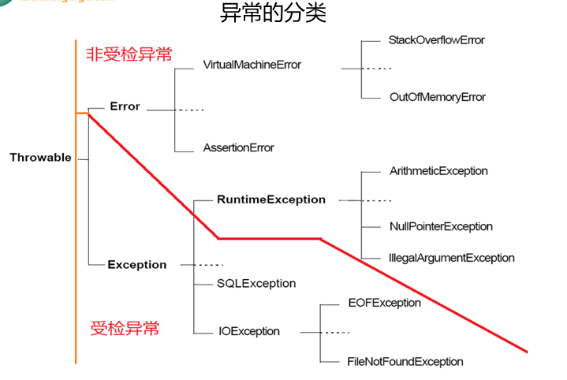

# Java_base

**区分大小写：** Java 是大小写敏感的，因此变量名中的大小写字母被视为不同的符号。
**不以数字开头：** 变量名不能以数字开头，但可以包含数字。
**标识符的组成** :  数字 [0-9]   英文字母大小写    _ [下划线]     $ [符号]    中文
**参考阿里巴巴程序员写代码的程序规范**

# **基本类型**
## 基本数据类型
```java
Java的数据类型的分类 :
	基本数据类型
    引用数据类型[对象]
        
引用数据类型的基本分类 : 
	类 [class] , 接口 [interface] , 数组 [Array] , 枚举 [enum] , 
   注解 [@interface] , 记录 [record]
```

**基本数据类型**

| 基本数据类型名称 | 所占字节数 | 表示数据的范围 |
| --- | --- | --- |
| **整型** |  |  |
| byte [字节] | 1 | [-128,127] |
| short[短整型] | 2 | +-3w多 |
| int[整型] | 4 | +-21亿多 |
| long[长整型] | 8 | 比int多 |
| **浮点型** |  |  |
| float[单精度] | 4 | 比long多 |
| double[双精度] | 8 | 比float多 |
| **字符型** |  |  |
| char | 2 | [0,65535] |
| **布尔型** |  |  |
| boolean | 1 | true,false |

## **包装类类型**
包装类**都继承于**Number类型
基本类型都有对应的包装类型，基本类型与其对应的包装类型之间的赋值使用自动装箱与拆箱完成。	
```java
Integer.parseInt(s)与Integer.valueOf(s)的区别???

Integer.parseInt(s)的作用就是把字符串s解析成有符号的int基本类型。
Integer.valueOf(s)把字符串s解析成Integer对象类型，返回的integer 可以调用对象中的方法。
Integer x = 2;     // 装箱 调用了 Integer.valueOf(2)
int y = x;         // 拆箱 调用了 X.intValue()

```
```java
new Integer(123) 与 Integer.valueOf(123) 的区别???


new Integer(123) 每次都会新建一个对象；
Integer.valueOf(123) 会使用缓存池中的对象，多次调用会取得同一个对象的引用。


Integer x = new Integer(123);
Integer y = new Integer(123);
System.out.println(x == y);    // false
Integer z = Integer.valueOf(123);
Integer k = Integer.valueOf(123);
System.out.println(z == k);   // true


// valueOf() 方法的实现比较简单，就是先判断值是否在缓存池中，如果在的话就直接返回缓存池的内容。
public static Integer valueOf(int i) {
    if (i >= IntegerCache.low && i <= IntegerCache.high)
        return IntegerCache.cache[i + (-IntegerCache.low)];
    return new Integer(i);
}


```
基本类型对应的缓冲池如下：

- boolean values true and false
- all byte values
- short values between -128 and 127
- int values between -128 and 127
- char in the range \u0000 to \u007F

在使用这些基本类型对应的包装类型时，如果该数值范围在缓冲池范围内，就可以直接使用缓冲池中的对象。
## String
### 源码概念
String 被声明为 final，**因此它不可被继承**。(Integer 等包装类也不能被继承）
在 Java 8 中，String 内部使用 char 数组存储数据
```java
public final class String
    implements java.io.Serializable, Comparable<String>, CharSequence {
    /** The value is used for character storage. */
    private final char value[];
}
```
在 Java 9 之后，String 类的实现改用 byte 数组存储字符串，同时使用 coder 来标识使用了哪种编码。
```java
public final class String
    implements java.io.Serializable, Comparable<String>, CharSequence {
    /** The value is used for character storage. */
    private final byte[] value;

    /** The identifier of the encoding used to encode the bytes in {@code value}. */
    private final byte coder;
}
```
value 数组被声明为 final，这意味着 value 数组初始化之后就不能再引用其它数组。并且 String 内部没有改变 value 数组的方法，因此可以保证 String 不可变。
### new String("abc")
使用这种方式一共会创建两个字符串对象（前提是 String Pool 中还没有 "abc" 字符串对象）。

- "abc" 属于字符串字面量，因此编译时期会在 String Pool 中创建一个字符串对象，指向这个 "abc" 字符串字面量；
- 而使用 new 的方式会在堆中创建一个字符串对象。
### **★为什么不可变**
不可变的好处

1. 缓存hash    因为 String 的 hash 值经常被使用，例如 String 用做 HashMap 的 key。不可变的特性可以使得 hash 值也不可变，因此只需要进行一次计算。
2. string pool需要   如果一个 String 对象已经被创建过了，那么就会从 String Pool 中取得引用。只有 String 是不可变的，才可能使用 String Pool。
3. 安全性
4. 线程安全
### **★**String, StringBuffer and StringBuilder
和 String 类不同的是，StringBuffer 和 StringBuilder类的对象能够被多次的修改，并且不产生新的未使用对象。

StringBuilder 类在 Java 5 中被提出，它和 StringBuffer 之间的最大不同在于 StringBuilder 的方法不是线程安全的。

由于 StringBuilder 相较于 StringBuffer 有速度优势，多数情况下建议使用 StringBuilder类。**然而在应用程序要求线程安全的情况下，则必须使用 StringBuffer 类。**

### **★==与equals的区别**
**==  **
**如果是基本数据类型 比较的是数据值**
**如果是引用数据类型 比较的是地址值**
**equals**
**没有被重写 比较的是地址值**
**被重写了 一般我们比较的是内容**

**hashcode 判断哈希值是否相等**
1.equal()相等的两个对象他们的hashCode()肯定相等，也就是用equal()对比是绝对可靠的。**2.hashCode()相等的两个对象他们的equal()不一定相等，也就是hashCode()不是绝对可靠的。

## **★**面试题
**为什么int与float都占4字节 但是范围不一样?**
这是因为它们使用了不同的编码方式和表示方法。
**对于 **`**int**`** 类型，4 字节的内存空间全部用于表示整数值。**

- **符号位：1 位，用于表示正数（0）或负数（1）。**
- **数值位：剩下的 31 位用于表示数值。**

这使得 `int` 类型的数值范围大约是 -2^31 到 2^31-1，即 -2,147,483,648 到 2,147,483,647。

对于 `float` 类型，4 字节的内存空间被分为三个部分：符号位、指数位和尾数位。这是基于 IEEE 754 标准的单精度浮点数表示。

- **符号位**：1 位，同样用于表示正数（0）或负数（1）。
- **指数位**：8 位，用于表示指数部分，可以表示指数的偏移值。
- **尾数位**：剩下的 23 位用于表示小数部分，也称为有效数字。

浮点数的这种表示方式允许它表示一个范围很大的数值，包括非常大和非常小的数，以及小数。但是，由于尾数位只有 23 位，这限制了 `float` 类型能够精确表示的数值范围。`float` 类型的数值范围大约是 1.4E-45 到 3.4E+38。

**单精度和双精度**

单精度和双精度浮点数的主要区别在于它们存储和处理数值的精度和范围。双精度浮点数提供了更高的精度和更大的数值范围，但同时也占用更多的存储空间和计算资源。在选择使用单精度还是双精度时，需要根据具体的应用场景和精度要求来决定。在 Java 中，`double` 是默认的浮点数类型，而 `float` 则需要显式声明

**Java开发中计算金额时使用什么数据类型？**

不能使用float或double，因为精度不高。
使用BigDecimal类替换，可以实现任意精度的数据的运算。

**char型变量中能不能存储一个中文汉字**

可以的。char c1 = '中';        char c2 = 'a';

因为char使用的是unicode字符集，包含了世界范围的所有的字符。一个汉字2个半字节

**为什么Java中0.1 + 0.2结果不是0.3？**

**整数变为二进制，能够做到“每个十进制整数都有对应的二进制数”**，比如数字3，二进制就是11；再比如，数字43就是二进制101011，这个毫无争议。

**对于小数，并不能做到“每个小数都有对应的二进制数字”**。举例来说，二进制小数0.0001表示十进制数0.0625 （至于它是如何计算的，不用深究）；二进制小数0.0010表示十进制数0.125；二进制小数0.0011表示十进制数0.1875。看，对于四位的二进制小数，二进制小数虽然是连贯的，但是十进制小数却不是连贯的。比如，你无法用四位二进制小数的形式表示0.125 ~ 0.1875之间的十进制小数。
采用BigDecimal 来进行0.1+0.2的计算

所以在编程中，遇见小数判断相等情况，比如开发银行、交易等系统，可以采用`四舍五入`或者“`同乘同除`”等方式进行验证，避免上述问题。

# Java 值传递详解
与c++不同 java只有值传递

传递基本类型
```java
public static void main(String[] args) {
    int num1 = 10;
    int num2 = 20;
    swap(num1, num2);
    System.out.println("num1 = " + num1);
    System.out.println("num2 = " + num2);
}

public static void swap(int a, int b) {
    int temp = a;
    a = b;
    b = temp;
    System.out.println("a = " + a);
    System.out.println("b = " + b);
}

// a = 20
// b = 10
// num1 = 10
// num2 = 20
```

传递引用类型
```java
  public static void main(String[] args) {
      int[] arr = { 1, 2, 3, 4, 5 };
      System.out.println(arr[0]);
      change(arr);
      System.out.println(arr[0]);
  }

  public static void change(int[] array) {
      // 将数组的第一个元素变为0
      array[0] = 0;
  }
// 1
// 0
```
实际上，这里传递的还是值，不过，这个值是实参的地址罢了！
也就是说 change 方法的参数拷贝的是 arr （实参）的地址，因此，它和 arr 指向的是同一个数组对象。这也就说明了为什么方法内部对形参的修改会影响到实参。


传递引用类型2
```java
public class Person {
    private String name;
   // 省略构造函数、Getter&Setter方法
}

public static void main(String[] args) {
    Person xiaoZhang = new Person("小张");
    Person xiaoLi = new Person("小李");
    swap(xiaoZhang, xiaoLi);
    System.out.println("xiaoZhang:" + xiaoZhang.getName());
    System.out.println("xiaoLi:" + xiaoLi.getName());
}

public static void swap(Person person1, Person person2) {
    Person temp = person1;
    person1 = person2;
    person2 = temp;
    System.out.println("person1:" + person1.getName());
    System.out.println("person2:" + person2.getName());
}

// person1:小李
// person2:小张
// xiaoZhang:小张
// xiaoLi:小李
```

真正的引用传递
```java
#include <iostream>

void incr(int& num)
{
    std::cout << "incr before: " << num << "\n";
    num++;
    std::cout << "incr after: " << num << "\n";
}

int main()
{
    int age = 10;
    std::cout << "invoke before: " << age << "\n";
    incr(age);
    std::cout << "invoke after: " << age << "\n";
}


// invoke before: 10
// incr before: 10
// incr after: 11
// invoke after: 11
```


# Lambda
## Lambda

Lambda 表达式本质上是一个对象，跟其他任何我们使用过的对象一样， 我们可以将 Lambda 表达式赋值给变量并进行传递和使用。

```java
(形参列表) -> {Lambda体}
```
### 匹配Lambda 与接口的规则

- 接口是否只有一个抽象（未实现）方法，即是一个函数式接口
- lambda 表达式的参数是否与抽象方法的参数匹配
- lambda 表达式的返回类型是否与单个方法的返回类型匹配
### 函数式接口
**只有一个抽象方法的接口被称为函数是式接口**，从 Java 8 开始，Java 接口中可以包含默认方法和静态方法。默认方法和静态方法都有直接在接口声明中定义的实现。这意味着，Java lambda 表达式可以实现拥有多个方法的接口——只要接口中只有一个未实现的抽象方法就行。
### Lambda表达式的简化
```java
// 表达式的方法不带参数
() -> System.out.println("Zero parameter lambda");
// 表达式的方法接受一个参数
(param) -> System.out.println("One parameter: " + param);
// 只接收单个参数时，参数列表外的小括号也可以省略掉。
param -> System.out.println("One parameter: " + param);
// 如果 Lambda 表达式的方法体需要由多行组成
(oldState, newState) -> {
    System.out.println("Old state: " + oldState);
    System.out.println("New state: " + newState);
}
//  Lambda 表达式所做的只是计算返回值并返回它
(a1, a2) -> { a1 > a2; }

```


### 方法引用的语法格式：
#### **双冒号 :: 向 Java 的编译器指明这是一个方法的引用。**

- 静态方法
- 参数对象的实例方法
- 实例方法
- 类的构造方法
#### 引用构造器
当Lambda表达式是创建一个对象，并且满足Lambda表达式形参，正好是给创建这个对象的构造器的实参列表，就可以使用构造器引用：
```java
ClassName::new

// 假设我们有这样一个函数式接口
public interface Factory {
    public String create(char[] val);
}
// Factory 接口的 create() 方法与 String 类中的其中一个构造方法的签名相匹配
// 因此，String类的该构造方法也可以用作 Lambda 表达式。
Factory factory = String::new;
// 等同于 Factory factory (chars) -> String.new(chars);
```
#### 引用静态方法
```java
public interface Finder {
    public int find(String s1, String s2);
}

public class MyClass{
    public static int doFind(String s1, String s2){
        return s1.lastIndexOf(s2);
    }
}
// Lambda 直接引用 Myclass 的 doFind 方法。
Finder finder = MyClass::doFind;
```
#### 引用参数的方法
```java
// Lambda 直接转发调用的方法是来自参数的方法
public interface Finder {
    public int find(String s1, String s2);
}

Finder finder = String::indexOf;
// Finder finder = (s1, s2) -> s1.indexOf(s2);
```

#### 引用实例方法
```java
public interface Deserializer {
    public int deserialize(String v1);
}

public class StringConverter {
    public int convertToInt(String v1){
        return Integer.valueOf(v1);
    }
}


StringConverter stringConverter = new StringConverter();

Deserializer des = stringConverter::convertToInt;
// 等同于 Deserializer des = (value) -> stringConverter.convertToInt(value)


```
## Stream Api
Java 8 Stream是一个基于集合（Collection）的元素处理框架，它提供了一种流式处理（stream processing）的方式，可以方便地进行数据过滤、映射、聚合等操作
### Stream特点

1. 延迟执行（lazy evaluation）：Stream中的操作并不会立即执行，而是在需要的时候才执行，这样可以减少不必要的计算。
2. 内部迭代（internal iteration）：Stream使用迭代器（Iterator）遍历集合，不需要手动编写循环代码。
3. 不可变性（immutability）：Stream不会修改原有的数据，而是返回新的Stream对象。
4. 并行处理（parallel processing）：Stream可以并行处理数据，充分利用多核处理器的性能。
### Stream 的操作三个步骤
1- 创建 Stream：可以通过集合、数组、文件等方式创建Stream。
2- 中间操作：对Stream进行一系列中间操作，如filter、map、flatMap、distinct等，这些操作会返回新的Stream对象。
3- 终止操作：如forEach、reduce、collect等，这些操作会触发Stream的计算。

#### 创建stream流
| stream() | 创建出一个新的stream串行流对象 |
| --- | --- |
| parallelStream() | 创建出一个可并行执行的stream流对象 |
| Stream.of() | 通过给定的一系列元素创建一个新的Stream串行流对象 |

#### 中间操作
| filter() | 按照条件过滤符合要求的元素， 返回新的stream流 |
| --- | --- |
| map() | 将已有元素转换为另一个对象类型，一对一逻辑，返回新的stream流 |
| flatMap() | 将已有元素转换为另一个对象类型，一对多逻辑，即原来一个元素对象可能会转换为1个或者多个新类型的元素，返回新的stream流 |
| limit() | 仅保留集合前面指定个数的元素，返回新的stream流 |
| skip() | 跳过集合前面指定个数的元素，返回新的stream流 |
| concat() | 将两个流的数据合并起来为1个新的流，返回新的stream流 |
| distinct() | 对Stream中所有元素进行去重，返回新的stream流 |
| sorted() | 对stream中所有的元素按照指定规则进行排序，返回新的stream流 |
| peek() | 对stream流中的每个元素进行逐个遍历处理，返回处理后的stream流 |

#### 终止操作
| count() | 返回stream处理后最终的元素个数 |
| --- | --- |
| max() | 返回stream处理后的元素最大值 |
| min() | 返回stream处理后的元素最小值 |
| findFirst() | 找到第一个符合条件的元素时则终止流处理 |
| findAny() | 找到任何一个符合条件的元素时则退出流处理，这个对于串行流时与findFirst相同，对于并行流时比较高效，任何分片中找到都会终止后续计算逻辑 |
| anyMatch() | 返回一个boolean值，类似于isContains(),用于判断是否有符合条件的元素 |
| allMatch() | 返回一个boolean值，用于判断是否所有元素都符合条件 |
| noneMatch() | 返回一个boolean值， 用于判断是否所有元素都不符合条件 |
| collect() | 将流转换为指定的类型，通过Collectors进行指定 |
| toArray() | 将流转换为数组 |
| iterator() | 将流转换为Iterator对象 |
| foreach() | 无返回值，对元素进行逐个遍历，然后执行给定的处理逻辑 |

### 常用情景
#### 生成集合
```java
public void testCollectStopOptions() {
    List<Dept> ids = Arrays.asList(new Dept(17), new Dept(22), new Dept(23));
    // collect成list
    List<Dept> collectList = ids.stream().filter(dept -> dept.getId() > 20)
            .collect(Collectors.toList());
    System.out.println("collectList:" + collectList);
    // collect成Set
    Set<Dept> collectSet = ids.stream().filter(dept -> dept.getId() > 20)
            .collect(Collectors.toSet());
    System.out.println("collectSet:" + collectSet);
    // collect成HashMap，key为id，value为Dept对象
    Map<Integer, Dept> collectMap = ids.stream().filter(dept -> dept.getId() > 20)
            .collect(Collectors.toMap(Dept::getId, dept -> dept));
    System.out.println("collectMap:" + collectMap);
}
```
#### 生成拼接字符串
```java
public void testCollectJoinStrings() {
    List<String> ids = Arrays.asList("205", "10", "308", "49", "627", "193", "111", "193");
    String joinResult = ids.stream().collect(Collectors.joining(","));
    System.out.println("拼接后：" + joinResult);
}
// 拼接后：205,10,308,49,627,193,111,193
```
#### 数据批量数学运算
```java
public void testNumberCalculate() {
    List<Integer> ids = Arrays.asList(10, 20, 30, 40, 50);
    // 计算平均值
    Double average = ids.stream().collect(Collectors.averagingInt(value -> value));
    System.out.println("平均值：" + average);
    // 数据统计信息
    IntSummaryStatistics summary = ids.stream().collect(Collectors.summarizingInt(value -> value));
    System.out.println("数据统计信息： " + summary);
}
```
## Optional类
Java 8中引入了一个新的类Optional，用于解决NullPointerException问题和使代码更加健壮。
 Optional类代表一个值可能存在也可能不存在的容器。
它可以用于任何类型的对象，并提供了一些有用的方法来处理可能为空的值。

Optional实际上是个容器：它可以保存类型T的值，或者仅仅保存null。

### Optional特点

1. 避免空指针异常： Optional 类可以帮助我们避免空指针异常，因为如果一个值不存在， Optional 类会返回一个空对象，而不是抛出空指针异常。
2. 方便的API： Optional 类提供了一系列方便的API，用于处理可能存在或不存在的值。这些API包括 orElse() 、 orElseGet() 、orElseThrow()等方法。
3. 函数式编程支持： Optional 类支持函数式编程，可以轻松地与Java 8中的Lambda表达式和Stream API结合使用。
4. 不可变性：Optional类是不可变的，一旦创建了一个 Optional 对象，它的值就不能被修改。
5. 可以通过工厂方法创建： Optional 类提供了静态工厂方法，如 of() 、 ofNullable() 等，可以方便地创建 Optional 对象。
6. 可以嵌套使用：Optional 类可以嵌套使用，以表示嵌套的可能存在或不存在的值。
### 创建Optional对象
（1）static  Optional empty() ：用来创建一个空的Optional
（2）static  Optional of(T value) ：用来创建一个非空的Optional
（3）static  Optional ofNullable(T value) ：用来创建一个可能是空，也可能非空的Optional

### 常用场景

1. 判断Optional容器中的值是否存在，如果存在，就对它进行Consumer指定的操作，如果不存在就不做

（1）boolean isPresent()  ：判断Optional容器中的值是否存在
（2）void ifPresent(Consumer<? super T> consumer) 

2. 获取 Optional 对象中的值

（1）T get()  ：要求Optional容器必须非空            T get()与of(T value)使用是安全的

3. 替代if-else方法

  (1) T orElse(T other)  ：        orElse(T other) 与ofNullable(T value)配合使用，

如果Optional容器中非空，就返回所包装值，如果为空，就用orElse(T other)other指定的默认值（备胎）代替

（2）T orElseGet(Supplier<? extends T> other)  ：

如果Optional容器中非空，就返回所包装值，如果为空，就用Supplier接口的Lambda表达式提供的值代替

（3） T orElseThrow(Supplier<? extends X> exceptionSupplier)

如果Optional容器中非空，就返回所包装值，如果为空，就抛出你指定的异常类型代替原来的NoSuchElementException

4. 转换 Optional 对象中的值

Optional map(Function<? super T,? extends U> mapper)
判断Optional容器中的值是否存在，如果存在，就对它进行Function接口指定的操作，如果不存在就不做

5. 过滤 Optional 对象中的值：

Optional<\T> filter(Predicate<? super T> predicate)
判断Optional容器中的值是否符合条件进行过滤

6.  Optional 对象为空时执行操作

public void ifPresentOrElse(Consumer<? super T> action, Runnable emptyAction)

```java
package com.impower.optional;

import java.util.Optional;

import org.junit.Test;

public class TestOptional {
    @Test
    public void test9(){
        String str = "Hello1";
        Optional<String> opt = Optional.ofNullable(str);
        //判断是否是纯字母单词，如果是，转为大写，否则保持不变
        String result = opt.filter(s->s.matches("[a-zA-Z]+"))
                .map(s -> s.toUpperCase()).orElse(str);
        System.out.println(result);
    }


    @Test
    public void test8(){
        String str = null;
        Optional<String> opt = Optional.ofNullable(str);
        String string = opt.orElseThrow(()->new RuntimeException("值不存在"));
        System.out.println(string);
    }


    @Test
    public void test7(){
        String str = null;
        Optional<String> opt = Optional.ofNullable(str);
        String string = opt.orElseGet(String::new);
        System.out.println(string);
    }

    @Test
    public void test6(){
        String str = "hello";
        Optional<String> opt = Optional.ofNullable(str);
        String string = opt.orElse("impower");
        System.out.println(string);
    }

    @Test
    public void test5(){
        String str = null;
        Optional<String> opt = Optional.ofNullable(str);
//		System.out.println(opt.get());//java.util.NoSuchElementException: No value present
    }

    @Test
    public void test4(){
        String str = "hello";
        Optional<String> opt = Optional.of(str);

        String string = opt.get();
        System.out.println(string);
    }


    @Test
    public void test3(){
        String str = null;
        Optional<String> opt = Optional.ofNullable(str);
        System.out.println(opt);
    }

    @Test
    public void test2(){
        Optional<String> opt = Optional.empty();
        System.out.println(opt);
    }

    @Test
    public void test1(){
        String str = "hello";
        Optional<String> opt = Optional.of(str);
        System.out.println(opt);
    }
}
```

# 反射

## 反射的概念

Java程序中，所有的对象都有两种类型：编译时类型和运行时类型，而很多时候对象的编译时类型和运行时类型不一致。

例如：某些变量或形参的类型是Object类型，但是程序却需要调用该对象运行时类型的方法，该方法不是Object中的方法，那么如何解决呢？

为了解决这些问题，程序需要在运行时发现对象和类的真实信息，现在有两种方案：

方案1：在编译和运行时都完全知道类型的具体信息，在这种情况下，我们可以直接先使用instanceof运算符进行判断，再利用强制类型转换符将其转换成运行时类型的变量即可。

方案2：编译时根本无法预知该对象和类的真实信息，程序只能依靠运行时信息来发现该对象和类的真实信息，这就必须使用反射。

因为加载完类之后，就产生了一个Class类型的对象，并将引用存储到方法区，那么每一个类在方法区内存都可以找到唯一Class对象与之对应，这个对象包含了完整的类的结构信息，我们可以通过这个对象获取类的结构。这种机制就像一面镜子，Class对象像是类在镜子中的镜像，通过观察这个镜像就可以知道类的结构，所以，把这种机制形象地称为反射机制。

非反射：类（原物）-->类信息

反射：Class对象（镜像）-->类（原物）

### 获取Class对象的四种方式

（1）类型名.class              要求编译期间已知类型

（2）对象.getClass()            获取对象的运行时类型

（3）Class.forName(类型全名称)                可以获取编译期间未知的类型

（4）ClassLoader的类加载器对象.loadClass(类型全名称)    可以用系统类加载对象或自定义加载器对象加载指定路径下的类型

### 类的加载过程

当程序主动使用某个类时，如果该类还未被加载到内存中，系统会通过加载、连接、初始化三个步骤来对该类进行初始化，如果没有意外，JVM将会连续完成这三个步骤，所以有时也把这三个步骤统称为类加载。

类的加载又分为三个阶段：

（1）加载：load              就是指将类型的class字节码数据读入内存

（2）连接：link

①验证：校验合法性等

②准备：准备对应的内存（方法区），创建Class对象，为类变量赋默认值，为静态常量赋初始值。

③解析：把字节码中的符号引用替换为对应的直接地址引用

（3）初始化：initialize（类初始化）即执行类初始化方法，大多数情况下，类的加载就完成了类的初始化，有些情况下，会延迟类的初始化。


### 类初始化

1、哪些操作会导致类的初始化？

（1）运行主方法所在的类，要先完成类初始化，再执行main方法

（2）第一次使用某个类型就是在new它的对象，此时这个类没有初始化的话，先完成类初始化再做实例初始化

（3）调用某个类的静态成员（类变量和类方法），此时这个类没有初始化的话，先完成类初始化

（4）子类初始化时，发现它的父类还没有初始化的话，那么先初始化父类

（5）通过反射操作某个类时，如果这个类没有初始化，也会导致该类先初始化

> 类初始化执行的是()，该方法由（1）类变量的显式赋值代码（2）静态代码块中的代码构成


## 反射的基本应用

### 获取类型的详细信息

可以获取：包、修饰符、类型名、父类（包括泛型父类）、父接口（包括泛型父接口）、成员（属性、构造器、方法）、注解（类上的、方法上的、属性上的）

### 创建任意引用类型的对象

两种方式：

1、直接通过Class对象来实例化（要求必须有公共的无参构造）

2、通过获取构造器对象来进行实例化

方式一的步骤：

（1）获取该类型的Class对象（2）创建对象

方式二的步骤：

（1）获取该类型的Class对象（2）获取构造器对象（3）创建对象

> 如果构造器的权限修饰符修饰的范围不可见，也可以调用setAccessible(true)


### 操作任意类型的属性

（1）获取该类型的Class对象

Class clazz = Class.forName("包.类名");

（2）获取属性对象

Field field = clazz.getDeclaredField("属性名");

（3）如果属性的权限修饰符不是public，那么需要设置属性可访问

field.setAccessible(true);

（4）创建实例对象：如果操作的是非静态属性，需要创建实例对象

Object obj = clazz.newInstance(); //有公共的无参构造

Object obj = 构造器对象.newInstance(实参...);//通过特定构造器对象创建实例对象

（4）设置属性值

field.set(obj,"属性值");

> 如果操作静态变量，那么实例对象可以省略，用null表示


（5）获取属性值

Object value = field.get(obj);

> 如果操作静态变量，那么实例对象可以省略，用null表示


### 调用任意类型的方法

（1）获取该类型的Class对象

Class clazz = Class.forName("包.类名");

（2）获取方法对象

Method method = clazz.getDeclaredMethod("方法名",方法的形参类型列表);

（3）创建实例对象

Object obj = clazz.newInstance();

（4）调用方法

Object result = method.invoke(obj, 方法的实参值列表);

> 如果方法的权限修饰符修饰的范围不可见，也可以调用setAccessible(true)
>  
> 如果方法是静态方法，实例对象也可以省略，用null代替


注解是以“**@注释名**”在代码中存在的，还可以添加一些参数值，例如：

```java
@SuppressWarnings(value=”unchecked”)
@Override
@Deprecated
```

注解Annotation是从JDK5.0开始引入。

虽然说注解也是一种注释，因为它们都不会改变程序原有的逻辑，只是对程序增加了某些注释性信息。不过它又不同于单行注释和多行注释，对于单行注释和多行注释是给程序员看的，而注解是可以被编译器或其他程序读取的一种注释，程序还可以根据注解的不同，做出相应的处理。所以注解是插入到代码中以便有工具可以对它们进行处理的标签。

一个完整的注解应该包含三个部分：
（1）声明
（2）使用
（3）读取

此外，从Java 9开始，`getDeclared`系列方法被标记为过时（deprecated），这意味着在未来的Java版本中可能会被移除。不过，目前它们仍然是访问类声明元素的主要方式。如果你的代码需要在Java 9或更高版本中运行，建议使用`Class<T>.getDeclaredFields()`和`Class<T>.getDeclaredMethods()`的替代方法，如`Class<T>.getFields()`和`Class<T>.getMethods()`，这些方法不会过时，但它们只返回公共（public）的字段和方法。

# 自定义注解

## 声明自定义注解
```java
【元注解】
【修饰符】 @interface 注解名{
    【成员列表】
}

/**
* 水果供应者注解
*/
@Target(FIELD)
@Retention(RUNTIME)
@Documented
public @interface FruitProvider {
    public int id() default -1;
    public String name() default "";
    public String address() default "";
}
public class Apple {
    @FruitProvider(id = 1,name = "xx",address="xxx")
    private String appleProvider;
```
## 自定义注解类编写的规则

- 自定义注解可以通过四个元注解
   - @Retention,
   -  ●   RetentionPolicy.SOURCE : 在编译阶段丢弃。它们不会写入字节码。@Override, @SuppressWarnings都属于这类注解。
  ●   RetentionPolicy.CLASS : 在类加载的时候丢弃。在字节码文件的处理中有用。注解默认使用这种方式
  ●   RetentionPolicy.RUNTIME : 始终不会丢弃，运行期也保留该注解，因此可以使用反射机制读取该注解的信息。自定义的注解通常使用这种方式。
   - @Target，
   -  ● ElementType.CONSTRUCTOR: 用于描述构造器
  ● ElementType.FIELD: 成员变量、对象、属性（包括enum实例）
  ● ElementType.LOCAL_VARIABLE: 用于描述局部变量
  ● ElementType.METHOD: 用于描述方法
  ● ElementType.PACKAGE: 用于描述包
  ● ElementType.PARAMETER: 用于描述参数
  ● ElementType.TYPE: 用于描述类、接口(包括注解类型) 或enum声明
   - @Inherited,
   - @Documented，
- 分别说明它的声明周期，使用位置，是否被继承，是否被生成到API文档中。

1. Annotation 型定义为@interface, 所有的Annotation 会自动继承java.lang.Annotation这一接口,并且不能再去继承别的类或是接口.
2. 参数成员只能用public 或默认(default) 这两个访问权修饰
3. 参数成员只能用基本类型byte、short、char、int、long、float、double、boolean八种基本数据类型和String、Enum、Class、annotations等数据类型，以及这一些类型的数组.
4. 要获取类方法和字段的注解信息，必须通过Java的反射技术来获取 Annotation 对象，因为你除此之外没有别的获取注解对象的方法
5. 注解也可以没有定义成员,

# 异常
## 个人理解

个人认为，程序中的错误可以分为三大类：

- **系统错误** 。这类错误是程序运行环境的问题，一般我们都无法避免，对于这类错误，有些我们是可以处理的，比如请求网络异常，这个我们可以重试几次，而有些是我们无法处理的，比如内存耗尽 OOM 了、栈溢出等等，这种我们就只能停止运行，甚至退出整个程序。
- **程序错误** 。这类错误一般都是我们程序的 bug，比如空指针，文件未创建，逻辑计算错误，对于这种错误，我们必须要记录下来，而且最好是触发监控系统告警。
- **用户错误** 。比如用户输入非法参数，重复请求，一般这类的错误属于用户应用层错误，对于这类错误，我们只需要提示用户即可，没有必要记录日志，但是我们可以做一些必要的统计，比如某个用户频繁输入非法参数，不断进行错误请求，我们可以将这些用户纳入黑名单等，这样有利于我们改善系统和侦测是否有恶意的用户请求。

对于这三种错误，我们需要进行区分，不同的异常分类有不同的处理级别。

- **系统错误** ：尽可能的预见异常，在能处理的地方需要进行处理，不能处理的往外抛
- **程序错误** ：我们需要尽可能杜绝，记录每一个程序处理异常，进行必要的告警。
- **用户错误** ：参数校验必须，严谨将错误参数带入系统。我们无法避免，只能适当统计和侦测。

同时，我不建议系统中定义太多自定义 Exception，

**解决方法**

- **统一分类的错误字典** 。无论你是使用错误码还是异常捕捉，都需要认真并统一地做好错误的分类。最好是在一个地方定义相关的错误。比如，HTTP 的 4XX 表示客户端有问题，5XX 则表示服务端有问题。也就是说，你要建立一个错误字典。
- **同类错误的定义最好是可以扩展的** 。这一点非常重要，而对于这一点，通过面向对象的继承或是像 Go 语言那样的接口多态可以很好地做到。这样可以方便地重用已有的代码。
- **定义错误的严重程度** 。比如，Fatal 表示重大错误，Error 表示资源或需求得不到满足，Warning 表示并不一定是个错误但还是需要引起注意，Info 表示不是错误只是一个信息，Debug 表示这是给内部开发人员用于调试程序的。
- **错误日志的输出最好使用错误码，而不是错误信息** 。打印错误日志的时候，应该使用统一的格式。但最好不要用错误信息，而应使用相应的错误码，错误码不一定是数字，也可以是一个能从错误字典里找到的一个唯一的可以让人读懂的关键字。这样，会非常有利于日志分析软件进行自动化监控，而不是要从错误信息中做语义分析。比如：HTTP 的日志中就会有 HTTP 的返回码，如：404。但我更推荐使用像PageNotFound这样的标识，这样人和机器都很容易处理。
- **忽略错误最好有日志** 。不然会给维护带来很大的麻烦。
- **对于同一个地方不停的报错，最好不要都打到日志里** 。不然这样会导致其它日志被淹没了，也会导致日志文件太大。最好的实践是，打出一个错误以及出现的次数。不要用错误处理逻辑来处理业务逻辑。也就是说，不要使用异常捕捉这样的方式来处理业务逻辑，而是应该用条件判断。如果一个逻辑控制可以用 if - else 清楚地表达，那就不建议使用异常方式处理。异常捕捉是用来处理不期望发生的事情，而错误码则用来处理可能会发生的事。
- **对于同类的错误处理，用一样的模式** 。比如，对于null对象的错误，要么都用返回 null，加上条件检查的模式，要么都用抛 NullPointerException 的方式处理。不要混用，这样有助于代码规范。
- **尽可能在错误发生的地方处理错误** 。因为这样会让调用者变得更简单。向上尽可能地返回原始的错误。如果一定要把错误返回到更高层去处理，那么，应该返回原始的错误，而不是重新发明一个错误。
- **处理错误时，总是要清理已分配的资源** 。这点非常关键，使用 RAII 技术，或是 try-catch-finally，或是 Go 的 defer 都可以容易地做到。
- **不推荐在循环体里处理错误** 。这里说的是 try-catch，绝大多数的情况你不需要这样做。
- **最好把整个循环体外放在 try 语句块内，而在外面做 catch** 。不要把大量的代码都放在一个 try 语句块内。一个 try 语句块内的语句应该是完成一个简单单一的事情。
- **为你的错误定义提供清楚的文档以及每种错误的代码示例** 。如果你是做 RESTful API 方面的，使用 Swagger 会帮你很容易搞定这个事。
- **对于异步的方式，推荐使用 Promise** 模式处理错误。对于这一点，JavaScript 中有很好的实践。
- **对于分布式的系统，推荐使用 APM 相关的软件** 。尤其是使用 Zipkin 这样的服务调用跟踪的分析来关联错误。

> **异常应该出现在它应该出现的地方** 。


## 异常的分类

### ★Exception & Error
在Java中，异常的继承体系是基于`Throwable`类的。所有的异常和错误都是`Throwable`类的子类。

- **Exception** :程序本身可以处理的异常，可以通过 catch 来进行捕获。Exception 又可以分为 Checked Exception (受检查异常，必须处理) 和 Unchecked Exception (不受检查异常，可以不处理)。
- **Error**：Error 属于程序无法处理的错误 ，不建议通过catch捕获 。例如 Java 虚拟机运行错误（Virtual MachineError）、虚拟机内存不够错误(OutOfMemoryError)、类定义错误（NoClassDefFoundError）等 。这些异常发生时，Java 虚拟机（JVM）一般会选择线程终止。

### ★Checked Exception  &  Unchecked Exception
**Checked Exception** 即 受检查异常 ，Java 代码在编译过程中，如果受检查异常没有被 catch或者throws 关键字处理的话，就没办法通过编译。
**Unchecked Exception** 即 **不受检查异常** ，Java 代码在编译过程中 ，我们即使不处理不受检查异常也可以正常通过编译。
RuntimeException 及其子类都统称为非受检查异常，常见的有

- NullPointerException(空指针错误)
- IllegalArgumentException(参数错误比如方法入参类型错误)
- NumberFormatException（字符串转换为数字格式错误，IllegalArgumentException的子类）
- ArrayIndexOutOfBoundsException（数组越界错误）
- ClassCastException（类型转换错误）
- ArithmeticException（算术错误）
- SecurityException （安全错误比如权限不够）
- UnsupportedOperationException(不支持的操作错误比如重复创建同一用户)
## 异常的处理方式

```java
 * 
 *  1. 捕获
 *      try {
 *          
 *      } catch (异常的类型 引用) {
 *         
 *      } catch (异常类型2 引用) {
 *
 *      } catch (异常类型3 引用) {
 *
 *      }.... {
 *
 *      } finally {
 *          一定会执行的语句. 在这里通常要写释放不在GC区中的资源的代码. 通常是向OS申请的硬件资源, 必须要释放, 否则会形成资源泄露(resource leak)
 *      }
 *
 *      组合 :
 *      try catch finally
 *      try catch
 *      try finally
 *
 *  2 抛出
 *      在方法中使用语句throw可以抛出异常对象, throw一旦执行, 方法就提前直接结束了, 会让调用者难受.
 处理方式选择 :
 *      功能方法(被调用的方法) 通常是要抛出异常, 用于提醒调用者此方法无法正确继续, 请作出决策
 *      入口方法(栈底的方法) 通常是要捕获异常, 防止栈出问题

       子类重写方法抛出的受检异常不能大于等于父类方法抛出的异常.

    3. try块：用于捕获异常。其后可接零个或多个 catch 块，如果没有 catch 块，则必须跟一个 finally 块。
     catch块：用于处理 try 捕获到的异常。
     finally 块：无论是否捕获或处理异常，finally 块里的语句都会被执行。
     
     当在 try 块或 catch 块中有到 return 语句时，finally 语句块将在方法返回之前被执行。
     当finally中也有return时 try/catch中的return会被finally中的return值替换

 */
```

## ★throw与throws的区别

-  `**throw**`**关键字**： 
-  用法：`throw`关键字用于在方法或代码块内部显式地抛出异常。 
-  异常类型：可以抛出任何类型的异常，包括检查型异常（checked exceptions）和非检查型异常（unchecked exceptions）。 
-  语法：`throw`后面跟着要抛出的异常实例。 
-  异常传播：`throw`关键字不能用于传播检查型异常，它主要用于抛出非检查型异常。 
-  示例：`throw new IOException("File not found");` 
-  `**throws**`**关键字**： 
-  用法：`throws`关键字用于方法签名中，声明方法可能抛出的异常。 
-  异常类型：可以声明方法可能抛出的检查型异常和非检查型异常。 
-  语法：`throws`后面跟着可能抛出的异常类名，多个异常类名之间用逗号分隔。 
-  异常传播：`throws`关键字用于传播检查型异常，它允许异常在调用堆栈中向上传播。 
-  示例：`public void readFile() throws IOException, SQLException { ... }` 

总结来说，`throw`用于在代码中显式抛出异常，而`throws`用于声明方法可能抛出的异常。`throw`可以抛出任何类型的异常，但不能用于传播检查型异常；而`throws`则专用于声明和传播检查型异常。这两个关键字的使用场景和目的不同，它们共同构成了Java中异常处理的基础

## 自定义异常

**为什么需要自定义异常类:**

我们说了Java中不同的异常类,分别表示着某一种具体的异常情况,那么在开发中总是有些异常情况是核心类库中没有定义好的，此时我们需要根据自己业务的异常情况来定义异常类。例如年龄负数问题，考试成绩负数问题等等。

**异常类如何定义:**

1. 自定义一个编译时异常类型：自定义类 并继承`java.lang.Exception`。
2. 自定义一个运行时异常类型：自定义类 并继承`java.lang.RuntimeException`。

注意自定义的异常只能通过throw抛出。

自定义异常：

（1）要继承一个异常类型

（2）建议大家提供至少两个构造器，一个是无参构造，一个是(String message)构造器

（3）自定义异常对象只能手动抛出。抛出后由try..catch处理，也可以甩锅throws给调用者处理。

**演示自定义异常：**

```java
package com.impower.define;

public class NotTriangleException extends Exception{
    public NotTriangleException() {
    }

    public NotTriangleException(String message) {
        super(message);
    }
}
package com.impower.define;

public class Triangle {
    private double a;
    private double b;
    private double c;

    public Triangle(double a, double b, double c) throws NotTriangleException {
        if(a<=0 || b<=0 || c<=0){
            throw new NotTriangleException("三角形的边长必须是正数");
        }
        if(a+b<=c || b+c<=a || a+c<=b){
            throw new NotTriangleException(a+"," + b +"," + c +"不能构造三角形，三角形任意两边之后必须大于第三边");
        }
        this.a = a;
        this.b = b;
        this.c = c;
    }

    public double getA() {
        return a;
    }

    public void setA(double a) throws NotTriangleException{
        if(a<=0){
            throw new NotTriangleException("三角形的边长必须是正数");
        }
        if(a+b<=c || b+c<=a || a+c<=b){
            throw new NotTriangleException(a+"," + b +"," + c +"不能构造三角形，三角形任意两边之后必须大于第三边");
        }
        this.a = a;
    }

    public double getB() {
        return b;
    }

    public void setB(double b) throws NotTriangleException {
        if(b<=0){
            throw new NotTriangleException("三角形的边长必须是正数");
        }
        if(a+b<=c || b+c<=a || a+c<=b){
            throw new NotTriangleException(a+"," + b +"," + c +"不能构造三角形，三角形任意两边之后必须大于第三边");
        }
        this.b = b;
    }

    public double getC() {
        return c;
    }

    public void setC(double c) throws NotTriangleException {
        if(c<=0){
            throw new NotTriangleException("三角形的边长必须是正数");
        }
        if(a+b<=c || b+c<=a || a+c<=b){
            throw new NotTriangleException(a+"," + b +"," + c +"不能构造三角形，三角形任意两边之后必须大于第三边");
        }
        this.c = c;
    }

    @Override
    public String toString() {
        return "Triangle{" +
                "a=" + a +
                ", b=" + b +
                ", c=" + c +
                '}';
    }
}
package com.impower.define;

public class TestTriangle {
    public static void main(String[] args) {
        Triangle t = null;
        try {
            t = new Triangle(2,2,3);
            System.out.println("三角形创建成功：");
            System.out.println(t);
        } catch (NotTriangleException e) {
            System.err.println("三角形创建失败");
            e.printStackTrace();
        }

        try {
            if(t != null) {
                t.setA(1);
            }
            System.out.println("三角形边长修改成功");
        } catch (NotTriangleException e) {
            System.out.println("三角形边长修改失败");
            e.printStackTrace();
        }
    }
}
```

# IO流

- InputStream/Reader: 所有的输入流的基类，前者是字节输入流，后者是字符输入流。
- OutputStream/Writer: 所有输出流的基类，前者是字节输出流，后者是字符输出流。
## **字节流**

一切文件数据(文本、图片、视频等)在存储时，都是以二进制数字的形式保存，都一个一个的字节，那么传输时一样如此。所以，字节流可以传输任意文件数据。在操作流的时候，我们要时刻明确，无论使用什么样的流对象，底层传输的始终为二进制数据。
### inputStream
InputStream用于从源头（通常是文件）读取数据（字节信息）到内存中，
java.io.InputStream抽象类是所有字节输入流的父类。
### OutputStream
OutputStream用于将数据（字节信息）写入到目的地（通常是文件），
java.io.OutputStream抽象类是所有字节输出流的父类。

## **字符流**

当使用字节流读取文本文件时，可能会有一个小问题。就是遇到中文字符时，可能不会显示完整的字符，那是因为一个中文字符可能占用多个字节存储。所以Java提供一些字符流类，以字符为单位读写数据，专门用于处理文本文件。
### Reader
Reader用于从源头（通常是文件）读取数据（字符信息）到内存中，
java.io.Reader抽象类是所有字符输入流的父类。
Reader 用于读取文本， InputStream 用于读取原始字节
### Writer
Writer用于将数据（字符信息）写入到目的地（通常是文件），
java.io.Writer抽象类是所有字符输出流的父类。


## **缓存流**

缓冲流,也叫高效流，按照数据类型分类：

- **字节缓冲流**：`BufferedInputStream`，`BufferedOutputStream`
- **字符缓冲流**：`BufferedReader`，`BufferedWriter`

缓冲流的基本原理，是在创建流对象时，会创建一个内置的默认大小的缓冲区数组，通过缓冲区读写，减少系统IO次数，从而提高读写的效率。
### BufferedInputStream
BufferedInputStream 从源头（通常是文件）读取数据（字节信息）到内存的过程中不会一个字节一个字节的读取，而是会先将读取到的字节存放在缓存区，并从内部缓冲区中单独读取字节。这样大幅减少了 IO 次数，提高了读取效率。

BufferedInputStream 内部维护了一个缓冲区，这个缓冲区实际就是一个字节数组
```java
public
class BufferedInputStream extends FilterInputStream {
    // 内部缓冲区数组
    protected volatile byte buf[];
    // 缓冲区的默认大小
    private static int DEFAULT_BUFFER_SIZE = 8192;
    // 使用默认的缓冲区大小
    public BufferedInputStream(InputStream in) {
        this(in, DEFAULT_BUFFER_SIZE);
    }
    // 自定义缓冲区大小
    public BufferedInputStream(InputStream in, int size) {
        super(in);
        if (size <= 0) {
            throw new IllegalArgumentException("Buffer size <= 0");
        }
        buf = new byte[size];
    }
}
// 缓冲区的大小默认为 8192 字节
// 也可以通过 BufferedInputStream(InputStream in, int size) 这个构造方法来指定缓冲区的大小
```
### BufferedOutputStream
BufferedOutputStream 将数据（字节信息）写入到目的地（通常是文件）的过程中不会一个字节一个字节的写入，而是会先将要写入的字节存放在缓存区，并从内部缓冲区中单独写入字节.
## **转换流**
InputStreamReader类
OutputStreamWriter类
## **对象流和数据流**

- DataOutputStream：数据输出流允许应用程序以适当方式将基本 Java 数据类型写入输出流中。然后，应用程序可以使用数据输入流（DataInputStream）将数据读入。
- DataInputStream：数据输入流允许应用程序以与机器无关方式从底层输入流中读取基本 Java 数据类型。
- ObjectOutputStream：将 Java 基本数据类型和对象写入字节输出流中。稍后可以使用 ObjectInputStream 将数据读入。通过在流中使用文件可以实现Java各种基本数据类型的数据以及对象的持久存储。如果流是网络套接字流，则可以在另一台主机上或另一个进程中接收这些数据或重构对象。
- ObjectInputStream：ObjectInputStream 对以前使用 ObjectOutputStream 写入的基本数据和对象进行反序列化。
## System.out
System.out 实际是用于获取一个 PrintStream 对象，print方法实际调用的是 PrintStream 对象的 write 方法。PrintStream 是 OutputStream 的子类，
## File 
File 类不能访问文件内容本身，如果需要访问文件内容本身，则需要使用输入/输出流。
File 类提供了如下三种形式构造方法。

1. File(String path)：如果 path 是实际存在的路径，则该 File 对象表示的是目录；如果 path 是文件名，则该 File 对象表示的是文件。
2. File(String path, String name)：path 是路径名，name 是文件名。
3. File(File dir, String name)：dir 是路径对象，name 是文件名。

```java
//常用方法
boolean canRead();   //测试应用程序是否能从指定的文件中进行读取
boolean canWrite();
boolean delete();
boolean exists();
long lastModified();	//返回当前 File 对象表示的文件最后修改的时间
long length();		//返回当前 File 对象表示的文件长度
boolean mkdir();		//创建一个目录，它的路径名由当前 File 对象指定
boolean mkdirs();     //创建一个目录，它的路径名由当前 File 对象指定
boolean renameTo(File);    //将当前 File 对象指定的文件更名为给定参数 File 指定的路径名
String[] list(FilenameFilter);//返回当前 File 对象指定的目录中满足指定过滤器的文件列表

public FileWriter(File file,boolean append); //创建文件输出流以写入由指定的 File对象表示的文件。  
public FileWriter(String fileName,boolean append);//创建文件输出流以指定的名称写入文件。  
flush; //刷新缓冲区，流对象可以继续使用。
close;  //先刷新缓冲区，然后通知系统释放资源。流对象不可以再被使用了。
```

File 类中有以下两个常用常量：

- public static final String pathSeparator：指的是分隔连续多个路径字符串的分隔符，Windows 下指`;`。例如 `java -cp test.jar;abc.jar HelloWorld`。
- public static final String separator：用来分隔同一个路径字符串中的目录的，Windows 下指`/`。例如 `C:/Program Files/Common Files`。

## 序列化与反序列化

Java 提供了一种对象**序列化**的机制。用一个字节序列可以表示一个对象，该字节序列包含该`对象的类型`和`对象中存储的属性`等信息。字节序列写出到文件之后，相当于文件中**持久保存**了一个对象的信息。

反之，该字节序列还可以从文件中读取回来，重构对象，对它进行**反序列化**。`对象的数据`、`对象的类型`和`对象中存储的数据`信息，都可以用来在内存中创建对象。看图理解序列化：


**从本质上来说，序列化就是将对象的状态和相关描述信息按照一定的格式写入到字节流中，而反序列化则是从字节流中重建这个对象。**

### 为什么需要 Java 序列化和反序列化呢？有两个原因：

1. 持久化。即将该对象保存到磁盘中。一般来说我们是不需要持久化 Java 对象的，但是如果遇到特殊情况，我们需要将 Java 对象持久化到磁盘中，以便于我们在重启 JVM 时可以重建这些 Java 对象。所以我们可以通过序列化的方式将 Java 对象转换成字节流，然后将这些字节流保存到磁盘中实现持久化。在我们应用程序重启时，可以读取这些字节流进行反序列化还原 Java 对象。
2. 网络传输：我们都知道网络上传输的对象是二进制字节流，我们是无法传输一个 Java 对象给一个应用的，所以在传输前我们需要对 Java 对象进行序列化将其转换为字节流。而接收方则根据字节流中所包含的信息重建该 Java 对象。

### 序列化方法

ObjectOutputStream流中支持序列化的方法是：

- `public final void writeObject (Object obj)` : 将指定的对象写出。

ObjectInputStream流中支持反序列化的方法是：

- `public final Object readObject ()` : 读取一个对象。

### Serializable序列化接口与transient关键字

类必须实现`java.io.Serializable` 接口，`Serializable` 是一个标记接口，不实现此接口的类将不会使任何状态序列化或反序列化，会抛出`NotSerializableException` 。

- 如果对象的某个属性也是引用数据类型，那么如果该属性也要序列化的话，也要实现`Serializable` 接口
- 该类的所有属性必须是可序列化的。如果有一个属性不需要可序列化的，则该属性必须注明是瞬态的，使用`transient` 关键字修饰。
- 静态变量的值不会序列化。因为静态变量的值不属于某个对象。

### 反序列化失败问题

首先，**对于JVM可以反序列化对象，它必须是能够找到class文件的类。如果找不到该类的class文件，则抛出一个 **`**ClassNotFoundException**`** 异常。**

其次，当JVM反序列化对象时，能找到class文件，但是class文件在序列化对象之后发生了修改，那么反序列化操作也会失败，抛出一个`InvalidClassException`异常。发生这个异常的原因如下：

- 该类的序列版本号与从流中读取的类描述符的版本号不匹配
- 该类包含未知数据类型

`Serializable` 接口给需要序列化的类，提供了一个序列版本号。`serialVersionUID` 该版本号的目的在于验证序列化的对象和对应类是否版本匹配。如果没有声明serialVersionUID，则每次编译都会产生新的serialVersionUID序列化版本ID值，这样如果在序列化完成之后修改了类导致类重新编译，则原来的数据将无法反序列化。所以通常我们都会在实现Serializable接口时，声明一个serialVersionUID，并为其指定一个值。serialVersionUID必须是static和final修饰的long类型的数据，它的值由程序员随意指定即可。

如果声明了serialVersionUID，即使在序列化完成之后修改了类导致类重新编译，则原来的数据也能正常反序列化，只是新增的字段值是默认值而已。

**单例被反序列化破坏，就让单例实现**`**_readResolve()_**`**方法，返回同一个对象即可**
## 

# 网络编程

**C/S结构** ：全称为Client/Server结构，是指客户端和服务器结构。常见程序有ＱＱ、迅雷等
**B/S结构** ：全称为Browser/Server结构，是指浏览器和服务器结构。常见浏览器有IE、谷歌、火狐等。

两种架构各有优势，但是无论哪种架构，都离不开网络的支持。**网络编程**，就是在一定的协议下，实现两台计算机的通信的程序。

## 网络编程三要素
### IP地址和域名
### 端口号
唯一标识设备中的进程
**端口号：用两个字节表示的整数，它的取值范围是0~65535**。 

- 公认端口：0~1023。被预先定义的服务通信占用，如：HTTP（80），FTP（21），Telnet（23）
- 注册端口：1024~49151。分配给用户进程或应用程序。如：Tomcat（8080），MySQL（3306），Oracle（1521）。
- 动态/ 私有端口：49152~65535。
### 网络通信协议
## 网络编程API
### InetAddress类
InetAddress类主要表示IP地址，两个子类：Inet4Address、Inet6Address。
Internet上的主机有两种方式表示地址：

- 域名(hostName)：www.impower.com
- IP 地址(hostAddress)：202.108.35.210

lInetAddress 类没有提供公共的构造器，而是提供 了 如下几个 静态方法来获取InetAddress 实例

- public static InetAddress getLocalHost()
- public static InetAddress getByName(String host)
- public static InetAddress getByAddress(byte[] addr)

InetAddress 提供了如下几个常用的方法

- public String getHostAddress() ：返回 IP 地址字符串（以文本表现形式）。
- public String getHostName() ：获取此 IP 地址的主机名

```java
package com.impower.ip;

import java.net.InetAddress;
import java.net.UnknownHostException;

import org.junit.Test;

public class TestInetAddress {
    @Test
    public void test01() throws UnknownHostException{
        InetAddress localHost = InetAddress.getLocalHost();
        System.out.println(localHost);
    }

    @Test
    public void test02()throws UnknownHostException{
        InetAddress impower = InetAddress.getByName("www.impower.com");
        System.out.println(impower);
    }

    @Test
    public void test03()throws UnknownHostException{
//		byte[] addr = {112,54,108,98};
        byte[] addr = {(byte)192,(byte)168,24,56};
        InetAddress impower = InetAddress.getByAddress(addr);
        System.out.println(impower);
    }
}
```

### Socket分类

通信的两端都要有Socket（也可以叫“套接字”），是两台机器间通信的端点。网络通信其实就是Socket间的通信。Socket可以分为：

- 流套接字（stream socket）：使用TCP提供可依赖的字节流服务 
   - ServerSocket：此类实现TCP服务器套接字。服务器套接字等待请求通过网络传入。
   - Socket：此类实现客户端套接字（也可以就叫“套接字”）。套接字是两台机器间通信的端点。
- 数据报套接字（datagram socket）：使用UDP提供“尽力而为”的数据报服务 
   - DatagramSocket：此类表示用来发送和接收UDP数据报包的套接字。
### Socket相关类API
#### ServerSocket类
**ServerSocket类的构造方法：**

- ServerSocket(int port) ：创建绑定到特定端口的服务器套接字。

**ServerSocket类的常用方法：**

- Socket accept()：侦听并接受到此套接字的连接。
#### Sokcet类

**Socket类的常用构造方法**：

- public Socket(InetAddress address,int port)：创建一个流套接字并将其连接到指定 IP 地址的指定端口号。
- public Socket(String host,int port)：创建一个流套接字并将其连接到指定主机上的指定端口号。

**Socket类的常用方法**：

- public InputStream getInputStream()：返回此套接字的输入流，可以用于接收消息
- public OutputStream getOutputStream()：返回此套接字的输出流，可以用于发送消息
- public InetAddress getInetAddress()：此套接字连接到的远程 IP 地址；如果套接字是未连接的，则返回 null。
- public InetAddress getLocalAddress()：获取套接字绑定的本地地址。
- public int getPort()：此套接字连接到的远程端口号；如果尚未连接套接字，则返回 0。
- public int getLocalPort()：返回此套接字绑定到的本地端口。如果尚未绑定套接字，则返回 -1。
- public void close()：关闭此套接字。套接字被关闭后，便不可在以后的网络连接中使用（即无法重新连接或重新绑定）。需要创建新的套接字对象。 关闭此套接字也将会关闭该套接字的 InputStream 和 OutputStream。
- public void shutdownInput()：如果在套接字上调用 shutdownInput() 后从套接字输入流读取内容，则流将返回 EOF（文件结束符）。 即不能在从此套接字的输入流中接收任何数据。
- public void shutdownOutput()：禁用此套接字的输出流。对于 TCP 套接字，任何以前写入的数据都将被发送，并且后跟 TCP 的正常连接终止序列。 如果在套接字上调用 shutdownOutput() 后写入套接字输出流，则该流将抛出 IOException。 即不能通过此套接字的输出流发送任何数据。

**注意：**先后调用Socket的shutdownInput()和shutdownOutput()方法，仅仅关闭了输入流和输出流，并不等于调用Socket的close()方法。在通信结束后，仍然要调用Scoket的close()方法，因为只有该方法才会释放Socket占用的资源，比如占用的本地端口号等。

#### DatagramSocket

**DatagramSocket 类的常用方法：**

- public DatagramSocket(int port)创建数据报套接字并将其绑定到本地主机上的指定端口。套接字将被绑定到通配符地址，IP 地址由内核来选择。
- public DatagramSocket(int port,InetAddress laddr)创建数据报套接字，将其绑定到指定的本地地址。本地端口必须在 0 到 65535 之间（包括两者）。如果 IP 地址为 0.0.0.0，套接字将被绑定到通配符地址，IP 地址由内核选择。
- public void close()关闭此数据报套接字。
- public void send(DatagramPacket p)从此套接字发送数据报包。DatagramPacket 包含的信息指示：将要发送的数据、其长度、远程主机的 IP 地址和远程主机的端口号。
- public void receive(DatagramPacket p)从此套接字接收数据报包。当此方法返回时，DatagramPacket 的缓冲区填充了接收的数据。数据报包也包含发送方的 IP 地址和发送方机器上的端口号。 此方法在接收到数据报前一直阻塞。数据报包对象的 length 字段包含所接收信息的长度。如果信息比包的长度长，该信息将被截短。

#### DatagramPacket类

**DatagramPacket类的常用方法：**

- public DatagramPacket(byte[] buf,int length)构造 DatagramPacket，用来接收长度为 length 的数据包。 length 参数必须小于等于 buf.length。
- public DatagramPacket(byte[] buf,int length,InetAddress address,int port)构造数据报包，用来将长度为 length 的包发送到指定主机上的指定端口号。length 参数必须小于等于 buf.length。
- public int getLength()返回将要发送或接收到的数据的长度。

## TCP网络编程

### 通信模型

Java语言的基于套接字TCP编程分为服务端编程和客户端编程，其通信模型如图所示：


### 开发步骤

服务器端程序包含以下四个基本的 步骤：

- 调用 ServerSocket(int port)  ：创建一个服务器端套接字，并绑定到指定端口上。用于监听客户端的请求。
- 调用 accept() ：监听连接请求，如果客户端请求连接，则接受连接，返回通信套接字对象。
- 调用  该Socket 类对象的 getOutputStream()  和 getInputStream () ：获取输出流和输入流，开始网络数据的发送和接收。
- 关闭Socket 对象：客户端访问结束，关闭通信套接字。

客户端程序包含以下四个基本的步骤 ：

- 创建 Socket ：根据指定服务端的 IP 地址或端口号构造 Socket 类对象。若服务器端响应，则建立客户端到服务器的通信线路。若连接失败，会出现异常。
- 打开连接到 Socket  的输入/ 出流： 使用 getInputStream()方法获得输入流，使用getOutputStream()方法获得输出流，进行数据传输
- 按照一定的协议对 Socket 进行读/ 写操作：通过输入流读取服务器放入线路的信息（但不能读取自己放入线路的信息），通过输出流将信息写入线路。
- 关闭 Socket ：断开客户端到服务器的连接，释放线路

## UDP网络编程

UDP(User Datagram Protocol，用户数据报协议)：是一个无连接的传输层协议、提供面向事务的简单不可靠的信息传送服务，类似于短信。

###  通信模型

UDP协议是一种**面向非连接**的协议，面向非连接指的是在正式通信前不必与对方先建立连接，不管对方状态就直接发送，至于对方是否可以接收到这些数据内容，UDP协议无法控制，因此说，UDP协议是一种**不可靠的**协议。无连接的好处就是快，省内存空间和流量，因为维护连接需要创建大量的数据结构。UDP会尽最大努力交付数据，但不保证可靠交付，没有TCP的确认机制、重传机制，如果因为网络原因没有传送到对端，UDP也不会给应用层返回错误信息。

UDP协议是面向数据报文的信息传送服务。UDP在发送端没有缓冲区，对于应用层交付下来的报文在添加了首部之后就直接交付于ip层，不会进行合并，也不会进行拆分，而是一次交付一个完整的报文。比如我们要发送100个字节的报文，我们调用一次send()方法就会发送100字节，接收方也需要用receive()方法一次性接收100字节，不能使用循环每次获取10个字节，获取十次这样的做法。

UDP协议没有拥塞控制，所以当网络出现的拥塞不会导致主机发送数据的速率降低。虽然UDP的接收端有缓冲区，但是这个缓冲区只负责接收，并不会保证UDP报文的到达顺序是否和发送的顺序一致。因为网络传输的时候，由于网络拥塞的存在是很大的可能导致先发的报文比后发的报文晚到达。如果此时缓冲区满了，后面到达的报文将直接被丢弃。这个对实时应用来说很重要，比如：视频通话、直播等应用。

因此UDP适用于一次只传送少量数据、对可靠性要求不高的应用环境，数据报大小限制在64K以下。


### 开发步骤

发送端程序包含以下四个基本的 步骤：

- 创建DatagramSocket ：默认使用系统随机分配端口号。
- 创建DatagramPacket：将要发送的数据用字节数组表示，并指定要发送的数据长度，接收方的IP地址和端口号。
- 调用  该DatagramSocket 类对象的 send方法 ：发送数据报DatagramPacket对象。
- 关闭DatagramSocket 对象：发送端程序结束，关闭通信套接字。

接收端程序包含以下四个基本的步骤 ：

- 创建DatagramSocket ：指定监听的端口号。
- 创建DatagramPacket：指定接收数据用的字节数组，起到临时数据缓冲区的效果，并指定最大可以接收的数据长度。
- 调用  该DatagramSocket 类对象的receive方法 ：接收数据报DatagramPacket对象。。
- 关闭DatagramSocket ：接收端程序结束，关闭通信套接字。

# Effective java

## 1.用静态工厂方法替代构造器

- 静态工厂方法与构造器不同的第一优势在于，它们有名字
- 不用每次被调用时都创建新对象
- 可以返回原返回类型的子类
- 在创建带泛型的实例时，能使代码变得简洁

```java
//for example
Fragment fragment = MyFragment.newIntance();
    // or 
Calendar calendar = Calendar.getInstance();
    // or 
Integer number = Integer.valueOf("3");
```

for example:

```java
class Child{
    int age = 10;
    int weight = 30;
    public static Child newChild(int age, int weight) {
        Child child = new Child();
        child.weight = weight;
        child.age = age;
        return child;
    }
    public static Child newChildWithWeight(int weight) {
        Child child = new Child();
        child.weight = weight;
        return child;
    }
    public static Child newChildWithAge(int age) {
        Child child = new Child();
        child.age = age;
        return child;
    }
}
```

## 2.遇到多个构造器参数时要考虑用构建器

```java
public class NutritionFacts {
    private final int servingSize;
    private final int servings;
    private final int calories;
    private final int fat;
    private final int sodium;
    private final int carbohydrate;


    public static class Builder {
        //必须注入的参数，可不用初始化
        private final int servingSize;
        private final int servings;

        //可选择注入的参数
        private int calories = 0;
        private int fat = 0;
        private int sodium = 0;
        private int carbohydrate = 0;

        public Builder(int servingSize, int servings) {
            this.servingSize = servingSize;
            this.servings = servings;
        }

        public Builder setCalories(int calories) {
            this.calories = calories;
            return this;
        }

        public Builder calories(int val) {
            this.calories = val;
            return this;
        }

        public Builder carbohydrate(int val) {
            this.carbohydrate = val;
            return this;
        }

        public Builder sodium(int val) {
            this.sodium = val;
            return this;
        }

        public NutritionFacts build() {
            return new NutritionFacts(this);
        }
    }

    @Override
    public String toString() {
        return "NutritionFacts{" +
                "servingSize=" + servingSize +
                ", servings=" + servings +
                ", calories=" + calories +
                ", fat=" + fat +
                ", sodium=" + sodium +
                ", carbohydrate=" + carbohydrate +
                '}';
    }

    //私有构造方法
    private NutritionFacts(Builder builder) {
        servingSize = builder.servingSize;
        servings = builder.servings;
        calories = builder.calories;
        fat = builder.fat;
        sodium = builder.sodium;
        carbohydrate = builder.carbohydrate;
    }
    
    public static void main(String[] args) {
        NutritionFacts bean = new NutritionFacts.
                Builder(8, 20)
                .calories(30)
                .build();
    }
}
```
### 3.使用 clone() 方法来拷贝一个对象即复杂又有风险，它会抛出异常，并且还需要类型转换。最好不要去使用 clone()，可以使用拷贝构造函数或者拷贝工厂来拷贝一个对象。

```java
public class CloneConstructorExample {

    private int[] arr;

    public CloneConstructorExample() {
        arr = new int[10];
        for (int i = 0; i < arr.length; i++) {
            arr[i] = i;
        }
    }

    public CloneConstructorExample(CloneConstructorExample original) {
        arr = new int[original.arr.length];
        for (int i = 0; i < original.arr.length; i++) {
            arr[i] = original.arr[i];
        }
    }

    public void set(int index, int value) {
        arr[index] = value;
    }

    public int get(int index) {
        return arr[index];
    }
}


CloneConstructorExample e1 = new CloneConstructorExample();
CloneConstructorExample e2 = new CloneConstructorExample(e1);
e1.set(2, 222);
System.out.println(e2.get(2)); // 2

```
