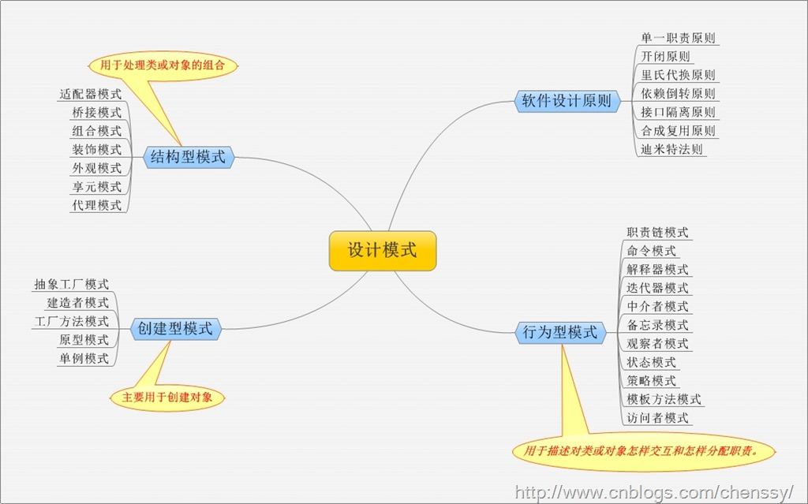

1995 年，GoF（Gang of Four，四人组/四人帮）合作出版了《设计模式：可复用面向对象软件的基础》一书，共收录了 23 种设计模式，从此树立了软件设计模式领域的里程碑，人称「GoF设计模式

要掌握设计模式我们除了要掌握基本的面向对象理论外，还需要掌握如下两个知识点：

1. 7 种设计原则
2. 23 种设计模式

# 7 种设计原则

### 1、单一职责原则

一个类，只有一个引起它变化的原因。应该只有一个职责。每一个职责都是变化的一个轴线，如果一个类有一个以上的职责，这些职责就耦合在了一起。这会导致脆弱的设计。当一个职责发生变化时，可能会影响其它的职责。另外，多个职责耦合在一起，会影响复用性。例如：要实现逻辑和界面的分离。from：百度百科

### 2、开闭原则（Open Close Principle）

开闭原则就是说对扩展开放，对修改关闭。在程序需要进行拓展的时候，不能去修改原有的代码，实现一个热插拔的效果。所以一句话概括就是：为了使程序的扩展性好，易于维护和升级。想要达到这样的效果，我们需要使用接口和抽象类，后面的具体设计中我们会提到这点。

### 3、里氏代换原则（Liskov Substitution Principle）

里氏代换原则(Liskov Substitution Principle LSP)面向对象设计的基本原则之一。 里氏代换原则中说，任何基类可以出现的地方，子类一定可以出现。 LSP是继承复用的基石，只有当衍生类可以替换掉基类，软件单位的功能不受到影响时，基类才能真正被复用，而衍生类也能够在基类的基础上增加新的行为。里氏代换原则是对“开-闭”原则的补充。实现“开-闭”原则的关键步骤就是抽象化。而基类与子类的继承关系就是抽象化的具体实现，所以里氏代换原则是对实现抽象化的具体步骤的规范。from：百度百科

### 4、依赖倒转原则（Dependence Inversion Principle）

所谓依赖倒置原则（Dependence Inversion Principle）就是要依赖于抽象，不要依赖于具体。简单的说就是要求对抽象进行编程，不要对实现进行编程，这样就降低了客户与实现模块间的耦合。

实现开闭原则的关键是抽象化，并且从抽象化导出具体化实现，如果说开闭原则是面向对象设计的目标的话，那么依赖倒转原则就是面向对象设计的主要手段。 from：百度百科

### 5、接口隔离原则（Interface Segregation Principle）

这个原则的意思是：使用多个隔离的接口，比使用单个接口要好。还是一个降低类之间的耦合度的意思，从这儿我们看出，其实设计模式就是一个软件的设计思想，从大型软件架构出发，为了升级和维护方便。所以上文中多次出现：降低依赖，降低耦合。

### 6、合成复用原则（Composite Reuse Principle）

合成复用原则就是指在一个新的对象里通过关联关系（包括组合关系和聚合关系）来使用一些已有的对象，使之成为新对象的一部分；新对象通过委派调用已有对象的方法达到复用其已有功能的目的。简言之：要尽量使用组合/聚合关系，少用继承。

### 7、迪米特法则（最少知道原则）（Demeter Principle）

为什么叫最少知道原则，就是说：一个实体应当尽量少的与其他实体之间发生相互作用，使得系统功能模块相对独立。也就是说一个软件实体应当尽可能少的与其他实体发生相互作用。这样，当一个模块修改时，就会尽量少的影响其他的模块，扩展会相对容易，这是对软件实体之间通信的限制，它要求限制软件实体之间通信的宽度和深度。

# 23 of Method

### 1、抽象工厂模式(Abstract Factory)

所谓抽象工厂模式就是她提供一个接口，用于创建相关或者依赖对象的家族，而不需要明确指定具体类。他允许客户端使用抽象的接口来创建一组相关的产品，而不需要关系实际产出的具体产品是什么。这样一来，客户就可以从具体的产品中被解耦。它的优点是隔离了具体类的生成，使得客户端不需要知道什么被创建了，而缺点就在于新增新的行为会比较麻烦，因为当添加一个新的产品对象时，需要更加需要更改接口及其下所有子类

### 2、建造者模式(Builder)

对于建造者模式而已，它主要是将一个复杂对象的构建与表示分离，使得同样的构建过程可以创建不同的表示。适用于那些产品对象的内部结构比较复杂。

建造者模式将复杂产品的构建过程封装分解在不同的方法中，使得创建过程非常清晰，能够让我们更加精确的控制复杂产品对象的创建过程，同时它隔离了复杂产品对象的创建和使用，使得相同的创建过程能够创建不同的产品。但是如果某个产品的内部结构过于复杂，将会导致整个系统变得非常庞大，不利于控制，同时若几个产品之间存在较大的差异，则不适用建造者模式，毕竟这个世界上存在相同点大的两个产品并不是很多，所以它的使用范围有限。

### 3、工厂方法模式(Factory Method)

作为抽象工厂模式的孪生兄弟，工厂方法模式定义了一个创建对象的接口，但由子类决定要实例化的类是哪一个，也就是说工厂方法模式让实例化推迟到子类。

工厂方法模式非常符合“开闭原则”，当需要增加一个新的产品时，我们只需要增加一个具体的产品类和与之对应的具体工厂即可，无须修改原有系统。同时在工厂方法模式中用户只需要知道生产产品的具体工厂即可，无须关系产品的创建过程，甚至连具体的产品类名称都不需要知道。虽然他很好的符合了“开闭原则”，但是由于每新增一个新产品时就需要增加两个类，这样势必会导致系统的复杂度增加。

### 4、原型模式(Prototype)

在我们应用程序可能有某些对象的结构比较复杂，但是我们又需要频繁的使用它们，如果这个时候我们来不断的新建这个对象势必会大大损耗系统内存的，这个时候我们需要使用原型模式来对这个结构复杂又要频繁使用的对象进行克隆。所以原型模式就是用原型实例指定创建对象的种类，并且通过复制这些原型创建新的对象。

它主要应用与那些创建新对象的成本过大时。它的主要优点就是简化了新对象的创建过程，提高了效率，同时原型模式提供了简化的创建结构。

### 5、单例模式(Singleton)

单例模式，从字面上看就是一个实例的意思。所以它的定义就是确保某一个类只有一个实例，并且提供一个全局访问点。

单例模式具备如下几个特点：

- 1、只有一个实例。
- 2、能够自我实例化。
- 3、提供全局访问点。

所以说当系统中只需要一个实例对象或者系统中只允许一个公共访问点，除了这个公共访问点外，不能通过其他访问点访问该实例时，可以使用单例模式。

单例模式的主要优点就是节约系统资源、提高了系统效率，同时也能够严格控制客户对它的访问。也许就是因为系统中只有一个实例，这样就导致了单例类的职责过重，违背了“单一职责原则”，同时也没有抽象类，所以扩展起来有一定的困难

### 6、 适配器模式(Adapter)

在我们的应用程序中我们可能需要将两个不同接口的类来进行通信，在不修改这两个的前提下我们可能会需要某个中间件来完成这个衔接的过程。这个中间件就是适配器。所谓适配器模式就是将一个类的接口，转换成客户期望的另一个接口。它可以让原本两个不兼容的接口能够无缝完成对接。

### 7、桥接模式(Bridge)

如果说某个系统能够从多个角度来进行分类，且每一种分类都可能会变化，那么我们需要做的就是讲这多个角度分离出来，使得他们能独立变化，减少他们之间的耦合，这个分离过程就使用了桥接模式。所谓桥接模式就是讲抽象部分和实现部分隔离开来，使得他们能够独立变化。

桥接模式将继承关系转化成关联关系，封装了变化，完成了解耦，减少了系统中类的数量，也减少了代码量。

### 8、组合模式(Composite)

组合模式组合多个对象形成树形结构以表示“整体-部分”的结构层次。它定义了如何将容器对象和叶子对象进行递归组合，使得客户在使用的过程中无须进行区分，可以对他们进行一致的处理。

在使用组合模式中需要注意一点也是组合模式最关键的地方：叶子对象和组合对象实现相同的接口。这就是组合模式能够将叶子节点和对象节点进行一致处理的原因。

虽然组合模式能够清晰地定义分层次的复杂对象，也使得增加新构件也更容易，但是这样就导致了系统的设计变得更加抽象，如果系统的业务规则比较复杂的话，使用组合模式就有一定的挑战了

### 9、装饰者模式(Decorator)

我们可以通过继承和组合的方式来给一个对象添加行为，虽然使用继承能够很好拥有父类的行为，但是它存在几个缺陷：

- 一、对象之间的关系复杂的话，系统变得复杂不利于维护。
- 二、容易产生“类爆炸”现象。三、是静态的。在这里我们可以通过使用装饰者模式来解决这个问题。

装饰者模式，动态地将责任附加到对象上。若要扩展功能，装饰者提供了比继承更加有弹性的替代方案。虽然装饰者模式能够动态将责任附加到对象上，但是他会产生许多的细小对象，增加了系统的复杂度。

### 10、外观模式(Facade)

我们都知道类与类之间的耦合越低，那么可复用性就越好，如果两个类不必彼此通信，那么就不要让这两个类发生直接的相互关系，如果需要调用里面的方法，可以通过第三者来转发调用。外观模式非常好的诠释了这段话。外观模式提供了一个统一的接口，用来访问子系统中的一群接口。它让一个应用程序中子系统间的相互依赖关系减少到了最少，它给子系统提供了一个简单、单一的屏障，客户通过这个屏障来与子系统进行通信。

通过使用外观模式，使得客户对子系统的引用变得简单了，实现了客户与子系统之间的松耦合。但是它违背了“开闭原则”，因为增加新的子系统可能需要修改外观类或客户端的源代码。

### 11、享元模式(Flyweight)

在一个系统中对象会使得内存占用过多，特别是那些大量重复的对象，这就是对系统资源的极大浪费。享元模式对对象的重用提供了一种解决方案，它使用共享技术对相同或者相似对象实现重用。

享元模式就是运行共享技术有效地支持大量细粒度对象的复用。系统使用少量对象,而且这些都比较相似，状态变化小，可以实现对象的多次复用。这里有一点要注意：享元模式要求能够共享的对象必须是细粒度对象。

享元模式通过共享技术使得系统中的对象个数大大减少了，同时享元模式使用了内部状态和外部状态，同时外部状态相对独立，不会影响到内部状态，所以享元模式能够使得享元对象在不同的环境下被共享。同时正是分为了内部状态和外部状态，享元模式会使得系统变得更加复杂，同时也会导致读取外部状态所消耗的时间过长。

### 12、代理模式(Proxy)

代理模式就是给一个对象提供一个代理，并由代理对象控制对原对象的引用。它使得客户不能直接与真正的目标对象通信。代理对象是目标对象的代表，其他需要与这个目标对象打交道的操作都是和这个代理对象在交涉。

代理对象可以在客户端和目标对象之间起到中介的作用，这样起到了的作用和保护了目标对象的，同时也在一定程度上面减少了系统的耦合度。

### 13、职责链模式(Chain of Responsibility)

职责链模式描述的请求如何沿着对象所组成的链来传递的。它将对象组成一条链，发送者将请求发给链的第一个接收者，并且沿着这条链传递，直到有一个对象来处理它或者直到最后也没有对象处理而留在链末尾端。

避免请求发送者与接收者耦合在一起，让多个对象都有可能接收请求，将这些对象连接成一条链，并且沿着这条链传递请求，直到有对象处理它为止，这就是职责链模式。在职责链模式中，使得每一个对象都有可能来处理请求，从而实现了请求的发送者和接收者之间的解耦。同时职责链模式简化了对象的结构，它使得每个对象都只需要引用它的后继者即可，而不必了解整条链，这样既提高了系统的灵活性也使得增加新的请求处理类也比较方便。但是在职责链中我们不能保证所有的请求都能够被处理，而且不利于观察运行时特征。

### 14、命令模式(Command)

有些时候我们想某个对象发送一个请求，但是我们并不知道该请求的具体接收者是谁，具体的处理过程是如何的，们只知道在程序运行中指定具体的请求接收者即可，对于这样将请求封装成对象的我们称之为命令模式。所以命令模式将请求封装成对象，以便使用不同的请求、队列或者日志来参数化其他对象。同时命令模式支持可撤销的操作。

命令模式可以将请求的发送者和接收者之间实现完全的解耦，发送者和接收者之间没有直接的联系，发送者只需要知道如何发送请求命令即可，其余的可以一概不管，甚至命令是否成功都无需关心。同时我们可以非常方便的增加新的命令，但是可能就是因为方便和对请求的封装就会导致系统中会存在过多的具体命令类。

### 15、解释器模式(Interpreter)

所谓解释器模式就是定义语言的文法，并且建立一个解释器来解释该语言中的句子。解释器模式描述了如何构成一个简单的语言解释器，主要应用在使用面向对象语言开发的编译器中。它描述了如何为简单的语言定义一个文法，如何在该语言中表示一个句子，以及如何解释这些句子。

### 16、迭代器模式(Iterator)

对于迭代在编程过程中我们经常用到，能够游走于聚合内的每一个元素，同时还可以提供多种不同的遍历方式，这就是迭代器模式的设计动机。在我们实际的开发过程中，我们可能会需要根据不同的需求以不同的方式来遍历整个对象，但是我们又不希望在聚合对象的抽象接口中充斥着各种不同的遍历操作，于是我们就希望有某个东西能够以多种不同的方式来遍历一个聚合对象，这时迭代器模式出现了。

何为迭代器模式？所谓迭代器模式就是提供一种方法顺序访问一个聚合对象中的各个元素，而不是暴露其内部的表示。迭代器模式是将迭代元素的责任交给迭代器，而不是聚合对象，我们甚至在不需要知道该聚合对象的内部结构就可以实现该聚合对象的迭代。

通过迭代器模式，使得聚合对象的结构更加简单，它不需要关注它元素的遍历，只需要专注它应该专注的事情，这样就更加符合单一职责原则了。

### 17、中介者模式(Mediator)

所谓中介者模式就是用一个中介对象来封装一系列的对象交互，中介者使各对象不需要显式地相互引用，从而使其耦合松散，而且可以独立地改变它们之间的交互。在中介者模式中，中介对象用来封装对象之间的关系，各个对象可以不需要知道具体的信息通过中介者对象就可以实现相互通信。它减少了对象之间的互相关系，提供了系统可复用性，简化了系统的结构。

在中介者模式中，各个对象不需要互相知道了解，他们只需要知道中介者对象即可，但是中介者对象就必须要知道所有的对象和他们之间的关联关系，正是因为这样就导致了中介者对象的结构过于复杂，承担了过多的职责，同时它也是整个系统的核心所在，它有问题将会导致整个系统的问题。所以如果在系统的设计过程中如果出现“多对多”的复杂关系群时，千万别急着使用中介者模式，而是要仔细思考是不是您设计的系统存在问题。

### 18、备忘录模式(Memento)

所谓备忘录模式就是在不破坏封装的前提下，捕获一个对象的内部状态，并在该对象之外保存这个状态，这样可以在以后将对象恢复到原先保存的状态。它实现了对信息的封装，使得客户不需要关心状态保存的细节。保存就要消耗资源，所以备忘录模式的缺点就在于消耗资源。如果类的成员变量过多，势必会占用比较大的资源，而且每一次保存都会消耗一定的内存。

### 19、观察者模式(Observer)

何谓观察者模式？观察者模式定义了对象之间的一对多依赖关系，这样一来，当一个对象改变状态时，它的所有依赖者都会收到通知并且自动更新。

在这里，发生改变的对象称之为观察目标，而被通知的对象称之为观察者。一个观察目标可以对应多个观察者，而且这些观察者之间没有相互联系，所以么可以根据需要增加和删除观察者，使得系统更易于扩展。

所以观察者提供了一种对象设计，让主题和观察者之间以松耦合的方式结合。

### 20、状态模式(State)

状态模式就是允许对象在内部状态发生改变时改变它的行为，对象看起来好像修改了它的类。

在状态模式中我们可以减少大块的if…else语句，它是允许态转换逻辑与状态对象合成一体，但是减少if…else语句的代价就是会换来大量的类，所以状态模式势必会增加系统中类或者对象的个数。

同时状态模式是将所有与某个状态有关的行为放到一个类中，并且可以方便地增加新的状态，只需要改变对象状态即可改变对象的行为。但是这样就会导致系统的结构和实现都会比较复杂，如果使用不当就会导致程序的结构和代码混乱，不利于维护。

### 21、策略模式(Strategy)

策略模式就是定义了算法族，分别封装起来，让他们之前可以互相转换，此模式然该算法的变化独立于使用算法的客户。

在策略模式中它将这些解决问题的方法定义成一个算法群，每一个方法都对应着一个具体的算法，这里的一个算法我就称之为一个策略。虽然策略模式定义了算法，但是它并不提供算法的选择，即什么算法对于什么问题最合适这是策略模式所不关心的，所以对于策略的选择还是要客户端来做。客户必须要清楚的知道每个算法之间的区别和在什么时候什么地方使用什么策略是最合适的，这样就增加客户端的负担。

同时策略模式也非常完美的符合了“开闭原则”，用户可以在不修改原有系统的基础上选择算法或行为，也可以灵活地增加新的算法或行为。但是一个策略对应一个类将会是系统产生很多的策略类。

### 22、模板方法模式(Template Method)

模板方法模式就是在一个方法中定义一个算法的骨架，而将一些步骤延迟到子类中。模板方法使得子类可以在不改变算法结构的情况下，重新定义算法中的某些步骤。

模板方法模式就是基于继承的代码复用技术的。在模板方法模式中，我们可以将相同部分的代码放在父类中，而将不同的代码放入不同的子类中。也就是说我们需要声明一个抽象的父类，将部分逻辑以具体方法以及具体构造函数的形式实现，然后声明一些抽象方法让子类来实现剩余的逻辑，不同的子类可以以不同的方式来实现这些逻辑。所以模板方法的模板其实就是一个普通的方法，只不过这个方法是将算法实现的步骤封装起来的。

### 23、访问者模式(Visitor)

访问者模式俗称23大设计模式中最难的一个。除了结构复杂外，理解也比较难。在我们软件开发中我们可能会对同一个对象有不同的处理，如果我们都做分别的处理，将会产生灾难性的错误。对于这种问题，访问者模式提供了比较好的解决方案。

访问者模式即表示一个作用于某对象结构中的各元素的操作，它使我们可以在不改变各元素的类的前提下定义作用于这些元素的新操作。

访问者模式的目的是封装一些施加于某种数据结构元素之上的操作，一旦这些操作需要修改的话，接受这个操作的数据结构可以保持不变。为不同类型的元素提供多种访问操作方式，且可以在不修改原有系统的情况下增加新的操作方式。同时我们还需要明确一点那就是访问者模式是适用于那些数据结构比较稳定的，因为他是将数据的操作与数据结构进行分离了，如果某个系统的数据结构相对稳定，但是操作算法易于变化的话，就比较适用适用访问者模式，因为访问者模式使得算法操作的增加变得比较简单了。

