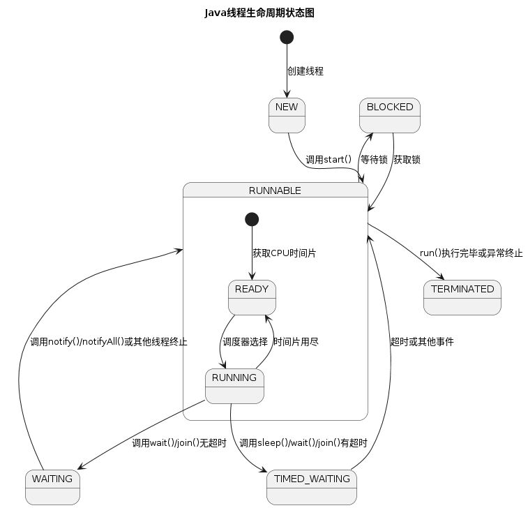
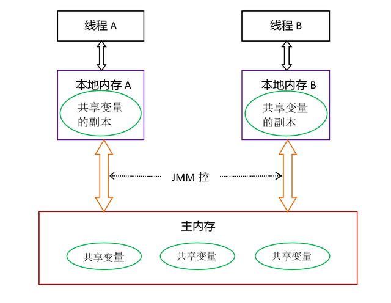

# 并发编程

# 并发编程基本概念

## ★进程和线程 

进程是资源分配的最小单位: 一个程序的执行过程 , 与线程最大的区别 是**每个进程基本上都是独立的** 而线程不一定
线程是功能执行的最小单位: 一个进程中可以多个线程，最少要有一个线程。 多个线程共享进程的堆叠和方法区

但每个线程都有自己的程序计数器、虚拟机栈和本地方法栈

## ★并行和并发
并行：多项工作一起执行，之后再汇总

ex：泡方便面，电水壶烧水，一边撕调料倒入桶中。

并发：同一时刻多个线程在访问同一个资源，cpu频繁切换上下文  是多个线程对一个点或者是说资源的抢夺 

ex: 春运抢票 电商秒杀...

## ★同步和异步

- **同步**：调用某个任务时，会一直等待该任务完成，然后才继续执行后续的代码
- **异步**：调用某个任务时，不必等待任务完成就可以继续执行其他代码。

## ★上下文切换

答：**多线程编程中一般线程的数量大于 CPU 核心数**，而一个 CPU 为了有效地执行这些线程，核心只能在任何时候使用一个线程，**CPU 策略是将时间片分配到每个线程并旋转**。当一个线程的时间片用完时，它将重新处于就绪状态，供其他线程使用。这个过程属于上下文切换。

**上下文切换通常是计算密集型的**。换句话说，它需要相当可观的处理器时间。在每秒几十次或数百次的切换中，每次切换都需要纳秒量级时间。因此，上下文切换意味着系统消耗了大量事实上，CPU时间可能是操作系统中时间消耗最大的操作。Linux与其他操作系统相比(包括其他类别)Unix系统有很多优点，其中之一就是上下文切换和模式切换的时间消耗很少。

## ★多线程带来的问题

内存泄漏、上下文切换、死锁、

## ★wait/sleep
wait：**放开手去睡**，放开手里的锁
sleep：**握紧手去睡**，醒了手里还有锁
wait是Object的方法，sleep是thread的方法

| **对比项** | **所属类** | **是否释放锁** | **底层实现** |
| --- | --- | --- | --- |
| sleep() | Thread | 不释放锁 | C |
| wait() | Object | 释放锁 | C |

## ★join/yield

yield  执行后线程直接进入**就绪状态**，马上释放了cpu的执行权，但是依然保留了cpu的执行资格，所以有可能cpu下次进行线程调度还会让这个线程获取到执行权继续执行。

join  执行后线程进入**阻塞状态**，例如在线程B中调用线程A的join（），那线程B会进入到阻塞队列，直到线程A结束或中断线程。


## ★notify  notifyAll

```java
synchronized (this) {
    // 进行一些操作
    // ...
    this.notify();  // 唤醒一个等待线程
    this.notifyAll(); // 唤醒所有等待线程 
    
}
// 唤醒正在等待该对象监视器锁的一个线程
// 当多个线程都在等待同一个对象的监视器锁时，notify() 方法只会随机唤醒其中一个线程。
// 调用 notify() 后，该线程会释放对象锁，然后被唤醒的线程将有机会获取锁并继续执行。
// 调用 notifyAll() 后，该线程会释放对象锁，所有等待的线程都有机会获取锁并继续执行。
// notify() 和 notifyAll() 必须在 synchronized 块或方法中调用，
```


## ★如何创建线程

一般来说创建线程有四种方式 实际上有10种方式创建  

常用的三种 继承`Thread`类    实现`runnable`接口       实现`Callable`接口 

除此之外  实现线程池      使用`ForkJoinPool`  `CompletableFuture`类等等

**但最终都是通过`new Thread().start()`创建**


1. **继承**`Thread`**类**：创建一个新类继承`Thread`类，并重写`run()`方法。然后创建该类的实例，调用`start()`方法启动线程。

```java
class MyThread extends Thread {
    public void run() {
        // 线程执行的代码
    }
}
```

2. **实现**`Runnable`**接口**：创建一个实现`Runnable`接口的类，并实现`run()`方法。然后创建`Thread`实例，将`Runnable`对象作为参数传递给`Thread`构造函数，调用`start()`方法启动线程。

```java
class MyRunnable implements Runnable {
    public void run() {
        // 线程执行的代码
    }
}
```

3. **实现`callable`接口**: 创建一个实现`callable`接口的类,并实现call()方法，然后创建`Thread`实例,将`callable`对象作为参数传递给`Thread`构造函数，调用`start()`方法启动线程。

```java
class MyCallableThread implements Callable<String>{
    @Override
    public String call() throws Exception {
        
        return "MyCallableThread";
    }
}
```

4. **使用**new ThreadPoolExecutor 创建线程池，

    

5. **使用**`ForkJoinPool：`ForkJoinPool`是一种特殊的线程池，用于执行`ForkJoinTask`任务。它适用于可以分解成更小任务的并行计算。

```java
ForkJoinPool forkJoinPool = new ForkJoinPool();
ForkJoinTask<Integer> task = new MyForkJoinTask();
forkJoinPool.execute(task);
```

这五种方式各有优势，适用于不同的场景。继承`Thread`类和实现`Runnable`接口是最基本的方式，适用于简单的并发任务。使用`ThreadPoolExecutor`提供了更高级的线程管理和任务控制功能，适用于复杂的并发应用。`ForkJoinPool`则专为并行计算设计，适用于可以分解成更小任务的大规模并行计算。


### ★ callable接口与runnable接口的区别？

**从java5开始，提供了Callable接口，是Runable接口的增强版。**

相同点：**都是接口，都可以编写多线程程序，都采用Thread.start()启动线程**

不同点：

1. 具体方法不同：一个是run，一个是call
2. Runnable没有**返回值**；Callable可以返回执行结果，是个泛型
3. Callable接口的call()方法允许抛出**异常**；Runnable的run()方法异常只能在内部消化，不能往上继续抛
4. 它提供了检查计算是否完成的方法，以等待计算的完成，并检索计算的结果。

## ★线程的生命周期




- NEW: 初始状态，线程被创建出来但没有被调用 `start()` 。
- RUNNABLE: 运行状态，线程被调用了 `start()`   等待运行的状态。 
- BLOCKED：阻塞状态，需要等待锁释放。
- WAITING：等待状态，表示该线程需要等待其他线程做出一些特定动作（通知或中断）。
- TIME_WAITING：超时等待状态，可以在指定的时间后自行返回而不是像 WAITING 那样一直等待。
- TERMINATED：终止状态，表示该线程已经运行完毕。


## ★死锁

多个程序同时阻塞 争夺同一资源 

**如何检测死锁**

使用`jmap`、`jstack`等命令查看 JVM 线程栈和堆内存的情况。如果有死锁，`jstack` 的输出中通常会有 `Found one Java-level deadlock:`的字样，后面会跟着死锁相关的线程信息。另外，实际项目中还可以搭配使用`top`、`df`、`free`等命令查看操作系统的基本情况，出现死锁可能会导致 CPU、内存等资源消耗过高。

采用 VisualVM、JConsole 等工具进行排查

**如何避免死锁**

破坏死锁的产生的必要条件即可：

1. **破坏请求与保持条件**：一次性申请所有的资源。
2. **破坏不剥夺条件**：占用部分资源的线程进一步申请其他资源时，如果申请不到，可以主动释放它占有的资源。
3. **破坏循环等待条件**：靠按序申请资源来预防。按某一顺序申请资源，释放资源则反序释放。破坏循环等待条件。

Lock.tryLock()方法

## ★乐观锁和悲观锁

### 悲观锁

悲观锁认为共享资源每次访问的都会出问题, 所以每次在线程获取资源操作的时候上锁  当一个线程拿到资源 其他线程阻塞,用完在把资源转给其他线程


`synchronized`和`ReentrantLock`等独占锁都是悲观锁

```java
public void performSynchronisedTask() {
    synchronized (this) {
        // 需要同步的操作
    }
}

private Lock lock = new ReentrantLock();
lock.lock();
try {
   // 需要同步的操作
} finally {
    lock.unlock();
}
```

高并发的场景下，激烈的锁竞争会造成线程阻塞，大量阻塞线程会导致系统的上下文切换，增加系统的性能开销。并且，**悲观锁还可能会存在死锁问题**，影响代码的正常运行.  多用于读多写少的情况下


### 乐观锁

悲观锁认为共享资源每次访问的都不会出问题, 无需加锁 线程可以不停访问 只有在提交和修改的时候去验证的资源是否被其他线程修改了(版本号机制,cas算法  来实现)


atomic类包下的原子变量类`AtomicInteger`、`LongAdder` 就是基于cas算法实现的乐观锁


高并发的场景下，乐观锁相比悲观锁来说，不存在锁竞争造成线程阻塞，也不会有死锁的问题，在性能上往往会更胜一筹。但是，如果冲突频繁发生（写占比非常多的情况），会频繁失败和重试（悲观锁的开销是固定的），这样同样会非常影响性能，导致 CPU 飙升。

#### 版本号机制

#### CAS

先比较再交换
CAS操作有3个基本参数：内存地址A，旧值B，新值C。它的作用是将指定内存地址A的内容与所给的旧值B相比，如果相等，则将其内容替换为指令中提供的新值C；如果不等，则更新失败。类似于修改登陆密码的过程。当用户输入的原密码和数据库中存储的原密码相同，才可以将原密码更新为新密码，否则就不能更新。

**CAS是解决多线程并发安全问题的一种乐观锁算法。**因为它在对共享变量更新之前，会先比较当前值是否与更新前的值一致，如果一致则更新，如果不一致则循环执行（称为自旋锁），直到当前值与更新前的值一致为止，才执行更新。

```java
// 对象、对象的属性地址偏移量、预期值、修改值
public final native boolean compareAndSwapInt(Object var1, long var2, int var4, int var5);
```

Unsafe简单demo：

```java
public class UnsafeDemo {

    private int number = 0;

    public static void main(String[] args) throws NoSuchFieldException, IllegalAccessException {
        UnsafeDemo unsafeDemo = new UnsafeDemo();
        System.out.println(unsafeDemo.number);// 修改前
        unsafeDemo.compareAndSwap(0, 30);
        System.out.println(unsafeDemo.number);// 修改后
    }

    public void compareAndSwap(int oldValue, int newValue){
        try {
            // 通过反射获取Unsafe类中的theUnsafe对象
            Field theUnsafe = Unsafe.class.getDeclaredField("theUnsafe");
            theUnsafe.setAccessible(true); // 设置为可见
            Unsafe unsafe = (Unsafe) theUnsafe.get(null); // 获取Unsafe对象
            // 获取number的偏移量
            long offset = unsafe.objectFieldOffset(UnsafeDemo.class.getDeclaredField("number"));
            // cas操作
            unsafe.compareAndSwapInt(this, offset, oldValue, newValue);
        } catch (NoSuchFieldException e) {
            e.printStackTrace();
        } catch (IllegalAccessException e) {
            e.printStackTrace();
        }
    }
}
```

##### 基本代码演示

这里以AtomicInteger这个类来演示：

```java
public class CasDemo {

    public static void main(String[] args) {
        AtomicInteger i = new AtomicInteger(1);
        System.out.println("第一次更新：" + i.compareAndSet(1, 200));
        System.out.println("第一次更新后i的值：" + i.get());
        System.out.println("第二次更新：" + i.compareAndSet(1, 300));
        System.out.println("第二次更新后i的值：" + i.get());
        System.out.println("第三次更新：" + i.compareAndSet(200, 300));
        System.out.println("第三次更新后i的值：" + i.get());
    }
}
```

输出结果如下：

```
第一次更新：true
第一次更新后i的值：200
第二次更新：false
第二次更新后i的值：200
第三次更新：true
第三次更新后i的值：300
```

结果分析：

```
第一次更新：i的值（1）和预期值（1）相同，所以执行了更新操作，把i的值更新为200
第二次更新：i的值（200）和预期值（1）不同，所以不再执行更新操作
第三次更新：i的值（200）和预期值（1）相同，所以执行了更新操作，把i的值更新为300
```

##### 验证原子性缺点

**开销大**：在并发量比较高的情况下，如果反复尝试更新某个变量，却又一直更新不成功，会给CPU带来较大的压力

**ABA问题**：当变量从A修改为B再修改回A时，变量值等于期望值A，但是无法判断是否修改，CAS操作在ABA修改后依然成功。版本号

**不能保证代码块的原子性**：CAS机制所保证的只是一个变量的原子性操作，而不能保证整个代码块的原子性。


## 事务

ACID 是数据库管理系统 (DBMS) 中用来描述事务特性的一组属性的缩写。ACID 属性保证了即使在并发操作和系统故障的情况下，数据库操作也能保持一致性和可靠性。以下是 ACID 的四个组成部分：

1. **Atomicity（原子性）**：
   - 事务被视为一个不可分割的工作单元。
   - 事务中的所有操作要么全部成功完成，要么全部失败并回滚到事务开始之前的状态。
   - 一旦事务完成（提交或回滚），它对数据库的影响是永久性的。
2. **Consistency（一致性）**：
   - 事务必须确保所有数据库规则在事务执行前后都得到遵守。
   - 事务开始前和完成后，数据库都处于一致性状态。
   - 事务不能违反任何约束或规则（如外键约束、唯一约束等）。
3. **Isolation（隔离性）**：
   - 并发执行的事务之间是隔离的，也就是说一个事务看起来像是在独立的数据库中执行一样。
   - 数据库必须确保事务执行时不受其他并发事务的影响。
   - 不同级别的隔离可以防止不同的并发问题，如脏读、不可重复读和幻读。
4. **Durability（持久性）**：
   - 一旦事务提交，它对数据库的更改就是永久的。
   - 即使系统出现故障（如电源中断），提交的数据也不会丢失。
   - 通常通过将更改写入磁盘上的持久存储来保证这一点。

**问题:**

脏读 : 读取另一个事务未提交的数据 				设置隔离级别  **Read Uncommitted（读未提交）**

不可重读读: 不可重复读是指在一个事务内多次读取同一数据时，结果却不同(偏向于修改操作)   设置隔离级别   **Repeatable Read（可重复读）**

幻读: 幻读是指在一个事务内多次执行相同的查询时，返回的结果集不同。(偏向于增删操作)  设置隔离级别  **Serializable（序列化）**


1. ****：

   - 允许事务读取尚未提交的数据。
   - 最低的隔离级别，可能导致脏读、不可重复读和幻读。

2. **Read committed（读已提交）**：

   - 只允许事务读取已经提交的数据。
   - 默认情况下，大多数数据库系统采用此隔离级别。
   - 可能导致不可重复读和幻读。

3. **Repeatable Read（可重复读）**：

   - 保证事务可以多次读取同一数据并获得相同的结果。
   - 在此隔离级别下，事务开始时会锁定所有读取的数据，直到事务结束。
   - 防止了不可重复读，但仍然可能发生幻读。

4. **Serializable（序列化）**：

   - 提供最高的隔离级别。
   - 事务的执行效果就像它们按顺序执行一样。
   - 完全防止了不可重复读和幻读。
   - 可能导致锁竞争加剧，影响并发性能。

   


# 多线程高并发底层原理


cpu缓存用来解决cpu处理速度和内存速度不匹配问题  


Java 源代码会经历 **编译器优化重排 —> 指令并行重排 —> 内存系统重排** 的过程，最终才变成操作系统可执行的指令序列。


### java内存模型（JMM）


JMM规定了内存主要划分为**主内存**和**工作内存**两种。

> **主内存**：保存了所有的变量。
>
> **工作内存**：每个线程都有自己的工作内存，线程独享，保存了线程用到的变量副本（主内存共享变量的一份拷贝）。工作内存负责与线程交互，也负责与主内存交互。


此处的主内存和工作内存跟JVM内存划分（堆、栈、方法区）是在不同的维度上进行的，如果非要对应起来，主内存对应的是Java堆中的对象实例部分，工作内存对应的是栈中的部分区域，从更底层的来说，**主内存对应的是硬件的物理内存，工作内存对应的是寄存器和高速缓存**。

JMM对共享内存的操作做出了如下两条规定：

> - 线程对共享内存的所有操作都必须在自己的工作内存中进行，不能直接从主内存中读写；
> - 不同线程无法直接访问其他线程工作内存中的变量，因此共享变量的值传递需要通过主内存完成。



**内存模型的三大特性：**

-  **原子性：即不可分割性。**比如 a=0；（a非long和double类型） 这个操作是不可分割的，那么我们说这个操作是原子操作。再比如：a++； 这个操作实际是a = a + 1；是可分割的，所以他不是一个原子操作。非原子操作都会存在线程安全问题，需要**使用同步技术（sychronized）或者锁（Lock）来让它变成一个原子操作**。一个操作是原子操作，那么我们称它具有原子性。java的concurrent包下提供了一些原子类，我们可以通过阅读API来了解这些原子类的用法。比如：**AtomicInteger、AtomicLong、AtomicReference**等。 
-  **可见性：每个线程都有自己的工作内存，所以当某个线程修改完某个变量之后，在其他的线程中，未必能观察到该变量已经被修改。在 Java 中 volatile、synchronized 和 final 实现可见性。**volatile只能让被他修饰内容具有可见性，但不能保证它具有原子性。 
-  **有序性：java的有序性跟线程相关。**一个线程内部所有操作都是有序的，如果是多个线程所有操作都是无序的。因为JMM的工作内存和主内存之间存在延迟，而且java会对一些指令进行重新排序。volatile和synchronized可以保证程序的有序性，很多程序员只理解这两个关键字的执行互斥，而没有很好的理解到**volatile和synchronized也能保证指令不进行重排序。** 

#### Java 内存区域和 JMM 有何区别？

 **Java 内存区域和内存模型是完全不一样的两个东西**：

JVM 内存结构和 Java 虚拟机的运行时区域相关，定义了 JVM 在运行时如何分区存储程序数据，就比如说堆主要用于存放对象实例。

Java 内存模型和 Java 的并发编程相关，抽象了线程和主内存之间的关系就比如说线程之间的共享变量必须存储在主内存中，规定了从 Java 源代码到 CPU 可执行指令的这个转化过程要遵守哪些和并发相关的原则和规范，其主要目的是为了简化多线程编程，增强程序可移植性的


### 虚拟线程

这种线程是由`Java`虚拟机调度，而不是os调度。虚拟线程占用空间小，因此可以极大量地创建和使用。

#### 虚拟线程和平台线程有什么关系

在没有虚拟线程之前  JVM 调度程序通过平台线程来管理虚拟线程，一个平台线程可以在不同的时间执行不同的虚拟线程，当虚拟线程被阻塞或等待时，平台线程可以切换到执行另一个虚拟线程


#### 虚拟线程实现原理

[虚拟线程 - VirtualThread 源码透视](https://www.cnblogs.com/throwable/p/16758997.html)


# 线程间通信

```java
1.先定义资源类、属性和方法
2.在资源类中写方法的时候：
    2.1 判断(while判断类属性)
    2.2 干活
    2.3 唤醒
3.通过多线程操作资源类中的方法
```
