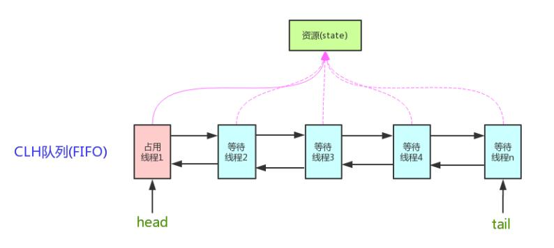

# Juc锁

# volatile

`java.util.concurrent`包下

`volatile` 的作用 :

1. 保证数据的可见性    **但不能保证数据的原子性**
2. 防止jvm指令重排

**如何保证可见性?**

如果我们将变量声明为 `volatile` ，这就指示 JVM，这个变量是共享且不稳定的，每次使用它都到主存中进行读取。

ex:

**如何防止jvm指令重排?**

在对这个变量进行读写操作的时候，会通过插入特定的 **内存屏障** 的方式来禁止指令重排序。

ex:

## volatile 的使用场景

**状态标记**：

* 使用 `volatile` 变量来表示线程间共享的状态标记，如线程中断标志、线程池关闭标志等。

**懒汉式初始化**：

* 在单线程环境下，可以使用 `volatile` 变量来实现懒汉式单例模式，因为 `volatile` 变量保证了可见性和有序性。

**发布对象**：

- 使用 `volatile` 变量来发布一个对象引用，确保其他线程能够看到完整的对象状态。

# synchronized

`synchronized` 是 Java 中的一个关键字，主要解决的是多个线程之间访问资源的同步性，可以保证被它修饰的方法或者代码块在任意时刻只能有一个线程执行。


## **sychronized 的底层原理**

synchronized 关键字底层原理属于 JVM 层面的东西。

方法级的同步是隐式，即无需通过字节码指令来控制的，它实现在方法调用和返回操作之中。JVM可以从方法常量池中的方法表结构(method_info Structure) 中的 ACC_SYNCHRONIZED 访问标志区分一个方法是否同步方法。当方法调用时，调用指令将会 检查方法的 ACC_SYNCHRONIZED 访问标志是否被设置，如果设置了，执行线程将先持有monitor（虚拟机规范中用的是管程一词）， 然后再执行方法，最后再方法完成(无论是正常完成还是非正常完成)时释放monitor。

代码块的同步是利用monitorenter和monitorexit这两个字节码指令。它们分别位于同步代码块的开始和结束位置。当jvm执行到monitorenter指令时，当前线程试图获取monitor对象的所有权，如果未加锁或者已经被当前线程所持有，就把锁的计数器+1；当执行monitorexit指令时，锁计数器-1；当锁计数器为0时，该锁就被释放了。如果获取monitor对象失败，该线程则会进入阻塞状态，直到其他线程释放锁。

不过两者的本质都是对对象监视器 monitor 的获取。

ex:


## **synchronized 和 volatile 有什么区别**

`synchronized` 关键字和 `volatile` 关键字是两个互补的存在，而不是对立的存在！

- `volatile` 关键字是线程同步的轻量级实现，所以 `volatile`性能肯定比`synchronized`关键字要好 。但是 `volatile` 关键字只能用于变量而 `synchronized` 关键字可以修饰方法以及代码块 。
- `volatile` 关键字能保证数据的可见性，但不能保证数据的原子性。`synchronized` 关键字两者都能保证。
- `volatile`关键字主要用于解决变量在多个线程之间的可见性，而 `synchronized` 关键字解决的是多个线程之间访问资源的同步性.

### **使用场景**

* 饰实例方法  (锁当前对象实例)

```java
synchronized void method() {
    //业务代码
}
```

* 修饰静态方法  (锁当前类)

```java
synchronized static void method() {
    //业务代码
}
```

* 修饰代码块  (锁指定对象/类)

```java
synchronized(this) {
    //业务代码
}
```

**不要使用 `synchronized(String a)`** 因为 JVM 中，字符串常量池具有缓存功能

构造方法不能被`synchronized`修饰  可以在构造方法内部使用 synchronized 代码块

## **Lock原理**

· Lock的存储结构：一个int类型状态值（用于锁的状态变更），一个双向链表（用于存储等待中的线程）

· Lock获取锁的过程：本质上是通过CAS来获取状态值修改，如果当场没获取到，会将该线程放在线程等待链表中。

· Lock释放锁的过程：修改状态值，调整等待链表。

· Lock大量使用CAS+自旋。因此根据CAS特性，lock建议使用在低锁冲突的情况下。

# ReentrantLock

ReentrantLock实现了Lock接口 比synchronized更加强大 , 灵活, 增加了轮询、超时、中断、公平锁和非公平锁等高级功能。


**RenntrantLock的创建**

`private ReentrantLock lock = new ReentrantLock(); // 锁声明`


**可重入性**

可重入锁又名递归锁，是指在同一个线程在外层方法获取锁的时候，再进入该线程的内层方法会自动获取锁。Java中ReentrantLock和synchronized都是可重入锁，可重入锁的一个优点是**可一定程度避免死锁**。

```java
class A{
	public synchronized void aa{
		......
        bb();
        ......
	}
	public synchronized void bb{
		......
	}
}
A a = new A();
a.aa();
```

A类中有两个普通同步方法，都需要对象a的锁。如果是不可重入锁的话，aa方法首先获取到锁，aa方法在执行的过程中需要调用bb方法，此时锁被aa方法占有，bb方法无法获取到锁，这样就会导致bb方法无法执行，aa方法也无法执行，出现了死锁情况。可重入锁可避免这种死锁的发生。


**公平锁源码:**  默认是非公平锁

```java
private ReentrantLock lock = new ReentrantLock(true); // 公平锁设置

// 传入一个 boolean 值，true 时为公平锁，false 时为非公平锁
public ReentrantLock(boolean fair) {
    sync = fair ? new FairSync() : new NonfairSync();
}
```


**限时等待**

传入时间参数，表示等待指定的时间，无参则表示立即返回锁申请的结果：true表示获取锁成功，false表示获取锁失败。我们可以将这种方法用来解决死锁问题。

```java
boolean tryLock(long time, TimeUnit unit) throws InterruptedException; // 限时等待  
```


**ReentrantLock和synchronized区别**

1. Lock的加锁和解锁都是由java代码配合native方法（调用操作系统的相关方法）实现的，而synchronize的加锁和解锁的过程是由JVM管理的
2. 当一个线程使用synchronize获取锁时，若锁被其他线程占用着，那么当前只能被阻塞，直到成功获取锁。而Lock则提供超时锁和可中断等更加灵活的方式，在未能获取锁的 条件下提供一种退出的机制。
3. 一个锁内部可以有多个Condition实例，即有多路条件队列，而synchronize只有一路条件队列；同样Condition也提供灵活的阻塞方式，在未获得通知之前可以通过中断线程以 及设置等待时限等方式退出条件队列。
4. synchronize对线程的同步仅提供独占模式，而Lock即可以提供独占模式，也可以提供共享模式


# ReentrantReadWriteLock

ReentrantReadWriteLock读写锁

针对**读多写少**的情况    读写锁允许同一时刻被多个读线程访问，**但是在写线程访问时，所有的读线程和其他的写线程都会被阻塞。**
读写锁的特点：

1. 写写不可并发
2. 读写不可并发
3. 读读可以并发

读写锁：读写锁中的读锁和写锁实际是一把锁的两个不同角色。

读锁：读共享

写锁: 独占锁


## 锁降级

什么是锁降级，锁降级就是从写锁降级成为读锁。在当前线程拥有写锁的情况下，再次获取到读锁，随后释放写锁的过程就是锁降级。这里可以举个例子：

```java
public void test(){
    rwlock.writeLock().lock();
    System.out.println("获取到写锁。。。。");
    rwlock.readLock().lock();
    System.out.println("获取到读锁----------");
    rwlock.writeLock().unlock();
    System.out.println("释放写锁==============");
    rwlock.readLock().unlock();
    System.out.println("释放读锁++++++++++++++++");
}
```

打印效果：


## 读写锁总结

1. 支持公平/非公平策略


2. 支持可重入

    - 同一读线程在获取了读锁后还可以获取读锁
    - 同一写线程在获取了写锁之后既可以再次获取写锁又可以获取读锁

3. 支持锁降级，不支持锁升级

4. 读写锁如果使用不当，很容易产生“饥饿”问题：

    在读线程非常多，写线程很少的情况下，很容易导致写线程“饥饿”，虽然使用“公平”策略可以一定程度上缓解这个问题，但是“公平”策略是以牺牲系统吞吐量为代价的。

5. Condition条件支持

    写锁可以通过newCondition()方法获取Condition对象。但是读锁是没法获取Condition对象，读锁调用newCondition() 方法会直接抛出UnsupportedOperationException。


# AQS

AQS 的全称为 `AbstractQueuedSynchronizer` ，它是实现同步器的基础组件（框架）, 抽象队列同步器。在 `java.util.concurrent.locks` 包下面。juc下面Lock（ReentrantLock、ReentrantReadWriteLock等）的实现以及一些并发工具类（Semaphore、CountDownLatch、CyclicBarrier等）就是通过AQS来实现的。具体用法是通过继承AQS实现其模板方法，然后将子类作为同步组件的内部类。But StampLock不是基于AQS实现的。


**框架结构**

AQS框架结构如下：
AQS内部维护着一个FIFO双向队列，该队列就是`CLH同步队列`。

- **CLH队列**：全称是(Craig.Landin. and Haqersten)lock queue，`用来存储被阻塞的线程信息`。


AQS维护了一个volatile语义(支持多线程下的可见性)的共享资源变量**state**和一个FIFO（first-in-first-out）**线程等待队列**(多线程竞争state资源被阻塞时，会进入此队列)。

`state 属性表示资源的状态`
例如：

- 对于ReentrantLock来说，state=1，表示资源被占用；state=0，表示资源没有被占用。
- 对于CountDownLatch来说，state=0，表示计数器归零，所有线程都可以访问资源；status为N表示计数器未归零，所有线程都需要阻塞。

**基于AQS实现锁的思路**

AQS将大部分的同步逻辑均已经实现好，继承的自定义同步器只需要实现state的获取(acquire)和释放(release)的逻辑代码就可以，主要包括下面方法：

- acquire(int)：独占方式。尝试获取资源，成功则返回true，失败则返回false。
- release(int)：独占方式。尝试释放资源，成功则返回true，失败则返回false。
- 

- acquireShared(int)：共享方式。尝试获取资源。负数表示失败；0表示成功，但没有剩余可用资源；正数表示成功，且有剩余资源。
- releaseShared(int)：共享方式。尝试释放资源，如果释放后允许唤醒后续等待结点返回true，否则返回false。
- 

- isHeldExclusively()：该线程是否正在独占资源。只有用到condition才需要去实现它。

也就是说
		通过AQS可以实现独占锁（只有一个线程可以获取到锁，如：ReentrantLock），也可以实现共享锁（多个线程都可以获取到锁Semaphore/CountDownLatch等）


## CountDownLatch（倒计数器）

CountDownLatch是一个非常实用的多线程控制工具类. 

例如：在手机上安装一个应用程序，假如需要5个子进程检查服务授权，那么主进程会维护一个计数器，初始计数

就是5。用户每同意一个授权该计数器减1，当计数减为0时，主进程才启动，否则就只有阻塞等待了。

CountDownLatch中count down是倒数的意思，latch则是门闩的含义。整体含义可以理解为倒数的门栓，似乎有

一点“三二一，芝麻开门”的感觉。CountDownLatch的作用也是如此。

```java
new CountDownLatch(int count) //实例化一个倒计数器，count指定初始计数
countDown() // 每调用一次，计数减一
await() //等待，当计数减到0时，阻塞线程（可以是一个，也可以是多个）并行执行
```

```java
// 案例  6个同学陆续离开教室后值班同学才可以关门。

public class CountDownLatchDemo {

    /**
     * main方法也是一个进程，在这里是主进程，即上锁的同学
     *
     * @param args
     */
    public static void main(String[] args) throws InterruptedException {

        // 初始化计数器，初始计数为6
        CountDownLatch countDownLatch = new CountDownLatch(6);

        for (int i = 0; i < 6; i++) {
            new Thread(()->{
                try {
                    // 每个同学墨迹几秒钟
                    TimeUnit.SECONDS.sleep(new Random().nextInt(5));
                    System.out.println(Thread.currentThread().getName() + " 同学出门了");
                    // 调用countDown()计算减1
                    countDownLatch.countDown();
                } catch (InterruptedException e) {
                    e.printStackTrace();
                }
            }, String.valueOf(i)).start();
        }

        // 调用计算器的await方法，等待6位同学都出来
        countDownLatch.await();

        System.out.println("值班同学锁门了");
    }
}
```

### ★CountDownLatch 与 join 方法的区别

调用一个子线程的 **join()方法**后，该线程会一直**被阻塞直到该线程运行完毕**。而 CountDownLatch 则使用计数器

允许子线程**运行完毕或者运行中**时候递减计数，也就是 CountDownLatch 可以在子线程运行任何时候让 await 方

法返回而不一定必须等到线程结束；另外使用线程池来管理线程时候一般都是直接添加 Runnable 到线程池这时候

就没有办法在调用线程的 join 方法了，countDownLatch 相比 Join 方法让我们对线程同步有更灵活的控制。

动手案例:秦灭六国，一统华夏。

## CyclicBarrier（循环栅栏）

该命令只在每个屏障点运行一次。若在所有参与线程之前更新共享状态，此屏障操作很有用

常用方法：

1. CyclicBarrier(int parties, Runnable barrierAction) 创建一个CyclicBarrier实例，parties指定参与相互等待的线程数，**barrierAction一个可选的Runnable命令，该命令只在每个屏障点运行一次，可以在执行后续业务之前共享状态。该操作由最后一个进入屏障点的线程执行。**
2. CyclicBarrier(int parties) 创建一个CyclicBarrier实例，parties指定参与相互等待的线程数。
3. await() 该方法被调用时表示当前线程已经到达屏障点，当前线程阻塞进入休眠状态，**直到所有线程都到达屏障点**，当前线程才会被唤醒。

```java
//组队打boss过关卡游戏。
public class CyclicBarrierDemo {

    public static void main(String[] args) {

        CyclicBarrier cyclicBarrier = new CyclicBarrier(3, () -> {

            System.out.println(Thread.currentThread().getName() + " 过关了");
        });

        for (int i = 0; i < 3; i++) {
            new Thread(()->{
                try {
                    System.out.println(Thread.currentThread().getName() + " 开始第一关");
                    TimeUnit.SECONDS.sleep(new Random().nextInt(4));
                    System.out.println(Thread.currentThread().getName() + " 开始打boss");
                    cyclicBarrier.await();

                    System.out.println(Thread.currentThread().getName() + " 开始第二关");
                    TimeUnit.SECONDS.sleep(new Random().nextInt(4));
                    System.out.println(Thread.currentThread().getName() + " 开始打boss");
                    cyclicBarrier.await();

                    System.out.println(Thread.currentThread().getName() + " 开始第三关");
                    TimeUnit.SECONDS.sleep(new Random().nextInt(4));
                    System.out.println(Thread.currentThread().getName() + " 开始打boss");
                    cyclicBarrier.await();

                } catch (Exception e) {
                    e.printStackTrace();
                }
            }, String.valueOf(i)).start();
        }
    }
}
```

### ★CyclicBarrier和CountDownLatch的区别？

CountDownLatch的计数器只能使用一次，而CyclicBarrier的计数器可以使用reset()方法重置，可以使用多次，所以CyclicBarrier能够处理更为复杂的场景；CountDownLatch允许一个或多个线程**等待一组事件的产生**，而CyclicBarrier用于等待其他线程**运行到栅栏位置**。


## Semaphore（信号量）

非常适合需求量大，而资源又很紧张的情况。比如给定一个资源数目有限的资源池，假设资源数目为N，每一个线程均可获取一个资源，但是当资源分配完毕时，后来线程需要阻塞等待，直到前面已持有资源的线程释放资源之后才能继续。
信号量主要用于两个目的：

1. 多个共享资源的互斥使用。
2. 用于并发线程数的控制。保护一个关键部分不要一次输入超过N个线程。

sentinel限流

```java
//方法
public Semaphore(int permits) // 构造方法，permits指资源数目（信号量）
public void acquire() throws InterruptedException // 占用资源，当一个线程调用acquire操作时，它要么通过成功获取信号量（信号量减1），要么一直等下去，直到有线程释放信号量，或超时。
public void release() // （释放）实际上会将信号量的值加1，然后唤醒等待的线程。
```

```java
// 案例：6辆车抢占3个车位
public class SemaphoreDemo {

    public static void main(String[] args) {
        // 初始化信号量，3个车位
        Semaphore semaphore = new Semaphore(3);

        // 6个线程，模拟6辆车
        for (int i = 0; i < 6; i++) {
            new Thread(()->{
                try {
                    // 抢占一个停车位
                    semaphore.acquire();
                    System.out.println(Thread.currentThread().getName() + " 抢到了一个停车位！！");
                    // 停一会儿车
                    TimeUnit.SECONDS.sleep(new Random().nextInt(10));
                    System.out.println(Thread.currentThread().getName() + " 离开停车位！！");
                    // 开走，释放一个停车位
                    semaphore.release();
                } catch (InterruptedException e) {
                    e.printStackTrace();
                }
            }, String.valueOf(i)).start();
        }
    }
}
```

# Atomic 
