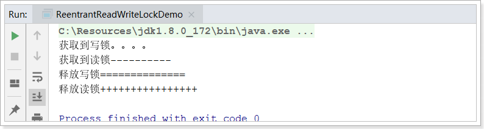
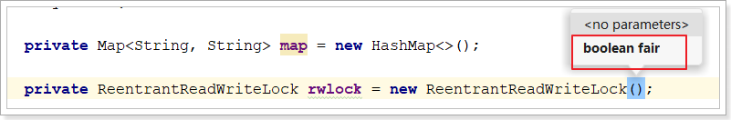
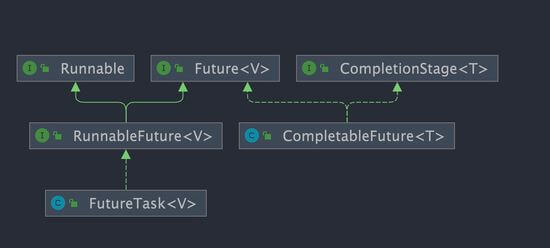
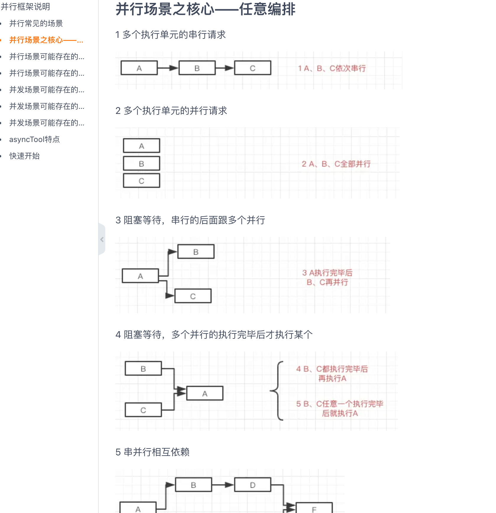

# volatile

`volatile` 的作用 :

1. 保证数据的可见性    **但不能保证数据的原子性**
2. 防止jvm指令重排

**如何保证可见性?**

如果我们将变量声明为 `volatile` ，这就指示 JVM，这个变量是共享且不稳定的，每次使用它都到主存中进行读取。 

ex:

**如何防止jvm指令重排?**

在对这个变量进行读写操作的时候，会通过插入特定的 **内存屏障** 的方式来禁止指令重排序。

ex:

# synchronized

`synchronized` 是 Java 中的一个关键字，翻译成中文是同步的意思，主要解决的是多个线程之间访问资源的同步性，可以保证被它修饰的方法或者代码块在任意时刻只能有一个线程执行。

**使用范围:**

修饰实例方法  (锁当前对象实例)

修饰静态方法  (锁当前类)

修饰代码块  (锁指定对象/类)

**不要使用 `synchronized(String a)`** 因为 JVM 中，字符串常量池具有缓存功能

构造方法不能被`synchronized`修饰  可以在构造方法内部使用 synchronized 代码块


**sychronized 的底层原理**

​	synchronized 关键字底层原理属于 JVM 层面的东西。

ex:


**synchronized 和 volatile 有什么区别**

`synchronized` 关键字和 `volatile` 关键字是两个互补的存在，而不是对立的存在！

- `volatile` 关键字是线程同步的轻量级实现，所以 `volatile`性能肯定比`synchronized`关键字要好 。但是 `volatile` 关键字只能用于变量而 `synchronized` 关键字可以修饰方法以及代码块 。
- `volatile` 关键字能保证数据的可见性，但不能保证数据的原子性。`synchronized` 关键字两者都能保证。
- `volatile`关键字主要用于解决变量在多个线程之间的可见性，而 `synchronized` 关键字解决的是多个线程之间访问资源的同步性.


# ReentrantLock

ReentrantLock实现了Lock接口 比synchronized更加强大 , 灵活, 增加了轮询、超时、中断、公平锁和非公平锁等高级功能。


**RenntrantLock的创建**

`private ReentrantLock lock = new ReentrantLock(); // 锁声明`


**可重入性**

可重入锁又名递归锁，是指在同一个线程在外层方法获取锁的时候，再进入该线程的内层方法会自动获取锁。Java中ReentrantLock和synchronized都是可重入锁，可重入锁的一个优点是**可一定程度避免死锁**。

```java
class A{
	public synchronized void aa{
		......
        bb();
        ......
	}
	public synchronized void bb{
		......
	}
}
A a = new A();
a.aa();
```

A类中有两个普通同步方法，都需要对象a的锁。如果是不可重入锁的话，aa方法首先获取到锁，aa方法在执行的过程中需要调用bb方法，此时锁被aa方法占有，bb方法无法获取到锁，这样就会导致bb方法无法执行，aa方法也无法执行，出现了死锁情况。可重入锁可避免这种死锁的发生。


**公平锁源码:**  默认是非公平锁

```java
private ReentrantLock lock = new ReentrantLock(true); // 公平锁设置

// 传入一个 boolean 值，true 时为公平锁，false 时为非公平锁
public ReentrantLock(boolean fair) {
    sync = fair ? new FairSync() : new NonfairSync();
}
```


**限时等待**

传入时间参数，表示等待指定的时间，无参则表示立即返回锁申请的结果：true表示获取锁成功，false表示获取锁失败。我们可以将这种方法用来解决死锁问题。

```java
boolean tryLock(long time, TimeUnit unit) throws InterruptedException; // 限时等待  
```


**ReentrantLock和synchronized区别**

ReentrantLock：都是可重入锁、独占锁;  显式释放锁、可以响应中断。  可以实现公平锁
synchronized： 都是可重入锁、独占锁 ; 隐式释放锁、不可以响应中断。只能是非公平锁


# ReentrantReadWriteLock读写锁

针对**读多写少**的情况    读写锁允许同一时刻被多个读线程访问，**但是在写线程访问时，所有的读线程和其他的写线程都会被阻塞。**
读写锁的特点：

1. 写写不可并发
2. 读写不可并发
3. 读读可以并发

读写锁：读写锁中的读锁和写锁实际是一把锁的两个不同角色。

读锁：读共享

写锁: 独占锁


## 锁降级

什么是锁降级，锁降级就是从写锁降级成为读锁。在当前线程拥有写锁的情况下，再次获取到读锁，随后释放写锁的过程就是锁降级。这里可以举个例子：

```java
public void test(){
    rwlock.writeLock().lock();
    System.out.println("获取到写锁。。。。");
    rwlock.readLock().lock();
    System.out.println("获取到读锁----------");
    rwlock.writeLock().unlock();
    System.out.println("释放写锁==============");
    rwlock.readLock().unlock();
    System.out.println("释放读锁++++++++++++++++");
}
```

打印效果：


## 读写锁总结

1. 支持公平/非公平策略



2. 支持可重入

    - 同一读线程在获取了读锁后还可以获取读锁
    - 同一写线程在获取了写锁之后既可以再次获取写锁又可以获取读锁

3. 支持锁降级，不支持锁升级

4. 读写锁如果使用不当，很容易产生“饥饿”问题：

    在读线程非常多，写线程很少的情况下，很容易导致写线程“饥饿”，虽然使用“公平”策略可以一定程度上缓解这个问题，但是“公平”策略是以牺牲系统吞吐量为代价的。

5. Condition条件支持

    写锁可以通过newCondition()方法获取Condition对象。但是读锁是没法获取Condition对象，读锁调用newCondition() 方法会直接抛出UnsupportedOperationException。


# ThreadLocal

threadLocal是JDK自带的类  位于java.lang包下 主要作用就是**实现每个线程都有专属的的本地变量**


ThreadLocal原理

```java
// Thread源码
public class Thread implements Runnable {
    //......
    //与此线程有关的ThreadLocal值。由ThreadLocal类维护
    ThreadLocal.ThreadLocalMap threadLocals = null;

    //与此线程有关的InheritableThreadLocal值。由InheritableThreadLocal类维护
    ThreadLocal.ThreadLocalMap inheritableThreadLocals = null;
    //......
}
```

从上面Thread类 源代码可以看出Thread 类中有一个 threadLocals 和 一个 inheritableThreadLocals 变量，它们都是 ThreadLocalMap 类型的变量,默认情况下这两个变量都是 null，只有当前线程调用 ThreadLocal 类的 set或get方法时才创建它们，**实际上调用这两个方法的时候，我们调用的是ThreadLocalMap类对应的 get()、set()方法。**

`ThreadLocal`类的`set()`方法

```java
public void set(T value) {
    //获取当前请求的线程
    Thread t = Thread.currentThread();
    //取出 Thread 类内部的 threadLocals 变量(哈希表结构)
    ThreadLocalMap map = getMap(t);
    if (map != null)
        // 将需要存储的值放入到这个哈希表中
        map.set(this, value);
    else
        createMap(t, value);
}
ThreadLocalMap getMap(Thread t) {
    return t.threadLocals;
}
```

最终的变量是放在了当前线程的 `ThreadLocalMap` 中，并不是存在 `ThreadLocal` 上，`ThreadLocal` 可以理解为

只是`ThreadLocalMap`的封装，传递了变量值。 `ThrealLocal` 类中可以通过`Thread.currentThread()`获取到

当前线程对象后，直接通过`getMap(Thread t)`可以访问到该线程的`ThreadLocalMap`对象。


**每个`Thread`中都具备一个`ThreadLocalMap`，而`ThreadLocalMap`可以存储以`ThreadLocal`为 **

**key ，Object 对象为 value 的键值对。**


**ThreadLocal 内存泄露问题是怎么导致的？**

`ThreadLocalMap` 中使用的 key 为 `ThreadLocal` 的弱引用，而 value 是强引用。所以，如果 `ThreadLocal` 没

有被外部强引用的情况下，在垃圾回收的时候，key 会被清理掉，而 value 不会被清理掉。

这样一来，`ThreadLocalMap` 中就会出现 key 为 null 的 Entry。假如我们不做任何措施的话，value 永远无法被 

GC 回收，这个时候就可能会产生内存泄露。`ThreadLocalMap` 实现中已经考虑了这种情况，在调用 `set()`、

`get()`、`remove()` 方法的时候，会清理掉 key 为 null 的记录。使用完 `ThreadLocal`方法后最好手动调用

`remove()`方法


# CompletableFuture 

串行->并行


## Future

在 Java 中，`Future` 类是一个泛型接口，位于 `java.util.concurrent` 包下，其中定义了 5 个方法，主要包括下面这 5个功能：

```java
// V 代表了Future执行的任务返回值的类型
public interface Future<V> {
    // 取消任务执行
    // 成功取消返回 true，否则返回 false
    boolean cancel(boolean mayInterruptIfRunning);
    // 判断任务是否被取消
    boolean isCancelled();
    // 判断任务是否已经执行完成
    boolean isDone();
    // 获取任务执行结果
    V get() throws InterruptedException, ExecutionException;
    // 指定时间内没有返回计算结果就抛出 TimeOutException 异常
    V get(long timeout, TimeUnit unit)

        throws InterruptedException, ExecutionException, TimeoutExceptio

}
```

简单理解就是：我有一个任务，提交给了 `Future` 来处理。任务执行期间我自己可以去做任何想做的事情。并且，在这期间我还可以取消任务以及获取任务的执行状态。一段时间之后，我就可以 `Future` 那里直接取出任务执行结果。


缺点:

不支持异步任务的编排组合、获取计算结果的 `get()` 方法为阻塞调用  etc...

## CompletableFuture 

Java 8 才被引入`CompletableFuture` 类可以解决`Future` 的缺点。`CompletableFuture` 除了提供了更为好用和强大的 `Future` 特性之外，还提供了函数式编程、异步任务编排组合的能力。

```java
public class CompletableFuture<T> implements Future<T>, CompletionStage<T> {
}
```



`CompletionStage` 接口描述了一个异步计算的阶段。很多计算可以分成多个阶段或步骤，此时可以通过它将所有步骤组合起来，形成异步计算的流水线。

## CompletableFuture 操作

### create CompletableFuture

1. new 
2. 基于 `CompletableFuture` 自带的静态工厂方法：`runAsync()`、`supplyAsync()` 。

### 常用的使用方式

CompletableFutre的方法很多 下面介绍几个常用的方法

#### runAsync

当你需要异步操作且不关心返回结果的时候可以使用 `runAsync()` 方法。

```java
public static CompletableFuture<Void> runAsync(Runnable runnable) {
        return asyncRunStage(ASYNC_POOL, runnable);
}

public static CompletableFuture<Void> runAsync(Runnable runnable, Executor executor) {
        return asyncRunStage(screenExecutor(executor), runnable);
}
```

`runAsync()` 方法接受的参数是 `Runnable` ，这是一个函数式接口，不允许返回值。

```java
@FunctionalInterface
public interface Runnable {
    public abstract void run();
}
```


#### supplyAsync

当你需要异步操作且关心返回结果的时候,可以使用 `supplyAsync()` 方法。

```java
public static <U> CompletableFuture<U> supplyAsync(Supplier<U> supplier) {
        return asyncSupplyStage(ASYNC_POOL, supplier);
}

public static <U> CompletableFuture<U> supplyAsync(Supplier<U> supplier,Executor executor) {
        return asyncSupplyStage(screenExecutor(executor), supplier);
}
```

`supplyAsync()` 方法接受的参数是 `Supplier<U>` ，这也是一个函数式接口，`U` 是返回结果值的类型。

```java
@FunctionalInterface
public interface Supplier<T> {
    T get();
}

```

#### thenAcceptAsync

`thenAcceptAsync`等待上一个任务执行完成之后，使用这个方法获取上一个任务的返回结果，之后调用下一个任务的操作

```java
public CompletableFuture<Void> thenAcceptAsync(Consumer<? super T> action) {
        return uniAcceptStage(defaultExecutor(), action);
}

public CompletableFuture<Void> thenAcceptAsync(Consumer<? super T> action,
                                                   Executor executor) {
        return uniAcceptStage(screenExecutor(executor), action);
}
```

#### handle()

通过 `handle()` 方法来处理任务执行过程中可能出现的抛出异常的情况。

```java
public <U> CompletableFuture<U> handle(
    BiFunction<? super T, Throwable, ? extends U> fn) {
    return uniHandleStage(null, fn);
}

public <U> CompletableFuture<U> handleAsync(
    BiFunction<? super T, Throwable, ? extends U> fn) {
    return uniHandleStage(defaultExecutor(), fn);
}

public <U> CompletableFuture<U> handleAsync(
    BiFunction<? super T, Throwable, ? extends U> fn, Executor executor) {
    return uniHandleStage(screenExecutor(executor), fn);
```

#### allOf()

运行多个 `CompletableFuture`

**`allOf()` 方法会等到所有的 `CompletableFuture` 都运行完成之后再返回**

调用 `join()` 可以让程序等`future1` 和 `future2` 都运行完了之后再继续执行。

```java
//x.组合以上七个异步任务
CompletableFuture.allOf(
        skuCompletableFuture,
        productComCompletableFuture,
        skuPriceCompletableFuture,
        productDetailsComCompletableFuture,
        skuSpecValueComCompletableFuture,
        skuStockVoComCompletableFuture
).join();
```

## 使用注意事项

### 使用自定义线性池

`CompletableFuture` 默认使用`ForkJoinPool.commonPool()` 作为执行器，这个线程池是全局共享的，可能会被其他任务占用，导致性能下降或者饥饿。因此，建议使用自定义的线程池来执行 `CompletableFuture` 的异步任务，可以提高并发度和灵活性。

### 尽量避免使用 get()

`CompletableFuture`的`get()`方法是阻塞的，尽量避免使用。如果必须要使用的话，需要添加超时时间，否则可能会导致主线程一直等待，无法执行其他任务。

## 合理组合多个异步任务




