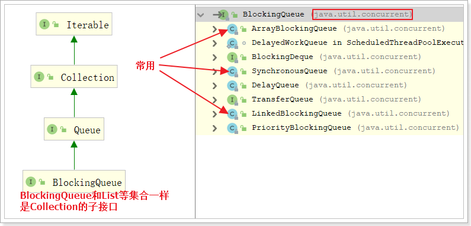
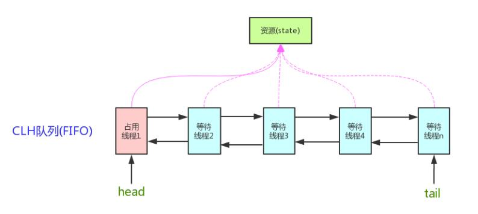
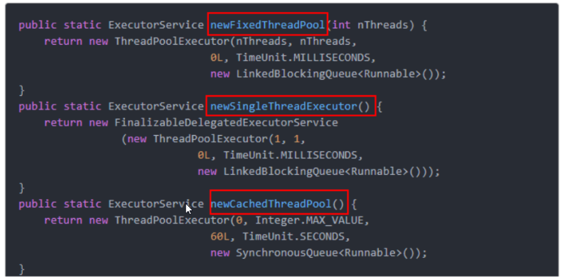
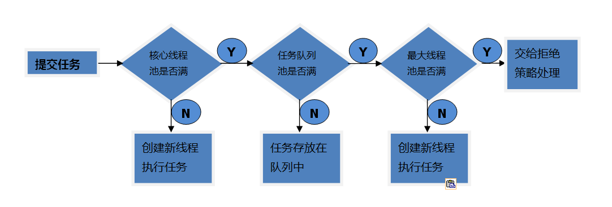
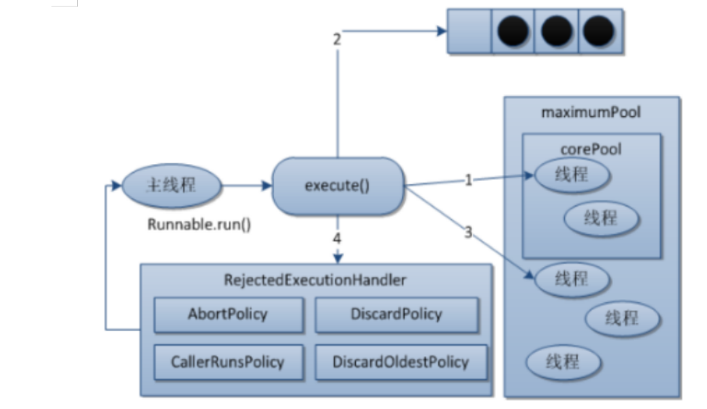

# Juc高级
# 并发容器类

vector

synchronizedList

hashtable


**Vector和Synchronized的缺点：**

​		vector：**内存消耗比较大**，底层基于数组,浪费内存空间，速度慢，适合一次增量比较大的情况

​		SynchronizedList：**迭代器涉及的代码没有加上线程同步代码,toString()方法上有锁**,底层基于LIst动态扩容

## CopyOnWrite容器

**CopyOnWrite容器**（简称COW容器）即**写时复制**的容器。通俗的理解是当我们往一个容器添加元素的时候，不直接往当前容器添加，而是先将当前容器进行Copy，复制出一个新的容器，然后新的容器里添加元素，添加完元素之后，再将原容器的引用指向新的容器。

**本质是数组**

```java
public class CopyOnWriteArrayList<E>
    implements List<E>, RandomAccess, Cloneable, java.io.Serializable {
    private static final long serialVersionUID = 8673264195747942595L;

    /**
     * The lock protecting all mutators.  (We have a mild preference
     * for builtin monitors over ReentrantLock when either will do.)
     */
    final transient Object lock = new Object();

    /** The array, accessed only via getArray/setArray. */
    private transient volatile Object[] array;
    ...
}
```


**add方法是线程安全的**

```java
    /**
     * Appends the specified element to the end of this list.
     *
     * @param e element to be appended to this list
     * @return {@code true} (as specified by {@link Collection#add})
     */
    public boolean add(E e) {
        synchronized (lock) {
            Object[] es = getArray();
            int len = es.length;
            es = Arrays.copyOf(es, len + 1);
            es[len] = e;
            setArray(es);
            return true;
        }
    }
```


**CopyOnWrite并发容器用于读多写少的并发场景**。比如：白名单，黑名单。假如我们有一个搜索网站，用户在这个网站的搜索框中，输入关键字搜索内容，但是某些关键字不允许被搜索。这些不能被搜索的关键字会被放在一个黑名单当中，黑名单一定周期才会更新一次。

缺点：

1. **内存占用问题。**写的时候会创建新对象添加到新容器里，而旧容器的对象还在使用，所以有两份对象内存。通过压缩容器中的元素的方法来减少大对象的内存消耗，比如，如果元素全是10进制的数字，可以考虑把它压缩成36进制或64进制。或者不使用CopyOnWrite容器，而使用其他的并发容器，如ConcurrentHashMap。
2. **数据一致性问题。**CopyOnWrite容器只能保证数据的最终一致性，不能保证数据的实时一致性。所以如果你希望写入的的数据，马上能读到，请不要使用CopyOnWrite容器。

## 阻塞队列（BlockingQueue）

所谓**阻塞**，在某些情况下会**挂起线程**（即阻塞），一旦条件满足，被挂起的线程又会自动被唤起

BlockingQueue即阻塞队列，是java.util.concurrent下的一个接口，因此不难理解，BlockingQueue是为了解决多线程中数据高效安全传输而提出的。从阻塞这个词可以看出，在某些情况下对阻塞队列的访问可能会造成阻塞。被阻塞的情况主要有如下两种：

1.  **当队列满了的时候进行入队列操作** 
2.  **当队列空了的时候进行出队列操作** 


**阻塞队列主要用在生产者/消费者的场景**，下面这幅图展示了一个线程生产、一个线程消费的场景：


**为什么需要BlockingQueue**	好处是我们不需要关心什么时候需要阻塞线程，什么时候需要唤醒线程，因为这一切BlockingQueue都给你一手包办了。在concurrent包发布以前，在多线程环境下，我们都必须去自己控制这些细节，尤其还要兼顾效率和线程安全，而这会给我们的程序带来不小的复杂度。

### BlockingQueue

java.util.concurrent 包里的 BlockingQueue是一个接口，继承Queue接口，Queue接口继承 Collection。

BlockingQueue接口主要有以下7个实现类：

1. **ArrayBlockingQueue：由数组结构组成的有界阻塞队列。**
2. **LinkedBlockingQueue：由链表结构组成的有界（但大小默认值为integer.MAX_VALUE）阻塞队列。**
3. PriorityBlockingQueue：支持优先级排序的无界阻塞队列。
4. DelayQueue：使用优先级队列实现的延迟无界阻塞队列。
5. **SynchronousQueue：不存储元素的阻塞队列，也即单个元素的队列。**
6. LinkedTransferQueue：由链表组成的无界阻塞队列。
7. LinkedBlockingDeque：由链表组成的双向阻塞队列。

它的方法可以分成以下4类：

|          | 抛出异常  | 特殊值   | 阻塞   | 超时                 |
| -------- | --------- | -------- | ------ | -------------------- |
| **插入** | add(e)    | offer(e) | put(e) | offer(e, time, unit) |
| **移除** | remove()  | poll()   | take() | poll(time, unit)     |
| **检查** | element() | peek()   | 不可用 | 不可用               |

**抛出异常**
add正常执行返回true，element（不删除）和remove返回阻塞队列中的第一个元素		

当阻塞队列满时，再往队列里add插入元素会抛IllegalStateException:Queue full

当阻塞队列空时，再往队列里remove移除元素会抛NoSuchElementException

当阻塞队列空时，再调用element检查元素会抛出NoSuchElementException

**特定值**		

插入方法，成功ture失败false

移除方法，成功返回出队列的元素，队列里没有就返回null		

检查方法，成功返回队列中的元素，没有返回null

**一直阻塞**

如果试图的操作无法立即执行，该方法调用将会发生阻塞，直到能够执行。

当阻塞队列满时，再往队列里put元素，队列会一直阻塞生产者线程直到put数据or响应中断退出	

当阻塞队列空时，再从队列里take元素，队列会一直阻塞消费者线程直到队列可用

**超时退出**

如果试图的操作无法立即执行，该方法调用将会发生阻塞，直到能够执行，但等待时间不会超过给定值。

返回一个特定值以告知该操作是否成功(典型的是 true / false)。


ex:

```java
public class BlockingQueueDemo {

    public static void main(String[] args) throws InterruptedException {
        BlockingQueue<String> queue = new ArrayBlockingQueue<>(3);
        // 第一组方法：add remove element
//        System.out.println(queue.add("a"));
//        System.out.println(queue.add("b"));
//        System.out.println(queue.add("c"));
//        // System.out.println(queue.add("d"));
//        // System.out.println(queue.element());
//        System.out.println(queue.remove());
//        System.out.println(queue.remove());
//        System.out.println(queue.remove());
//        //System.out.println(queue.remove());
//        //System.out.println(queue.element());
        // 第二组：offer poll peek
//        System.out.println(queue.offer("a"));
//        System.out.println(queue.offer("b"));
//        System.out.println(queue.offer("c"));
//        System.out.println(queue.offer("d"));
//        System.out.println(queue.peek());
//        System.out.println(queue.poll());
//        System.out.println(queue.poll());
//        System.out.println(queue.poll());
//        System.out.println(queue.poll());
//        System.out.println(queue.peek());
        // 第三组：put take
//        queue.put("a");
//        queue.put("b");
//        queue.put("c");
//        System.out.println(queue.take());
//        queue.put("d");
//        System.out.println(queue.take());
//        System.out.println(queue.take());
//        System.out.println(queue.take());
        // 第四组：offer poll
        System.out.println(queue.offer("a"));
        System.out.println(queue.offer("b"));
        System.out.println(queue.offer("c"));
        System.out.println(queue.offer("d", 5, TimeUnit.SECONDS));
    }
}
```


# AQS

AQS 的全称为 `AbstractQueuedSynchronizer` ，它是实现同步器的基础组件（框架）, 抽象队列同步器。在 `java.util.concurrent.locks` 包下面。juc下面Lock（ReentrantLock、ReentrantReadWriteLock等）的实现以及一些并发工具类（Semaphore、CountDownLatch、CyclicBarrier等）就是通过AQS来实现的。具体用法是通过继承AQS实现其模板方法，然后将子类作为同步组件的内部类。But StampLock不是基于AQS实现的。


**框架结构**

AQS框架结构如下：
AQS内部维护着一个FIFO双向队列，该队列就是`CLH同步队列`。

- **CLH队列**：全称是(Craig.Landin. and Haqersten)lock queue，`用来存储被阻塞的线程信息`。


AQS维护了一个volatile语义(支持多线程下的可见性)的共享资源变量**state**和一个FIFO（first-in-first-out）**线程等待队列**(多线程竞争state资源被阻塞时，会进入此队列)。

`state 属性表示资源的状态`
例如：

- 对于ReentrantLock来说，state=1，表示资源被占用；state=0，表示资源没有被占用。
- 对于CountDownLatch来说，state=0，表示计数器归零，所有线程都可以访问资源；status为N表示计数器未归零，所有线程都需要阻塞。

**基于AQS实现锁的思路**

AQS将大部分的同步逻辑均已经实现好，继承的自定义同步器只需要实现state的获取(acquire)和释放(release)的逻辑代码就可以，主要包括下面方法：

- acquire(int)：独占方式。尝试获取资源，成功则返回true，失败则返回false。
- release(int)：独占方式。尝试释放资源，成功则返回true，失败则返回false。
- 

- acquireShared(int)：共享方式。尝试获取资源。负数表示失败；0表示成功，但没有剩余可用资源；正数表示成功，且有剩余资源。
- releaseShared(int)：共享方式。尝试释放资源，如果释放后允许唤醒后续等待结点返回true，否则返回false。
- 

- isHeldExclusively()：该线程是否正在独占资源。只有用到condition才需要去实现它。

也就是说
		通过AQS可以实现独占锁（只有一个线程可以获取到锁，如：ReentrantLock），也可以实现共享锁（多个线程都可以获取到锁Semaphore/CountDownLatch等）


## CountDownLatch（倒计数器）

CountDownLatch是一个非常实用的多线程控制工具类. 

例如：在手机上安装一个应用程序，假如需要5个子进程检查服务授权，那么主进程会维护一个计数器，初始计数

就是5。用户每同意一个授权该计数器减1，当计数减为0时，主进程才启动，否则就只有阻塞等待了。

CountDownLatch中count down是倒数的意思，latch则是门闩的含义。整体含义可以理解为倒数的门栓，似乎有

一点“三二一，芝麻开门”的感觉。CountDownLatch的作用也是如此。

```java
new CountDownLatch(int count) //实例化一个倒计数器，count指定初始计数
countDown() // 每调用一次，计数减一
await() //等待，当计数减到0时，阻塞线程（可以是一个，也可以是多个）并行执行
```

```java
// 案例  6个同学陆续离开教室后值班同学才可以关门。

public class CountDownLatchDemo {

    /**
     * main方法也是一个进程，在这里是主进程，即上锁的同学
     *
     * @param args
     */
    public static void main(String[] args) throws InterruptedException {

        // 初始化计数器，初始计数为6
        CountDownLatch countDownLatch = new CountDownLatch(6);

        for (int i = 0; i < 6; i++) {
            new Thread(()->{
                try {
                    // 每个同学墨迹几秒钟
                    TimeUnit.SECONDS.sleep(new Random().nextInt(5));
                    System.out.println(Thread.currentThread().getName() + " 同学出门了");
                    // 调用countDown()计算减1
                    countDownLatch.countDown();
                } catch (InterruptedException e) {
                    e.printStackTrace();
                }
            }, String.valueOf(i)).start();
        }

        // 调用计算器的await方法，等待6位同学都出来
        countDownLatch.await();

        System.out.println("值班同学锁门了");
    }
}
```

### ★CountDownLatch 与 join 方法的区别

调用一个子线程的 **join()方法**后，该线程会一直**被阻塞直到该线程运行完毕**。而 CountDownLatch 则使用计数器

允许子线程**运行完毕或者运行中**时候递减计数，也就是 CountDownLatch 可以在子线程运行任何时候让 await 方

法返回而不一定必须等到线程结束；另外使用线程池来管理线程时候一般都是直接添加 Runnable 到线程池这时候

就没有办法在调用线程的 join 方法了，countDownLatch 相比 Join 方法让我们对线程同步有更灵活的控制。

动手案例:秦灭六国，一统华夏。

## CyclicBarrier（循环栅栏）

该命令只在每个屏障点运行一次。若在所有参与线程之前更新共享状态，此屏障操作很有用

常用方法：

1. CyclicBarrier(int parties, Runnable barrierAction) 创建一个CyclicBarrier实例，parties指定参与相互等待的线程数，**barrierAction一个可选的Runnable命令，该命令只在每个屏障点运行一次，可以在执行后续业务之前共享状态。该操作由最后一个进入屏障点的线程执行。**
2. CyclicBarrier(int parties) 创建一个CyclicBarrier实例，parties指定参与相互等待的线程数。
3. await() 该方法被调用时表示当前线程已经到达屏障点，当前线程阻塞进入休眠状态，**直到所有线程都到达屏障点**，当前线程才会被唤醒。

```java
//组队打boss过关卡游戏。
public class CyclicBarrierDemo {

    public static void main(String[] args) {

        CyclicBarrier cyclicBarrier = new CyclicBarrier(3, () -> {

            System.out.println(Thread.currentThread().getName() + " 过关了");
        });

        for (int i = 0; i < 3; i++) {
            new Thread(()->{
                try {
                    System.out.println(Thread.currentThread().getName() + " 开始第一关");
                    TimeUnit.SECONDS.sleep(new Random().nextInt(4));
                    System.out.println(Thread.currentThread().getName() + " 开始打boss");
                    cyclicBarrier.await();

                    System.out.println(Thread.currentThread().getName() + " 开始第二关");
                    TimeUnit.SECONDS.sleep(new Random().nextInt(4));
                    System.out.println(Thread.currentThread().getName() + " 开始打boss");
                    cyclicBarrier.await();

                    System.out.println(Thread.currentThread().getName() + " 开始第三关");
                    TimeUnit.SECONDS.sleep(new Random().nextInt(4));
                    System.out.println(Thread.currentThread().getName() + " 开始打boss");
                    cyclicBarrier.await();

                } catch (Exception e) {
                    e.printStackTrace();
                }
            }, String.valueOf(i)).start();
        }
    }
}
```

### ★CyclicBarrier和CountDownLatch的区别？

CountDownLatch的计数器只能使用一次，而CyclicBarrier的计数器可以使用reset()方法重置，可以使用多次，所以CyclicBarrier能够处理更为复杂的场景；CountDownLatch允许一个或多个线程**等待一组事件的产生**，而CyclicBarrier用于等待其他线程**运行到栅栏位置**。


## Semaphore（信号量）

非常适合需求量大，而资源又很紧张的情况。比如给定一个资源数目有限的资源池，假设资源数目为N，每一个线程均可获取一个资源，但是当资源分配完毕时，后来线程需要阻塞等待，直到前面已持有资源的线程释放资源之后才能继续。
信号量主要用于两个目的：

1. 多个共享资源的互斥使用。
2. 用于并发线程数的控制。保护一个关键部分不要一次输入超过N个线程。

sentinel限流

```java
//方法
public Semaphore(int permits) // 构造方法，permits指资源数目（信号量）
public void acquire() throws InterruptedException // 占用资源，当一个线程调用acquire操作时，它要么通过成功获取信号量（信号量减1），要么一直等下去，直到有线程释放信号量，或超时。
public void release() // （释放）实际上会将信号量的值加1，然后唤醒等待的线程。
```

```java
// 案例：6辆车抢占3个车位
public class SemaphoreDemo {

    public static void main(String[] args) {
        // 初始化信号量，3个车位
        Semaphore semaphore = new Semaphore(3);

        // 6个线程，模拟6辆车
        for (int i = 0; i < 6; i++) {
            new Thread(()->{
                try {
                    // 抢占一个停车位
                    semaphore.acquire();
                    System.out.println(Thread.currentThread().getName() + " 抢到了一个停车位！！");
                    // 停一会儿车
                    TimeUnit.SECONDS.sleep(new Random().nextInt(10));
                    System.out.println(Thread.currentThread().getName() + " 离开停车位！！");
                    // 开走，释放一个停车位
                    semaphore.release();
                } catch (InterruptedException e) {
                    e.printStackTrace();
                }
            }, String.valueOf(i)).start();
        }
    }
}
```


# ThreadPool线程池

## 什么是线程池

线程池介绍管理一系列线程的池子, 当有任务要处理时 直接从线程池种获取线程来处理, 处理完后也不会立即销毁,而是等待另一个任务

## 为什么要用线程池？

线程池的优势：线程复用；控制最大并发数；管理线程。

1. 降低资源消耗。通过重复利用已创建的线程降低线程创建和销毁造成的销耗。
2. 提高响应速度。当任务到达时，任务可以不需要等待线程创建就能立即执行。
3. 提高线程的可管理性。线程是稀缺资源，如果无限制的创建，不仅会销耗系统资源，还会降低系统的稳定性，使用线程池可以进行统一的分配，调优和监控。


## Executors工具类

```java
// 每种连接池的效果
public class ThreadPoolDemo {

    public static void main(String[] args) {
        // 创建单一线程的连接池
        // ExecutorService threadPool = Executors.newSingleThreadExecutor();
        // ExecutorService threadPool = Executors.newFixedThreadPool(3);
        ExecutorService threadPool = Executors.newCachedThreadPool();

        try {
            for (int i = 0; i < 5; i++) {
                threadPool.execute(()->{
                    System.out.println(Thread.currentThread().getName() + "执行了业务逻辑");
                });
            }
        } catch (Exception e) {
            e.printStackTrace();
        } finally {
            threadPool.shutdown();
        }
    }
}


@Bean
public ThreadPoolExecutor threadPoolExecutor(){
    // 当前系统可用处理器数量
    int processorsCount = Runtime.getRuntime().availableProcessors();
    ThreadPoolExecutor threadPoolExecutor = new ThreadPoolExecutor(
            processorsCount * 2,  //线程池的核心线程数量
            processorsCount * 2,             //线程池的最大线程数
            0,                               //当线程数大于核心线程数时，多余的空闲线程存活的最长时间
            TimeUnit.SECONDS,                //时间单位
            new ArrayBlockingQueue<>(200),  //任务队列，用来储存等待执行任务的队列
            Executors.defaultThreadFactory(),      //默认的线程工厂，用来创建线程.
            // 自定义拒绝策略
            (runnable, executor) -> {           //拒绝策略，当提交的任务过多而不能及时处理时，我们可以定制策略来处理任务
                try {
                    Thread.sleep(200);
                } catch (InterruptedException e) {
                    throw new RuntimeException(e);
                }
                executor.submit(runnable);
            }
    );
    // 线程池创建,核心线程同时创建
    threadPoolExecutor.prestartAllCoreThreads();
    return threadPoolExecutor;
}
```

## 底层原理

上述案例中的三个方法的本质都是ThreadPoolExecutor的实例化对象，只是具体参数值不同。


### 线程池的7个重要参数

1. corePoolSize：线程池中的常驻核心线程数
2. maximumPoolSize：线程池中能够容纳同时 执行的最大线程数，此值必须大于等于1
3. keepAliveTime：多余的空闲线程的存活时间 当前池中线程数量超过corePoolSize时，当空闲时间达到keepAliveTime时，多余线程会被销毁直到 只剩下corePoolSize个线程为止
4. Timeunit：keepAliveTime的单位
5. workQueue：任务队列，被提交但尚未被执行的任务
6. threadFactory：表示生成线程池中工作线程的线程工厂， 用于创建线程，**一般默认的即可**
7. handler：拒绝策略，表示当队列满了，并且工作线程大于 等于线程池的最大线程数（maximumPoolSize）时，如何来拒绝 请求执行的runnable的策略

### 线程池底层工作原理

重要的事情说三遍：以下重要：以下重要：以下重要：

1.  在创建了线程池后，线程池中的**线程数为零**。 
2.  当调用execute()方法添加一个请求任务时，线程池会做出如下判断： 
    1. 如果正在运行的线程数量**小于corePoolSize**，那么马上**创建线程**运行这个任务；
    2. 如果正在运行的线程数量**大于或等于corePoolSize**，那么**将这个任务放入队列**；
    3. 如果这个时候队列满了且正在运行的线程数量还**小于maximumPoolSize**，那么还是要**创建非核心线程**立刻运行这个任务；
    4. 如果队列满了且正在运行的线程数量**大于或等于maximumPoolSize**，那么线程池会**启动饱和拒绝策略**来执行。
3.  当一个线程完成任务时，它会从队列中取下一个任务来执行。 
4.  当一个线程无事可做超过一定的时间（keepAliveTime）时，线程会判断：
    如果当前运行的线程数大于corePoolSize，那么这个线程就被停掉。
    所以线程池的所有任务完成后，**它最终会收缩到corePoolSize的大小**。 



### 拒绝策略

一般我们创建线程池时，为防止资源被耗尽，任务队列都会选择创建有界任务队列，但种模式下如果出现**任务队列已满且线程池创建的线程数达到你设置的最大线程数时**，这时就需要你指定ThreadPoolExecutor的RejectedExecutionHandler参数即合理的拒绝策略，来处理线程池"超载"的情况。

ThreadPoolExecutor自带的拒绝策略如下：

1. AbortPolicy(默认)：直接**抛出RejectedExecutionException异常**阻止系统正常运行
2. CallerRunsPolicy：“调用者运行”一种调节机制，该策略既不会抛弃任务，也不会抛出异常，而是**将某些任务回退到调用者**，从而降低新任务的流量。
3. DiscardOldestPolicy：**抛弃队列中等待最久的任务**，然后把当前任务加人队列中 尝试再次提交当前任务。
4. DiscardPolicy：**该策略默默地丢弃无法处理的任务**，不予任何处理也不抛出异常。 如果允许任务丢失，这是最好的一种策略。

**以上内置的策略均实现了RejectedExecutionHandler接口，也可以自己扩展RejectedExecutionHandler接口，定义自己的拒绝策略**

## 自定义线程池

不推荐

# 多线程高并发底层原理


cpu不能直接读取内存 通过L1 L2 L3 缓存读取ram

## java内存模型（JMM）

JMM规定了内存主要划分为**主内存**和**工作内存**两种。

> **主内存**：保存了所有的变量。
> **共享变量**：如果一个变量被多个线程使用，那么这个变量会在每个线程的工作内存中保有一个副本，这种变量就是共享变量。
> **工作内存**：每个线程都有自己的工作内存，线程独享，保存了线程用到的变量副本（主内存共享变量的一份拷贝）。工作内存负责与线程交互，也负责与主内存交互。


此处的主内存和工作内存跟JVM内存划分（堆、栈、方法区）是在不同的维度上进行的，如果非要对应起来，主内存对应的是Java堆中的对象实例部分，工作内存对应的是栈中的部分区域，从更底层的来说，**主内存对应的是硬件的物理内存，工作内存对应的是寄存器和高速缓存**。

JMM对共享内存的操作做出了如下两条规定：

> - 线程对共享内存的所有操作都必须在自己的工作内存中进行，不能直接从主内存中读写；
> - 不同线程无法直接访问其他线程工作内存中的变量，因此共享变量的值传递需要通过主内存完成。


内存模型的三大特性：

-  **原子性：即不可分割性。**比如 a=0；（a非long和double类型） 这个操作是不可分割的，那么我们说这个操作是原子操作。再比如：a++； 这个操作实际是a = a + 1；是可分割的，所以他不是一个原子操作。非原子操作都会存在线程安全问题，需要**使用同步技术（sychronized）或者锁（Lock）来让它变成一个原子操作**。一个操作是原子操作，那么我们称它具有原子性。java的concurrent包下提供了一些原子类，我们可以通过阅读API来了解这些原子类的用法。比如：**AtomicInteger、AtomicLong、AtomicReference**等。 
-  **可见性：每个线程都有自己的工作内存，所以当某个线程修改完某个变量之后，在其他的线程中，未必能观察到该变量已经被修改。在 Java 中 volatile、synchronized 和 final 实现可见性。**volatile只能让被他修饰内容具有可见性，但不能保证它具有原子性。 
-  **有序性：java的有序性跟线程相关。**一个线程内部所有操作都是有序的，如果是多个线程所有操作都是无序的。因为JMM的工作内存和主内存之间存在延迟，而且java会对一些指令进行重新排序。volatile和synchronized可以保证程序的有序性，很多程序员只理解这两个关键字的执行互斥，而没有很好的理解到volatile和synchronized也能保证指令不进行重排序。 


