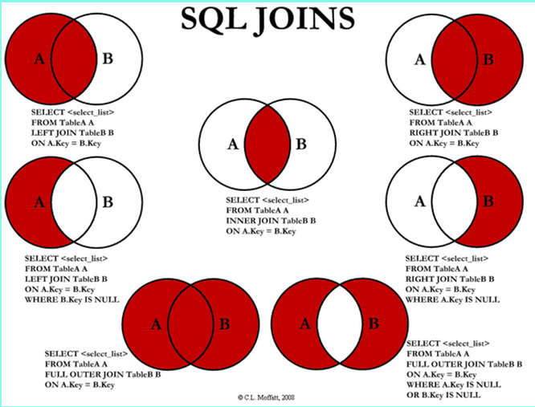
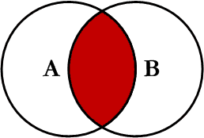
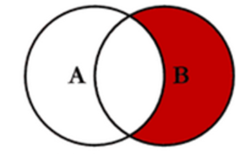
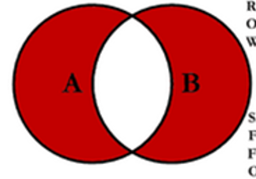

# Mysql

## **sqlserver数据库对应java中的数据类型**

| SQL Server 类型        | JDBC 类型 (java.sql.Types)            | Java 语言类型                |
| ---------------------- | ------------------------------------- | ---------------------------- |
| bigint                 | BIGINT                                | long                         |
| timestampbinary        | BINARY                                | byte[]                       |
| bit                    | BIT                                   | boolean                      |
| char                   | CHAR                                  | String                       |
| decimalmoneysmallmoney | DECIMAL                               | java.math.BigDecimal         |
| float                  | DOUBLE                                | double                       |
| int                    | INTEGER                               | int                          |
| imagevarbinary(max)    | LONGVARBINARY                         | byte[]                       |
| varchar(max)text       | LONGVARCHAR                           | String                       |
| nchar                  | CHARNCHAR (Java SE 6.0)               | String                       |
| nvarchar               | VARCHARNVARCHAR (Java SE 6.0)         | String                       |
| nvarchar(max)ntext     | LONGVARCHARLONGNVARCHAR (Java SE 6.0) | String                       |
| numeric                | NUMERIC                               | java.math.BigDecimal         |
| real                   | REAL                                  | float                        |
| smallint               | SMALLINT                              | short                        |
| datetimesmalldatetime  | TIMESTAMP                             | java.sql.Timestamp           |
| varbinaryudt           | VARBINARY                             | byte[]                       |
| varchar                | VARCHAR                               | String                       |
| tinyint                | TINYINT                               | short                        |
| uniqueidentifier       | CHAR                                  | String                       |
| xml                    | LONGVARCHARSQLXML (Java SE 6.0)       | StringSQLXML                 |
| time                   | TIME (1)                              | java.sql.Time (1)            |
| date                   | DATE                                  | java.sql.Date                |
| datetime2              | TIMESTAMP                             | java.sql.Timestamp           |
| datetimeoffset (2)     | microsoft.sql.Types.DATETIMEOFFSET    | microsoft.sql.DateTimeOffset |

```mysql
整数
	int 		4字节有符号
	bigint	    8字节有符号 
小数
	double 		8字节 (浮点数)
	decimal		多个字节 定点数(精度高)
字符串 
	char		1个字符 
	char(长度)	定长字符串, 效率高, 占用空间, 最长255
	varchar(长度) 变长字符串, 空间使用好, 最长65535字节.
	longtext	  长文本, 最多4G
日期时间
	date	    日期 
	time 		时间 
	datetime	日期时间
```


## base Operation

```mysql
MySQL数据库是一个C/S架构
Server : mysqld.exe
Client : mysql.exe
\select 可以查看当前连接的会话信息

-- 注意 : 
	SQL 语言大小写不敏感。 
	SQL 可以写在一行或者多行
	数据库名、表名、表的别名、变量名`严格区分大小写`
	列名与列的别名`不区分大小写`
	
	关键字不能被缩写也不能分行
	各子句一般要分行写。
	使用缩进提高语句的可读性。
	
	
-- DML : 数据操纵语言, 操作数据的 CURD
C  新建数据 insert 
R  访问数据 select  -- DQL 
U  修改数据 update 
D  删除数据 delete 

-- DDL : 数据定义语言, 操作数据库对象(数据库, 表, 列, 约束, 视图)
C  创建对象   create 
R  查看对象   show 
U  修改对象   alter
D  丢弃对象   drop 


-- 查看默认字符集  8.0之后是utf8mb4
SHOW VARIABLES LIKE '%char%';
ALTER DATABASE name CHARACTER SET utf8;
```

**sql_mode**  宽松模式 or 严格模式

```mysql
-- 查询sql_mode的值
SHOW VARIABLES LIKE 'sql_mode';
or
SELECT @@session.sql_mode; 
SELECT @@global.sql_mode;
-- 临时设置sql_mode的值
SET GLOBAL sql_mode = 'mode1,model2,...'; --全局，要重新启动客户端生效，重启MySQL服务后失效
SET SESSION sql_mode = 'mode1,model2,...';--当前会话生效效，关闭当前会话就不生效了
-- 永久设置sql_mode的值
1. vim ../mysql8/conf/my.cnf

   [mysqld]
2. sql-mode = "mode1,model2,..."

3. docker restart mysql 
```

**存储引擎**

```mysql
-- 查看MySQL提供什么存储引擎
SHOW ENGINES; or   SHOW VARIABLES LIKE '%default_storage_engine%';
-- 设置存储引擎
SET DEFAULT_STORAGE_ENGINE=MyISAM;
```


```mysql
-- 导入外部数据文件中的数据
source -- 外部数据文件的绝对路径 
source d:\\company.sql;

-- 所有ip可以访问数据库
update user set host = '%' where user='root' and host='192.168.1.x';
-- 刷新权限
flush privileges
```


## create tables;

```mysql
-- 创建表 
create table if not exists 表名 (
	列名1 数据类型(长度) 其他选项,
	列名2 数据类型(长度) 其他选项, 
	.......,
	表级约束1(列名),
	表级约束2(列名)
) engine 存储引擎 charset 字符集;

ALTER DATABASE name CHARACTER SET utf8;

ex:
create table if not exists teacher (
	id int auto_increment, -- 自增 
	name varchar(10) not null, -- 非空 
	age int,
	gender enum('男', '女') default '男', 
	phone varchar(20), 
	primary key(id), -- 唯一 主键
	unique(phone)
) engine innodb charset utf8mb4;

-- 完整复制表结构
create table if not exists country3 like world.country;


-- 字符串必须使用''包围
insert into customer(
	id, -- 列名的列表可以乱序
	name,
	age,
	gender,
	email 
) values (
	1, -- 值的列表必须要和列名的列表顺序一致.	
	'张三',
	35,
	'男',
	'zhang3@qq.com'
);

-- 创建数据库
create database database_name
-- 查看创建库的具体信息
SHOW CREATE DATABASE my_new_database;
```

## update tables;

```mysql
-- 修改数据
UPDATE table_name
SET column1 = value1, column2 = value2, ...
WHERE condition;

ex:
update customer set name ='张三', age = 35 where id = 1;


-- 修改表 
alter table 表名 
    
-- 修改列的数据类型等
modify column 列名 新数据类型(新长度) 新其他选项;

ex:
alter table teacher 
modify column name char(5) not null; 
	

-- 修改列名等
change column 列名 新列名 新数据类型(新长度) 新其他选项;

ex:
alter table teacher 
change column phone mobile char(15) unique;
	

-- 添加新列
add column 列名 数据类型(长度) 其他选项;
-- 向中间位置添加新列
add column 列名 数据类型(长度) 其他选项 after 某列名;

ex:
-- 向头部添加新列
alter table teacher 
add column salary int not null first;

```

## read tables;

```mysql
-- 选择所有列
SELECT *
FROM   departments;

-- 选择特定列 
SELECT 
	department_id, 
	location_id
FROM   
	departments;
	

-- 给列起别名, 使用关键字 as, as关键字可以省略 , 只能影响到虚表   
select 
	continent as 大洲,
	name "国家 名字", -- 别名中如果有空格, 必须要用""包围
	code 代码,
	code,
	name
from               -- 别名一旦建立  原名被替代
	country;


	
-- 在where中不可以使用列的别名, where先于select执行.	先滤行

-- 执行顺序 : join -> on -> join -> on ... from -> where -> select -> order by 

where 判定器, 判定器的结果一定是布尔.

like 用于模糊查询, 只能用于字符串类型的列   -- 如果后面的字符串中没有特殊字符时, Like和 = 一样.
% 表示的是任意个任意字符, 最灵活的通配符
_ 表示的是一个任意字符, 必须是一个

-- null值的处理必须使用is 

distinct 查重

order by 用于为虚表排序, 所以它总是最后, 且晚于select执行.
-- asc 升序(默认)
-- desc 降序
-- 先以第1列为依据升序排序, 在相同的第一列数据的内部再以第2列微排 
-- 查询的过程就是把基表切开, 再根据 select中提供的列, 把需要的列取出来, 所有列都取出来后, 再现粘回去, 形成一个虚表.

-- 多个表中的同名列必须使用表名.限定 


-- 逻辑运算 
-- and 表示并且, 只要有假结果一定假
-- or 表示或者, 只要有真结果一定真

-- 并且的逻辑要求高, 数据较少


group by中出现的列必须也出现在select
-- group by 中出现的列对应的数据必须要有相同,才便于聚集

limit  0,1 -- 跳过第0行 获得第1行


-- 查看库
SHOW DATABASES;
-- 查看创建库的具体信息
SHOW CREATE DATABASE my_new_database;
```


## delete tables;

```mysql
-- 丢弃表
drop table 表名;
-- 删除数据
delete from 表名;
-- 删除所有数据, 最好加上where
delete from customer;
delete from customer where id = 2;

-- 删除库
DROP DATABASE mydatabase;
```


## function

```mysql
-- 单行函数 : 作用于每一行数据, 以每一行数据的某些列为实参.
lower(字符串) -- 变小写 
upper(字符串) -- 变大写 
CONCAT('Hello', 'World') : 'HelloWorld' -- 字符串连接 
SUBSTR('HelloWorld', 1, 5) : -- 取子串, 第1个参数是要处理的字符串, 第2个参数是开始索引下标(索引总是从1开始), 第3个参数是子串长度
LENGTH('HelloWorld') -- 获取字符串长度
INSTR('HelloWorld', 'W') -- 获取第2个参数的短串,在第1个参数长串中首次出现的下标索引 , 和indexOf
LPAD(salary,10,'*') -- 左填充 , 第2个参数是总宽度, 第3个参数是要填充的字符
RPAD(salary, 10, '*') -- 右填充
TRIM('H' FROM 'HelloWorld'),
REPLACE('abcd','b','m')


-- 思路 : 	
1) 确定 主基表 , 如果一张表数据不够, join 副表 , 必须再有on, 如果数据还不够, 继续 join... on 最后确定好了最终的基表
2) from 从这个最终基表中获取到所有数据, 如果不需要这么多数据, 使用 where 进行基本的行过滤. 基本行确定OK
3) 是否题干中是否有 "各", "每", 如果有要分组group by, 弄清楚分组依据的列是什么
4) 如果有分组, 第1时间把分组的列名放在select中. 继续处理select中还需要哪些统计或需要哪些列, 执行完后分组后的虚表就成形了
5) 是否有分组后统计结果的过滤, 使用having过滤
6) 再查看是否有排序的需要, 使用order by
```

## subquery

```mysql
子查询 : 基于未知值的查询时, 未知值先作为子查询	

ex:
-- 查询面积最小的国家	
select 
	code,
	name,
	continent,
	surfacearea
from 
	country  
where 
	surfacearea = 
					(select 
						min(surfacearea)
					from 
						country);
```

## transaction

```mysql
-- 启动事务 :
set autocommit = false; -- 不允许自动提交 
-- 启动事务
set @@autocommit=off;
-- 还原设置
set @@autocommit=on;


START TRANSACTION;
-- 执行一些 SQL 操作，如：
INSERT INTO table_name (column1, column2) VALUES ('value1', 'value2');
UPDATE another_table SET column = 'new_value' WHERE condition;
-- 如果一切正常，提交事务：
COMMIT;
-- 如果出错，回滚事务：
ROLLBACK;
```

## constraint

```mysql
-- 约束(constraint) : 表级的强制规定, 用于保证数据的一致性和完整性.

NOT NULL 非空约束，规定某个字段不能为空 必须是列级约束
UNIQUE  唯一约束，规定某个字段在整个表中是唯一的, 可以是列级约束, 也可以是表级
PRIMARY KEY  主键(非空且唯一), 可以是列级, 也可以表级
FOREIGN KEY  外键 可以列级和表级
CHECK  检查约束 不支持 
DEFAULT  默认值 必须列级

-- 表级约束的最大优势 是可以多个列组合.


-- 外键, 一个表的列的数据要完全依赖另外一个表中的相应的数据才可以.
drop table if exists classes;
create table if not exists classes (
	id int auto_increment,
	name varchar(30) not null, 
	room char(4),
	begindate date,
	master int, -- 这个是某个老师的id号
	primary key(id),
	-- foreign key(本表的外键的列名) references 父表(父表中被引用的列名)
	foreign key(master) references teachers(id)
);

-- 删除这个记录会出问题, 因为此记录在子表中被引用了.
delete from teachers where id = 1; 

-- 外键的缺点是降低效率

-- 执意要删除父表中被引用的记录时, 当前表没有办法了.

-- 丢弃主键  一张表只能有一个主键.
alter table 表名 
drop primary key;


-- 添加主键 
alter table 表名 
add primary key(主键列名列表);

-- 丢弃外键约束, 一张表只能有一个主键. 但是可以有多个外键, 丢弃外键时必须要有名字. 可以通过查看表的建表语句. show create table 表名;
alter table 表名
drop foreign key 外键约束名; 


-- 添加外键
-- 当删除父表中的被引用的记录时, 有选项可以特殊处理
alter table 表名;
add constraint 外键约束名 foreign key(本表的外键的列名) references 父表(父表被引用的列) 
	on delete [do nothing(默认), cascade级联, set null(置空)]

alter table classes 
add constraint fk foreign key(master) references teachers(id) on delete cascade; 
-- 级联, 当删除父表中的被引用的记录时, 子表中的记录被波及到

-- 丢弃外键 
alter table classes 
drop foreign key fk;

alter table classes 
add constraint fk foreign key(master) references teachers(id) on delete set null; -- 置空 
-- 置空, 当删除父表中的被引用的记录时, 子表中的外键列的值设置为null 

select * from world.city limit 20, 10; -- 20表示要跳过的记录, 10就是最终要的记录数

SELECT * FROM table LIMIT (PageNo - 1)*PageSize, PageSize;
```

## join



### Inner JOIN



**SELECT** <select_list>
**FROM** Table_A A
**INNER** **JOIN** Table_B B
**ON** A.Key = B.Key

### Left JOIN


**SELECT** <select_list>
**FROM** Table_A A
**LEFT** **JOIN** Table_B B
**ON** A.Key = B.Key

### Right JOIN


**SELECT** <select_list>
**FROM** Table_A A
**RIGHT** **JOIN** Table_B B
**ON** A.Key = B.Key

### Outer JOIN


**SELECT** <select_list>
**FROM** Table_A A
**FULL** **OUTER** **JOIN** Table_B B
**ON** A.Key = B.Key

### Left Excluding JOIN


**SELECT** <select_list>
**FROM** Table_A A
**LEFT** **JOIN** Table_B B
**ON** A.Key = B.Key
**WHERE** B.Key **IS** **NULL**

### Right Excluding JOIN



**SELECT** <select_list>
**FROM** Table_A A
**RIGHT** **JOIN** Table_B B
**ON** A.Key = B.Key
**WHERE** A.Key **IS** **NULL**

### Outer Excluding JOIN



**SELECT** <select_list>
**FROM** Table_A A
**FULL** **OUTER** **JOIN** Table_B B
**ON** A.Key = B.Key
**WHERE** A.Key **IS** **NULL** **OR** B.Key **IS** **NULL**