# Redis基础与操作

> 官方介绍: Remote Dictionary Server(远程字典服务)是完全开源的，使用ANSIC语言编写遵守BSD协议，是一个高性能的Key-Value数据库提供了丰富的数据结构，例如String、Hash、List、Set、SortedSet等等。数据是存在内存中的，同时Redis支持事务、持久化、LUA脚本、发布/订阅、缓存淘汰、流技术等多种功能特性提供了主从模式、Redis Sentinel和Redis Cluster集群架构方案 

-  Redis是当前比较热门的NOSQL系统之一，它是一个开源的使用ANSI c语言编写的key-value存储系统（区别于MySQL的二维表格的形式存储。） 
-  Redis数据都是缓存在计算机内存中，但是Redis会周期性的把更新的数据写入磁盘或者把修改操作写入追加的记录文件，实现数据的持久化。 
-  Redis读写速度快，Redis读取的速度是110000次/s，写的速度是81000次/s； 
-  Redis的所有操作都是原子性的。 
-  Redis支持多种数据结构：string（字符串），list（列表），hash（哈希），set（集合），zset(有序集合) 
-  Redis支持集群部署 
-  支持过期时间，支持事务，消息订阅 


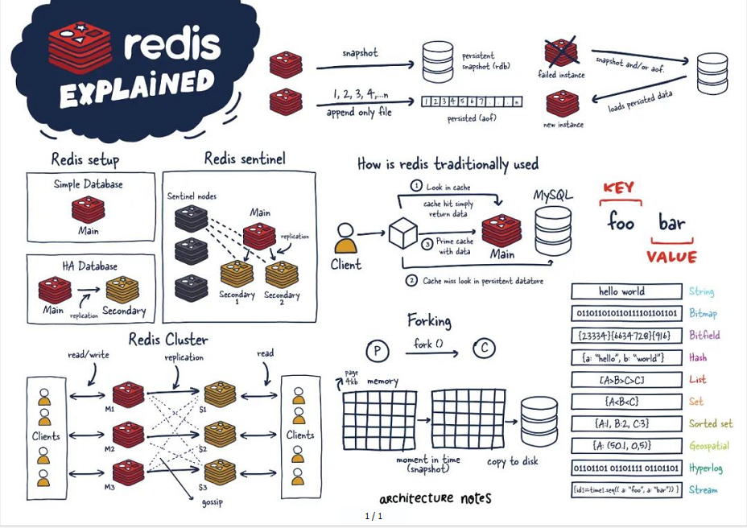


## Redis常用数据类型和命令

### key操作的相关命令

| 语法          | 功能                                                         |
| ------------- | ------------------------------------------------------------ |
| keys *        | 查看当前库所有key (匹配：keys *1)                            |
| exists key    | 判断某个key是否存在                                          |
| type key      | 查看你的key是什么类型                                        |
| del key       | 删除指定的key数据                                            |
| unlink key    | 非阻塞删除,仅将keys从keyspace元数据中删除，真正的删除会在后续异步操作 |
| expire key 10 | 10秒钟：为给定的key设置过期时间                              |
| ttl key       | 查看还有多少秒过期，-1表示永不过期，-2表示已过期             |
| select        | 命令切换数据库                                               |
| dbsize        | 查看当前数据库的key的数量                                    |
| flushdb       | 清空当前库                                                   |
| flushall      | 清空全部库                                                   |

### 五种基本数据类型

1. **字符串(String):** string是redis最基本的类型，一个key对应一个value。
2. **列表(List):** Redis列表是简单的字符串列表，按照插入顺序排序。
3. **哈希表(Hash)**: Redis hash 是一个 string 类型的 field和 value的映射表。
4. **Set(集合):**Redis 的 Set 是 String 类型的无序集合,集合成员是唯一的。
5. **zset(有序集合)**Redis zset 和 set 一样也是string类型元素的集合,且不允许重复的成员。

### 五种特殊数据类型

1. **地理空间（Geospatial）**：用于存储地理位置信息，支持地理空间索引和半径查询
2. **流（Streams）**：用于消息队列和日志存储，支持消息的持久化和时间排序 
3. **基数统计（HyperLogLogs）**：用于基数估计算法的数据结构，常用于统计唯一值的近似值
4. **位图（Bitmaps）**：基于字符串类型，可以对每个位进行操作，常用于实现布隆过滤器等位操作 
5. **位域 (Bitfield):** 通过bitfield命令我们可以一次性对多个比特位域进行操作


## 字符串(String)

1 String是Redis最基本的类型，你可以理解成与Memcached一模一样的类型，一个key对应一个value。

2 String类型是二进制安全的。意味着Redis的string可以包含任何数据。比如jpg图片或者序列化的对象。

3 String类型是Redis最基本的数据类型，一个Redis中字符串value最多可以是512M

### 常用命令

| 语法                                      | 解释                                                         |
| ----------------------------------------- | ------------------------------------------------------------ |
| set <key><value>                          | 添加键值对                                                   |
|                                           | NX：当数据库中key不存在时，可以将key-value添加数据库         |
|                                           | XX：当数据库中key存在时，可以将key-value添加数据库，与NX参数互斥 |
|                                           | EX：key的超时秒数                                            |
|                                           | PX：key的超时毫秒数，与EX互斥                                |
| get <key>                                 | 查询对应键值                                                 |
| append <key><value>                       | 将给定的<value> 追加到原值的末尾                             |
| strlen <key>                              | 获得值的长度                                                 |
| setnx <key><value>                        | 只有在 key 不存在时 设置 key 的值                            |
| incr <key>                                | 将 key 中储存的数字值增1,只能对数字值操作，如果为空，新增值为1 |
| decr <key>                                | 将 key 中储存的数字值减1,只能对数字值操作，如果为空，新增值为-1 |
| incrby / decrby <key><步长>               | 将 key 中储存的数字值增减。自定义步长                        |
| mset <key1><value1><key2><value2> .....   | 同时设置一个或多个 key-value对                               |
| mget <key1><key2><key3> .....             | 同时获取一个或多个 value                                     |
| msetnx <key1><value1><key2><value2> ..... | 同时设置一个或多个 key-value 对，当且仅当所有给定 key 都不存在。有一个失败则都失败(原子性) |
| getrange <key><起始位置><结束位置>        | 获得值的范围，类似java中的substring，**前包，后包**          |
| setrange <key><起始位置><value>           | 用 <value> 覆写<key>所储存的字符串值，从<起始位置>开始(**索引从0**开始)。 |
| setex <key> <过期时间> <value>            | 设置键值的同时，设置过期时间，单位秒。                       |
| getset <key><value>                       | 以新换旧，设置了新值同时获得旧值。                           |

### 数据结构

String的数据结构为简单动态字符串(Simple Dynamic String,缩写SDS)。是可以修改的字符串，内部结构实现上类似于Java的ArrayList，采用预分配冗余空间的方式来减少内存的频繁分配.
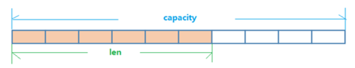

如图中所示，内部为当前字符串实际分配的空间capacity一般要高于实际字符串长度len。当字符串长度小于1M时，扩容都是加倍现有的空间，如果超过1M，扩容时一次只会多扩1M的空间。需要注意的是字符串最大长度为512M。


## 列表(List)

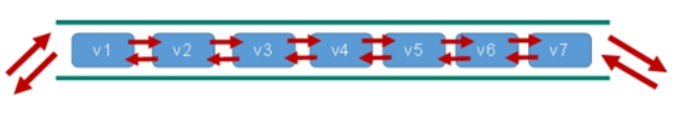

单键多值, 一个键下的value是一个List.Redis 列表是简单的字符串列表，按照插入顺序排序。你可以添加一个元素到列表的头部（左边）或者尾部（右边）。
它的底层实际是个双向链表，对两端的操作性能很高，通过索引下标的操作中间的节点性能会较差。


### 常用命令
| 语法                                           | 功能                                           |
| ---------------------------------------------- | ---------------------------------------------- |
| lpush/rpush <key><value1><value2><value3> .... | 从左边/右边插入一个或多个值。                  |
| lpop/rpop <key>                                | 从左边/右边吐出一个值。值在键在，值光键亡。    |
| rpoplpush <key1><key2>                         | 从<key1>列表右边吐出一个值，插到<key2>列表左边 |
| lrange <key><start><stop>                      | 按照索引下标获得元素(从左到右)                 |
|                                                | 0左边第一个，-1右边第一个，（0-1表示获取所有） |
| lindex <key><index>                            | 按照索引下标获得元素(从左到右)                 |
| llen <key>                                     | 获得列表长度                                   |
| linsert <key> before <value><newvalue>         | 在<value>的前面插入<newvalue>插入值            |
| linsert <key> after <value><newvalue>          | 在<value>的后面插入<newvalue>插入值            |
| lrem <key><n><value>                           | 从左边删除n个value(从左到右)                   |
| lset<key><index><value>                        | 将列表key下标为index的值替换成value            |


### 数据结构

List的数据结构为快速链表quickList。首先在列表元素较少的情况下会使用一块连续的内存存储，这个结构是ziplist，也即是压缩列表。它将所有的元素紧挨着一起存储，分配的是一块连续的内存。当数据量比较多的时候才会改成quicklist。因为普通的链表需要的附加指针空间太大，会比较浪费空间。比如这个列表里存的只是int类型的数据，结构上还需要两个额外的指针prev和next。


Redis将链表和ziplist结合起来组成了quicklist。也就是将多个ziplist使用双向指针串起来使用。这样既满足了快速的插入删除性能，又不会出现太大的空间冗余。

## 集合(Set)

    Redis set对外提供的功能与list类似是一个列表的功能，特殊之处在于set是可以**自动排重**的，当你需要存储一个列表数据，又不希望出现重复数据时，set是一个很好的选择，
    并且set提供了判断某个成员是否在一个set集合内的重要接口这个也是list所不能提供的。

    Redis的Set是string类型的无序集合。它底层其实是一个value为null的hash表，所以添加，删除，查找的**复杂度都是O(1)**。一个算法，随着数据的增加，执行时间的长短，如果是O(1)，数据增加，查找数据的时间不变   

### 常用命令

| 语法                               | 功能                                                         |
| ---------------------------------- | ------------------------------------------------------------ |
| sadd <key><value1><value2> .....   | 将一个或多个 member 元素加入到集合 key 中，已经存在的 member 元素将被忽略 |
| smembers <key>                     | 取出该集合的所有值。                                         |
| sismember <key><value>             | 判断集合<key>是否为含有该<value>值，有1，没有0               |
| scard<key>                         | 返回该集合的元素个数。                                       |
| srem <key><value1><value2> ....    | 删除集合中的某个元素。                                       |
| spop <key>                         | 随机从该集合中吐出一个值                                     |
| spop <key><N>                      | 随机从该集合中吐出N个值。                                    |
| srandmember <key><n>               | 随机从该集合中取出n个值。不会从集合中删除 。                 |
| smove <source><destination><value> | 把集合中一个值从一个集合移动到另一个集合                     |
| sinter <key1><key2>                | 返回两个集合的交集元素。                                     |
| sunion <key1><key2>                | 返回两个集合的并集元素。                                     |
| sdiff <key1><key2>                 | 返回两个集合的**差集**元素(key1中的，不包含key2中的)         |


### 数据结构

Set数据结构是dict字典，字典是用哈希表实现的。Java中HashSet的内部实现使用的是HashMap，只不过所有的value都指向同一个对象。Redis的set结构也是一样，它内部也使用hash结构，所有value都指向同一个内部值。

## 哈希(Hash)

Redis hash 是一个键值对集合。Redis hash是一个string类型的field和value的映射表，hash特别适合用于存储对象。类似Java里面的Map<String,Object>用户ID为查找的key，存储的value用户对象包含姓名，年龄，生日等信息

-  方式1  单key+序列化 .问题:每次修改用户的某个属性需要，先反序列化改好后再序列化回去。开销较大。
    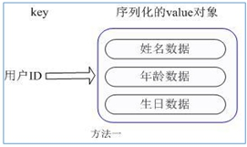
-  方式2 多key-value .问题:用户ID数据冗余  
    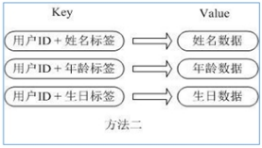
-  方式3 单key + 多(field+value) 

​     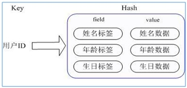

- **通过 key(用户ID) + field(属性标签) 就可以操作对应属性数据了，既不需要重复存储数据，也不会带来序列化和并发修改控制的问题** 

### 常用命令

| 语法                                            | 功能                                                         |
| ----------------------------------------------- | ------------------------------------------------------------ |
| hset <key><field><value><value>                 | 给<key>集合中的 <field>键赋值<value>                         |
| hget <key1><field>                              | 从<key1>集合<field>取出 value                                |
| hmset <key1><field1><value1><field2><value2>... | 批量设置hash的值                                             |
| hexists<key1><field>                            | 查看哈希表 key 中，给定域 field 是否存在。                   |
| hkeys <key>                                     | 列出该hash集合的所有field                                    |
| hvals <key>                                     | 列出该hash集合的所有value                                    |
| hincrby <key><field><increment>                 | 为哈希表 key 中的域 field 的值加上增量 1 -1                  |
| hsetnx <key><field><value>                      | 将哈希表 key 中的域 field 的值设置为 value ，当且仅当域 field 不存在 . |


### 数据结构

Hash类型对应的数据结构是两种：ziplist（压缩列表），hashtable（哈希表）。当field-value长度较短且个数较少时，使用ziplist，否则使用hashtable。

## 有序集合Zset

Redis有序集合zset与普通集合set非常相似，是一个没有重复元素的字符串集合。不同之处是有序集合的每个成员都关联了一个评分（score）,这个评分（score）被用来按照从最低分到最高分的方式排序集合中的成员。集合的成员是唯一的，但是评分可以是重复了 。因为元素是有序的, 所以你也可以很快的根据评分（score）或者次序（position）来获取一个范围的元素。访问有序集合的中间元素也是非常快的,因此你能够使用有序集合作为一个没有重复成员的智能列表。

### 常用命令

| 语法                                                         | 功能                                                         |
| ------------------------------------------------------------ | ------------------------------------------------------------ |
| zadd <key><score1><value1><score2><value2>…                  | 将一个或多个 member 元素及其 score 值加入到有序集 key 当中。 |
| zrange<key><start><stop>  [WITHSCORES]                       | 升序返回有序集 key 中，下标在<start><stop>之间的元素,0代表第一个元素索引,-1代表最后一个元素索引.带WITHSCORES，可以让分数一起和值返回到结果集。 |
| zrevrange <key><start><stop> [WITHSCORES]                    | 降序返回有序集 key 中，下标在<start><stop>之间的元素,0代表第一个元素索引,-1代表最后一个元素索引.带WITHSCORES，可以让分数一起和值返回到结果集 |
| zrangebyscore <key> <min> <max> [withscores] [limit offset count] | 返回有序集 key 中，所有 score 值介于 min 和 max 之间(包括等于 min 或 max )的成员。有序集成员按 score 值递增(从小到大)次序排列。 |
| zrevrangebyscore <key> <max> <min> [withscores] [limit offset count] | 同上，改为从大到小排列。                                     |
| zincrby <key><increment><value>                              | 为元素的score加上增量                                        |
| zrem <key><value>                                            | 删除该集合下，指定值的元素                                   |
| zcount <key><min><max>                                       | 统计该集合，分数区间内的元素个数                             |
| zrank <key><value>                                           | 返回该值在集合中的排名，从0开始。                            |


ex：如何利用zset实现一个文章访问量的排行榜？

### 数据结构

SortedSet(zset)是Redis提供的一个非常特别的数据结构，一方面它等价于Java的数据结构Map<String, Double>，可以给每一个元素value赋予一个权重score，另一方面它又类似于TreeSet，内部的元素会按照权重score进行排序，可以得到每个元素的名次，还可以通过score的范围来获取元素的列表。


## Jedis客户端程序

```
 Redis不仅是使用命令来操作，现在基本上主流的语言都有客户端支持，比如java、C、C#、C++、php、Node.js、Go等。在官方网站里列一些Java的客户端，有Jedis、Redisson、Jredis、JDBC-Redis、等其中官方推荐使用Jedis和Redisson。 在企业中用的最多的就是Jedis。Jedis提供了完整Redis命令，而Redisson有更多分布式的容器实现。
```

### 环境准备

> 1 创建maven普通项目,导入如下依赖


```xml
<dependency>
    <groupId>redis.clients</groupId>
    <artifactId>jedis</artifactId>
    <version>2.9.0</version>
</dependency>
<!-- https://mvnrepository.com/artifact/org.junit.jupiter/junit-jupiter-api -->
<dependency>
    <groupId>org.junit.jupiter</groupId>
    <artifactId>junit-jupiter-api</artifactId>
    <version>5.8.1</version>
    <scope>test</scope>
</dependency>
```

> 2 虚拟机和Redis设置


- 禁用Linux的防火墙：Linux(CentOS7)里执行命令
- systemctl stop/disable firewalld.service
- redis.conf中注释掉bind 127.0.0.1 ,然后 protected-mode 的值设置为no

> 3 测试JAVA程序和Redis之间的通信


```java
package com.redis.jedis;
import redis.clients.jedis.Jedis;
public class Demo01 {
    @Test
    public void TestPing() {
        Jedis jedis = new Jedis("192.168.6.101",6379);
        String pong = jedis.ping();
        System.out.println("连接成功："+pong);
        jedis.close();
    }
}
```

### key相关API

```java
@Test
public void testKeyAPI(){
    jedis.set("k1", "v1");
    // 添加 键值对并设置过期时间
    jedis.setex("k2",100, "v2");
    jedis.set("k3", "v3");
    // 获取所有的键
    Set<String> keys = jedis.keys("*");
    System.out.println(keys.size());
    for (String key : keys) {
        System.out.println(key);
    }
    // 判断某个键是否存在
    System.out.println(jedis.exists("k1"));
    // 查看键剩余过期时间
    System.out.println(jedis.ttl("k2"));
    // 根据键获取值
    System.out.println(jedis.get("k1"));
}
```

### String相关API

```java
// 添加String
System.out.println(jedis.set("k1", "v1"));
// 一次添加多个
System.out.println(jedis.mset("ka","aaa","kb","bbb"));
//  获取
System.out.println(jedis.get("k1"));
// 一次获取多个
System.out.println(jedis.mget("k1","ka","kb"));
// 追加
System.out.println(jedis.append("k1", "vvvvv"));
// 获取长度
System.out.println(jedis.strlen("k1"));
// 不存在时进行设置
System.out.println(jedis.setnx("k1","xxxxx"));
System.out.println(jedis.setnx("k2","10"));
// 增长/减少
System.out.println(jedis.incr("k2"));
System.out.println(jedis.decr("k2"));
System.out.println(jedis.incrBy("k2", 10));
System.out.println(jedis.decrBy("k2", 10));
```

### List相关API

```java
@Test
public void testList(){
    // 放入List
    Long lpush = jedis.lpush("klist", "a", "b", "c", "d", "d");
    System.out.println(lpush);
    // 获取List
    List<String> kList = jedis.lrange("klist", 0, -1);
    kList.forEach(System.out::println);
    // 取值
    String klist = jedis.lpop("klist");

}
```

### Set相关API

```java
@Test
public void testSet(){
    // 添加一个set集合
    jedis.sadd("skey","a","b","c","d","e");
    // 获取制定的set集合
    Set<String> skey = jedis.smembers("skey");
    skey.forEach(System.out::println);
    //判断是否包含
    System.out.println(jedis.sismember("skey","a"));
    //删除元素
    jedis.srem("skey","a","b");
    //弹出一个元素
    System.out.println(jedis.spop("skey"));
    //弹出N个元素
    System.out.println(jedis.spop("skey",2));
    //从一个set向另一个set移动元素
    jedis.smove("skey","bkey","X");
    // ……

}
```

### Hash相关API

```java
// 添加值
jedis.hset("player1","pname","宇智波赵四儿");
jedis.hset("player1","page","14");
jedis.hset("player1","gender","boy");
// 获取值
System.out.println(jedis.hget("player1","pname"));

//  批量添加值
Map<String,String> player2=new HashMap<String,String>();
player2.put("pname","旋涡刘能");
player2.put("page","13");
player2.put("gender","boy");
jedis.hmset("player2",player2);

// 查看filed是否存在
System.out.println(jedis.hexists("player1", "pname"));
// 查看集合中所有的field
Set<String> player1fields = jedis.hkeys("player1");
player1fields.forEach(System.out::println);
// 查看集合中所有的value
List<String> player1vals = jedis.hvals("player1");
player1vals.forEach(System.out::println);
// 给制定属性+1
jedis.hincrBy("player1","page",5);
// 如不存在,添加某个属性
jedis.hsetnx("player1","height","156");
System.out.println(jedis.hget("player1","page"));
System.out.println(jedis.hget("player1","height"));
```

### ZSet相关API

```java
// 准备数据
Map<String ,Double> map=new HashMap<>();
map.put("李四",11d);
map.put("王五",8d);
map.put("赵六",20d);
map.put("刘七",3d);
//  添加元素
jedis.zadd("zkey",10,"张三");
jedis.zadd("zkey",map);
 // 升序返回有序
 Set<String> zkeys = jedis.zrange("zkey", 0, -1);
 zkeys.forEach(System.out::println);
 //  降序返回元素
 Set<String> zkeys2 = jedis.zrevrange("zkey", 0, -1);
 zkeys2.forEach(System.out::println);

 System.out.println("===========");
 Set<String> zkeys3 = jedis.zrangeByScore("zkey", 10, 20);
 zkeys3.forEach(System.out::println);
 System.out.println("===========");
 Set<String> zkeys4 = jedis.zrevrangeByScore("zkey", 20, 10);
 zkeys4.forEach(System.out::println);
 // 增加分数
 jedis.zincrby("zkey",5,"张三");
 jedis.zincrby("zkey",-5,"赵六");
 //  删除 元素
 jedis.zrem("zkey","张三");
 System.out.println(jedis.zcount("zkey",10,20));
 System.out.println(jedis.zrank("zkey","李四"));
```

## SpringBoot整合Redis

### SpringDataRedis介绍

[https://spring.io/projects/spring-data-redis](https://spring.io/projects/spring-data-redis)

> SpringData模块是SpringBoot中对各种数据操作的单元,集成对各种数据库的简化操作方式,其中对Redis数据库操作的模块叫做spring-data-redis!


- 提供了不同Redis客户端的整合(Jedis和Lettuce)
- 提供了简化操作api对象,RedisTemplate
- 支持Redis高级场景应用(集群,哨兵等配置)
- 支持数据序列化和反序列化存储
- 更方便集成到SpringBoot环境等等

### pringDataRedis方法分组介绍

> SpringDataRedis提供的直接操作api对象为RedisTemplate,我们先了解下,他针对数据操作的方法有哪些!

| 方法名                      | 操作数据类型       |
| --------------------------- | ------------------ |
| redisTemplate.opsForValue() | 操作String数据类型 |
| redisTemplate.opsForHash()  | 操作Hash数据类型   |
| redisTemplate.opsForList()  | 操作List数据类型   |
| redisTemplate.opsForSet()   | 操作Set数据类型    |
| redisTemplate.opsForZSet()  | 操作ZSet数据类型   |


## 创建工程

## 添加依赖

```xml
<parent>
    <groupId>org.springframework.boot</groupId>
    <artifactId>spring-boot-starter-parent</artifactId>
    <version>3.0.5</version>
</parent>

<dependencies>
        <!-- 基本启动 starter - autoconfigure - 142配置类  web-->
        <dependency>
            <groupId>org.springframework.boot</groupId>
            <artifactId>spring-boot-starter-web</artifactId>
        </dependency>

        <dependency>
            <groupId>org.springframework.boot</groupId>
            <artifactId>spring-boot-starter-test</artifactId>
        </dependency>

        <dependency>
            <groupId>org.springframework.boot</groupId>
            <artifactId>spring-boot-starter-data-redis</artifactId>
        </dependency>

        <!-- 连接池-->
        <dependency>
            <groupId>org.apache.commons</groupId>
            <artifactId>commons-pool2</artifactId>
        </dependency>

</dependencies>
```

## 创建配置文件

application.properties

```properties
# redis单机连接的基本信息
spring.data.redis.host=120.46.137.83
spring.data.redis.port=6385

# 配置客户端类型(springboot2以后,默认切换到lettuce)
spring.data.redis.client-type=lettuce

# redis连接池配置
# 含义：这个属性指定是否启用 Lettuce 连接池。
spring.data.redis.lettuce.pool.enabled=true
# 含义：这个属性定义了连接池中允许的最大活动连接数。
spring.data.redis.lettuce.pool.max-active=8
# 含义：这个属性定义了连接池中允许的最大空闲连接数。
spring.data.redis.lettuce.pool.max-idle=5
# 含义：这个属性定义了在获取连接时最长的等待时间（以毫秒为单位）。
spring.data.redis.lettuce.pool.max-wait=100

#切换jedis
spring.data.redis.client-type=jedis
spring.data.redis.jedis.pool.enabled=true
spring.data.redis.jedis.pool.max-active=8
```

RedisTemplate、StringRedisTemplate： 操作redis的工具类

-  要从redis的连接工厂获取链接才能操作redis 
-  **Redis客户端** 
-  - Lettuce： 默认
    - Jedis：可以使用以下切换

```xml
<dependency>
    <groupId>org.springframework.boot</groupId>
    <artifactId>spring-boot-starter-data-redis</artifactId>
    <exclusions>
        <exclusion>
            <groupId>io.lettuce</groupId>
            <artifactId>lettuce-core</artifactId>
        </exclusion>
    </exclusions>
</dependency>

<!-- 切换 jedis 作为操作redis的底层客户端-->
<dependency>
    <groupId>redis.clients</groupId>
    <artifactId>jedis</artifactId>
</dependency>
```

## 创建启动类

```java
package com.redis;

import org.springframework.boot.SpringApplication;
import org.springframework.boot.autoconfigure.SpringBootApplication;

@SpringBootApplication
public class Application {

    public static void main(String[] args) {
        SpringApplication.run(Application.class,args);
    }
}
```

## 测试Template代码

```java
@SpringBootTest(classes = 启动类.class)
public class SpringBootRedisTest {


    @Autowired
    private RedisTemplate redisTemplate;

    @Test
    public void testString(){

        redisTemplate.opsForValue().set("name","赵伟风");
        String result = (String) redisTemplate.opsForValue().get("name");

        System.out.println("result = " + result);
    }
}
```

## 序列化定制

#### RedisTemplate序列化需求介绍

1.  问题演示和解释
    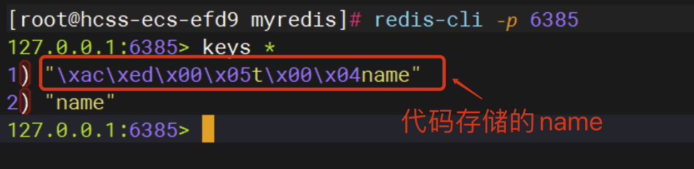
    我们发现,代码存储key="name"到了redis变了样,这是因为redis有自带的序列化器转化的时的问题!
    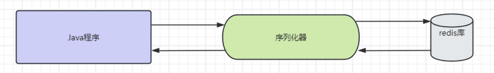
    序列化器配置位置和默认配置代码: 

```java
private @Nullable RedisSerializer<?> defaultSerializer;
private @Nullable ClassLoader classLoader;
//配置序列化器的四个位置
//key - value
private @Nullable RedisSerializer keySerializer = null;
private @Nullable RedisSerializer valueSerializer = null;
private @Nullable RedisSerializer hashKeySerializer = null;
private @Nullable RedisSerializer hashValueSerializer = null;

private RedisSerializer<String> stringSerializer = RedisSerializer.string();
//....
/**
  * Constructs a new <code>RedisTemplate</code> instance.
  */
public RedisTemplate() {}

@Override
public void afterPropertiesSet() {

    super.afterPropertiesSet();

    boolean defaultUsed = false;

    if (defaultSerializer == null) {
		//如果没有配置序列化器,使用的是jdk序列化器
        //将数据转成byte字节进行存储
        defaultSerializer = new JdkSerializationRedisSerializer(
            classLoader != null ? classLoader : this.getClass().getClassLoader());
    }

    if (enableDefaultSerializer) {

        if (keySerializer == null) {
            keySerializer = defaultSerializer;
            defaultUsed = true;
        }
        if (valueSerializer == null) {
            valueSerializer = defaultSerializer;
            defaultUsed = true;
        }
        if (hashKeySerializer == null) {
            hashKeySerializer = defaultSerializer;
            defaultUsed = true;
        }
        if (hashValueSerializer == null) {
            hashValueSerializer = defaultSerializer;
            defaultUsed = true;
        }
    }
	//....
    initialized = true;
}
```

`JdkSerializationRedisSerializer` 是 Spring Data Redis 提供的一种 Redis 数据序列化器，它的主要作用是将 Java 对象序列化为字节流，以便将其存储在 Redis 中，或者从 Redis 中读取字节流并反序列化为 Java 对象。 

2.  常见序列化器 

| 序列化器名                         | 作用                                   | 备注            |
| ---------------------------------- | -------------------------------------- | --------------- |
| JdkSerializationRedisSerializer    | 将数据转化字节流进行存储               | 默认            |
| GenericJackson2JsonRedisSerializer | jackson序列化器,数据进行json方式序列化 | 导入依赖jackson |
| StringRedisSerializer              | 字符串形式存储,一般用于key             | 注意utf-8格式   |


#### RedisTemplate序列化具体配置

```java
@Configuration
public class RedisTemplateConfig {

    @Bean
    public RedisTemplate<String, Object> redisTemplate(RedisConnectionFactory connectionFactory){
        // 创建RedisTemplate对象
        RedisTemplate<String, Object> template = new RedisTemplate<>();
        // 设置连接工厂
        template.setConnectionFactory(connectionFactory);
        // 创建JSON序列化工具
        GenericJackson2JsonRedisSerializer jsonRedisSerializer = 
            							new GenericJackson2JsonRedisSerializer();
        // 设置Key的序列化
        template.setKeySerializer(RedisSerializer.string());
        template.setHashKeySerializer(RedisSerializer.string());
        // 设置Value的序列化
        template.setValueSerializer(jsonRedisSerializer);
        template.setHashValueSerializer(jsonRedisSerializer);
        // 返回修改的模板对象
        return template;
    }
}
```

## RedisTemplate其他方法

> 测试使用redisTemplate其他的方法!


```java
@SpringBootTest(classes = Main.class)
public class SpringRedisTest {


    @Autowired
    private RedisTemplate redisTemplate;

    @Test
    public void testRedis2(){

        //字符串操作
        redisTemplate.opsForValue().set("name","zwf");
        Object name = redisTemplate.opsForValue().get("name");
        System.out.println("name = " + name);

        List list = new ArrayList<>();
        list.add("lucy");
        list.add("mary");
        redisTemplate.opsForValue().set("abc",list);
        System.out.println(redisTemplate.opsForValue().get("abc"));

        System.out.println("----------------------------------------------");

        //集合操作
        redisTemplate.opsForList().rightPushAll("names","1","2","3");
        List names = redisTemplate.opsForList().range("names", 0, -1);
        System.out.println("names = " + names);

        System.out.println("----------------------------------------------");

        // 存储哈希表
        String hashKey = "myHash";
        String field1 = "name";
        String value1 = "John";
        String field2 = "age";
        String value2 = "25";

        redisTemplate.opsForHash().put(hashKey, field1, value1);
        redisTemplate.opsForHash().put(hashKey, field2, value2);

        // 获取哈希表
        Object retrievedValue1 = redisTemplate.opsForHash().get(hashKey, field1);
        System.out.println("retrievedValue1 = " + retrievedValue1);
        Object retrievedValue2 = redisTemplate.opsForHash().get(hashKey, field2);
        System.out.println("retrievedValue2 = " + retrievedValue2);

        System.out.println("----------------------------------------------");

        // 存储集合
        String setKey = "mySet";
        value1 = "Apple";
        value2 = "Banana";
        String value3 = "Orange";
        redisTemplate.opsForSet().add(setKey, value1);
        redisTemplate.opsForSet().add(setKey, value2);
        redisTemplate.opsForSet().add(setKey, value3);
        // 获取集合
        Set<Object> retrievedSet = redisTemplate.opsForSet().members(setKey);
        System.out.println("Retrieved set: " + retrievedSet); // Output: Retrieved set: [Apple, Banana, Orange]

        System.out.println("----------------------------------------------");

        // 添加元素到 Sorted Set
        redisTemplate.opsForZSet().add("myZSet", "value1", 1.0);
        redisTemplate.opsForZSet().add("myZSet", "value2", 2.0);
        redisTemplate.opsForZSet().add("myZSet", "value3", 3.0);

        // 获取 Sorted Set 的元素数量
        Long size = redisTemplate.opsForZSet().size("myZSet");
        System.out.println("Sorted Set size: " + size);

        // 获取指定元素的分数
        Double score = redisTemplate.opsForZSet().score("myZSet", "value2");
        System.out.println("Value2 score: " + score);

        // 获取指定范围的元素（按分数排序）
        Set<String> range = redisTemplate.opsForZSet().range("myZSet", 0, -1);
        System.out.println("Sorted Set range: " + range);

        // 移除指定元素
        Long removedCount = redisTemplate.opsForZSet().remove("myZSet", "value1");
        System.out.println("Removed count: " + removedCount);
    }

}
```

## Redis Lua 脚本

### 什么是LUA

> 什么是LUA脚本

```latex
Lua 是一个小巧的[脚本语言](http://baike.baidu.com/item/脚本语言)，Lua脚本可以很容易的被C/C++ 代码调用，也可以反过来调用C/C++的函数，Lua并没有提供强大的库，一个完整的Lua解释器不过200k，所以Lua不适合作为开发独立应用程序的语言，而是作为嵌入式脚本语言。很多应用程序、游戏使用LUA作为自己的嵌入式脚本语言，以此来实现可配置性、可扩展性。这其中包括魔兽争霸地图、魔兽世界、博德之门、愤怒的小鸟等众多游戏插件或外挂。
```

> LUA脚本的优势


```
将复杂的或者多步的redis操作，写为一个脚本，一次提交给redis执行，减少反复连接redis的次数。提升性能。
LUA脚本是类似redis事务，有一定的原子性，不会被其他命令插队，可以完成一些redis事务性的操作。但是注意redis的lua脚本功能，只有在Redis 2.6以上的版本才可以使用。利用lua脚本淘汰用户，解决超卖问题。redis 2.6版本以后，通过lua脚本解决争抢问题，实际上是redis利用其单线程的特性，用任务队列的方式解决多任务并发问题。
```


### 创建SpringBoot工程

### 引入相关依赖

```xml
<parent>
    <groupId>org.springframework.boot</groupId>
    <artifactId>spring-boot-starter-parent</artifactId>
    <version>3.0.5</version>
</parent>

<dependencies>
    <dependency>
        <groupId>org.springframework.boot</groupId>
        <artifactId>spring-boot-starter-web</artifactId>
    </dependency>

    <dependency>
        <groupId>org.springframework.boot</groupId>
        <artifactId>spring-boot-starter-test</artifactId>
    </dependency>

    <dependency>
        <groupId>org.springframework.boot</groupId>
        <artifactId>spring-boot-starter-data-redis</artifactId>
    </dependency>
</dependencies>
```

### 创建配置文件

```properties
spring.data.redis.host=192.168.6.131
spring.data.redis.port=6379
```

### 创建LUA脚本

创建文件夹lua，创建脚本文件test.lua

> LUA脚本


```bash
local current = redis.call('GET', KEYS[1])
if current == ARGV[1]
  then redis.call('SET', KEYS[1], ARGV[2])
  return true
end
return false
```

### 创建配置类

```java
package com.redis;

import org.springframework.context.annotation.Bean;
import org.springframework.context.annotation.Configuration;
import org.springframework.core.io.ClassPathResource;
import org.springframework.core.io.Resource;
import org.springframework.data.redis.connection.RedisConnectionFactory;
import org.springframework.data.redis.core.RedisTemplate;
import org.springframework.data.redis.core.script.RedisScript;
import org.springframework.data.redis.serializer.GenericJackson2JsonRedisSerializer;
import org.springframework.data.redis.serializer.StringRedisSerializer;

@Configuration
public class AppRedisConfiguration  {

    //简单序列化
    @Bean
    public RedisTemplate<String,String> redisTemplate(RedisConnectionFactory factory) {
        RedisTemplate<String,String> redisTemplate = new RedisTemplate<>();
        redisTemplate.setConnectionFactory(factory);
        // 设置键序列化方式
        redisTemplate.setKeySerializer(new StringRedisSerializer());
        // 设置简单类型值的序列化方式
        redisTemplate.setValueSerializer(new StringRedisSerializer());
        // 设置默认序列化方式
        redisTemplate.setDefaultSerializer(new StringRedisSerializer());
        redisTemplate.afterPropertiesSet();
        return redisTemplate;
    }

    //加载lua脚本，设置返回值类型
    @Bean
    public RedisScript<Boolean> script() {
        Resource scriptSource = new ClassPathResource("lua/test.lua");
        return RedisScript.of(scriptSource, Boolean.class);
    }
    
    
}
```

### 创建测试类

```java
package com.redis;

import org.junit.jupiter.api.Test;
import org.springframework.beans.factory.annotation.Autowired;
import org.springframework.boot.test.context.SpringBootTest;
import org.springframework.data.redis.core.RedisTemplate;
import org.springframework.data.redis.core.script.RedisScript;

import java.util.Collections;
import java.util.List;

@SpringBootTest
public class TestLua {

    @Autowired
    private RedisScript<Boolean> script;

    @Autowired
    private RedisTemplate<String,String> redisTemplate;

    @Test
    public void test() {
        boolean flag = checkAndSet("hello","helloworld");
        System.out.println(flag ? "修改成功" : "修改失败");

        // 手工添加一个值，再试试
        redisTemplate.opsForValue().set("key", "hello");
        boolean flag1 = checkAndSet("world","hello");
        System.out.println(flag1 ? "修改成功" : "修改失败");
    }

    private boolean checkAndSet(String value1,String value2) {
        List<String> keyList = Collections.singletonList("key");
        return redisTemplate.execute(script, keyList, value1,value2);
    }
}
```

- RedisTemplate.execute说明


**RedisTemplate.execute需要传入三个值**


- **第一个参数 RedisScript script：** Lua脚本

- **第二个参数 List keys：**集合 
    - 如果是单个参数，使用这个可以转换为**单元素集合** 
        - Collections.singletonList(参数)；
    - 多参数 
        - `List<String> keys = Arrays.asList(key1, key2, key3);`
- **第三个参数 args：**ARGV，也就是其他类型参数

# Redis的持久化

## 持久化介绍

> 我们知道Redis是一个内存型数据库,内存的特性是掉电或者程序退出则不保存数据,但是经过实测我们发现,Redis重启服务后,之前存储的数据仍然在,那么这就是通过持久化的方式实现的.
>
> Redis 提供了2个不同形式的持久化方式。


-  RDB（Redis DataBase）定时数据快照 默认方式 
    - RDB持久化是一种周期性将Redis数据集快照保存到磁盘的机制。它会创建一个二进制文件（以`.rdb`为扩展名），其中包含了当前数据库中的所有键值对的快照。RDB持久化有以下特点： 
        - 快速恢复：RDB文件是一个快照，恢复时可以快速加载整个数据集，适合用于备份和灾难恢复。
        - 紧凑的文件格式：RDB文件采用二进制格式，文件相对较小，节省存储空间。
        - 高性能：由于RDB是周期性执行的快照操作，可以提供很好的性能，不会对数据库的读写操作产生额外的负担。
        - 可配置的触发机制：可以通过配置触发RDB持久化的方式，如根据时间间隔、写操作次数或者同时满足两者等。
-  AOF（Append Of File） 指令日志文件 手动开启 
    - AOF持久化通过将Redis的写操作追加到一个日志文件（Append-Only File）中来记录数据库状态的持久化方式。AOF文件以文本方式保存 Redis 数据库的操作命令，它可以通过重新执行这些命令来还原数据集。AOF持久化有以下特点： 
        - 高数据完整性：通过记录每个写操作命令，可以将数据库的状态完全还原。
        - 恢复方式灵活：可以选择完全根据AOF文件来还原数据库状态，也可以选择在启动时将AOF文件的内容重放到内存数据库中。
        - 默认是追加模式：在默认情况下，Redis以追加模式将写操作追加到AOF文件中，即使文件很大，也不会对系统性能产生明显影响。
        - 文件体积相对较大：由于AOF文件保存了系统的写操作历史，相比RDB文件，AOF文件的体积通常要大。
        - 可能会有较高的写入延迟：由于每个写操作都需要追加到AOF文件，如果AOF文件较大，可能会导致写入延迟增加。

## RDB持久化

### RDB简介

> 在指定的时间间隔内将内存中的数据集快照写入磁盘,也就是行话讲的Snapshot快照，它恢复时是将快照文件直接读到内存里.


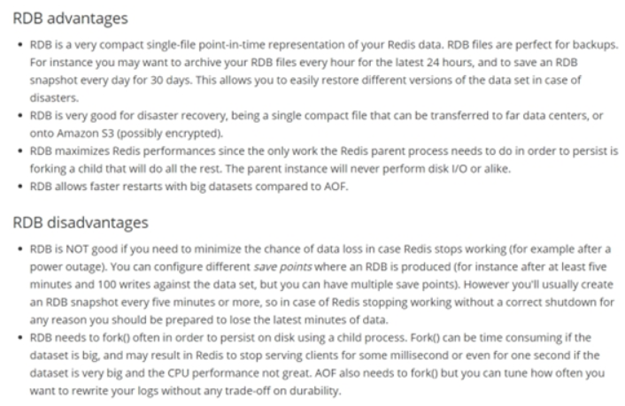

### RDB持久化流程

> 执行流程


    Redis会单独创建（fork）一个子进程来进行持久化，会先将数据写入到 一个临时文件中，待持久化过程都结束了，再用这个临时文件替换上次持久化好的文件。 整个过程中，主进程是不进行任何IO操作的，这就确保了极高的性能 如果需要进行大规模数据的恢复，且对于数据恢复的完整性不是非常敏感，那RDB方式要比AOF方式更加的高效。RDB的缺点是最后一次持久化后的数据可能丢失（服务器宕机，最后一次不会缓存，正常关闭会进行缓存）。

> Fork子进程


- Fork的作用是复制一个与当前进程一样的进程。新进程的所有数据（变量、环境变量、程序计数器等） 数值都和原进程一致，但是是一个全新的进程，并作为原进程的子进程
- 在Linux程序中，fork()会产生一个和父进程完全相同的子进程，但子进程在此后多会exec系统调用，出于效率考虑，Linux中引入了“写时复制技术”
- 一般情况父进程和子进程会共用同一段物理内存，只有进程空间的各段的内容要发生变化时，才会将父进程的内容复制一份给子进程。

> RDB持计划流程图


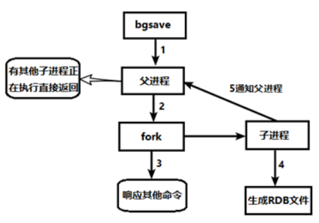

### RDB相关配置与操作

> RDB文件名配置


-  在redis.conf中配置文件名称，默认为dump.rdb

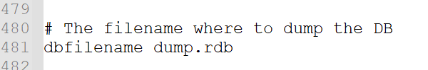

> RDB文件位置配置


- rdb文件的保存路径，也可以修改。默认为Redis启动时命令行所在的目录下.
- 可以通过修改该配置,将RDB文件存到系统的制定目录下dir "/root/myredis/"

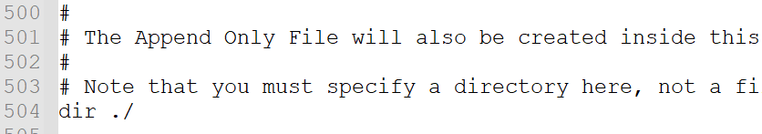

> RDB自动执行快照策略


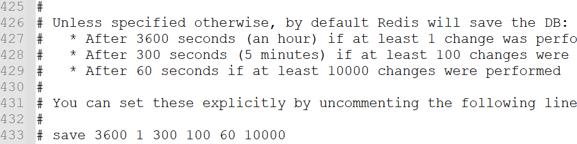

- save命令临时这只快照执行策略 
    -  格式：save 秒钟 写操作次数 RDB是整个内存的压缩过的Snapshot，RDB的数据结构，可以配置复合的快照触发条件， 默认是1分钟至少1万个key发生变化，或5分钟至少100个key发生变化，或1个小时至少1个key发生变化。 
    -  禁用 不设置save指令，或者给save传入空字符串 
    -  以下是一些常见的建议： 
        1. **保证数据安全**：至少设置一个`save`规则，以便在Redis发生意外情况（如未预料的断电、宕机等）时，能够通过RDB持久化文件恢复数据。
        2. **平衡性能和持久化频率**：过于频繁的RDB持久化操作可能对性能产生负面影响，因此需要在性能和数据安全之间进行平衡。可以根据系统负载、数据更新频率等因素来调整`save`规则的时间间隔和改变的键的数量。
        3. **避免数据丢失**：确保至少有一个`save`规则能够覆盖一段时间内的数据更新，以免数据丢失过多。
    -  例如，以下是一种常见的`save`规则配置： 

```
save 900 1      # 在900秒（15分钟）内，如果至少有1个键发生改变，则执行RDB持久化
save 300 10     # 在300秒（5分钟）内，如果至少有10个键发生改变，则执行RDB持久化
save 60 10000   # 在60秒内，如果至少有10,000个键发生改变，则执行RDB持久化
```

这个配置意味着在不同时间范围内，Redis会根据改变的键的数量执行RDB持久化操作，以实现数据的定期持久化和保护。
总之，`save`规则的设置应该根据具体的应用和业务需求进行调整，并在性能、数据安全和数据可用性之间进行权衡。
注意：在`save`指令中，时间参数（如900秒）是指Redis服务器从上一次成功执行持久化操作开始计时。 

> shuwRDB手动执行快照命令


-  save VS bgsave 
    - save ：使用主进行进行持久化指令,save时只管保存，其它不管，全部阻塞。手动保存。不建议。
    - bgsave：Redis会在后台异步进行快照操作，快照同时还可以响应客户端请求。
        可以通过lastsave 命令获取最后一次成功执行快照的时间
        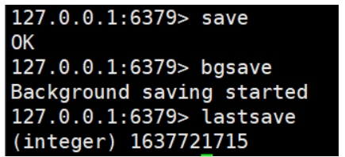
-  flushall命令 
    - 执行flushall命令，也会产生dump.rdb文件，但里面是空的，无意义
-  shutdown命令 
    - shutdown命令在关闭服务的时候也会进行自动的持久化

> RDB备份异常策略


- stop-writes-on-bgsave-error 配置 
    - 当Redis无法写入磁盘的话，直接关掉Redis的写操作。推荐yes.

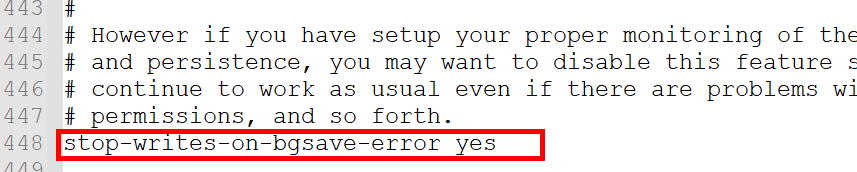

> RDB 文件压缩配置


- rdbcompression配置 
    - 对于存储到磁盘中的快照，可以设置是否进行压缩存储。如果是的话，redis会采用LZF算法进行压缩。如果你不想消耗CPU来进行压缩的话，可以设置为关闭此功能。推荐yes.
        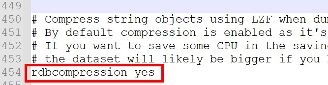

> RDB文件检查完整性配置


- rdbchecksum配置 
    - 在存储快照后，还可以让redis使用CRC64算法来进行数据校验，但是这样做会增加大约10%的性能消耗，如果希望获取到最大的性能提升，可以关闭此功能.推荐yes.

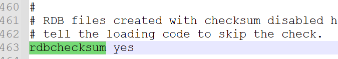

> RDB手动备份操作


-  查询rdb文件的目录 将 *.rdb的文件拷贝到别的地方 
-  rdb的恢复 
    -  关闭Redis 
    -  先把备份的文件拷贝到工作目录下 cp dump2.rdb dump.rdb 
    -  启动Redis, 备份数据会直接加载 

> RDB禁用操作


- 修改配置文件永久禁用

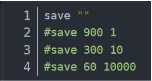

- 通过指令临时禁用

```
动态停止RDB：redis-cli config set save ""  save后给空值，表示禁用保存策略(不建议)
```

### RDB的优势和劣势

优势

- 适合大规模的数据恢复
- 对数据完整性和一致性要求不高更适合使用
- **节省磁盘空间**
- **恢复速度快**

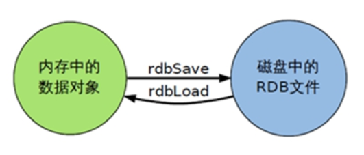

劣势

- Fork的时候，内存中的数据被克隆了一份，大致2倍的膨胀性需要考虑
- 虽然Redis在fork时使用了**写时拷贝技术**,但是如果数据庞大时还是比较消耗性能。
- 在备份周期在一定间隔时间做一次备份，所以如果Redis意外down掉的话，就会丢失最后一次快照后的所有修改。

### RDB总结

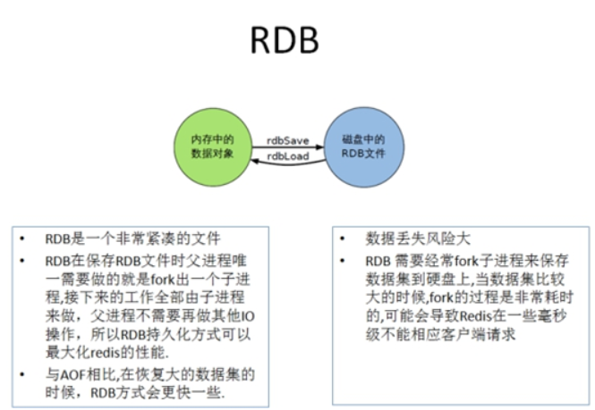

## AOF持久化

### AOF简介

       Append Only File 以日志的形式来记录每个写操作（增量保存），将Redis执行过的所有写指令记录下来(读操作不记录)， 只许追加文件但不可以改写文件，redis启动之初会读取该文件重新构建数据，换言之，redis 重启的话就根据日志文件的内容将写指令从前到后执行一次以完成数据的恢复工作

### AOF持计划流程

（1）客户端的请求写命令会被append追加到AOF缓冲区内；

（2）AOF缓冲区根据AOF持久化策略[always,everysec,no]将操作sync同步到磁盘的AOF文件中；

（3）AOF文件大小超过重写策略或手动重写时，会对AOF文件rewrite重写，压缩AOF文件容量；

（4）Redis服务重启时，会重新load加载AOF文件中的写操作达到数据恢复的目的；

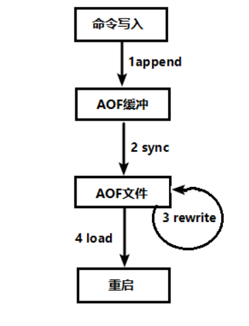

### AOF相关配置与操作

> AOF文件名配置


- 可以在redis.conf中配置文件名称，默认为 appendonly.aof

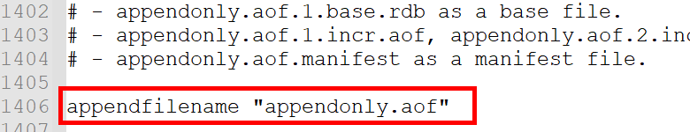

> AOF文件位置路径


- Redis6中，AOF文件的保存路径，同RDB的路径一致。
- Redis7有变化：

base：基本文件

incr：增量文件

manifest：清单文件

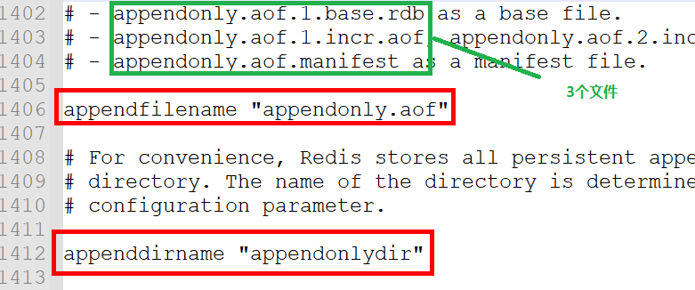

> AOF开启-修复-恢复操作


```
AOF的备份机制和性能虽然和RDB不同, 但是备份和恢复的操作同RDB一样，都是拷贝备份文件，需要恢复时再拷贝到Redis工作目录下，启动系统即加载。
```

-  正常恢复数据 
    -  修改默认的appendonly no，改为yes,开启AOF方式
        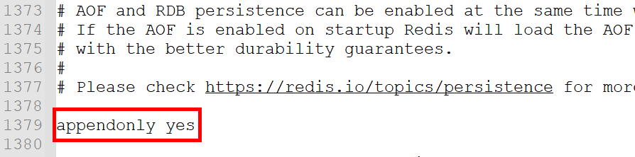
    -  将有数据的aof文件复制一份保存到对应目录(查看目录：config get dir) 
    -  恢复：重启redis然后重新加载 
-  异常修复数据 
    -  修改默认的appendonly no，改为yes 
    -  如遇到AOF文件损坏，通过/usr/local/bin/redis-check-aof --fix appendonly.aof.1.incr.aof进行恢复 
    -  备份被写坏的AOF文件 
    -  恢复：重启redis，然后重新加载 

> AOF同步频率设置


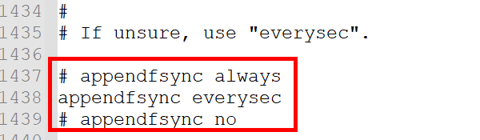

-  appendfsync always 
    - 始终同步，每次Redis的写入都会立刻记入日志；性能较差但数据完整性比较好
-  appendfsync everysec 
    - 每秒同步，每秒记入日志一次，如果宕机，本秒的数据可能丢失。
-  appendfsync no 
    - redis不主动进行同步，把同步时机交给操作系统。

> AOF压缩配置


-  什么是文件压缩 rewrite重写? 

```
AOF采用文件追加方式，文件会越来越大为避免出现此种情况，新增了重写机制, 当AOF文件的大小超过所设定的阈值时，Redis就会启动AOF文件的内容压缩， 只保留可以恢复数据的最小指令集.可以使用命令bgrewriteaof!
```


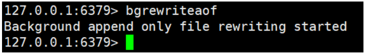

效果：

原始数据：

```
  SET key1 value1
  SET key2 value2
  SET key3 value3
  ...
  SET key100000 value100000
```

这个AOF文件包含了10万个`SET`命令，每个命令都以完整的形式记录在文件中。文件的大小可能相对较大。

执行`BGREWRITEAOF`命令重写AOF文件后，新生成的AOF文件可能会被优化如下：

压缩数据：

```
  *10\r\n
  $3\r\nSET\r\n
  $4\r\nkey1\r\n
  $6\r\nvalue1\r\n
  $3\r\nSET\r\n
  $4\r\nkey2\r\n
  $6\r\nvalue2\r\n
  ...
  $3\r\nSET\r\n
  $6\r\nkey100000\r\n
  $8\r\nvalue100000\r\n
```

新的AOF文件采用了类似于RESP（REdis Serialization Protocol）的格式，使用更紧凑的表示方式。这里使用了特殊的RESP表示法来表示命令参数，其中`*`表示参数数量，`$`表示参数长度，`\r\n`表示参数结束。

通过这种优化方式，新的AOF文件相对于原始AOF文件可能会更小，因为相同的命令参数被重复使用，并且使用了更紧凑的格式。

这种优化的效果在于减小AOF文件的体积和提高读取性能。AOF文件越小，加载和恢复数据所需的时间就越短，而且读取AOF文件时无需解压缩，可以更快地恢复数据。

需要注意的是，优化的效果会受到AOF文件中命令种类和数量的影响。一些特定情况下，比如AOF文件中存在大量相同的命令，优化效果可能会更加显著。但是，如果AOF文件中包含很少的重复命令或者大量不同类型的命令，优化效果可能相对较小。

总之，通过进行AOF文件重写和优化，Redis可以使用更紧凑的表示方式来减小AOF文件的大小，提高读取性能，并在加载AOF文件时更快地恢复数据。

-  重写策略设置! 
    -  no-appendfsync-on-rewrite 设置重写策略 

```
在 AOF 重写期间，Redis 会将新的写命令追加到新的 AOF 文件中，同时也会将这些写命令同步到磁盘（执行文件同步操作）。这样可以确保数据的持久性，但也会带来一定的性能损耗，因为磁盘同步是比较慢的操作。

通过设置 no-appendfsync-on-rewrite 为 "yes"，Redis 在 AOF 重写过程中将不会执行文件同步操作。这意味着重写期间新的写命令只会追加到新的 AOF 文件中，而不会立即同步到磁盘。这样可以提高 AOF 重写的性能!但是数据安全性低!
no-appendfsync-on-rewrite 默认情况下，该选项为 "no"，即执行文件同步操作以确保数据的持久性。数据安全,但是性能低!
```


-  何时自动触发重写? 

```
Redis会记录上次重写时的AOF大小，默认配置是当AOF文件大小是上次rewrite后大小的一倍且文件大于64M时触发,重写虽然可以节约大量磁盘空间，减少恢复时间。但是每次重写还是有一定的负担的，因此设定Redis要满足一定条件才会进行重写。
```


   - auto-aof-rewrite-percentage : 100% 设置重写基准值的百分比 
     - 该配置选项表示 AOF 文件大小相对于上次重写后的大小的增长百分比。默认值为 100，表示当 AOF 文件的大小增长到上次重写后大小的两倍时，将触发自动 AOF 重写。
   - auto-aof-rewrite-min-size : 100MB 设置重写基准值 
     - 该配置选项表示 AOF 文件的最小大小阈值。默认值为 64MB。即使 AOF 文件的增长百分比超过了 `auto-aof-rewrite-percentage` 的设定值，但如果 AOF 文件的大小仍然低于 `auto-aof-rewrite-min-size`，则不会触发自动 AOF 重写。

```
例如：文件达到70MB开始重写，降到50MB，下次什么时候开始重写？100MB
系统载入时或者上次重写完毕时，Redis会记录此时AOF大小，设为base_size,如果Redis的AOF当前大小>= base_size +base_size*100% (默认)且当前大小>=64mb(默认)的情况下，Redis会对AOF进行重写。
```

-  重写的流程是? 
    - （1）bgrewriteaof触发重写，判断是否当前有bgsave或bgrewriteaof在运行，如果有，则等待该命令结束后再继续执行。
    - （2）主进程fork出子进程执行重写操作，保证主进程不会阻塞。
    - （3）子进程遍历redis内存中数据到临时文件，客户端的写请求同时写入aof_buf缓冲区和aof_rewrite_buf重写缓冲区,保证原AOF文件完整以及新AOF文件生成期间的新的数据修改动作不会丢失。
    - （4）子进程写完新的AOF文件后，向主进程发信号，父进程更新统计信息。
    - （5）使用新的AOF文件覆盖旧的AOF文件，完成AOF重写。

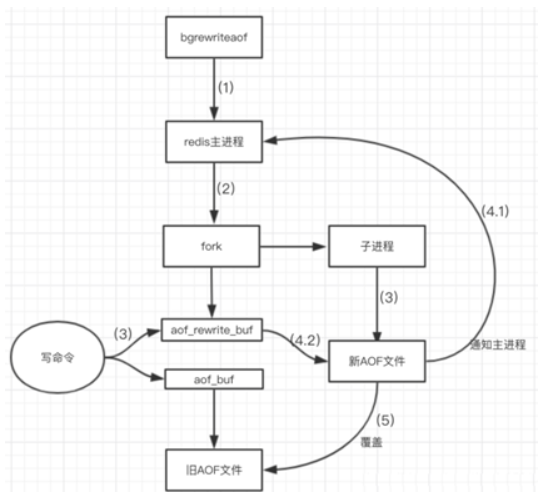

### AOF的优势和劣势

优势

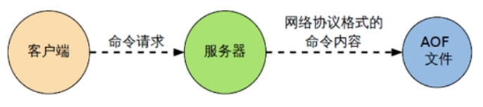

- 备份机制更稳健，丢失数据概率更低。
- 可读的日志文本，通过操作AOF稳健，可以处理误操作。

劣势

- 比起RDB占用更多的磁盘空间。
- 恢复备份速度要慢。
- 每次读写都同步的话，有一定的性能压力。
- 存在个别Bug，造成无法恢复。

### AOF总结

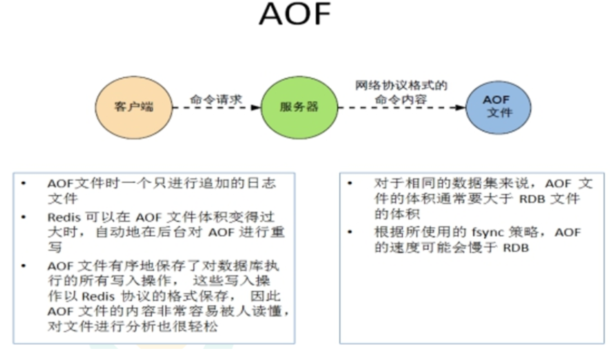

### 持久化方案选择

> RDB和AOP用哪个好?


- 官方推荐两个都启用。
- 如果对数据不敏感，可以选单独用RDB。
- 不建议单独用 AOF，因为可能会出现Bug。
- 如果只是做纯内存缓存，可以都不用。
- AOF和RDB如果同时开启,系统默认取AOF中的持久化数据

> 官网建议


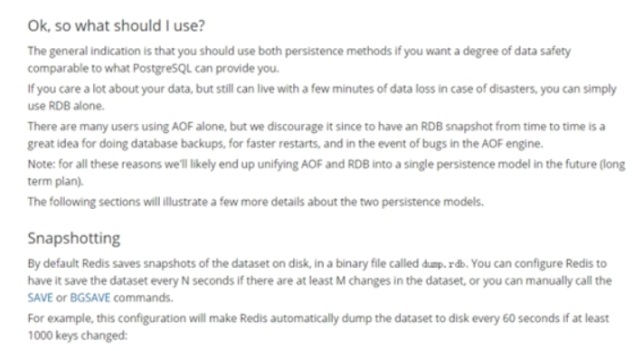

-  RDB持久化方式能够在指定的时间间隔能对你的数据进行快照存储 
-  AOF持久化方式记录每次对服务器写的操作,当服务器重启的时候会重新执行这些命令来恢复原始的数据,AOF命令以redis协议追加保存每次写的操作到文件末尾. 
-  Redis还能对AOF文件进行后台重写,使得AOF文件的体积不至于过大 
-  只做缓存：如果你只希望你的数据在服务器运行的时候存在,你也可以不使用任何持久化方式. 
-  同时开启两种持久化方式 
-  在这种情况下,当redis重启的时候会优先载入AOF文件来恢复原始的数据, 因为在通常情况下AOF文件保存的数据集要比RDB文件保存的数据集要完整. 
-  RDB的数据不实时，同时使用两者时服务器重启也只会找AOF文件。那要不要只使用AOF呢？ 
-  建议不要，因为RDB更适合用于备份数据库(AOF在不断变化不好备份)， 快速重启，而且不会有AOF可能潜在的bug，留着作为一个万一的手段。 
-  性能建议
    因为RDB文件只用作后备用途，建议只在Slave上持久化RDB文件，而且只要15分钟备份一次就够了，只保留save 900 1这条规则。
    如果使用AOF，好处是在最恶劣情况下也只会丢失不超过两秒数据，启动脚本较简单只load自己的AOF文件就可以了。
    代价,一是带来了持续的IO，二是AOF rewrite的最后将rewrite过程中产生的新数据写到新文件造成的阻塞几乎是不可避免的。
    只要硬盘许可，应该尽量减少AOF rewrite的频率，AOF重写的基础大小默认值64M太小了，可以设到5G以上。
    默认超过原大小100%大小时重写可以改到适当的数值。 

# Redis主从复制

## 什么是主从复制

> 主机数据更新后根据配置和策略， 自动同步到备机的master/slaver机制，Master以写为主，Slave以读为主


## 主从复制的作用

- 读写分离，性能扩展
- 容灾快速恢复

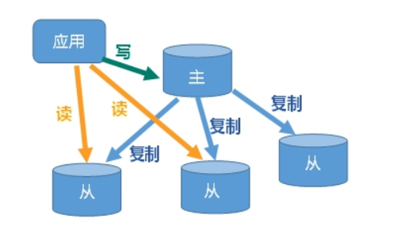

## 主从复制具体操作

### （1）实现思路

-  1 一个redis服务作为主机,主要负责写操作 
-  2 两个redis服务作为从机,主要负责读操作 
-  3 从机自动从主机同步数据下来 
-  4 从机主动找主机,而主机不会找从机 
-  5 正常来说主机和从机应该在不同的IP上开启redis服务,我们为了快速模拟,可以在一台机器上模拟出三个redis服务即可 

### （2） 一台机器上启动多个redis服务

- 使用redis-server启动服务时,要以来redis.conf配置文件.那么我们可以准备三个redis.conf文件,用来配置三个不同的服务,启动三次分别以来三个不同的服务即可

### （3）新建三个redis配置文件

**用于定义每个服务的专属配置**

-  新建redis6379.conf
    关闭aof功能
    

```
include /root/myredis/redis.conf
pidfile /var/run/redis_6379.pid
port 6379
dbfilename dump6379.rdb
```

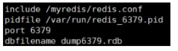

   - 含义介绍

```
include /root/myredis/redis.conf # 引入共同的配置
pidfile /var/run/redis_6379.pid # 使用独立的进程文件
port 6379 # 设置当前服务的端口号
dbfilename dump6379.rdb # 使用独立的RDB持久化文件  暂时不适用AOP持久化
```

-  新建redis6380.conf
    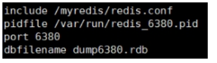
-  新建redis6381.conf
    
    - 在redis6381中多添加一个配置,设置从机的优先级，值越小，优先级越高，用于选举主机时使用。默认100


### （4）启动三个服务

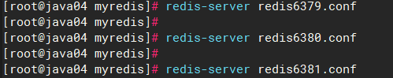

### （5）查看启动服务进程

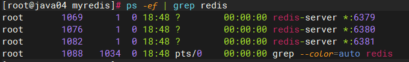

### （6）使用info replication查看主从相关信息

- 连接redis，使用：redis-cli -p 端口号
- 执行 info replication查看信息

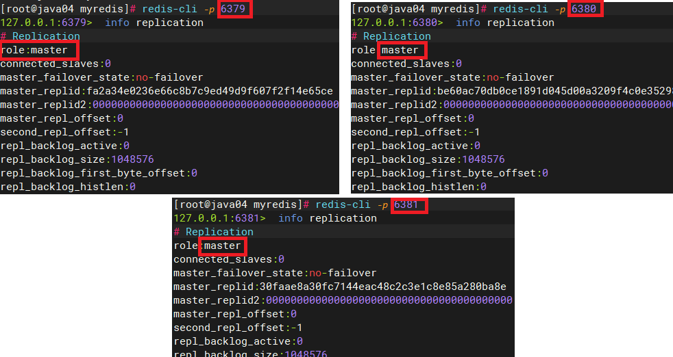

### （7） 配置主从机器

-  配从不配主,是让从机主动去找主机 
-  在6380 和6381的机器上执行如下命令 

```
slaveof 127.0.0.1 6379
```


-  执行完毕再次查看主从配置信息
    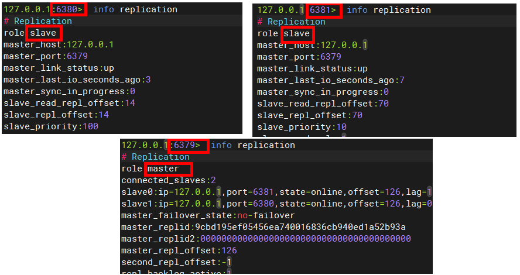

### （8）测试主从读写操作

-  主机上写入数据OK 
-  在从机上写数据报错
    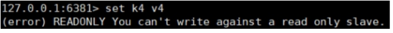
-  主机宕机,重启即可恢复主从状态,无需其他操作 
-  从机宕机,重启后需要重新执行 slaveof 127.0.0.1 6379 才能恢复 
-  从机可以在配置文件中写入slaveof 127.0.0.1 6379 ,这样重启无需手动输入slaveof 127.0.0.1 6379就可以恢复从机状态 

## 主从复制原理

- Slave启动成功连接到master后会发送一个sync命令
- Master接到命令启动后台的存盘进程，同时收集所有接收到的用于修改数据集命令， 在后台进程执行完毕之后，master将传送整个数据文件到slave,以完成一次完全同步
- 全量复制：而slave服务在接收到数据库文件数据后，将其存盘并加载到内存中。
- 增量复制：Master继续将新的所有收集到的修改命令依次传给slave,完成同步
- 但是只要是重新连接master,一次完全同步（全量复制)将被自动执行

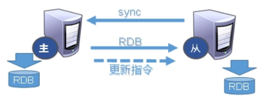

## 主从复制三种模式

> 第一种 一主二仆


- 问题1: 切入点问题,slave1、slave2是从头开始复制还是从切入点开始复制?比如从k4进来，那之前的k1,k2,k3是否也可以复制？[全量复制 第一次]
- 问题2 :从机是否可以写？set可否？  [不可以]
- 问题3:主机shutdown后情况如何？从机是上位还是原地待命？ [从机还是小弟]
- 问题4:主机又回来了后，主机新增记录，从机还能否顺利复制？ [可以]
- 问题5:其中一台从机down后情况如何？依照原有它能跟上大部队吗(还会自动变为从机吗?)？ [15 断了在连一下slaveof ]

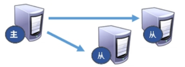

> 第二种 薪火相传


```
上一个Slave可以是下一个slave的Master，Slave同样可以接收其他 slaves的连接和同步请求，那么该slave作为了链条中下一个的master, 可以有效减轻master的写压力,去中心化降低风险。用 slaveof  <ip><port>
中途变更转向:会清除之前的数据，重新建立拷贝最新的,风险是一旦某个slave宕机，后面的slave都没法备份,主机挂了，从机还是从机，无法写数据了
```

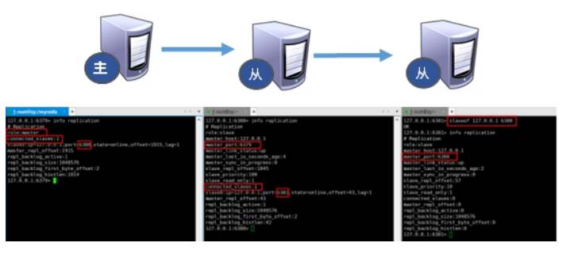

> 第三种 反客为主


- 当一个master宕机后，后面的slave可以立刻升为master，其后面的slave不用做任何修改。用 slaveof no one  将从机变为主机。

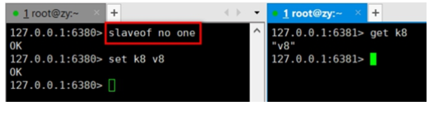

## 哨兵模式

### 哨兵模式简介

> 反客为主的自动版，能够后台监控主机是否故障，如果故障了根据投票数自动将从库转换为主库


### 哨兵模式的使用步骤

#### （1）第一步: 设置简单的一主二仆

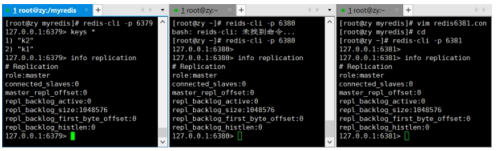

#### （2）第二步: 为哨兵模式准备配置文件

-  在/root/myredis 目录下新建sentinel.conf 配置文件中放入如下内容 

```latex
sentinel monitor mymaster 127.0.0.1 6379 1
```


-  其中mymaster为监控对象起的服务器名称， 1 为至少有多少个哨兵同意迁移的数量。 
-  注意: 此处的ip地址可以测试127系列,也可以是真实系列,建议配置成真实系列!   

#### （3）第三步: 启动哨兵

-  运行/usr/local/bin 下 redis-sentinel 命令,执行/root/myredis/sentinel.conf配置文件 

```latex
redis-sentinel /root/myredis/sentinel.conf
```


-  redis做压测可以用自带的redis-benchmark工具   

### 6.3 哨兵模式的操作演示

#### （1）主机宕机演示

```
当主机宕机,会从从机中选择一个作为新的主机,根据优先级slave-properity, 原主机重启后会成为从机
```

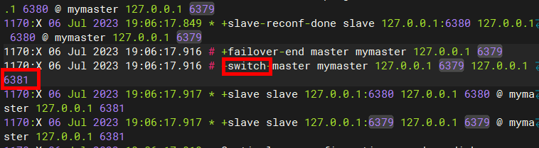

#### （2）复制延时

```
由于所有的写操作都是先在Master上操作，然后同步更新到Slave上，所以从Master同步到Slave机器有一定的延迟，当系统很繁忙的时候，延迟问题会更加严重，Slave机器数量的增加也会使这个问题更加严重。
```

#### （3）故障恢复

-  优先级在redis.conf中默认：replica-priority 100，值越小优先级越高 
-  偏移量是指获得原主机数据最全的
    在 Redis 中，复制偏移量（Replication Offset）是用于表示从节点与主节点之间数据同步的进度的一个重要指标。它是一个递增的整数值，用于记录从节点复制主节点数据时已经复制的字节数量。
    复制偏移量越高，说明从节点复制主节点的数据越完整，数据同步得越快。 
-  每个redis实例启动后都会随机生成一个40位的runid 

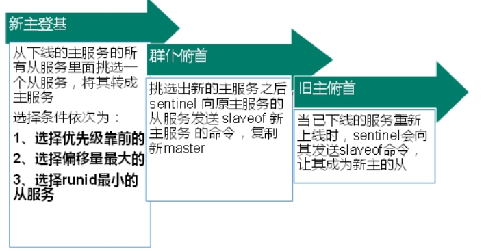

## RedisTemplate连接哨兵模式

### 导入依赖

```xml
<dependencies>
    <!-- 基本启动 starter - autoconfigure - 142配置类  web-->
    <dependency>
        <groupId>org.springframework.boot</groupId>
        <artifactId>spring-boot-starter-web</artifactId>
    </dependency>

    <dependency>
        <groupId>org.springframework.boot</groupId>
        <artifactId>spring-boot-starter-test</artifactId>
    </dependency>

    <dependency>
        <groupId>org.springframework.boot</groupId>
        <artifactId>spring-boot-starter-data-redis</artifactId>
    </dependency>

    <!-- 连接池-->
    <dependency>
        <groupId>org.apache.commons</groupId>
        <artifactId>commons-pool2</artifactId>
    </dependency>

</dependencies>
```

### 哨兵配置

```yaml
spring:
  data:
    redis:
      client-type: lettuce
      lettuce:
        pool:
          enabled: true
          max-active: 8
          max-idle: 5
          max-wait: 100
      sentinel:
        # 哨兵名称
        master: mymaster
        # 哨兵地址,集群继续配置多个
        nodes:
          - 192.168.6.100:26379
```

### 读写策略配置

```java
@Configuration
public class RedisTemplateConfig {

    @Bean
    public RedisTemplate<String, Object> redisTemplate(RedisConnectionFactory connectionFactory){
        // 创建RedisTemplate对象
        RedisTemplate<String, Object> template = new RedisTemplate<>();
        // 设置连接工厂
        template.setConnectionFactory(connectionFactory);
        // 创建JSON序列化工具
        GenericJackson2JsonRedisSerializer jsonRedisSerializer =
            							new GenericJackson2JsonRedisSerializer();
        // 设置Key的序列化
        template.setKeySerializer(RedisSerializer.string());
        template.setHashKeySerializer(RedisSerializer.string());
        // 设置Value的序列化
        template.setValueSerializer(jsonRedisSerializer);
        template.setHashValueSerializer(jsonRedisSerializer);
        // 返回
        return template;
    }


    /**
     * 配置主和从节点访问策略
     * - MASTER：从主节点读取
     * - MASTER_PREFERRED：优先从master节点读取，master不可用才读取replica
     * - REPLICA：从slave（replica）节点读取
     * - REPLICA _PREFERRED：优先从slave（replica）节点读取，所有的slave都不可用才读取master
     * @return
     */
    @Bean
    public LettuceClientConfigurationBuilderCustomizer clientConfigurationBuilderCustomizer(){
        //设置访问策略值
        return clientConfigurationBuilder -> clientConfigurationBuilder.readFrom(ReadFrom.REPLICA_PREFERRED);
    }
}
```

# Redis集群操作

## 目前面临问题分析

- 容量不够，redis如何进行扩容？
- 并发写操作， redis如何分摊？
- 另外，主从模式，薪火相传模式，主机宕机，导致ip地址发生变化，应用程序中配置需要修改对应的主机地址、端口等信息。
- 之前通过代理主机来解决，但是redis3.0中提供了解决方案。就是无中心化集群配置。

## 什么是集群

> Redis 集群实现了对Redis的水平扩容，即启动N个redis节点，将整个数据库分布存储在这N个节点中，每个节点存储总数据的1/N。


> Redis 集群通过分区（partition）来提供一定程度的可用性（availability ）：即使集群中有一部分节点失效或者无法进行通讯，集群也可以继续处理命令请求。


## 集群的搭建

### （1）第一步,搭建前的准备

- 之前操作产生的rdb和aof文件删除
- appendonly 修改回 no
- 清空主从复制和哨兵模式留下的一些文件
- 开启daemonize yes
- protected-mode no
- 注释掉bind

### （2）第二步,制作六个实例的配置文件

-  集群开启命令 

```latex
redis-cli --cluster create --cluster-replicas 1 
--cluster create：该命令参数表明你要创建一个 Redis 集群。Redis 集群是由多个 Redis 节点组成的分布式系统，用于实现高可用性和横向扩展。通过指定 create 参数，你告诉 redis-cli 工具你想要创建一个 Redis 集群。
--cluster-replicas 1：该命令参数指定了每个主节点应该具有的副本数。在 Redis 集群中，每个主节点可以有若干个从节点作为其副本，用于提供数据冗余和故障转移。通过设置 --cluster-replicas 1，你告诉 redis-cli 工具每个主节点应该有一个从节点副本。
```


-  集群配置文件 

```latex
include /root/myredis/redis.conf #引用公共的配置文件
port 6379 # 设置端口号
pidfile "/var/run/redis_6379.pid" # 设置pid进程文件
dbfilename "dump6379.rdb" # 设置rdb持久化问价名
cluster-enabled yes # 开启集群
cluster-config-file nodes-6379.conf # 设置集群使用的结点文件名
cluster-node-timeout 15000 # 设置结点失联时间
```


-  创建6379 6380 6381  6389 6390 6391 六个结点的配置文件 

```latex
创建一个配置文件后,进行复制即可,然后再vim下,通过 :%s/6379/目标端口 来批量替换每个配置文件中的端口号
```

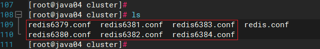

### （3）第三步,启动六个服务

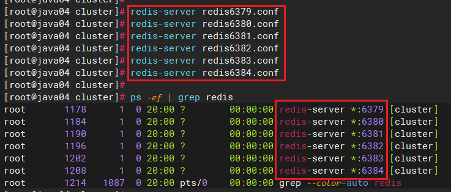

- 组合之前，请确保所有redis实例启动后，nodes-xxxx.conf文件都生成正常。

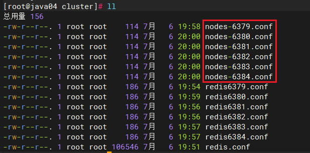

### （4）第四步 ,将六个服务合并为一个集群

-  切换目录到redis的src下 

```latex
cd /opt/redis-7.0.10/src
```


-  运行如下指令 

```latex
redis-cli --cluster create --cluster-replicas 1 192.168.6.131:6379 192.168.6.131:6380 192.168.6.131:6381 192.168.6.131:6382 192.168.6.131:6383 192.168.6.131:6384
ifconfig -> 192.168.6.100  云服务器 不能用公网ip  / 内网ip
```

**此处不要用127.0.0.1， 请用真实IP地址    --replicas 1 采用最简单的方式配置集群，一台主机，一台从机，正好三组。** 

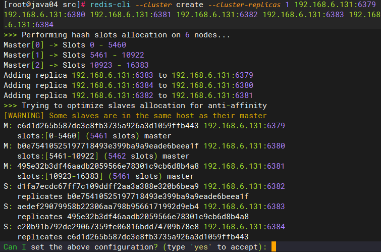

输入 yes 继续

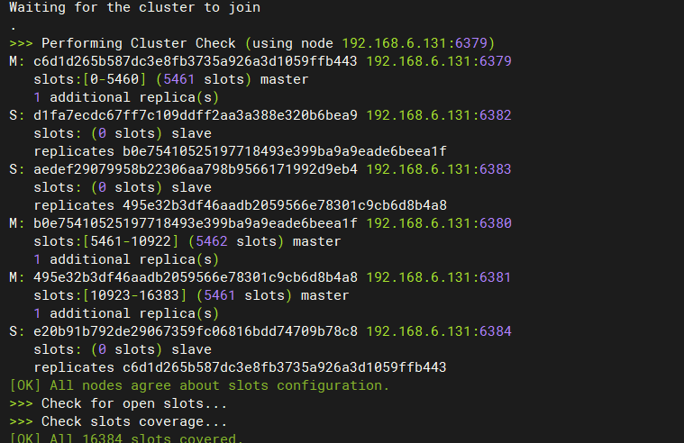

## 集群的登录

### （1）集群登录方式


- 登录指令添加 -c 代表以集群方式登录

### （2）登录后查看集群信息

-  一个集群至少要有三个主节点。选项 --cluster-replicas 1 表示我们希望为集群中的每个主节点创建一个从节点。 
-  分配原则尽量保证每个主数据库运行在不同的IP,每个从库和主库不在一个IP地址上。 

```latex
cluster nodes
```


## 集群的slots


- 一个 Redis 集群包含 16384 个插槽（hash slot）， 数据库中的每个键都属于这 16384 个插槽的其中一个，
- 集群使用公式 CRC16(key) % 16384 来计算键 key 属于哪个槽， 其中 CRC16(key) 语句用于计算键 key 的 CRC16 校验和 。
- 集群中的每个节点负责处理一部分插槽。 举个例子， 如果一个集群可以有主节点， 其中： 
    - 节点 A 负责处理 0 号至 5460 号插槽。
    - 节点 B 负责处理 5461 号至 10922 号插槽。
    - 节点 C 负责处理 10923 号至 16383 号插槽。

## 集群中录入值

- 在redis-cli每次录入、查询键值，redis都会计算出该key应该送往的插槽，如果不是该客户端对应服务器的插槽，redis会报错，并告知应前往的redis实例地址和端口。
- redis-cli客户端提供了 –c 参数实现自动重定向。
- 如 redis-cli -c –p 6379 登入后，再录入、查询键值对可以自动重定向。


-  不在一个slot下的键值，是不能使用mget,mset等多键操作。 
-  可以通过{}来定义组的概念，从而使key中{}内相同内容的键值对放到一个slot中去。 


## 集群中查找值

- cluster keyslot key 计算key应该保存在那个插槽
- cluster countkeysinslot slot的值 计算某个插槽中保存的key的数量
- CLUSTER GETKEYSINSLOT <slot><count> 返回 count 个 slot 槽中的键。


## 集群故障恢复

- 如果主节点下线？从节点能否自动升为主节点？注意：**15秒超时**


- 主节点恢复后，主从关系会如何？主节点回来变成从机。


- 如果所有某一段插槽的主从节点都宕掉，redis服务是否还能继续? 
    - redis.conf中cluster-require-full-coverage 为yes 那么 ，整个集群都挂掉
    - redis.conf中cluster-require-full-coverage 为no 那么，只有该插槽数据全都不能使用。

## 集群提供的好处

- 实现扩容
- 分摊压力
- 无中心配置相对简单

## 集群的不足

- 多键操作是不被支持的 {key}
- 多键的Redis事务是不被支持的。lua脚本不被支持 {key}

## RedisTemplate的集群配置

> 本地虚拟机可以配置集群,云服务器集群后面需要负载均衡等特殊处理暂时不可链接!


```yaml
spring:
  redis:
    cluster:
      nodes:
        - 集群ip:端口[6]
        - 集群ip:端口

# 如果是properties格式
spring.redis.cluster.nodes=ip:端口,ip:端口....
```