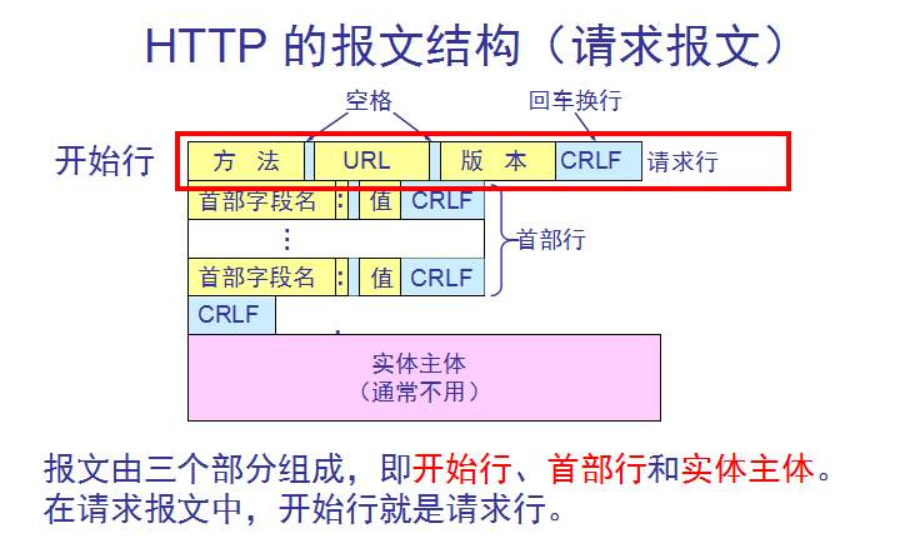
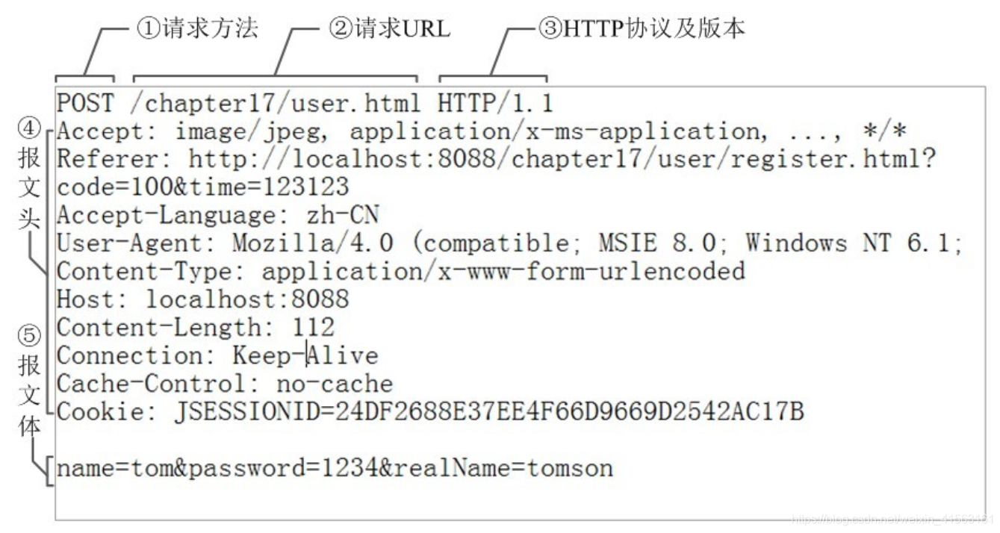
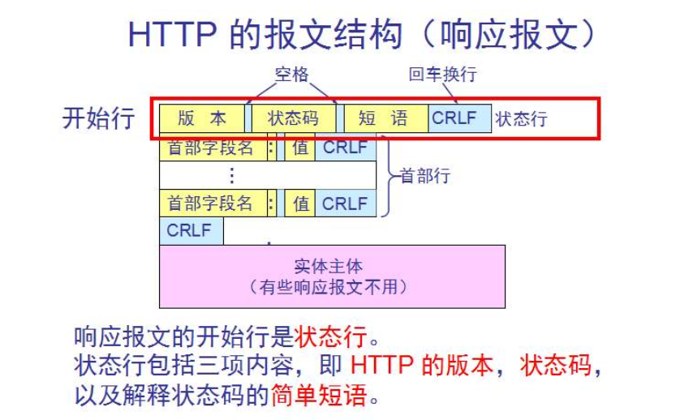
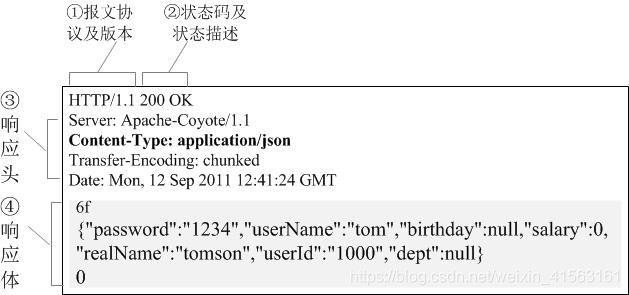
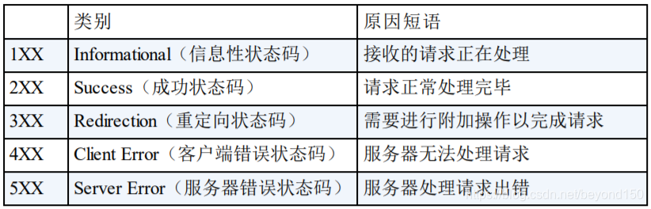

# JAVAWEB

## JAVAWEB的CS和BS模式

> CS模式：  Client-Server模式/客户端-服务端模式，该模式特点如下。

   1. 程序分两部分，一部分是客户端需要安装的程序，一部分是要部署在服务器上的程序；
   2. 用户需要在硬件设备或者操作系统中，下载安装特定的客户端程序才可以使用；
   3. 程序运行的压力由客户端和服务端共同承担；
   4. 可以借助客户端运算资源，对数据继续处理，一般可以有较好的画质和展现效果；
   5. 程序更新时，往往需要同时更新客户端和服务端两部分；
   6. 跨平台性能一般，不同的平台未必都有对应的客户端程序；
   7. 开发成本较高，要开发服务端和客户端程序，要为不同的客户端开发不同客户端程序；
> BS模式 Browser-Server模式：

1 程序就一部分，只要部署在服务器上即可；
2 无论用户使用什么设备和操作系统，只要有一个安装任意一款浏览器即可；
3 程序运行的压力主要由服务端承担；
4 客户端承担的计算压力小，可以对数据进行简单的继续处理，但是不像CS模式那些可以获得较好的画质和展现效果；
5 程序更新时，只需要同时服务端部分；
6 跨平台性能优秀，只要有一个浏览器，到处都可以使用；
7 开发成本略低，不必为不同的客户端开发不同客户端程序；
> 模式选择：对于JAVA程序员来说，开发的是服务端代码，所有无论前端是何种类型的客户端，只要按照接口文档要求开发后端功能即可，前后端分离模式下，我们可以在几乎不接触前端的状态下完成开发。

## JAVAWEB实现前后端分离
> 非前后端分离：

- 1 开发不分离： 程序员既要编写后端代码，又要去修改甚至编写前端代码，程序员的工作压力较大。
- 2 部署不分离：使用了后端动态页面技术(JSP,Thymeleaf等)，前端代码不能脱离后端服务器环境，必须部署在一起。
> 前后端分离：

- 1 开发分离：后端程序员只要按照接口文档去编写后端代码，无需编写或者关系前端代码，前后端程序员压力都降低。
- 2 部署分离：前端使用单独的页面动态技术，通过VUE等框架，工程化项目，前端项目可以部署到独立的服务器上。
## web项目中静态和动态资源

```
c.  静态资源，不需要服务器执行，直接返回即可， 由浏览器解析执行

d.  静态资源，它需要根据他的文件地址直接访问

e.  动态资源，需要服务器执行，将执行的结果，返回给浏览器显示

f.  动态资源，不能根据他的文件地址进行访问，需要设定特定的地址，访问特定地址，tomcat会执行动态资源
```


## xml
> XML是EXtensible Markup Language的缩写，翻译过来就是可扩展标记语言。所以很明显，XML和HTML一样都是标记语言，也就是说它们的基本语法都是标签。


-  **可扩展**：三个字表面上的意思是XML允许自定义格式。但这不代表你可以随便写； 
-  在XML基本语法规范的基础上，你使用的那些第三方应用程序、框架会通过XML约束的方式强制规定配置文件中可以写什么和怎么写； 
-  XML基本语法这个知识点的定位是：`**我们不需要从零开始，从头到尾的一行一行编写XML文档，而是在第三方应用程序、框架已提供的配置文件的基础上修改。**`要改成什么样取决于你的需求，而怎么改取决XML基本语法和具体的XML约束； 

## HTTP协议

**HTTP 超文本传输协议** (HTTP-Hyper Text transfer protocol)，是一个属于应用层的面向对象的协议，由于其简捷、快速的方式，适用于分布式超媒体信息系统。它于1990年提出，经过十几年的使用与发展，得到不断地完善和扩展。**它是一种详细规定了浏览器和万维网服务器之间互相通信的规则**，通过因特网传送万维网文档的数据传送协议。客户端与服务端通信时传输的内容我们称之为**报文**。**HTTP协议规定了报文的格式。**HTTP就是一个通信规则，这个规则规定了客户端发送给服务器的报文格式，也规定了服务器发送给客户端的报文格式。实际我们要学习的就是这两种报文。**客户端发送给服务器的称为"请求报文"**，**服务器发送给客户端的称为"响应报文"**。

### HTTP协议的会话方式

- 在浏览器中输入指定网页的 URL。
- 浏览器通过 DNS 协议，获取域名对应的 IP 地址。
- 浏览器根据 IP 地址和端口号，向目标服务器发起一个 TCP 连接请求。
- 浏览器在 TCP 连接上，向服务器发送一个 HTTP 请求报文，请求获取网页的内容。
- 服务器收到 HTTP 请求报文后，处理请求，并返回 HTTP 响应报文给浏览器。
- 浏览器收到 HTTP 响应报文后，解析响应体中的 HTML 代码，渲染网页的结构和样式，同时根据 HTML 中的其他资源的 URL（如图片、CSS、JS 等），再次发起 HTTP 请求，获取这些资源的内容，直到网页完全加载显示。
- 浏览器在不需要和服务器通信时，可以主动关闭 TCP 连接，或者等待服务器的关闭请求。
### tcp 三次握手 四次挥手
得到服务器的IP地址后，浏览器与服务器之间需要通过TCP协议建立连接。
三次握手过程
TCP连接通过三次握手建立：
**SYN**: 客户端发送一个SYN包请求连接。
**SYN-ACK**: 服务器收到后返回SYN-ACK包确认连接请求。
**ACK**: 客户端发送ACK包确认，连接建立。
四次挥手断开连接
数据传输完毕后，通过四次挥手断开连接：
**FIN**: 客户端发送FIN包请求断开。
**ACK**: 服务器确认，返回ACK包。
**FIN**: 服务器发送FIN包请求断开。
**ACK**: 客户端确认，返回ACK包，连接断开。

浏览器与WEB服务器的连接过程是短暂的，每次连接只处理一个请求和响应。对每一个页面的访问，浏览器与WEB服务器都要建立一次单独的连接。
浏览器到WEB服务器之间的所有通讯都是完全独立分开的请求和响应对。
## 请求和响应报文
### 请求报文



### 响应报文





### 常见状态码

200
201 已创建。成功请求并创建了新的资源
202 已接受 ,但未完成处理

301 move permanently （永久性重定向）
302 found （临时性重定向）
303 see other （示由于请求对应的资源存在着另一个 URI，应使用 GET
方法定向获取请求的资源）
304 not modified （表示在客户端采用带条件的访问某资源时，服务端找到了资源，但是这个请求的条件不符合。跟重定向无关）
307 temporary redirect （跟302一个意思）

401  请求要求用户的身份认证
403   服务器理解请求客户端的请求，但是拒绝执行此请求
405   客户端请求中的方法被禁止

 

**501  服务器不支持请求的功能，无法完成请求**
**502  作为网关或者代理工作的服务器尝试执行请求时，从远程服务器接收到了一个无效的响应**
503  由于超载或系统维护，服务器暂时的无法处理客户端的请求。
504  充当网关或代理的服务器，未及时从远端服务器获取请求
505  服务器不支持请求的HTTP协议的版本，无法完成处理


## 会话管理概述

**为什么需要[会话管理]?**
HTTP协议是无状态, 无法识别哪些请求是一个会话的! 无法做会话级别的数据共享
HTTP的请求变成有状态,能识别请求是哪个会话的! 根据会话级别进行数据共享,例如: 登录账号信息
无状态: 不会记录请求和响应的数据,
有状态: 利用某些存储技术,记录请求之间的状态,分析捋顺请求是否来自于一个会话

**会话管理实现手段**
            a.     cookie : cookie存储到客户端(浏览器) ,优势: 跨会话 	缺点: 	客户端数据不安全
            b.     session : session存储到服务端(tomcat), 优势: 数据安全 	缺点: 	不能跨会话
            c.     session底层需要依赖cookie
            d.     特点: 记录会话级别的数据,区分请求属于哪个会话,可以进行会话级别的数据共享

### **Cookie**

**cookie概述**
           cookie能实现会话级别的数据`共享`,存储客户端的技术
           当服务器想要存储数据,先创建一个cookie,放在响应头中带回到客户端
           客户端接收到响应以后,检查响应头(set-cookie)有cookie,将cookie存储到当前浏览器的**运行内存**中
           每次从当前浏览器发起请求,都会主动携带cookie,放在请求头中cookies ,带到服务端,服务端可以通过请求头获取cookie数据
            cookie不建议存储敏感数据,会话级别的数据存储建议session! 跨会话存储使用cookie

**cookie使用**

```java
存储cookie
Cookie cookie = new Cookie(name,value)
cookie.setMaxAge(秒)
response.addCookie(cookie)
```

**读取cookie**

```java
Cookie [] cookies = request.getCookies();
循环
cookie.getName() cookie.getValue();
```

**cookie的时效性**

**修改时效**

```java
setMaxAge(单位秒,0,删除同名的cookie);
response.addCookie(cookie);
```

**cookie的path属性**

cookie有一个path属性
path的作用,标识cookie会跟着哪个请求走
每次发起项目下的请求,对比你的请求地址和path, 如果你请求地址是path相同路径或者子路径cookie才会跟着你走
cookie path的默认值: 保存cookiecontroller地址的上一级 /**day06/cookies**/save

```java
//如何确保cookie整个项目都会被访问到! 要主动设置cookiepath值
//request对象:  /项目的跟地址 /day06 
cookie1.setPath(req.getContextPath());
```

### **Session**

1. HttpSession概念
    a. HttpSession是一种会话级别的数据存储技术,和cookie不同,存储到服务端
    b. HttpSession底层需要cookie来记录是哪个浏览器的会话请求
    c. 存储	
    i. 服务端创建一个session对象,每个session对象都有一个id属性
    ii. 可以向session存储数据
    iii. 服务端同时也会创建一个cookie: JSESSIONID  = 当前sessionid
    iv. 将cookie传递到客户端存储(session的标识存储到对应的客户端)
    d. 获取
    i. 每次先检查请求中是否保存JSESSIONIDcookie
    ii. 获取JSESSIONID的sessionid值
    iii. 给你返回对应id session对象
    iv. 在原session对象存储或者读取数据
2. HttpSession使用
    a. session存储数据

```
HttpSession  session  = request.getSession();
session.setAttribute(String key , Object value);
```

b. session读取数据

```
HttpSession  session  = request.getSession();
session.getAttribute(String key );
```

3. HttpSession的时效性
    a. session永远不能跨会话
    b. 方向1: session对应的cookie(一次会话)消失,将无法查找原有的session
    c. 方向2: session本身也是有存活时间(服务器不会永久的给你保留)
    i. 默认session有效期30分钟
    ii. 如何修改session有效期

```
session.setMaxInactiveInterval(5*60); //单位是秒 负值,永远不超时!
<session-config>
   <session-timeout>5</session-timeout> //单位分钟
</session-config>
// 直接让session失效
session.invalidate();
//session.removeAttribute("key");
//session.invalidate(); //箱子删除了
```

### **共享域使用**

1. 三大共享域对象概述和作用
    a. 共享域对象数据共享
    b. 实现数据的间接传递
    c. 发送数据方:将数据存储到合适的共享域对象
    d. 接收数据方:从共享域中获取数据
    e. 转发: request 
    f. 重定向: session
2. 共享域对象对应范围
    a. request(请求域) : 一次请求或者转发
    b. session(会话域) : 一次会话(一个浏览器的多次请求)
    c. servletContext(应用域) : 一个项目的所有请求
3. 共享域对象获取和方法
    a. 获取共享域对象
    i. request ->  service(request)
    ii. session ->  request.getSession();
    iii. servletContext -> getServletContext(); | 小共享域.getServletContext();
    b. 共享域对象方法
    i. 存 setAttribute(String key , Object value);
    ii. 取 Object value = getAttribute(String key);
    iii. 更 setAttribute(String key , Object value);
    iv. 删 removeAttribute(String key);

存储数据

```java
@WebServlet("/a")
public class AController extends HttpServlet {

    @Override
    public void service(HttpServletRequest req, HttpServletResponse resp) throws ServletException, IOException {
        req.setAttribute("key","request data!!");
        req.getSession().setAttribute("key","session data!!");
        req.getServletContext().setAttribute("key","application data!!");
        resp.sendRedirect(req.getContextPath() + "/b");
    }
}

```

获取数据

```java
@WebServlet("/b")
public class BController extends HttpServlet {

    @Override
    public void service(HttpServletRequest req, HttpServletResponse resp) throws ServletException, IOException {
        Object key = req.getAttribute("key");
        System.out.println("key = " + key);
        Object key1 = req.getSession().getAttribute("key");
        System.out.println("key1 = " + key1);
        Object key2 = req.getServletContext().getAttribute("key");
        System.out.println("key2 = " + key2);

        //TODO: 转发 request 重定向 session
    }
}

```

### **JSP**

1. jsp技术概述
    a. jsp介绍
    i. java server page java的动态页面展示语言
    ii. jsp可以用于展示动态数据(页面+共享域数据的结合)
    iii. html用于展示静态数据
    iv. jsp会变成servlet最终输出html页面
    b. jsp作用
    i. 根据数据动态修改页面的展示效果
    c. jsp基本使用

```
html自己写
<%java%>
<%=输出%>
```

2. el表达式
    a. el表达式作用 : 替代<%=%>快速输出共享域的数据
    b. el表达式是使用

```
<%
  request.setAttribute("key","data");
  session.setAttribute("key","session");
%>

<p> <%=request.getAttribute("key")%> </p>
<p> <%out.print(request.getAttribute("key"));%></p>
<hr>
el表达式怎么输出: ${key} -> 1. 获取共享域指定key的数据输出!
                          2. 从小到大范围共享域获取,有了就停止!   request session application(servletContext)
                          3. 指定共享域  requestScope sessionScope applicationScope  . key
<hr>
<p>${key}</p>
<p>${sessionScope.key}</p>
```

3. jstl标签库
    a. jstl标签库介绍
    i. jsp的扩展标签
    ii. 提供一些遍历和判断等功能
    iii. 简化原有的jsp代码实现
    b. jstl标签使用流程
    i. 导入对应的依赖
    ii. jsp中引入jstl标签库

```json
<%@ page import="java.util.List" %>
<%@ page import="java.util.ArrayList" %>
<%@ page import="com.atguigu.pojo.SysUser" %>
<%@ page contentType="text/html;charset=UTF-8" language="java" %>
<%@ taglib prefix="c" uri="http://java.sun.com/jsp/jstl/core" %>
<html>
<head>
    <title>Title</title>
</head>
<body>

<%--   输出 1 - 100 的值  1
                         2
                         3
             for(int item = 1 ; item <= 100 ; i++){

             }

             奇数 -> 红色
             偶数 -> 绿色
        --%>

    <%
        List<SysUser> list = new ArrayList<SysUser>();
        SysUser sysUser = new SysUser(1,"root","123456");
        SysUser sysUser1 = new SysUser(2,"root","123456");
        SysUser sysUser2 = new SysUser(3,"root","123456");
        SysUser sysUser3 = new SysUser(4,"root","123456");
        list.add(sysUser);
        list.add(sysUser1);
        list.add(sysUser2);
        list.add(sysUser3);
        request.setAttribute("list",list);
    %>


    <table border="1px" bordercolor="red">
        <tr>
            <th>id</th>
            <th>username</th>
            <th>password</th>
        </tr>
        <c:forEach items="${list}" var="user">
            <tr>
                <td>${user.uid}</td>
                <td>${user.username}</td>
                <td>${user.userPwd}</td>
            </tr>
        </c:forEach>

        <c:forEach begin="0" end="${list.size()-1}" var="i" step="1">
            <tr>
                <td>${list.get(i).uid}</td>
                <td>${list.get(i).username}</td>
                <td>${list.get(i).userPwd}</td>
            </tr>
        </c:forEach>

    </table>
    <c:forEach begin="1" end="100" step="1" var="item">
        <c:if test="${item%2==1}">
            <p><font color="red">${item}</font></p>
        </c:if>
        <c:if test="${item%2==0}">
            <p><font color="green">${item}</font></p>
        </c:if>
    </c:forEach>

</body>
</html>

```

### **过滤器**

1. 过滤器概述
    a. 过滤所有客户端的请求信息
    b. 根据我们的要求进行资源的放行或者资源的拦截
    c. 过滤器可以前置进行数据检查工作
    d. 例如: 检查是否登录 (学校门口的大爷)
2. 过滤器使用
    a. 创建一个过滤器类实现Filter接口
    b. 重写过滤器的三个方法
    i. init : 会在Tomcat启动的时候,调用一次,用于初始化工作
    ii. doFilter : **每次访问过滤器过滤资源**的时候触发,用于执行过滤任务!
    iii. destroy : tomcat关闭或者移除项目的时候,调用一次,用户销毁工作
    c. 配置过滤器要过滤的资源地址
    i. web.xml

```
<filter
<filter-mapping
```

ii. 注解配置

```
@WebFilter({"/html/info.html","/html/show.html","/controller/*"})
```

3. 过滤器生命周期
    a. init : tomcat启动就会调用一次! 做初始化工作
    b. doFilter : 每次访问过滤器资源的时候都会调用,做具体的过滤工作,可以决定拦截或者放行
    c. destroy : tomcat关闭或者移除项目的时候,会触发一次,进行资源释放工作
4. 过滤器链介绍
    a. 同一个资源可以被多个过滤器过滤
    b. 多个过滤器形成过滤链
    c. 站在单个过滤器的角度来说,我们正常处理业务,放行或者拦截即可!
    d. 放行:调用下一个过滤器,如果是最后一个过滤器,调用链尾的资源
    e. 拦截:不会继续向后调用,会直接跳转到其他目标资源
    f. 链中过滤器优先级问题: web.xml > 注解 | web.xml filter-mapping先后顺序  | 注解的类命名的排序
5. 注解方式配置过滤器

```java
@WebFilter({"/html/info.html","/html/show.html","/controller/*"})
```

### **AJAX**

1. ajax概述
    a. ajax是一种js的异步通信技术
    b. 可以在不切换页面的情况下,完成局部内容的更新
    c. 浏览器页面不动,但是需要向后台发起请求,使用ajax技术
    d. 异步: ajax
    e. 同步: form a location 

### **监听器**

1. 监听器概述
    a. Listener和Filter以及Servlet称为Javaee三大组件
    b. 他们三者都需要交给tomcat管理
    c. Listener监控共享域对象的创建和销毁以及属性的操作
2. 常见监听器介绍
    a. 共享域对象Listener -> 创建和销毁
    b. 共享域对象AttributeListener -> 属性操作
    c. ServletContextListener -> 项目周期一致 | 监控项目启动和终止以及配置初始化工作(ssm整合的时候使用)

