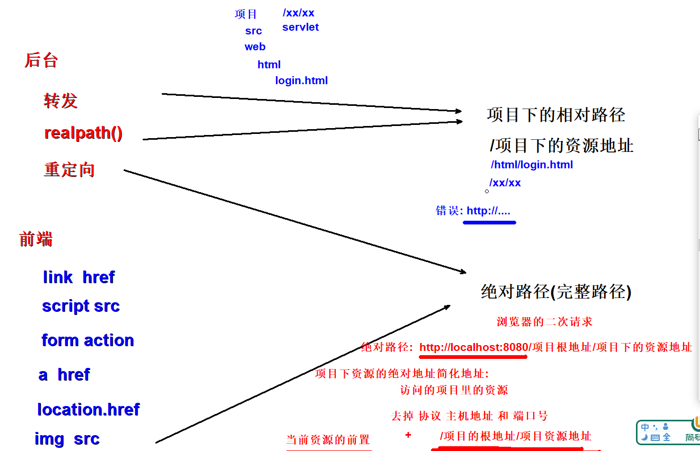

# Servlet

## servlet简介

```html
a.  servlet就是动态资源

b.  所有的动态资源都有固定的方法，待服务器软件调用

c.  javaee的api提供了一个Servlet接口，规定动态资源调用的方法

d.  创建动态资源都需要实现Servlet接口
```
## 生命周期
1. 通过生命周期测试发现Servlet对象在容器中是单例的；
2. 容器是可以处理并发的用户请求的，每个请求在容器中都会开启一个线程；
3. 多个线程可能会使用相同的Servlet对象，所以在Servlet中，我们不要轻易定义一些需要经常修改的成员变量；
4. load-on-startup中定义的正整数表示实例化顺序，如果数字重复了，容器会自行解决实例化顺序问题，但是应该避免重复；
5. Tomcat容器中，已经定义了一些随系统启动实例化的Servlet，自定义的Servlet的load-on-startup尽量不要占用数字1-5；

## **Servlet的继承结构和优化**
*  问题:
*      1.如何保证service方法必须重写,servlet必须有service方法
*           servlet -> 接口 -> service()
*           genericServlet -> 抽象类 -> 抽象service() | 硬刀子 语法: 接口 | 抽象方法
*           httpServlet -> 抽象类 -> 非抽象的service() | 软刀子 不靠语法: 父类的方法中抛异常 405

总结: servlet的最终使用
*      1.创建一个类,继承httpServlet
*      2.必须重写service方法(http)
*      3.可以选择重写init | destroy
*      4.使用注解@WebServlet配置访问地址即可


## ServletConfig和ServletContext
**ServletConfig使用**
介绍
```
ServletConfig放一些不能修改的配置参数
替代全局变量
避免了线程安全
ServletConfig存储一个servlet对应的变量参数
```
**声明**
方式一  web.xml

```xml
<servlet>

<servlet-name>configServlet</servlet-name>

<servlet-class>com.atguigu.servlet.ConfigServlet</servlet-class>

<!-- 参数变量,servlet读取,但是不能修改! 避免线程安全问题-->

<init-param>

<param-name>encoding</param-name>

<param-value>utf-8</param-value>

</init-param>

<init-param>

<param-name>key</param-name>

<param-value>value</param-value>

</init-param>

<load-on-startup>6</load-on-startup>

</servlet>

<servlet-mapping>

<servlet-name>configServlet</servlet-name>

<url-pattern>/config</url-pattern>

</servlet-mapping>
```

方式二  注解

```java
@WebServlet(value = "/config",loadOnStartup = 6,
initParams = {@WebInitParam(name = "encoding",value="utf-8"), 
              @WebInitParam(name = "key",value = "value")})
```

**ServletContext使用**
```java
i.  比ServletConfig更大的变量参数
ii.  不属于某一个Servlet
iii.  在配置的时候,只支持web.xml,且不在servlet标签中
iv.  多个servlet共有的参数变量,使用ServletContext 
```
b.  声明
```xml
<context-param>    
  <param-name>key</param-name>   
  <param-value>context</param-value>
</context-param>

<context-param>   
  <param-name>encoding</param-name>    
  <param-value>gbk</param-value>
</context-param>
```

c.  读取
```java
ServletContext servletContext = getServletContext();
String key = servletContext.getInitParameter("key");
System.out.println("key = " + key);
```

3.  ServletContext其他的API

```java
//根据在项目下的相对地址,获取绝对地址!

String realPath = servletContext.getRealPath("/imgs/gyy.png");

System.out.println("realPath = " + realPath);
```

## HttpServletRequest api
> HttpServletRequest是什么？

- HttpServletRequest是一个接口，其父接口是ServletRequest；
- HttpServletRequest是Tomcat将请求报文转换封装而来的对象，在Tomcat调用service方法时传入；
- HttpServletRequest代表客户端发来的请求，请求中的所有信息都可以通过该对象获得；
```java
@WebServlet("/request")
public class Requset extends HttpServlet {

    @Override
    public void service(HttpServletRequest req, HttpServletResponse resp) throws ServletException, IOException {
        //获取请求行
        String method = req.getMethod();
        System.out.println("method = " + method);

        //获取url
        StringBuffer requestURL = req.getRequestURL();
        System.out.println("requestURL = " + requestURL);

        //获取端口号后的地址
        String requestURI = req.getRequestURI();
        System.out.println("requestURI = " + requestURI);

        //获取项目的跟地址
        String contextPath = req.getContextPath();
        System.out.println("contextPath = " + contextPath);

        //获取网络协议
        String protocol = req.getProtocol();
        System.out.println("protocol = " + protocol);

        //获取请求头的参数
        String header = req.getHeader("user-agent");
        System.out.println("header = " + header);
        //获取多个请求头的参数
        Enumeration<String> headers = req.getHeaders("user-agent");
        while (headers.hasMoreElements()){
            String s = headers.nextElement();
            System.out.println("s = " + s);
        }
        //todo: tomcat 10+版本已经解决全部的请求参数乱码问题! 请求url参数和请求体的字符参数 编码格式默认设置为utf-8
        //todo: tomcat 8 + 默认将请求体的字符串参数设置为utf-8 将url地址默认的编码格式iso-8859-1(单字符的编码格式 abcdef 博大精深)  (apache)
        //String key = req.getParameter("key");

        req.setCharacterEncoding("utf-8");

        String key1 = req.getParameter("key1");
        System.out.println("key1 = " + key1);
        //key=value | key=1 | key2  form 多选框  爱好
        String[] keys = req.getParameterValues("key");
        System.out.println(" = " + Arrays.toString(keys));

        //一次获取所有的参数 参数-> map的键 [key key1] 参数的值 -> map的值 [因为一个key可能有多个值]
        Map<String, String[]> parameterMap = req.getParameterMap();
        System.out.println("--------------------");
        for (Map.Entry<String, String[]> entry : parameterMap.entrySet()) {
            System.out.println(entry.getKey() + "::" + Arrays.toString(entry.getValue()));
        }


        //todo: 前端利用请求体,传递json字符串或者文件类型的时候如何获取
        //1. 获取请求体的数据内容流 [字节输入流] 2. 流转成json字符串  3.利用第三方技术将json字符串转成java实体对象
        //ServletInputStream inputStream = req.getInputStream(); //请求体字节输入流
        //BufferedReader reader = req.getReader(); //请求体的字符输入流

    }
}
```

## HttpServletResponse api
> HttpServletResponse是什么？


- HttpServletResponse是一个接口，其父接口是ServletResponse；
- HttpServletResponse是Tomcat预先创建的，在Tomcat调用service方法时传入；
- HttpServletResponse代表对客户端的响应，该对象会被转换成响应的报文发送给客户端，通过该对象我们可以设置响应信息；
```java
@WebServlet("/response")
public class
HttpResponseServlet extends HttpServlet {

    @Override
    public void service(HttpServletRequest req, HttpServletResponse resp) throws ServletException, IOException {

        //响应数据: 状态行 [协议版本 状态码] 默认设置 响应头[key:value]  响应空行 响应体 [ 字符串(json)|字节(图片 文件)| xxx.html ]
        //状态行问题
        //协议版本不需要设置,请求来的是啥返回就是啥!
        //状态不需要主动设置,会根据tomcat处理结果自动判断 200 500 404 | 如果要[[重定向]]需要额外设置
        resp.setStatus(200);

        //设置响应头
        resp.setHeader("key","value");

        //响应体 [字符 | 字节] 你想响应数据,需要获取字符或者字节输出流! 把数据写到流中即可! 就代表写到前端!
        //todo: 两个流二选一 (字符串resp.getWriter(); | 字节resp.getOutputStream(); | 字符串+字节  resp.getOutputStream();)
        //hello servlet!!
        PrintWriter writer = resp.getWriter();

        //todo:我们返回的字符串,其实浏览器也是生成一个html进行展示,只不过他忘了设置meta charset=utf-8标签了 所以乱码了!
        //text/html -> 返回的内容其实是html展示 [文件类型的规范: mimetype 前面是大类型/小类型]
        //charset=utf-8 html展示的时候,使用meta charset=utf-8
        resp.setContentType("text/html;charset=utf-8");
        writer.print("你好,中国!!!");
//        writer.print("<html><head><meta charset='utf-8'> <title>xxx</title></head><body>hello servlet!!<br>你好,蛇窝类特!!</body>");

        //ServletOutputStream outputStream = resp.getOutputStream();
    }
}


//响应字节数据
@WebServlet("/response1")
public class HttpResponseServlet2 extends HttpServlet {

    @Override
    public void service(HttpServletRequest req, HttpServletResponse resp) throws ServletException, IOException {

        //1. 使用文件输入流读取字节文件
        //ServletContext |  getRealPath(/)
        ServletContext servletContext = getServletContext();
        String realPath = servletContext.getRealPath("/imgs/ynh.jpg");
        FileInputStream fileInputStream = new FileInputStream(realPath);
        //2. 保密
        //  content-disposition 文件定位
        //  attachment 附件 下载
        resp.setHeader("content-disposition","attachment;filename=ynh.jpg");

        //3. 将字节数据写到响应的字节输出流即可
        ServletOutputStream outputStream = resp.getOutputStream();

        int len = -1;
        byte[] buffer = new byte[8*1024];
        while( (len = fileInputStream.read(buffer)) != -1 ){
            outputStream.write(buffer,0,len);
        }

        if (fileInputStream != null) {
            fileInputStream.close();
        }
        if (outputStream != null){
            outputStream.close();
        }
    }
}

```
## **转发和重定向**
            1.     资源跳转需求
            a.     servlet -> html -> 返回 注册业务处理完毕以后,跳转到等登录页面
            b.     servlet -> servlet -> 返回 业务的继续和补充
            c.     作用: 完成资源之间的串联
            d.     实现: 转发 | 重定向
            2.     转发
            a.     转发只能是项目下的资源
            b.     转发对于客户端来说是一次请求,浏览器的展示地址是第一个资源地址(小红)
            c.     转发返回的状态码是200
            d.     转发的地址是项目下的相对地址(和realPath)
            e.     转发发起的对象是request对象
            3.     重定向
            a.     响应可以是项目下或者项目外的资源
            b.     重定向对于客户端来说是多次请求,浏览器展示地址是最后一个资源地址(马云)
            c.     重定向返回的状态码是302
            d.     重定向的地址必须是绝对地址或者绝对地址对应的简化地址
            e.     重定向发起的对象是response
```java
@WebServlet("/forward")
public class ForwardServlet extends HttpServlet {

    @Override
    public void service(HttpServletRequest req, HttpServletResponse resp) throws ServletException, IOException {
        System.out.println("ForwardServlet.service");
        //转发地址 项目下的资源地址  /request  = servletContext.realPath(/xxx)
        req.getRequestDispatcher("/html/login.html").forward(req,resp);
    }
}


@WebServlet("/redirect")
public class RedirectServlet extends HttpServlet {

    @Override
    public void service(HttpServletRequest req, HttpServletResponse resp) throws ServletException, IOException {
        System.out.println("RedirectServlet.service");
        //重定向 response发起, 地址: 绝对地址
        resp.sendRedirect("http://localhost:8080/request_response/html/login.html");
    }
}

```



