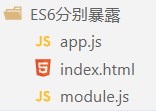
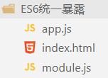
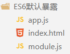

# 前端三剑客

# HTML

```html
<h1> <p>   
<br>      <hr color  size  width>    
<ol><li>   <ul><li>  

<a href="01html的基本结构.html" target="_blank">相对路径本地资源连接</a> 
target用于定义链接打开的方式：
+ _blank 在新窗口中打开目标资源；
+ _self  在当前窗口中打开目标资源；
    


    
+ src属性用于定义图片的连接。
+ title属性用于定义鼠标悬停时显示的文字。
+ alt属性用于定义图片加载失败时显示的提示文字。
+ height 高度
+ width 宽度
  
<audio></audio>
<vedio></vedio>
  <!-- 区块 -->
<div></div>
<span></span>
<!-- 框架 -->
<iframe></iframe>

```
## table
```html
<table>
  <thead>
    <tr>
      <th>列标题1</th>
      <th>列标题2</th>
      <th>列标题3</th>
    </tr>
  </thead>
  <tbody>
    <tr>
      <td>行1，列1</td>
      <td>行1，列2</td>
      <td>行1，列3</td>
    </tr>
    <tr>
      <td>行2，列1</td>
      <td>行2，列2</td>
      <td>行2，列3</td>
    </tr>
  </tbody>
</table>
```
## from
> 表单标签，可以实现让用户在界面上输入各种信息并提交的一种标签，是向服务端发送数据主要的方式之一：

-  form标签：表单标签，其内部用于定义可以让用户输入信息的表单项标签。 
   - action属性：用于定义信息提交的服务器的地址。
   - method属性：用于定义信息的提交方式。 
      - http请求方式:
      - get值：    get方式提交，数据会缀到url后，以?作为参数开始的标识，多个参数用&隔开。
      - post值：  post方式提交，数据会通过请求体发送，不会在缀到url后。
-  input标签：主要的表单项标签，可以用于定义表单项。 
   -  name属性：**向后台传递的数据的** 
   -  type属性：**单选框和多选框需要主动赋值** 
      -  text              文本框 
      -  password    密码框 
      -  submit         提交按钮 
      -  reset            重置按钮 
      -  radio           单选 
      -  checkboxes   复选框 
```html
<form action="/" method="post">
    <!-- 文本输入框 -->
    <label for="name">用户名:</label>
    <input type="text" id="name" name="name" required>

    <br>

    <!-- 密码输入框 -->
    <label for="password">密码:</label>
    <input type="password" id="password" name="password" required>

    <br>

    <!-- 单选按钮 -->
    <label>性别:</label>
    <input type="radio" id="male" name="gender" value="male" checked>
    <label for="male">男</label>
    <input type="radio" id="female" name="gender" value="female">
    <label for="female">女</label>

    <br>

    <!-- 复选框 -->
    <input type="checkbox" id="subscribe" name="subscribe" checked>
    <label for="subscribe">订阅推送信息</label>

    <br>

    <!-- 下拉列表 -->
    <label for="country">国家:</label>
    <select id="country" name="country">
        <option value="cn">CN</option>
        <option value="usa">USA</option>
        <option value="uk">UK</option>
    </select>

    <br>

    <!-- 提交按钮 -->
    <input type="submit" value="提交">
</form>
```
# css
CSS声明总是以分号 **;** 结束，声明总以大括号 **{}** 括起来:
```css
p {color:red;text-align:center;}
```
选择器通常是您需要改变样式的 HTML 元素。
每条声明由一个属性和一个值组成。
## 引用方式

**行内式**：通过元素开始标签的style属性引入，

行内引用

     标签  style = "csskey:值;csskey:值"

     优点: 不用写选择器,直接作用到了对应的标签

     缺点: 没有复用,html和css完全混到一起,特点的乱

```html
<input 
        type="button" 
        value="按钮"
        style="
            display: block;     
            width: 60px; 
            height: 40px;       
            background-color: rgb(140, 235, 100); 
            color: white;       
            border: 3px solid green;
            font-size: 22px;    
            font-family: '隶书';
            line-height: 30px;  
            border-radius: 5px;
    "/>
```

**内嵌式**：在head标签中通过style标签引入

- CSS样式的作用范围控制要依赖选择器；
- CSS的样式代码中注释的方式为  /_   _/；
- 缺点： 
   - 内嵌式虽然对样式代码做了抽取，但是CSS代码仍然在html文件中；
   - 内嵌样式仅仅能作用于当前文件，代码复用度还是不够，不利于网站风格统一；

```html
<head>
    <meta charset="UTF-8">
    <style>
        /*选择器*/
        input {
            display: block;     
            width: 80px; 
            height: 40px;       
            background-color: rgb(140, 235, 100); 
            color: white;       
            border: 3px solid green;
            font-size: 22px;    
            font-family: '隶书';
            line-height: 30px;  
            border-radius: 5px;
        }
    </style>
</head>
```

**外部**

- 可以在项目单独创建css样式文件，专门用于存放CSS样式代码。
- 在head标签中，通过link标签引入外部CSS样式即可。

```html
<head>
    <meta charset="UTF-8">
    <link href="css/buttons.css" rel="stylesheet" type="text/css"/>
</head>
```

## 选择器
id -> 唯一的名字 唯一的标识 全局唯一
id 选择器可以为标有特定 id 的 HTML 元素指定特定的样式。
HTML元素以id属性来设置id选择器,CSS 中 id 选择器以 "#" 来定义。
```css
<body>
    <h1 id="re">测试css</h1>
</body>
<style>
    #re {
        text-align:center;
  	    color:red;
    }
</style>
```

class -> 可以重复,可以有多个类型标签
class 选择器用于描述一组元素的样式，class 选择器有别于id选择器，class可以在多个元素中使用。
class 选择器在 HTML 中以 class 属性表示, 在 CSS 中，类选择器以一个点 **.** 号显示：
```css
<style>
.center{
	text-align:center;
}
</style>
<body>
<h1 class="center">标题居中</h1>
</body>
```

*{} 全部标签
选择器1,选择器2,选择器3...{}

选择器的优先级
如果多个选择器,作用到同一个标签,效果不同,层叠生效!
如果多个选择器,作用到同一个标签,效果相同,会根据选择器的优先级进行属性设置
id > class > 标签 > *

# JavaScript

1. JS的语句可以以; 结尾，也可以不用;结尾；
2. 标识符的命名规则参照JAVA；
3. ECMAScript 6，简称ES6，是**JavaScript**语言的一次重大更新。它于**2015**年发布，是原来的ECMAScript标准的第六个版本。ES6带来了大量的新特性，包括箭头函数、模板字符串、let和const关键字、解构、默认参数值、模块系统等等，大大提升了JavaScript的开发体验。`由于VUE3中大量使用了ES6的语法,所以ES6成为了学习VUE3的门槛之一`
4. ES6 的解构赋值是一种方便的语法，可以快速将数组或对象中的值拆分并赋值给变量。解构赋值的语法使用花括号 `{}` 表示对象，方括号 `[]` 表示数组。通过解构赋值，函数更方便进行参数接受等！

## JS的引入方式

1. 嵌入到html文件中

    ```html
    <body>
        <script>
            alert("helloworld");
        </script>
    </body
    ```

2. 内部脚本方式引入

    同css引入

    `<script type="type/javascript" scr="./ex.javascript"`

3. 外部脚本方式引入

    对比css style 只能出现1次 位置再头标签中

    script 出现多次 任何位置 不是进入页面就加载的代码，一般往后放！

## 数据类型
**基本数据类型** 

number string boolean undefined null

**引用数据类型** 

Object  Array Function

**判断数据类型的关键字：**

typeof 变量；

## JSON格式

**简单来说,JSON 就是一种字符串格式，这种格式无论是在前端还是在后端，都可以很容易地和对象之间进行转换，所以常用于前后端数据传递。**

- JSON的语法：let/var str="{'属性名':'属性值','属性名':{'属性名':'属性值'},'属性名':['值1','值1','值3']}" ；
- JSON字符串一般用于传递数据，一般都是用对象的属性表示数据，所以在此不研究对象的函数，只看对象的属性；
- 通过JSON.parse()方法可以将一个JSON串转换成对象；
- 通过JSON.stringify()方法可以将一个对象转换成一个JSON格式的字符串；


## JS Var

分为var let const 三种  我们采用ES6语法 使用    **let     const  模板字符串**  

* var
    1. 弱类型变量，可以统一声明成var
    2. var声明的变量可以再次声明；
    3. 变量可以使用不同的数据类型多次赋值；
    4. 如果使用了 一个没有声明的变量，那么运行时会报：`uncaught ReferenceError:  is not defined at index.html:行号:列号；`
    5. 如果一个变量只声明，没赋值，那么值是undefined；
    6. 变量标识符严格区分大小写；

- let 和var的差别：

    1. let 不能重复声明；
    2. let有块级作用域，非函数的花括号遇见let会有块级作用域，也就是只能在花括号里面访问；
    3. let不会预解析进行变量提升；
    4. let 定义的全局变量不会作为window的属性；
    5. let在es6中推荐优先使用；

    ```js
    <script>
        //1. let只有在当前代码块有效代码块. 代码块、函数、全局
        {
          let a = 1
          var b = 2
          
        }   
        console.log(a);  // a is not defined   花括号外面无法访问
        console.log(b);  // 可以正常输出
        //2. 不能重复声明
        let name = '天真'
        let name = '无邪'
        //3. 不存在变量提升（先声明，在使用）
        console.log(test) //可以     但是值为undefined
        var test = 'test'
        console.log(test1) //不可以  let命令改变了语法行为，它所声明的变量一定要在声明后使用，否则报错。
        let test1 = 'test1' 
        //4、不会成为window的属性   
        var a = 100
        console.log(window.a) //100
        let b = 200
        console.log(window.b) //undefined
        //5. 循环中推荐使用
        for (let i = 0; i < 10; i++) {
          // ...
        }
        console.log(i);
    </script>
    ```

* const和var

    1. 新增const和let类似，只是const定义的变量不能修改；
    2. 并不是变量的值不得改动，而是变量指向的那个内存地址所保存的数据不得改动；

    ```js
    <script>
        //1声明常量
        const PI = 3.1415926;
        PI=3.14 //报错
        //2.对应数组和对象元素修改，不算常量修改，修改值，不修改地址
            q
    </script>
    ```

* 模板字符串（template string）是增强版的字符串，用反引号（`）标识  

```html
<script>
    // 1 多行普通字符串
    let ulStr =
        '<ul>'+
        '<li>JAVA</li>'+
        '<li>html</li>'+
        '<li>VUE</li>'+
        '</ul>'
    console.log(ulStr)    
    // 2 多行模板字符串
    let ulStr2 = `
        <ul>
        	<li>JAVA</li>
        	<li>html</li>
        	<li>VUE</li>
        </ul>`
    console.log(ulStr2)        
    // 3  普通字符串拼接
    let name ='张小明'
    let infoStr =name+'被评为本年级优秀学员'  
    console.log(infoStr)
    // 4  模板字符串拼接
    let infoStr2 =`${name}被评为本年级优秀学员`
    console.log(infoStr2)
</script>
```


## JS Array

**数组定义:**

​	js中存储多个数据的容器： 数组

​	js中的容器虽然叫数组，但是本质是集合

​	js中的数组，可以随意扩容

​	js中的数组，没有泛型

**声明数组：**

```js
// 数组创建
let arr00 = [];
// 数组访问
arr00[0] = 1;
arr00[1] = "a";
// 数组里可以放任何值
let arr01 = ["abc",1,true,null,undefined,"?"];
// 数组的长度
let len = arr01.length;
// 数组.splice(操作的下角标index,删除的数量，可变参数...添加的元素); CURD数组
arr01.splice(2,1,false); // 修改
arr01.splice(2,0,true);  // 增加
arr01.splice(arr01.length-1,1); // 删除
```

**数组解构赋值**：

```javascript
let [a, b, c, d = 4] = [1, 2, 3];
console.log(a,b,c,d); // 4
```

该语句将数组 \[1, 2, 3] 中的第一个值赋值给 a 变量，第二个值赋值给 b 变量，第三个值赋值给 c 变量。可以使用默认值为变量提供备选值，在数组中缺失对应位置的值时使用该默认值。

## JS Object

**经典:**通过 {}形式创建对象

```javascript
// 对象的创建
let person = {
    firstName:"John",
    lastName:"Doe",
    age:50,
    eyeColor:"blue"
};
// 对象的访问
console.log(person.firstName);
console.log(person["lastName"]);
person.firstName;
person["lastName"];
```

**ES6: ** 新增了对象创建的语法糖，支持了class extends constructor等关键字，让ES6的语法和面向对象的语法更加接近，与java一样.

```javascript
 <script>
        class Student{
            age;
            name;
            score;
            address;

            get name(){
                return this.name;
            }
            set name(n){
                this.name = name;
            }
             // 实例方法
            eat(food){
                console.log(this.age+"岁的"+this.name +"用筷子吃"+food)
            }
            // 静态方法
            static sum(a,b){
                return a+b;
            }
            // 构造器
            constructor(name,age){
                this.name=name;
                this.age = age;
            }
        }
        let Student =new Student("张三",10);
            // 访问对象属性
            // 调用对象方法
            console.log(person.name)
            console.log(person.#n ) // 私有 报错
            person.name="小明"
            console.log(person.age)
            person.eat("火锅")
            console.log(Person.sum(1,2))
            class Student extends  Person{
                grade ;
                score ;
                study(){
                }
                constructor(name,age ) {
                    super(name,age);
                }
            }
            let stu =new Student("学生小李",18);
            stu.eat("面条")
    </script>
```

**对象的深拷贝和浅拷贝**

* 浅拷贝：

```java
<script>
    let arr  =['java','c','python']
    let person ={
        name:'张三',
        language:arr
    }
    // 浅拷贝,person2和person指向相同的内存
    let person2 = person;
    person2.name="小黑"
    console.log(person.name)
</script>
```

* 深拷贝：

```js
<script>
    let arr  =['java','c','python']
    let person ={
        name:'张三',
        language:arr
    }
    // 深拷贝,通过JSON和字符串的转换形成一个新的对象
    let person2 = JSON.parse(JSON.stringify(person))
    person2.name="小黑"
    console.log(person.name)
    console.log(person2.name) 
</script>
```

**对象解构赋值**：

```javascript
let {a, b} = {a: 1, b: 2};
//新增变量名必须和属性名相同，本质是初始化变量的值为对象中同名属性的值
//等价于 let a = 对象.a  let b = 对象.b
console.log(a,b); 
```

该语句将对象 {a: 1, b: 2} 中的 a 属性值赋值给 a 变量，b 属性值赋值给 b 变量。可以为标识符分配不同的变量名称，使用 : 操作符指定新的变量名。例如：

```javascript
let {a: x, b: y} = {a: 1, b: 2};
console.log(x,y);
```


## JS Function

如果少传递参数，对应位置的参数类型 undefined
调用，参数可以不按照列表的个数传递
参数不确定，不声明形成列表

**经典**

```js
<-- js声明方法 --> 
function 方法名(形成列表，不需要添加var){
    方法体；
    return;
}

ex: 
function add(a,b){
    return(a+b)
}
console.log(add(2,5));

ex1:// 函数表达式可以存储在变量中：
let sum = function add1(a,b){
    return a+b;
}
console.log(sum(1,1));
```
**ES6** 

ES6 允许使用（=>）定义函数。lambda表达式

```js
//  与java  lambda表达式一样
let fn1 = function(){}
let fn2 = ()=>{} 				//箭头函数,此处不需要写function关键字
let fn3 = x =>{} 				//单参数可以省略(),多参数无参数不可以!
let fn4 = x => console.log(x)   //只有一行方法体可以省略{};
let fun5 = x => x + 1 			//当函数体只有一句返回值时，可以省略花括号和 return 语句
```

**this的特点**

```js
// 箭头函数this关键字
// 在 JavaScript 中，this 关键字通常用来引用函数所在的对象，
// 或者在函数本身作为构造函数时，来引用新对象的实例。
// 但是在箭头函数中，this 的含义与常规函数定义中的含义不同，
// 并且是由箭头函数定义时的上下文来决定的，而不是由函数调用时的上下文来决定的。
// 箭头函数没有自己的this，this指向的是外层上下文环境的this
let person ={
    name:"张三",
    showName:function (){
        console.log(this) //  这里的this是person
        console.log(this.name)
    },
    viewName: () =>{
        console.log(this) //  这里的this是window
        console.log(this.name)
    }
}
person.showName()
person.viewName()
//this应用
function Counter() {
    this.count = 0;
    setInterval(() => {
        // 这里的 this 是上一层作用域中的 this，即 Counter实例化对象
        this.count++;
        console.log(this.count);
    }, 1000);
}
let counter = new Counter();
</script>

ex:
 <script>
       let xdd = document.getElementById("xdd");
       // 方案1 
       xdd.onclick = function(){
            console.log(this)
            let _this= this;  //this 是xdd
            //开启定时器
            setTimeout(function(){
                console.log(this)
                //变粉色
                _this.style.backgroundColor = 'pink';
            },2000);
        }
        // 方案2
        xdd.onclick = function(){
            console.log(this)
            //开启定时器
            setTimeout(()=>{
                console.log(this)// 使用setTimeout() 方法所在环境时的this对象
                //变粉色
                this.style.backgroundColor = 'pink';
            },2000);
        }
</script>
```

**rest和spread**

rest参数，在形参上使用 ，和JAVA中的可变参数几乎一样：

```html
<script>
    // 1 参数列表中多个普通参数  普通函数和箭头函数中都支持
    let fun1 = function (a,b,c,d=10){console.log(a,b,c,d)}
    let fun2 = (a,b,c,d=10) =>{console.log(a,b,c,d)}
    fun1(1,2,3)
    fun2(1,2,3,4)
    // 2 ...作为参数列表,称之为rest参数 普通函数和箭头函数中都支持 ,因为箭头函数中无法使用arguments,rest是一种解决方案
    let fun3 = function (...args){console.log(args)}
    let fun4 = (...args) =>{console.log(args)}
    fun3(1,2,3)
    fun4(1,2,3,4)
    // rest参数在一个参数列表中的最后一个只,这也就无形之中要求一个参数列表中只能有一个rest参数
    //let fun5 =  (...args,...args2) =>{} // 这里报错
</script>
```

spread参数，在实参上使用：

```html
<script>
    let arr =[1,2,3]
    //let arrSpread = ...arr;// 这样不可以,...arr必须在调用方法时作为实参使用
    let fun1 =(a,b,c) =>{
        console.log(a,b,c)
    }
    // 调用方法时,对arr进行转换 转换为1,2,3 
    fun1(...arr)
    //应用场景1 合并数组
    let arr2=[4,5,6]
    let arr3=[...arr,...arr2]
    console.log(arr3)
    //应用场景2 合并对象属性
    let p1={name:"张三"}
    let p2={age:10}
    let p3={gender:"boy"}
    let person ={...p1,...p2,...p3}
    console.log(person)
</script>
```

**函数参数解构赋值:**

```js
function add([x, y]) {
  return x + y;
}
add([1, 2]);
```

+ 该函数接受一个数组作为参数，将其中的第一个值赋给 x，第二个值赋给 y，然后返回它们的和；

+ ES6 解构赋值让变量的初始化更加简单和便捷。通过解构赋值，我们可以访问到对象中的属性，并将其赋值给对应的变量，从而提高代码的可读性和可维护性；

## ES6的模块化处理

ES6模块化的几种暴露和导入方式：

1. 分别导出；
2. 统一导出；
3. 默认导出；

### 分别导出



+ module.js 向外分别暴露成员：

``` javascript
//1.分别暴露
// 模块想对外导出,添加export关键字即可!
// 导出一个变量
export const PI = 3.14
// 导出一个函数
export function sum(a, b) {
  return a + b;
}
// 导出一个类
export class Person {
  constructor(name, age) {
    this.name = name;
    this.age = age;
  }
  sayHello() {
    console.log(`Hello, my name is ${this.name}, I'm ${this.age} years old.`);
  }
}
```

+ app.js 导入module.js中的成员：

``` javascript
/* 
    *代表module.js中的所有成员
    m1代表所有成员所属的对象
*/
import * as m1 from './module.js'
// 使用暴露的属性
console.log(m1.PI)
// 调用暴露的方法
let result =m1.sum(10,20)
console.log(result)
// 使用暴露的Person类
let person =new m1.Person('张三',10)
person.sayHello()
```

+ index.html作为程序启动的入口 ，导入 app.js  ：

``` html
<!-- 导入JS文件 添加type='module' 属性,否则不支持ES6的模块化 -->
<script src="./app.js" type="module" /> 
```

### 统一导出



+ module.js向外统一导出成员：

``` javascript
//2.统一暴露
// 模块想对外导出,export统一暴露想暴露的内容!
// 定义一个常量
const PI = 3.14
// 定义一个函数
function sum(a, b) {
  return a + b;
}
// 定义一个类
class Person {
  constructor(name, age) {
    this.name = name;
    this.age = age;
  }
  sayHello() {
    console.log(`Hello, my name is ${this.name}, I'm ${this.age} years old.`);
  }
}
// 统一对外导出(暴露)
export {
	PI,
    sum,
    Person
}
```

+ app.js导入module.js中的成员：

``` javascript
/* 
    {}中导入要使用的来自于module.js中的成员
    {}中导入的名称要和module.js中导出的一致,也可以在此处起别名
    {}中如果定义了别名,那么在当前模块中就只能使用别名
    {}中导入成员的顺序可以不是暴露的顺序
    一个模块中可以同时有多个import
    多个import可以导入多个不同的模块,也可以是同一个模块
*/
//import {PI ,Person ,sum }  from './module.js'
//import {PI as pi,Person as People,sum as add}  from './module.js'
import {PI ,Person ,sum,PI as pi,Person as People,sum as add}  from './module.js'
// 使用暴露的属性
console.log(PI)
console.log(pi)
// 调用暴露的方法
let result1 =sum(10,20)
console.log(result1)
let result2 =add(10,20)
console.log(result2)
// 使用暴露的Person类
let person1 =new Person('张三',10)
person1.sayHello()
let person2 =new People('李四',11)
person2.sayHello()
```

### 默认导出



+ modules混合向外导出：

``` javascript
// 3默认和混合暴露
/* 
    默认暴露语法  export default sum
    默认暴露相当于是在暴露的对象中增加了一个名字为default的属性
    三种暴露方式可以在一个module中混合使用
*/
export const PI = 3.14
// 导出一个函数
function sum(a, b) {
  return a + b;
}
// 导出一个类
class Person {
  constructor(name, age) {
    this.name = name;
    this.age = age;
  }
  sayHello() {
    console.log(`Hello, my name is ${this.name}, I'm ${this.age} years old.`);
  }
}
// 导出默认
export default sum
// 统一导出
export {
   Person
}
```

+ app.js 的default和其他导入写法混用：

``` javascript
/* 
    *代表module.js中的所有成员
    m1代表所有成员所属的对象
*/
import * as m1 from './module.js'
import {default as add} from './module.js' // 用的少
import add2 from './module.js' // 等效于 import {default as add2} from './module.js'
// 调用暴露的方法
let result =m1.default(10,20)
console.log(result)
let result2 =add(10,20)
console.log(result2)
let result3 =add2(10,20)
console.log(result3)

// 引入其他方式暴露的内容
import {PI,Person} from './module.js'
// 使用暴露的Person类
let person =new Person('张三',10)
person.sayHello()
// 使用暴露的属性
console.log(PI)
```


## 事件

事件可以是浏览器行为，也可以是用户行为。

1. 鼠标事件 
2. 键盘事件
3. 表单事件  
4. 标签添加事件   <标签 事件名[on事件名]="事件影响方法()">

```javascript
//js代码中添加事件 
//元素节点对象.事件名 = 匿名函数 【事件影响代码】
li.ondblclick = function(){
    this.remove();
}
```
## BOM编程
**什么是BOM**

a. 将浏览器抽象成一个对象
b. 调用浏览器抽象对象的方法就相当于调用浏览器
c. js将浏览器抽象成的对象叫：window

- BOM编程的对象结构如下:
   - window 顶级对象，代表整个浏览器窗口；
      - location属性，代表浏览器的地址栏；
      - history属性，代表浏览器的访问历史；
      - screen属性，代表屏幕；
      - navigator属性，代表浏览器软件本身；
      - document属性，代表浏览器窗口目前解析的html文档；
      - console属性，代表浏览器开发者工具的控制台；
      - localStorage属性，代表浏览器的本地数据持久化存储；
      - sessionStorage属性，代表浏览器的本地数据会话级存储；

**通过BOM编程实现会话级和持久级数据存储**

- 会话级数据 ：内存型数据，是浏览器在内存上临时存储的数据，浏览器关闭后数据失去，通过window的sessionStorge实现；
- 持久级数据 ：磁盘型数据，是浏览器在磁盘上持久存储的数据，浏览器关闭后数据仍在，通过window的localStorge实现；
- 在F12开发者工具的应用程序栏，可以查看数据的状态；
## DOM编程
**什么是DOM编程**

a. 将HTML文档页面抽象成document对象
b. 对html的动态操作,通过document提供的方法实现
c. 最终我们可以利用document对象完成页面的动态概念
d. document也隶属于window对象,window可以省略

- 上面的代码生成的树如下：
- DOM编程其实就是用window对象的document属性的相关API完成对页面元素的控制的编程：

**dom的操作**

元素节点的curd -> **元素节点**的curd方法
元素属性节点的curd -> **元素节点**的属性操作curd方法
元素文本节点的curd -> **元素节点**的文本操作curd方法

```javascript
1 获得document  dom树
window.document
2 从document中获取要操作的元素
1）直接获取
var el1 =document.getElementById("username") // 根据元素的id值获取页面上唯一的一个元素
var els =document.getElementsByTagName("input") // 根据元素的标签名获取多个同名元素
var els =document.getElementsByName("aaa") // 根据元素的name属性值获得多个元素
var els =document.getElementsByClassName("a") // 根据元素的class属性值获得多个元素
2）间接获取
var cs=div01.children // 通过父元素获取全部的子元素
var firstChild =div01.firstElementChild  // 通过父元素获取第一个子元素
var lastChild = div01.lastElementChild   // 通过父元素获取最后一个子元素
var parent = pinput.parentElement  // 通过子元素获取父元素
var pElement = pinput.previousElementSibling // 获取前面的第一个元素
var nElement = pinput.nextElementSibling // 获取后面的第一个元素
3 对元素进行操作
1）操作元素的属性   元素名.属性名=""
2）操作元素的样式   元素名.style.样式名=""  样式名"-" 要进行驼峰转换
3）操作元素的文本   元素名.innerText   只识别文本
元素名.innerHTML   同时可以识别html代码 
4）增删元素
var element =document.createElement("元素名") // 创建元素
父元素.appendChild(子元素)               // 在父元素中追加子元素
父元素.insertBefore(新元素,参照元素)     // 在某个元素前增加元素
父元素.replaceChild(新元素,被替换的元素) // 用新的元素替换某个子子元素
元素.remove()                            // 删除当前元素
```
