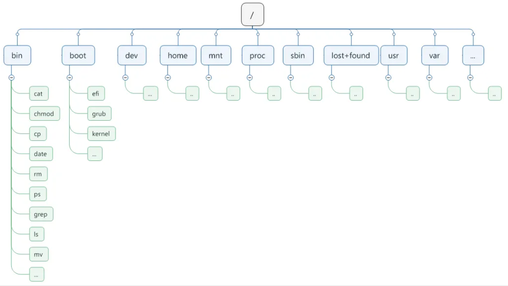
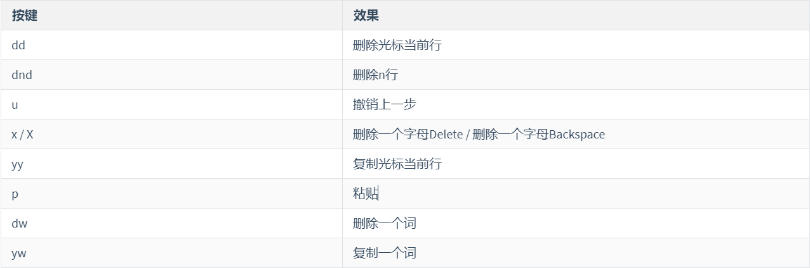

# centOS7
## 配置网络

```bash
ifconfig    ip addr
vi /etc/sysconfig/network-scripts/ifcfg-ens33
```

ens33网络配置默认信息如下

```bash
TYPE="Ethernet" #网络类型（通常是Ethemet，工业以太网）
PROXY_METHOD="none"
BROWSER_ONLY="no"
BOOTPROTO="dhcp"  #dhcp 为动态IP
DEFROUTE="yes"
IPV4_FAILURE_FATAL="no"
IPV6INIT="yes"
IPV6_AUTOCONF="yes"
IPV6_DEFROUTE="yes"
IPV6_FAILURE_FATAL="no"
IPV6_ADDR_GEN_MODE="stable-privacy"
NAME="ens33"
UUID="e8582df9-96c3-4ddc-9fc6-19282dd5e019"
DEVICE="ens33"
ONBOOT="yes" #系统启动的时候网络接口是否有效（yes/no）
```

以下选项,有则修改,无则增加

```bash
BOOTPROTO="static" #静态网址 (已有)
ONBOOT="yes" #开机启用 (已有)
IPADDR=192.168.6.100 #IP地址 (增加)
GATEWAY=192.168.6.2 #网关(增加)
DNS1=192.168.6.2 #DNS域名解析(增加)
```

重启网络服务

```bash
systemctl status network
systemctl restart network
systemctl is-enabled network
systemctl enable network
ping url
```

可能的故障问题

```bash
systemctl status NetworkManager.service 查看服务
systemctl stop NetworkManager           停止服务
systemctl is-enabled NetworkManager     查看自启动 
systemctl disable NetworkManager        关闭自启动
```


## 换源

```bash
rpm -qa       （功能描述：查询所安装的所有rpm软件包）
rpm -ql  	   服务名 (功能描述:查看安装位置)
cd /etc/yum.repos.d    yum文件位置  可以备份

阿里云
mv /etc/yum.repos.d/CentOS-Base.repo /etc/yum.repos.d/CentOS-Base.repo.backup
curl -o /etc/yum.repos.d/CentOS-Base.repo http://mirrors.aliyun.com/repo/Centos-7.repo
清华
mv /etc/yum.repos.d/CentOS-Base.repo /etc/yum.repos.d/CentOS-Base.repo.bak
vi /etc/yum.repos.d/CentOS-Base.repo

yum clean all  清缓存
yum makecache  产生新的缓存
```


## 同步时间

```bash
yum -y install ntp 安装ntp服务
systemctl enable ntpd  开启开机启动服务
systemctl start ntpd  启动服务
timedatectl set-timezone Asia/Shanghai  更改时区
timedatectl set-ntp yes  启用ntp同步
ntpq -p  同步时间
```


## 常用命令

```shell
lsof -i:端口号

hostname  //主机名
vim /etc/hostname   //修改主机名

systemctl --type service   //查看所有服务
```
### 文件目录

```bash
# 建立目录
mkdir -option NameDirectory
		-p  创建多层目录[未存在]

# 删除目录
rmdir NameDirectory

# 创建空文件
touch NameFile

# 复制文件或目录
cp -option sourceFileName destFileName
	-r     递归复制整个文件夹

# 移除文件或者目录
rm -optin NameFile
	-r
	-f
	-v     显示指令的详细执行过程
	

# 移动文件与目录或重命名
mv sourceNameFile NameFile

# 查看文件内容
cat -option NameFile.etc
	-n	   显示所有行的行号,包括空行

# 分屏查看器
 more NameFile.etc

# 分屏显示文件内容
less NameFile.etc 

# 显示文件头部内容
head File        查看文件头10行内容
head -n 5 File   查看文件头5行内容

# 输出文件尾部内容
tail File          查看文件后10行内容
tail -n 5 File     查看文件后5行内容，5可以是任意行数
tail -f File       实时追踪该文档的所有更新

# 打印信息
echo -option input
	 -e  支持反斜线控制的字符转换
	 
# > 覆盖和>>追加
ll >File       		列表的内容写入文件File.txt中  覆盖写
ll >>File       		列表的内容 追加 到文件的末尾
cat File1 > File2 	   将文件1的内容覆盖到文件2
echo “内容” >> File


# 查看历史命令
history 
```

```bash
# 创建链接和软连接
[root@hadoop ~]# mv houge.txt xiyou/dssz/
[root@hadoop ~]# ln -s xiyou/dssz/houge.txt houzi
[root@hadoop ~]# ll
lrwxrwxrwx. 1 root  root   20 6月 17 12:56 houzi -> xiyou/dssz/houge.txt
# 删除软连接
[root@hadoop ~] rm -rf houzi
# 进入软连接实际物理路径
[root@hadoop ~] ln -s xiyou/dssz/ ./dssz
[root@hadoop ~] cd -P dssz/

ln -s  创建的链接为 软连接

rm -rf linkNameFile
```


### 用户管理
```bash
useradd  用户名   		   # 用于创建新的用户账户
useradd -g  组名 用户名    # 用于创建新的用户账户添加到组
passwd 用户名   		   # 或作为特定用户更改自己的密码
id 用户名                 # 用户是否存在
cat /etc/passwd          # 查看创建的所有用户
su 用户名称                # 切换用户，只能获得用户的执行权限，不能获得环境变量
su - 用户名称              # 切换到用户并获得该用户的环境变量及执行权限
userdel 用户名          	# 删除用户但保存用户主目录）
userdel -r 用户名          # 用户和用户主目录，都删除
who am i				  # 我是谁
usermod -g 用户组 用户名    # 将用户加入到用户组
```

**将普通用户设置root权限**

vi /etc/sudoers
修改 /etc/sudoers 文件，找到下面一行(91行)，在root下面添加一行，如下

```bash
## Allow root to run any commands anywhere
root  ALL=(ALL)   ALL
```


### 组管理
group

```bash
groupadd 组名

groupdel 组名

cat  /etc/group   # 查看创建了那些组
```

### 文件权限

```bash
chmod 777

chgrp    # 改变所属组   -R

chown 选项 最终用户 文件或目录 # 改变文件或者目录的所有者
```

### 搜索查找

```bash
find [搜索范围] [选项]  	-name<查询方式> -user<用户名>-size<文件大小>

# 管道符，“|”，表示将前一个命令的处理结果输出传递给后面的命令处理
grep 选项 查找内容 源文件   # -n 显示匹配及行号

```

### 压缩和解压缩

```bash
tar -zcvf houma.tar.gz

tar -zxvf xiyou.tar.gz -C
```

### 进程线程管理

```bash
ps -aux | grep xxx     # 查看系统中所有进程  -a 选择所有进程 -u 显示所有用户的所有进程 -x 显示没有终端的进程
ps -ef  | grep xxx     # 可以查看子父进程之间的关系

# yum install netstta -y 
netstat -anp | grep 端口号  # 查看某个端口是否被占用
netstat -nultp # 查看当前所有已使用端口号

ss -tuln # 查看所有正在监听的 TCP 和 UDP 端口
ss -tuln | grep ':8080' # 查找某个特定端口的信息
```

```bash
# ps -aux显示信息说明
USER：该进程是由哪个用户产生的
PID：进程的ID号
​%CPU：该进程占用CPU资源的百分比，占用越高，进程越耗费资源；
​%MEM：该进程占用物理内存的百分比，占用越高，进程越耗费资源；
​VSZ：该进程占用虚拟内存的大小，单位KB；
​RSS：该进程占用实际物理内存的大小，单位KB；
​TTY：该进程是在哪个终端中运行的。其中tty1-tty7代表本地控制台终端，tty1-tty6是本地的字符界面终端，    tty7是图形终端。pts/0-255代表虚拟终端。
​STAT：进程状态。常见的状态有：R：运行、S：睡眠、T：停止状态、s：包含子进程、+：位于后台
​START：该进程的启动时间
​TIME：该进程占用CPU的运算时间，注意不是系统时间
​COMMAND：产生此进程的命令名
# ps -ef显示信息说明
UID：用户ID 
​PID：进程ID 
​PPID：父进程ID 
​C：CPU用于计算执行优先级的因子。数值越大，表明进程是CPU密集型运算，执行优先级会降低；数值越小，表明进程是I/O密集型运算，执行优先级会提高 
​STIME：进程启动的时间 
​TTY：完整的终端名称 
​TIME：CPU时间 
​CMD：启动进程所用的命令和参数
```

```bash
kill -9 UID
killall Name

netstat -anp | grep 端口号   # 查看端口号是否被占用s

```

### **磁盘内存**

```bash
top  # 查看内存
iotop # 查看磁盘io读写  （yum install iotop）
iotop -o # 查看较高的磁盘读写程序
df -h    # 列出文件系统的整体磁盘使用量，检查文件系统的磁盘空间占用情况
fdisk -l         # 查看磁盘分区详情


Device：分区序列
​Boot：引导
​Start：从X磁柱开始
​End：到Y磁柱结束
​Blocks：容量
​Id：分区类型ID
​System：分区类型
```


## 文件目录
> Centos7的文件目录结构




> Linux根目录下的常见目录及作用

1. /bin：★(/usr/bin,/usr/local/bin)

是Binary的缩写, 这个目录存放着最经常使用的命令,Linux默认的环境变量已经包含该路径,所以可以直接使用该路径下的指令如 cd指令 

可以通过echo $PATH查看系统环境变量来看是否包含了该目录

2. /sbin：(/usr/sbin, /usr/local/sbin)

s就是Super User的意思，这里存放的是系统管理员使用的系统管理程序。

以上目录，任何命令在任意目录下都可执行命令

3. /home：★

存放普通用户的主目录，在Linux中每个用户都有一个自己的目录，一般该目录名是以用户的账号命名的。

4. /root：★

该目录为系统管理员，也称作超级权限者的用户主目录。

5. /lib：

系统开机所需要最基本的动态连接共享库，其作用类似于Windows里的DLL文件。几乎所有的应用程序都需要用到这些共享库。

6. /lost+found：

这个目录一般情况下是空的，当系统非法关机后，这里就存放了一些文件。

7. /etc：★

所有的系统管理所需要的配置文件和子目录。my.cnf

8. /usr：★ 

这是一个非常重要的目录，用户的很多应用程序和文件都放在这个目录下，类似与windows下的program files目录。

9. /boot：★

这里存放的是启动Linux时使用的一些核心文件，包括一些连接文件以及镜像文件，自己的安装别放这里 

10. /proc：

这个目录是一个虚拟的目录，它是系统内存的映射，我们可以通过直接访问这个目录来获取系统信息。

11. /srv：

service缩写，该目录存放一些服务启动之后需要提取的数据。

12.    /sys： 

这是linux2.6内核的一个很大的变化。该目录下安装了2.6内核中新出现的一个文件系统 sysfs 。（内核）

13.    /tmp：

这个目录是用来存放一些临时文件的。

14.    /dev：★

Device(设备)的缩写,类似windows的设备管理器，把所有的硬件用文件的形式存储。 

15.    /media：★

linux系统会自动识别一些设备，例如U盘、光驱等等，当识别后，linux会把识别的设备挂载到这个目录下。CentOS6 就在/media下,CentOS7换目录了/


16.    /mnt：★

系统提供该目录是为了让用户临时挂载别的文件系统的，我们可以将光驱挂载在/mnt/上，然后进入该目录就可以查看光驱里的内容了。

17.    /opt：★

这是给主机额外安装软件所摆放的目录。

比如你安装JDK、Tomcat则就可以放到这个目录下。默认是空的。

18.    /usr/local: ★

这是另一个给主机额外安装软件所摆放的目录.一般是通过编译源码方式安装的程序。

19.    /var：★

这个目录中存放着在不断扩充着的东西，我们习惯将那些经常被修改的目录放在这个目录下。包括各种日志文件。

## vim
### 一般模式
1.删除和复制操作



2.光标移动操作


### 编辑模式


### 命令模式


