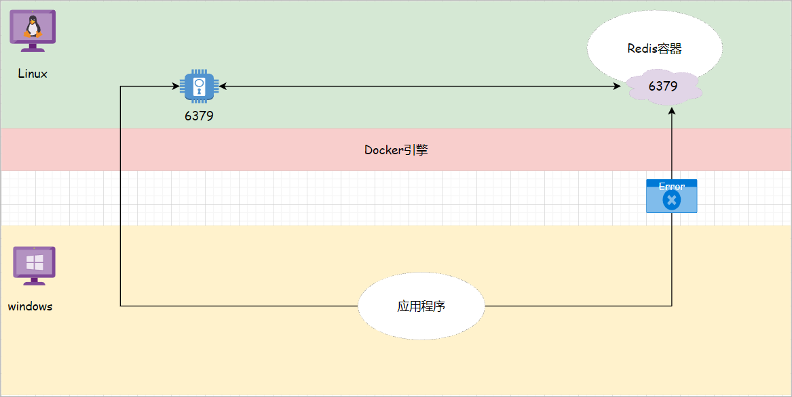
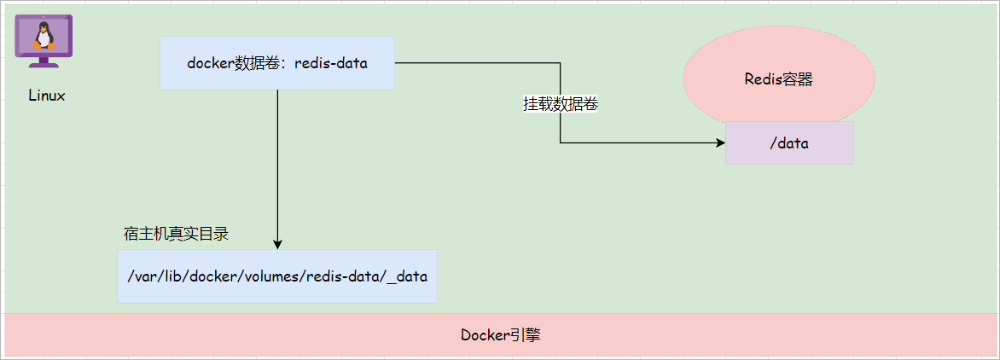

# Docker

Docker的安装和卸载可以参考官方文档：[https://docs.docker.com/engine/install/centos/](https://docs.docker.com/engine/install/centos/)
卸载

```bash
sudo yum remove docker \
                  docker-client \
                  docker-client-latest \
                  docker-common \
                  docker-latest \
                  docker-latest-logrotate \
                  docker-logrotate \
                  docker-engine
```
安装
```bash
# 安装依赖
sudo yum install -y yum-utils

# 安装docker的下载源
sudo yum-config-manager \
--add-repo \
 https://download.docker.com/linux/centos/docker-ce.repo
    
# 安装docker    
sudo yum install -y docker-ce docker-ce-cli containerd.io docker-buildx-plugin docker-compose-plugin
```
## 阿里云镜像加速器
```bash
# 在etc目录下创建一个docker文件夹
sudo mkdir -p /etc/docker

# 在/etc/docker文件夹下创建一个daemon.json文件，然后写入如下内容
sudo tee /etc/docker/daemon.json <<-'EOF'
{
  "registry-mirrors": ["https://phtv51hj.mirror.aliyuncs.com"]
}
EOF

# 重新加载docker的守护进程
sudo systemctl daemon-reload

# 重启docker服务
sudo systemctl restart docker
```
or
```bash
vim /etc/docker/daemon.json

{
    "registry-mirrors": [
    "https://ghcr.io",
    "https://5yt01a9i.mirror.aliyuncs.com",
    "https://registry.docker-cn.com",
    "http://hub-mirror.c.163.com",
    "https://mirror.baidubce.com"
    ]
}

sudo systemctl daemon-reload 
sudo systemctl restart docker
```
## docker镜像操作
```bash
# 搜索
docker serach 镜像名字
# 拉取
docker pull 镜像名字   # 默认最新
docker pull 镜像名称[:tag]
# 查看本地镜像
docker images name
                  -q, --quiet							# 查询镜像的id
                  -f, --filter string			# 按照指定的过滤条件进行查询
                      --format string			# 按照指定的格式化字符串进行结果格式化操作
                docker images -q
                docker images --filter reference="redis:*"	# 搜索镜像名称为redis，镜像标签是任意的所有镜像
                docker images --format "{{.Repository}}:{{.Tag}}" # 搜索结果中只包含仓库名称和标签名称
# 删除
docker rmi 镜像名称[:镜像标签]/镜像的id

# 加载上传的tar包
docker load -i  fileName.tar
```
## docker容器操作
```bash
# 查询容器
docker ps # 查看本地正在运行的容器

# 创建容器
docker run [OPTIONS] 镜像的名称:镜像标签/镜像id [COMMAND] [ARG...]
        -d,--detach								# 以后台的模式执行命令daemon
        -t, --tty								# 分配一个虚拟终端，通常和-i参数一起使用
        -i,--interactive						# 把交互界面一直保留，通常和-t参数一起使用
        docker run -it redis:7.0.10       # 创建一个交互型容器
        docker run -d  redis:7.0.10       # 创建一个守护型容器，容器在启动的时候打开一个shell窗口，并且让这个窗口一直保留
        --name   # 可以给创建的容器设置名称。如果没有加该参数，那么此时docker会为容器随机分配一个名字。
        docker run -d --name redis01 redis:7.0.10

# 删除容器
docker rm 容器名称/容器的id	
          docker rm -f $(docker ps -aq)  #删除所有容器

 # 进入容器
 docker exec [OPTIONS] CONTAINER COMMAND [ARG...]
         -t, --tty  # 分配一个虚拟终端，通常和-i参数一起使用
         -i,--interactive  # 把交互界面一直保留，通常和-t参数一起使用
         docker exec -it redis01 /bin/bash	# 进入到容器中同时打开一个shell窗口

# 其他命令
docker logs -f 容器名称/容器的id		# 查询容器内进程日志，-f参数表示实时监控日志信息
docker inspect 容器名称/容器的id						# 查看容器的详情信息
docker cp 	 										 # 完成容器和宿主机之间的文件copy

# 已有容器 设置开机自启
docker update --restart=always 容器ID(或者容器名)
```
-p   
docker容器内部所运行的进程是无法被外部机器(windows)直接访问的, 如果外部机器向访问容器内的进程，那么在创建容器的时候就需要在linux宿主机上开一个端口号，并且需要建立这个端口号和容器内进程端口号之间的映射关系.

exp:      docker run -d --name redis01 -p 6379:6379 redis:7.0.10

## docker数据卷操作
数据卷是docker所提供的一个虚拟目录，这个虚拟目录会对应宿主机的一个真实目录。在创建容器的时候就可以将这个数据卷挂载到容器中的某一个目录下，那么此时在该目录下所产生的数据就会存储到宿主机的目录下，实现了容器和宿主机之间的文件共享。

数据卷作用：
1.可以将容器中的数据持久化到宿主机目录中,以后删除容器，容器中指定目录中的数据就可以保存下来了。
2.可以让多个容器共享数据卷目录的同一份数据(项目)。

```bash
#  查看数据卷
docker volume ls 
#	创建数据卷
docker volume create 数据卷名称
# 查询数据卷详情
docker volume inspect 数据卷名称
# 删除数据卷
docker volume rm 数据卷名称  # 删除指定的数据卷
docker volume prune 		# 删除未使用的数据卷
# 数据卷挂载
-v 宿主机目录:容器目录
docker run -d --name redis03 -p 6381:6379 -v /redis-data:/data redis:7.0.10

```
## Docker图形化界面
```bash
# 搜索portainer
docker search portainer

# 拉取镜像
docker pull portainer/portainer

#创建并启动容器,注意需要做一个docker.sock文件的映射，后期portainer会通过这个文件和docker的守护进程进行通讯，管理docker的相关对象
# --restart=always: 表示随着docker服务的启动而启动
docker run -d -p 9000:9000  --name=portainer --restart=always -v /var/run/docker.sock:/var/run/docker.sock   portainer/portainer
```
